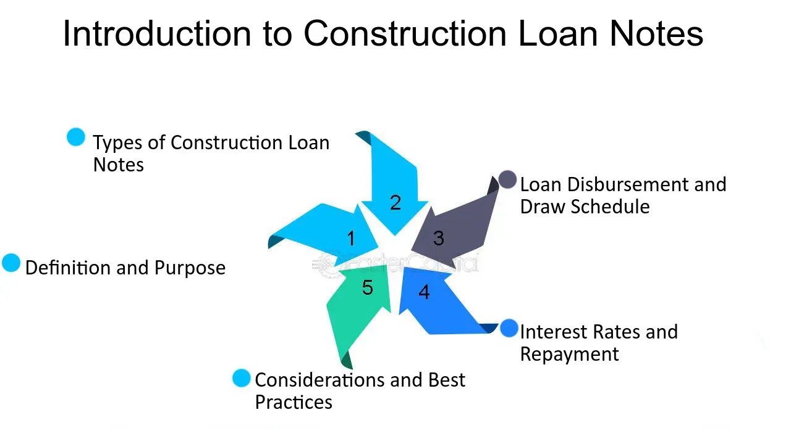

## Table of Contents

## What is a construction loan note?

A construction loan note is a type of loan that builders and developers use to finance the construction of a new building or project. It's like a regular loan, but instead of getting all the money at once, the lender gives out the money in stages as the construction progresses. This helps the builder because they only need to borrow what they need at each stage of the project, and it helps the lender because they can check that the work is being done properly before giving more money.

Once the construction is finished, the construction loan note often turns into a regular mortgage or another type of permanent financing. This means the builder or the new owner of the building starts paying back the loan over a long period of time, usually with interest. It's a common way to finance big building projects because it matches the way construction happens, step by step, until the project is complete.

## How does a construction loan note differ from a traditional mortgage?

A construction loan note and a traditional mortgage are used for different purposes and work in different ways. A construction loan note is used to pay for building a new home or project. The money is given out in stages as the building work is done. This means the builder only gets money as they need it for each part of the construction. On the other hand, a traditional mortgage is used to buy a home that's already built. With a traditional mortgage, the borrower gets all the money at once to buy the home and then pays it back over time.

Another difference is how the loans are paid back. With a construction loan note, once the building is finished, the loan often turns into a traditional mortgage or another type of long-term loan. This means the payments start after the construction is done. But with a traditional mortgage, the payments start right away. The borrower makes regular payments, usually every month, to pay back the loan over many years. So, a construction loan note helps with building, while a traditional mortgage helps with buying a finished home.

## What are the key components of a construction loan note?

A construction loan note has several important parts. One key part is the draw schedule, which shows how the money will be given out during the building process. The lender will check the work at each stage and release money for the next part of the project. Another important part is the [interest rate](/wiki/interest-rate-trading-strategies), which can be fixed or change over time. This rate affects how much the builder has to pay back. The loan also includes terms about how long the construction should take and what happens if it goes over that time.

Another key component is the conversion clause, which explains how the construction loan will turn into a permanent loan once the building is finished. This is important because it shows the builder how the loan will change after construction. The loan also includes a budget that shows how the money will be used for different parts of the project. This helps keep the project on track and within the planned costs. Together, these parts make up the construction loan note and help manage the building process from start to finish.

## Who typically qualifies for a construction loan note?

People who want to build a new home or a big project usually need a good credit score to qualify for a construction loan note. Lenders look at how much money the person makes and how much they already owe to see if they can pay back the loan. The builder or developer also needs to show they know how to build things well and finish projects on time. This makes the lender feel more sure about giving out the money.

The project itself also needs to be a good plan. The lender will check the building plans and budget to make sure they are realistic and that the project can be finished with the money they give. Sometimes, the person needs to put some of their own money into the project, called a down payment, to show they are serious about it. If everything looks good, the lender will give out the money in stages as the building work gets done.

## What are the steps to apply for a construction loan note?

To apply for a construction loan note, the first thing you need to do is find a lender who offers these loans. You can talk to banks, credit unions, or special construction loan companies. Once you pick a lender, you will need to fill out an application form. They will ask for your personal information, like your name, address, and social security number. They will also want to see your credit score and check your income and debts to see if you can pay back the loan.

Next, you need to show the lender your building plans and a detailed budget for the project. They will look at these to make sure the project is realistic and that you have enough money to finish it. You might also need to put some of your own money into the project, called a down payment. If the lender likes your plans and thinks you can handle the loan, they will approve it. After that, they will give you the money in stages as the building work gets done, and once it's finished, the loan usually turns into a regular mortgage or another long-term loan.

## How is the interest rate determined for a construction loan note?

The interest rate for a construction loan note is set by the lender based on a few things. One big thing is the current market rates, which can change over time. Lenders also look at how risky they think the loan is. If they think there's a bigger chance you might not pay back the loan, they might charge a higher interest rate. Your credit score is important too. If you have a good credit score, you might get a lower interest rate because the lender thinks you're more likely to pay back the loan on time.

Sometimes, the interest rate can be fixed, which means it stays the same the whole time you're paying back the loan. Other times, it can be variable, which means it can go up or down based on market changes. Lenders decide whether to offer a fixed or variable rate based on what they think will work best for them and for you. Knowing how the interest rate is set can help you understand how much you'll need to pay back over time.

## What are the repayment terms for a construction loan note?

The repayment terms for a construction loan note are different from a regular loan. During the building time, you usually only pay the interest on the money you've used so far. This is called interest-only payments. The lender gives you money in stages as the building work gets done, and you pay interest on what you've borrowed until the building is finished.

Once the building is done, the construction loan note often changes into a regular mortgage or another type of long-term loan. This is called the conversion phase. Now, you start paying back both the money you borrowed and the interest over a long time, usually many years. The exact terms, like how long you have to pay it back and what the interest rate will be, depend on what you and the lender agree on.

## What risks are associated with construction loan notes?

Construction loan notes come with some risks that you should know about. One big risk is that the building project might take longer or cost more than you planned. If this happens, you might need more money than the loan gives you, and that can be hard to get. Also, if the building work doesn't go well, the lender might stop giving you money until things get fixed. This can slow down the project and make it harder to finish on time.

Another risk is that interest rates might go up if you have a variable rate loan. This means you'll have to pay more money back over time. If you can't pay the interest during the building time, you might get into money trouble. Also, if the building isn't worth as much as you thought when it's done, it might be hard to turn the construction loan into a regular mortgage. This can make it tough to keep the project going and finish it the way you want.

## How can a construction loan note be converted to a permanent mortgage?

When a building project is finished, the construction loan note usually turns into a permanent mortgage. This happens through a process called conversion. The lender looks at the finished building and checks its value. If everything is good, they change the loan terms from the construction phase to a long-term mortgage. This means you start paying back the whole loan, not just the interest, over many years.

The conversion can happen in different ways depending on your loan agreement. Sometimes, you might need to apply for a new loan to replace the construction loan. Other times, the construction loan automatically changes into a mortgage with the same lender. The interest rate might change too, and it could be fixed or variable. Knowing how the conversion works helps you plan for the future and make sure you can keep paying the loan after the building is done.

## What documentation is required for a construction loan note?

To get a construction loan note, you need to give the lender a lot of papers. You will need to show them your personal information, like your name, address, and social security number. They will also want to see your credit report and proof of your income, like pay stubs or tax returns. This helps them decide if you can pay back the loan. You also need to give them a detailed plan of the building project, including the blueprints and a budget that shows how you will spend the money.

Another important document is the draw schedule, which tells the lender when and how much money you need during the building process. You might also need to provide a down payment to show you are serious about the project. If you are working with a builder, you may need to give the lender information about the builder's experience and past projects. All these papers help the lender understand your project and decide if they want to give you the loan.

## How do construction loan notes impact property development projects?

Construction loan notes are very important for property development projects because they give builders the money they need to build new homes or buildings. Instead of getting all the money at once, the lender gives out the money in stages as the building work gets done. This helps builders because they only need to borrow what they need at each part of the project. It also helps lenders because they can check that the work is being done right before giving more money. This way, the project stays on track and within the planned costs.

Once the building is finished, the construction loan note usually turns into a regular mortgage or another type of long-term loan. This means the builder or the new owner starts paying back the whole loan, not just the interest, over many years. This change can help the project move forward and be finished on time. But there are also risks, like if the building takes longer or costs more than planned, or if the interest rates go up. Knowing how construction loan notes work can help builders plan better and make sure their projects go smoothly from start to finish.

## What are the advanced strategies for managing multiple construction loan notes?

Managing multiple construction loan notes can be tricky, but there are some smart ways to do it well. One good idea is to keep a close eye on the draw schedules for each loan. This means knowing exactly when you need to ask for money from each lender and making sure you use that money right away for the right part of each project. It's also important to have a good relationship with all your lenders. Talk to them often and keep them updated on how each project is going. This can help you get more money when you need it and can make them more willing to work with you if something goes wrong.

Another helpful strategy is to plan your cash flow carefully. This means making sure you have enough money coming in to cover the interest payments on all your loans during the building time. You can also think about getting a line of credit as a backup plan in case one of your projects runs into money trouble. It's also a good idea to keep all your project budgets and timelines up to date. This helps you see if one project is going to need more money than you thought and lets you move money around between projects if you need to. By staying organized and planning ahead, you can handle multiple construction loan notes without too much stress.

## References & Further Reading

[1]: Andres, C. (2009). ["Integrating Algorithmic Trading with Financial Management: An Insight into Market Dynamics."](https://www.researchgate.net/publication/378548435_Algorithmic_Trading_and_AI_A_Review_of_Strategies_and_Market_Impact) Journal of Financial Markets.

[2]: Sornette, D. (2003). ["Why Stock Markets Crash: Critical Events in Complex Financial Systems."](https://www.amazon.com/Why-Stock-Markets-Crash-Financial/dp/0691175950) Princeton University Press.

[3]: Narang, R. K. (2009). ["Inside the Black Box: The Simple Truth About Quantitative Trading."](https://onlinelibrary.wiley.com/doi/book/10.1002/9781118267738) John Wiley & Sons.

[4]: Fabozzi, F. J., Focardi, S. M., & Kolm, P. N. (2010). ["Quantitative Equity Investing: Techniques and Strategies."](https://www.semanticscholar.org/paper/Quantitative-Equity-Investing%3A-Techniques-and-Fabozzi-Focardi/1c49a2a53919f7e65cb96f16691b8ff726fd3cd7) John Wiley & Sons.

[5]: Lintner, J. (1965). ["The Valuation of Risk Assets and the Selection of Risky Investments in Stock Portfolios and Capital Budgets."](https://www.jstor.org/stable/1924119) The Review of Economics and Statistics.