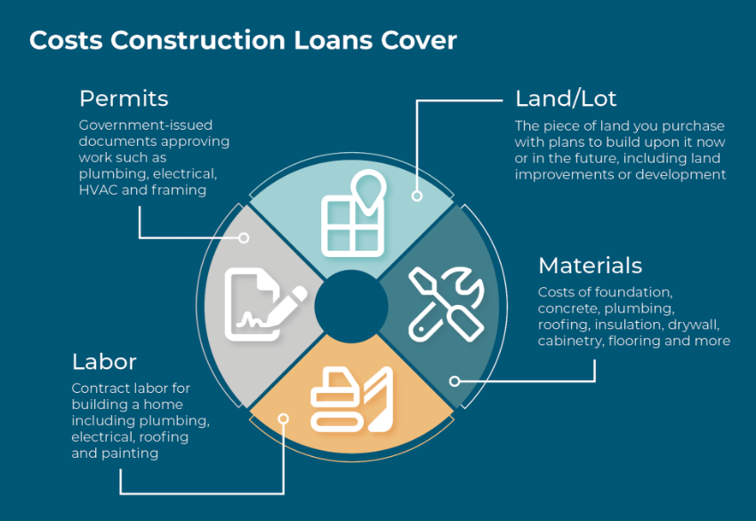

In construction, securing the right type of financing is crucial for successful project completion. The construction industry often requires substantial capital, and understanding the nuances of construction loans and home building financing can be pivotal. Construction projects range in scale from modest family homes to expansive commercial developments, each presenting unique financial challenges and opportunities. 

This article aims to provide a comprehensive overview of construction financing while exploring how algorithmic trading might influence this sector. Algorithmic trading, known for its transformative impact on financial markets, offers intriguing possibilities for enhancing the efficiency and accuracy of financial planning in construction. 

Whether you're a real estate developer, a prospective homeowner, or a financial enthusiast, grasping these concepts can help you navigate the complexities of construction financing. By understanding funding mechanisms, stakeholders can make informed decisions that align with their financial and project goals. 

Join us as we explore the intricacies of construction loans and the emerging role of algorithmic trading in this field. By doing so, we will unravel the critical aspects of securing and managing financial resources in construction, a key factor in ensuring the successful realization of construction projects.

## Table of Contents

## Understanding Construction Financing

Construction financing is a specialized form of funding designed to cover the costs associated with constructing new buildings or renovating existing structures. This type of financing is crucial in the construction industry, where projects require significant capital input and present unique financial challenges.

**Types of Construction Loans**

Construction loans can be categorized into several types, each with specific characteristics and purposes:

1. **Short-term Loans**: These loans are designed to cover immediate expenses and typically have a duration of 12 months or less. They are often utilized to finance initial construction costs.

2. **Long-term Loans**: These loans provide funding over an extended period and are generally used to address comprehensive financing needs throughout a construction project.

3. **Bridge Loans**: These are temporary loans intended to bridge the gap between two financing periods. Often used when transitioning from a construction loan to permanent financing, bridge loans provide necessary capital during the interim phase.

Each type of loan has its own set of terms and conditions tailored to meet the specific needs of a construction project.

**Typical Terms and Conditions**

Construction loans differ from traditional financing options due to their specific terms:

- **Interest Rates**: Interest rates for construction loans are generally higher than those for standard mortgages, reflecting the increased risk lenders assume. Rates might be fixed or variable, depending on the loan structure and agreement between the borrower and lender.

- **Repayment Schedules**: These loans usually operate on an interest-only payment plan during the construction period, transitioning to principal and interest payments upon project completion or conversion to a long-term mortgage.

- **Loan-to-Value Ratios (LTV)**: The LTV ratio is a critical factor in construction financing, determining the loan amount in relation to the property's estimated value upon project completion. Lower LTV ratios typically imply less risk for the lender, potentially resulting in more favorable loan terms for the borrower.

Lenders require detailed plans and cost estimates from borrowers, along with a comprehensive understanding of the project's financial outlook. This often includes architectural plans, project timelines, and contractor agreements.

**Key Considerations for Stakeholders**

Understanding the essential elements of construction financing allows stakeholders to make informed decisions:

- **Interest Rates**: Assessing the cost of borrowing is crucial for project budgeting and financial planning.

- **Repayment Schedules**: Align project cash flow with loan repayment schedules to ensure financial sustainability throughout the construction phase.

- **Loan-to-Value Ratios**: Managing LTV ratios can improve financing terms and reduce overall project risk.

By navigating these considerations effectively, developers, homeowners, and financial professionals can optimize their financial strategies, ensuring successful project execution and achievement of construction goals.

## The Role of Construction Loans in Home Building

Construction loans are a crucial aspect of the home building industry, providing tailored financial solutions specifically designed for the construction of new homes. Unlike traditional mortgages, which are structured to cover the cost of an already completed home, construction loans are meant to fund the various stages of home building. This upfront provision of funds is essential to accommodate the timelines and expenses encountered during the construction process.

Construction loans differ from traditional mortgages primarily in their structure and purpose. While traditional mortgages offer a lump sum to purchase an existing property, construction loans are disbursed in phases, also known as "draws." These draws align with specific milestones in the construction process, such as laying the foundation, framing, and completing structural work. This staged funding approach ensures that money is available as needed while minimizing interest costs in the early stages of construction.

The benefits of construction loans extend beyond their phased funding structure. For builders, these loans offer significant flexibility. Borrowers can modify plans and budgets in response to unforeseen changes in project scope or costs. Moreover, construction loans typically feature interest-only payments during the construction phase, which can help manage cash flow. Another potential benefit is the opportunity for builders to lock in favorable interest rates before market conditions shift, potentially reducing overall borrowing costs.

However, potential borrowers must be aware of the risks and challenges associated with construction loans. These loans can have higher interest rates compared to traditional mortgages, reflecting the additional risks lenders assume during an active construction project. Additionally, the application and approval process for a construction loan can be more stringent, as lenders require detailed project plans, budgets, and timelines. Borrowers may also be subject to construction delays and cost overruns, which can complicate the repayment process if the project deviates significantly from the initial plan.

To navigate these challenges and secure the most advantageous construction loan, potential borrowers should consider several key tips. It is essential to prepare a detailed and realistic budget and to work with experienced builders who have a track record of on-time, on-budget project delivery. Conducting thorough research on potential lenders, comparing terms, and seeking advice from financial advisors can also guide borrowers toward the best loan product for their situation. Understanding the lender’s draw schedule and ensuring it aligns with the construction timeline is another critical consideration.

In summary, while construction loans offer valuable advantages for home building, including flexibility and potentially lower costs, they also present unique risks. Prospective borrowers should carefully evaluate their financial capabilities and project specifics to select the right construction loan and lender, thereby increasing the likelihood of a successful home building project.

## Home Building Financing: Strategies and Solutions

Financing a home build requires strategic planning and an understanding of the available options to achieve the desired outcomes. Various financing solutions cater to different needs and stages of the home building process, each with its own advantages and drawbacks. This examination will provide insight into these options, allowing prospective homeowners to make informed decisions.

Savings is a primary financing option for home building. Utilizing personal savings eliminates the need for loans and interest payments, providing full control over the budget and timeline. However, saving enough to cover the entire cost of building a home can take significant time and discipline, making it less feasible for many individuals.

Private loans offer another financing avenue. They encompass a range of options, including personal loans from banks or credit unions, and construction loans specifically designed for building projects. Construction loans typically provide funds in stages as the building progresses, ensuring the money is available when needed. They often have higher interest rates than traditional mortgages and may require a substantial down payment and a solid credit history. Despite these challenges, construction loans offer flexibility and scalability, adapting to changes in project scope and cost.

Government-backed programs are designed to make home building more accessible, particularly for first-time buyers or those in rural areas. Programs such as the Federal Housing Administration (FHA) loans or the U.S. Department of Agriculture (USDA) loans can provide favorable terms with lower down payments. Eligibility criteria may be stringent, and the application process can be lengthy, but these programs can offer financial relief for eligible candidates.

Emerging trends in home building financing focus on sustainability and environmental impact. Green loans, designed to fund energy-efficient and sustainable construction practices, are gaining popularity. They offer incentives such as lower interest rates or rebates for incorporating environmentally friendly technologies and materials. Homeowners opting for green loans not only contribute to environmental conservation but also enjoy long-term cost savings through reduced energy bills.

Each financing strategy carries unique benefits and challenges. The choice of financing will depend on individual financial circumstances, project specifics, and long-term goals. Prospective homeowners should carefully evaluate their options, considering factors such as loan terms, interest rates, repayment schedules, and potential incentives for sustainable building.

Understanding these financing solutions equips individuals with the knowledge necessary to fund their dream homes effectively. By aligning their financial strategy with personal ambitions and environmental considerations, homeowners can achieve their building objectives while fostering innovation in home construction financing.

## Algorithmic Trading and Its Influence on Construction Financing

Algorithmic trading, a process where computer algorithms automatically make trading decisions, has revolutionized stock and [forex](/wiki/forex-system) markets. The integration of complex mathematical models enables trades at speeds and frequencies that a human trader cannot match. Central to [algorithmic trading](/wiki/algorithmic-trading)'s success are its capabilities in high-frequency trading, [arbitrage](/wiki/arbitrage), and [market making](/wiki/market-making), leveraging data to optimize decision-making and achieve desired financial outcomes.

Applying algorithmic trading principles to construction financing presents a novel opportunity to enhance this sector by improving risk assessment and financial predictions. Construction financing involves substantial risk due to variable project costs and timelines. Algorithmic models could offer a data-driven approach to assess risks more accurately. For instance, predictive analytics could forecast trends in material costs and labor availability, offering lenders a clearer picture of potential risks before committing capital.

The integration of [artificial intelligence](/wiki/ai-artificial-intelligence) (AI) and [machine learning](/wiki/machine-learning) further amplifies these efficiencies. By analyzing vast amounts of data, AI systems can identify patterns and correlations not immediately evident to human analysts. For example, machine learning algorithms can evaluate historical project data to predict the likelihood of cost overruns or delays, allowing lenders to adjust loan terms accordingly.

Moreover, algorithmic systems can facilitate improved loan servicing and management. Automated monitoring of financial metrics and project milestones can ensure compliance with loan agreements, reducing the administrative burden on lenders and borrowers alike. This automation may help avert potential financial issues by providing real-time alerts when deviations from expected financial trajectories occur.

Despite these potential benefits, challenges exist in the adoption of algorithmic trading models within construction financing. The complexity of construction projects, each with unique variables and external influences, adds a layer of complication not typically present in traditional financial markets. Furthermore, developing sophisticated algorithms requires significant expertise and may entail substantial upfront investment.

Additionally, there are concerns regarding transparency and accountability. As algorithmic trading in construction finance is still nascent, stakeholders may be wary of relying on decisions made by opaque systems they do not fully understand. Ensuring these technologies adhere to ethical standards and regulatory requirements remains a critical consideration.

In conclusion, while integrating algorithmic trading into construction financing processes holds promise for improving efficiency, accuracy, and risk management, it requires careful implementation and oversight. As the intersection of advanced technology and construction finance evolves, stakeholders must balance innovation with practical challenges to harness its full potential responsibly.

## Conclusion

Securing financing is a crucial component of any successful construction project, whether it involves a large-scale commercial building or crafting a cozy family home. The thorough understanding of various financing options and the significant role of construction loans are pivotal in influencing project outcomes. Construction projects require careful financial planning and execution, and the diverse array of available financing solutions offers stakeholders tailored strategies to meet their specific needs.

As the landscape of construction financing continues to evolve, innovative technologies like algorithmic trading present promising avenues for optimizing financial strategies. Algorithmic trading, widely acknowledged for its impact in financial markets such as stock and forex trading, holds potential for enhancing efficiency and accuracy in construction finance. By employing advanced algorithms and data analytics, stakeholders can potentially improve risk assessments and financial predictions, thereby making more informed decisions.

While challenges persist, the potential for innovation and improvement within the construction financing sector remains significant. The integration of artificial intelligence and machine learning can result in more sophisticated financial models, offering new insights and solutions to longstanding problems. However, the adoption of these technologies also poses challenges, such as the need for substantial investment in infrastructure and expertise.

To navigate the intertwined futures of construction financing and modern technology, continued education and adaptability are essential. Stakeholders must remain vigilant in updating their knowledge and skills, ensuring they can leverage emerging tools and methodologies effectively. By fostering a culture of innovation and embracing technological advancements, the construction industry can overcome existing barriers and chart a [course](/wiki/best-algorithmic-trading-courses) toward more efficient and sustainable financial practices.

## References & Further Reading

[1]: Geltner, D., Miller, N., Clayton, J., & Eichholtz, P. (2013). ["Commercial Real Estate Analysis and Investments"](https://www.researchgate.net/publication/245702364_Commercial_Real_Estate_Analysis_and_Investments). Cengage Learning.

[2]: Johnston, D., Tooze, J. A., & Allen, B. (2009). ["Loan Workouts and Debt for Equity Swaps: A Framework for Successful Corporate Rescues"](https://www.semanticscholar.org/paper/Loan-Workouts-and-Debt-for-Equity-Swaps%3A-A-for-Chatterji-Hedges/49fe316b9b2f5b66d2eaf805079676a442b39b20). Oxford University Press.

[3]: Lopez de Prado, M. (2018). ["Advances in Financial Machine Learning"](https://www.amazon.com/Advances-Financial-Machine-Learning-Marcos/dp/1119482089). Wiley.

[4]: Mulligan, J. F. (2005). ["Home Buying For Dummies"](https://www.kiplinger.com/article/real-estate/t029-c039-s001-home-buying-for-dummies.html). For Dummies.

[5]: Stephens, J., & Blodget, H. (2015). ["The Investment Answer: Learn to Manage Your Money & Protect Your Financial Future"](https://archive.org/details/investmentanswer00dani). Business Plus.