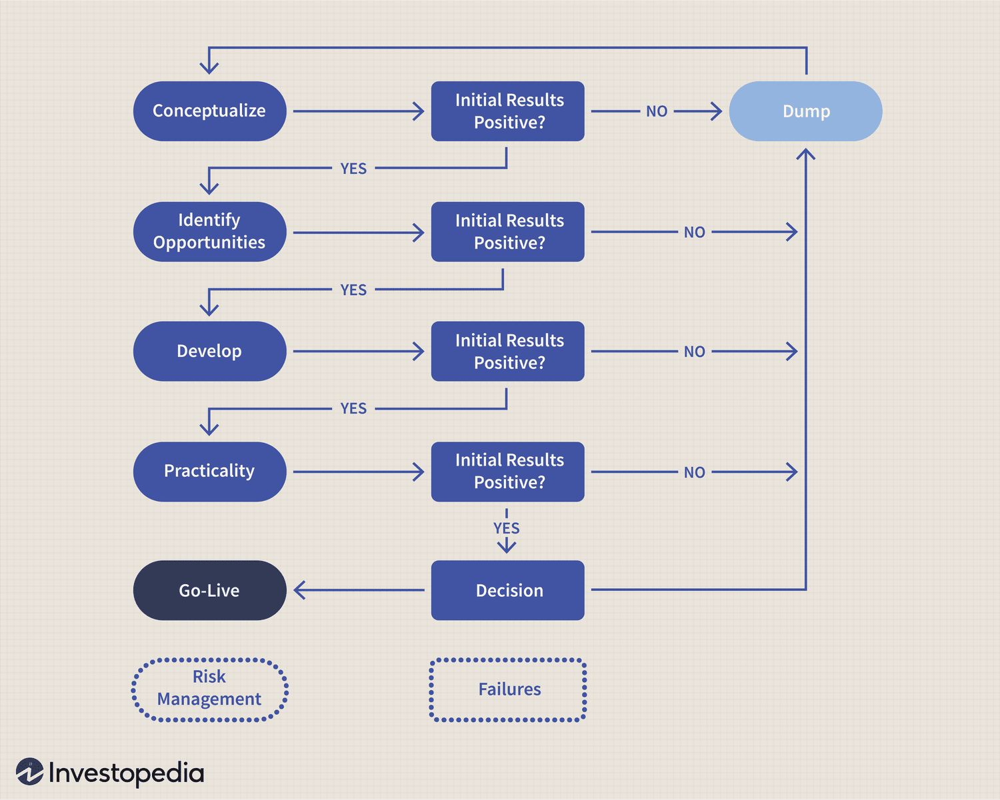

## Table of Contents

## What is Forex trading and why is it important to have a trading model?

Forex trading, also known as foreign exchange trading, is the buying and selling of different currencies on the global market. People trade currencies to make money from the changes in their values. For example, if you think the value of the Euro will go up compared to the US Dollar, you might buy Euros with Dollars. If the Euro does go up in value, you can sell it back for more Dollars than you started with, making a profit. Forex is the largest financial market in the world, with a huge amount of money traded every day.

Having a trading model is important because it helps you make better decisions when trading. A trading model is like a set of rules that tells you when to buy and when to sell currencies. It uses things like past price data and other information to help predict what might happen next. Without a model, you might make decisions based on feelings or guesses, which can be risky. A good model can help you be more consistent and reduce the chances of losing money.

## What are the basic components of a Forex trading model?

A Forex trading model is made up of a few key parts that help traders make smart choices. One important part is the entry and exit rules. These rules tell you when to buy a currency and when to sell it. They can be based on things like price patterns or special indicators that show when a currency might go up or down. Another part is risk management, which helps you decide how much money to put into each trade. This keeps you from losing too much if a trade goes wrong.

Another key part of a Forex trading model is the analysis method. This can be either technical analysis, which looks at past price data to predict future moves, or [fundamental analysis](/wiki/fundamental-analysis), which looks at things like a country's economy or interest rates. Some traders use both types to make better decisions. The last part is a way to test and improve the model. This is called [backtesting](/wiki/backtesting), where you use old data to see how well your model would have worked in the past. By doing this, you can make changes to make your model better and more reliable.

## How do you identify and select currency pairs for trading?

To identify and select currency pairs for trading, you first need to look at how much they move and how often they move. Some pairs, like EUR/USD or USD/JPY, are very popular and move a lot. These are called major pairs and they usually have smaller changes in price, which can be good if you want to trade often. Other pairs, called exotic pairs, might not move as often but can have bigger changes when they do. You should pick pairs that match how you like to trade and how much risk you want to take.

Next, you need to think about the time when you want to trade. Some currency pairs are more active at certain times of the day because of when different countries' markets are open. For example, if you want to trade the GBP/USD pair, it might be best to trade when both the London and New York markets are open because that's when this pair is most active. Also, you should look at economic news and events that can affect the currencies you are thinking about trading. Big news like [interest rate](/wiki/interest-rate-trading-strategies) changes or important economic reports can make currency pairs move a lot, so you need to be ready for that.

Lastly, it's a good idea to use your trading model to help you pick the right pairs. Your model can tell you which pairs are likely to move in a way that fits your trading plan. By testing your model with different pairs, you can see which ones work best for you. This way, you can focus on the pairs that give you the best chance to make money and fit well with your overall trading strategy.

## What are the key technical indicators used in Forex trading models?

In Forex trading models, some of the key technical indicators traders use are moving averages, the Relative Strength Index (RSI), and the Moving Average Convergence Divergence (MACD). Moving averages help traders see the overall trend of a currency pair by smoothing out price changes over time. For example, a simple moving average takes the average price of a currency over a certain number of days. If the price is above the moving average, it might mean the trend is going up, and if it's below, the trend might be going down. The RSI measures how fast and how much a currency's price has changed to see if it's overbought or oversold. If the RSI is above 70, the currency might be overbought and could go down soon. If it's below 30, it might be oversold and could go up.

Another important indicator is the MACD, which shows the relationship between two moving averages of a currency's price. It helps traders see if the trend is getting stronger or weaker. When the MACD line crosses above the signal line, it can be a sign to buy, and when it crosses below, it can be a sign to sell. These indicators help traders make better decisions by giving them clear signals based on past price data. By using these tools, traders can spot good times to enter or [exit](/wiki/exit-strategy) trades and manage their risk better.

## How do fundamental analysis factors affect Forex trading models?

Fundamental analysis looks at things like a country's economy, interest rates, and big news to understand why a currency's value might change. For example, if a country's economy is doing well, its currency might go up in value because more people want to invest there. On the other hand, if a country's interest rates go down, its currency might go down in value because people might move their money to countries with higher interest rates. Big news like elections or natural disasters can also shake up a currency's value a lot. When traders use fundamental analysis in their Forex trading models, they try to predict these changes and make trades that will make money from them.

In a Forex trading model, fundamental analysis helps traders decide when to buy or sell a currency. For instance, if a trader knows that a country is about to raise its interest rates, they might buy that country's currency before the change happens, hoping to sell it later at a higher price. The model might include rules about which economic reports to watch and how to react to them. By mixing fundamental analysis with technical indicators, traders can get a fuller picture of what might happen next. This can make their trading decisions more reliable and help them manage their risks better.

## What role does risk management play in a Forex trading model?

Risk management is a big part of a Forex trading model. It helps traders decide how much money to put into each trade and how to protect their money if things go wrong. Without good risk management, a trader could lose a lot of money fast, even if they make some good trades. A trading model uses rules like setting a stop-loss order, which is like an automatic way to sell a currency if it starts losing too much value. This keeps the trader from losing more than they can afford. Another rule might be to only risk a small part of their total money on any one trade, so they can keep trading even if they lose.

Using risk management in a Forex trading model also helps traders stay calm and stick to their plan. When the market moves a lot, it can be easy to get scared or too excited and make bad choices. But with clear rules about how much risk to take, traders can follow their model instead of their feelings. This makes their trading more consistent and helps them make money over time. By balancing the chances of making money with the risk of losing it, a good trading model can help traders do well in the Forex market.

## How can backtesting improve the effectiveness of a Forex trading model?

Backtesting helps make a Forex trading model better by letting traders see how well it would have worked in the past. They use old price data to run their model and see if it would have made money or lost money. By doing this, traders can find out what parts of their model need to be changed or fixed. If the model did not work well with certain currency pairs or during certain times, traders can adjust their rules to make it better. This way, they can feel more sure that their model will work well in the future.

Using backtesting also helps traders understand how much risk their model might have. They can see how often their model would have lost money and how big those losses might have been. With this information, traders can add or change risk management rules to protect their money better. By making their model safer and more reliable through backtesting, traders can trade with more confidence and have a better chance of making money in the Forex market.

## What are common strategies used in Forex trading models?

One common strategy used in Forex trading models is the trend-following strategy. This strategy involves looking at the overall direction of a currency pair's price and making trades that go along with that direction. Traders use tools like moving averages to figure out if the trend is going up or down. If the price is going up, they might buy the currency, hoping to sell it later at a higher price. If the price is going down, they might sell the currency, hoping to buy it back later at a lower price. This strategy works well in markets where the trend lasts for a while, but it can be risky if the trend suddenly changes.

Another popular strategy is the range trading strategy. This strategy is used when a currency pair's price stays within a certain range and doesn't move much. Traders look for times when the price is near the top of the range and sell the currency, expecting it to go back down. When the price is near the bottom of the range, they buy the currency, expecting it to go back up. This strategy can be good for making steady, small profits, but it can be risky if the price suddenly breaks out of the range.

A third strategy is the [breakout](/wiki/breakout-trading) strategy. This strategy involves watching for times when a currency pair's price breaks out of its usual range. Traders might buy the currency if the price breaks above the top of the range, expecting it to keep going up. They might sell the currency if the price breaks below the bottom of the range, expecting it to keep going down. This strategy can lead to big profits if the breakout is strong, but it can also lead to big losses if the breakout doesn't last.

## How do you optimize a Forex trading model for different market conditions?

To optimize a Forex trading model for different market conditions, you need to change your strategy based on how the market is acting. If the market is moving a lot and there are clear trends, you might want to use a trend-following strategy. This means buying when the price is going up and selling when it's going down. You can use moving averages to help you see the trend and decide when to trade. But if the market is not moving much and staying in a range, a range trading strategy might work better. This means buying near the bottom of the range and selling near the top. You need to keep an eye on the market and be ready to switch strategies when the market changes.

Another way to optimize your model is by using different technical indicators for different conditions. For example, if the market is very volatile, you might use the Relative Strength Index (RSI) to see if a currency is overbought or oversold. This can help you make quick trades to take advantage of big price swings. But if the market is calm, you might use the Moving Average Convergence Divergence (MACD) to spot slower trends and make longer-term trades. It's also important to adjust your risk management rules. In a volatile market, you might want to use tighter stop-loss orders to protect your money from big losses. In a calm market, you might be able to take more risk and aim for bigger profits. By changing your model to fit the market, you can make better trades and have a better chance of making money.

## What advanced statistical methods can enhance Forex trading model performance?

One advanced statistical method that can make a Forex trading model better is called machine learning. Machine learning uses computers to find patterns in lots of data, like past prices and economic reports. By using machine learning, a trading model can learn from this data and make better guesses about what will happen next. For example, a model might use a type of machine learning called neural networks to spot when a currency pair is about to change direction. This can help traders make trades at just the right time to make more money.

Another useful method is called time series analysis. This method looks at how prices change over time and tries to predict future changes based on past patterns. A common tool in time series analysis is the ARIMA model, which stands for AutoRegressive Integrated Moving Average. The ARIMA model can help traders see if a currency pair is likely to keep moving in the same direction or if it might start moving the other way. By using time series analysis, traders can fine-tune their trading model to take advantage of these patterns and make smarter trades.

## How do you integrate machine learning into Forex trading models?

To integrate machine learning into Forex trading models, you start by collecting a lot of data about currency prices, economic reports, and other things that might affect the market. This data is used to train a machine learning algorithm, like a [neural network](/wiki/neural-network), to find patterns and make predictions. For example, the algorithm might learn that certain economic news often leads to a change in a currency's price. Once trained, the algorithm can look at new data and give the trading model signals about when to buy or sell a currency. This helps the model make better decisions and possibly make more money.

Using machine learning in Forex trading models also means the model can keep learning and getting better over time. As new data comes in, the algorithm can update its knowledge and adjust its predictions. This makes the trading model more flexible and able to handle different market conditions. Traders can use this to their advantage by letting the model find new patterns that they might not have seen before. By doing this, they can improve their trading strategy and have a better chance of success in the Forex market.

## What are the latest trends and future directions in Forex trading model development?

The latest trends in Forex trading model development are focusing more on using technology like [artificial intelligence](/wiki/ai-artificial-intelligence) (AI) and machine learning. Traders are using these tools to make their models smarter and better at finding patterns in the market. For example, AI can look at a lot of data quickly and find things that a person might miss. This helps traders make better decisions and maybe make more money. Another trend is using more data from different places, like social media and news, to understand what might happen next in the market. By mixing this data with traditional price data, trading models can get a fuller picture of what's going on.

In the future, Forex trading models might become even more advanced. One direction could be using more real-time data to make quicker trades. With faster computers and better internet, traders can react to changes in the market almost instantly. Another direction might be making models that can explain their decisions better. Right now, some AI models can be hard to understand, but if they can explain why they made a certain trade, it could help traders trust them more. Overall, the future of Forex trading models looks like it will be about using more technology and data to make trading easier and more successful.

## What is Financial Modeling in Forex Trading?

Financial modeling involves creating structured representations of financial assets and scenarios, aiding in informed decision-making within the [forex](/wiki/forex-system) market. In forex trading, financial models are instrumental for simulating market conditions and forecasting price movements, which are crucial for devising effective trading strategies. By using these models, traders can enable data-driven decision-making, analyzing historical data and anticipating future trends with greater precision.

At the core of financial modeling in forex are quantitative techniques that utilize historical price data, market indicators, and economic variables to project future exchange rates. These models often employ statistical methods like regression analysis, time series analysis, and [machine learning](/wiki/machine-learning) algorithms to identify patterns and correlations within vast datasets.

For example, a common approach to financial modeling in forex involves using time series models such as the Autoregressive Integrated Moving Average (ARIMA) model. The ARIMA model is employed to forecast future prices based on past values and trends. The model can be described by the equation:

$$
X_t = c + \phi_1 X_{t-1} + \theta_1 \varepsilon_{t-1} + \varepsilon_t
$$

where:
- $X_t$ is the value being forecasted at time $t$,
- $c$ is a constant,
- $\phi_1$ is the autoregressive parameter,
- $\theta_1$ is the moving average parameter, and
- $\varepsilon_t$ is the error term.

Python, with its robust libraries such as pandas for data manipulation and statsmodels for statistical modeling, offers a practical environment for building such models. Consider the following code snippet that demonstrates an ARIMA model for forecasting:

```python
import pandas as pd
from statsmodels.tsa.arima.model import ARIMA

# Load historical forex data
data = pd.read_csv('forex_data.csv', parse_dates=['Date'], index_col='Date')
exchange_rate = data['EUR_USD']

# Fit ARIMA model
model = ARIMA(exchange_rate, order=(1, 1, 1))
model_fit = model.fit()

# Forecast the next steps
forecast = model_fit.forecast(steps=5)
print(forecast)
```

By accurately forecasting market conditions, traders can rigorously evaluate different trading strategies under various scenarios. This evaluation enables them to select strategies with the highest potential return while considering the associated risks.

Moreover, financial modeling not only facilitates price forecasting but also aids in stress testing and sensitivity analysis. Traders can assess how their strategies perform under extreme market conditions or adjust to changes in key economic indicators. Models that incorporate these elements enable a holistic analysis of trading strategies, thereby enhancing their robustness and reliability.

Effective financial modeling in forex trading requires a deep understanding of market dynamics, as well as continuous refinement and validation against actual market performance. As the forex market is inherently volatile and influenced by numerous global factors, models must be adaptive and regularly updated to reflect changes in market conditions or economic data. Consequently, robust financial modeling remains a cornerstone for success in forex trading, enabling traders to harness technological advancements and achieve improved trading outcomes.

## References & Further Reading

[1]: Bergstra, J., Bardenet, R., Bengio, Y., & Kégl, B. (2011). ["Algorithms for Hyper-Parameter Optimization."](https://dl.acm.org/doi/10.5555/2986459.2986743) Advances in Neural Information Processing Systems 24.

[2]: ["Advances in Financial Machine Learning"](https://www.amazon.com/Advances-Financial-Machine-Learning-Marcos/dp/1119482089) by Marcos Lopez de Prado

[3]: ["Evidence-Based Technical Analysis: Applying the Scientific Method and Statistical Inference to Trading Signals"](https://www.amazon.com/Evidence-Based-Technical-Analysis-Scientific-Statistical/dp/0470008741) by David Aronson

[4]: ["Machine Learning for Algorithmic Trading"](https://github.com/stefan-jansen/machine-learning-for-trading) by Stefan Jansen

[5]: ["Quantitative Trading: How to Build Your Own Algorithmic Trading Business"](https://github.com/LucindaYa/quant-resources/blob/master/Quantitative%20Trading%20How%20to%20Build%20Your%20Own%20Algorithmic%20Trading%20Business.pdf) by Ernest P. Chan