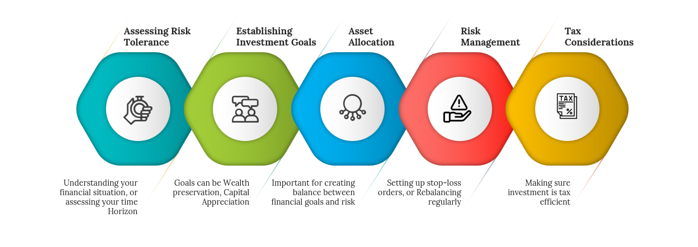

## Table of Contents

## What is a high-risk investment portfolio?

A high-risk investment portfolio is a collection of investments that have a higher chance of losing money but also a higher potential for big gains. These portfolios often include things like stocks of small or new companies, cryptocurrencies, and other investments that can go up or down a lot in value quickly. People who choose high-risk portfolios are usually okay with the chance of losing some money because they hope to make a lot more money if their investments do well.

High-risk portfolios are not for everyone. They are best for people who can handle the ups and downs of the market and who have extra money they can afford to lose. If you need your money to be safe and steady, a high-risk portfolio might not be the right choice for you. It's important to think about your own comfort with risk and your financial goals before deciding to invest in a high-risk portfolio.

## Why would someone want to build a high-risk investment portfolio?

Someone might want to build a high-risk investment portfolio because they are looking for big rewards. High-risk investments can grow a lot more than safer ones. If you pick the right stocks or other risky investments, you could make a lot more money than you would with something like a savings account or bonds. People who are okay with taking chances and have money they can afford to lose might choose a high-risk portfolio to try and grow their wealth faster.

Another reason is that some people enjoy the excitement and challenge of high-risk investing. It can be like a game where you try to guess which investments will do well. For these people, the thrill of possibly making a big win can be more important than the risk of losing money. They might also believe that they can spot good opportunities that others miss, so they are willing to take on more risk to prove their skills and potentially earn higher returns.

## What are the key characteristics of high-risk investments?

High-risk investments have a few main characteristics that make them different from safer investments. One big characteristic is that they can go up or down in value a lot, and it can happen quickly. For example, the price of a new company's stock or a cryptocurrency can change a lot in just one day. This means you could make a lot of money fast, but you could also lose a lot. Another characteristic is that high-risk investments often come from companies or projects that are new or small. These companies might have good ideas, but they also might fail, which makes their investments risky.

Another important characteristic of high-risk investments is that they usually don't pay you regular money like some safer investments do. For example, stocks of big companies might give you dividends, but stocks of small or new companies usually don't. This means you only make money if the value of your investment goes up, and if it goes down, you lose money. Finally, high-risk investments need more work and knowledge. You have to keep an eye on them and know a lot about the companies or projects you're investing in. If you don't, you might make bad choices and lose money.

## How can a beginner start building a high-risk investment portfolio?

If you're a beginner thinking about building a high-risk investment portfolio, start by learning as much as you can. Read books, watch videos, and follow news about different kinds of high-risk investments like stocks of small companies or cryptocurrencies. It's important to understand what you're getting into. Talk to people who know about investing, and maybe even get advice from a financial advisor. This will help you make smart choices and not just jump into something without knowing the risks.

Once you feel ready, start small. Don't put all your money into high-risk investments right away. Maybe start with a small amount that you can afford to lose. This way, you can learn from your mistakes without losing too much. As you get more comfortable and learn more, you can slowly add more money to your high-risk portfolio. Remember, high-risk investments can be exciting, but they can also be scary. Always think about how much risk you can handle and make sure you're okay with the chance of losing some money.

## What are some common high-risk investment options?

Some common high-risk investments are stocks of small or new companies. These companies can grow a lot and make you a lot of money, but they can also fail and lose all your money. Another common high-risk investment is cryptocurrencies like Bitcoin or Ethereum. These can go up or down a lot in value in just a few days. People who invest in them hope to make a big profit, but they also know they might lose everything.

Another type of high-risk investment is options trading. This is when you buy the right to buy or sell a stock at a certain price in the future. It can be very risky because if the stock doesn't go the way you thought, you can lose all the money you put in. Lastly, there are also things like penny stocks, which are stocks that cost very little money. They can go up a lot if the company does well, but they can also go to zero if the company fails.

## What is the role of diversification in a high-risk investment portfolio?

Diversification is important in a high-risk investment portfolio because it helps spread out the risk. When you have different types of investments, if one of them loses money, the others might still do well. This can help protect your money from big losses. For example, if you put all your money into one small company's stock and it fails, you could lose everything. But if you also have some money in other stocks or cryptocurrencies, those might go up and help balance out the loss.

Even in a high-risk portfolio, having a mix of investments can make a big difference. You might have some money in small company stocks, some in cryptocurrencies, and maybe even some in options trading. Each of these has its own risks and chances to make money. By spreading your money across them, you're not putting all your eggs in one basket. This way, you can still aim for big gains but also have a better chance of keeping some of your money safe if things don't go as planned.

## How does risk tolerance influence the construction of a high-risk portfolio?

Risk tolerance is how much risk you can handle without feeling too worried or scared. It's really important when you're building a high-risk investment portfolio. If you have a high risk tolerance, you might be okay with putting a lot of your money into things like small company stocks or cryptocurrencies. You know these can go up or down a lot, but you're willing to take that chance because you think the big rewards are worth it. But if you have a low risk tolerance, you might not want to put too much money into high-risk investments. You might feel too nervous about losing money, so you'd rather have a mix of high-risk and safer investments.

Understanding your risk tolerance helps you decide how much of your money to put into high-risk investments. If you're okay with a lot of risk, you might build a portfolio that's mostly high-risk investments. You'd be looking for big gains and be ready to handle big losses. But if you're not so okay with risk, you might only put a small part of your money into high-risk investments. The rest would go into safer things like bonds or big company stocks. This way, you can still try to make some big gains but also keep most of your money safe.

## What advanced strategies can be used to manage risk in a high-risk portfolio?

One advanced strategy to manage risk in a high-risk portfolio is called stop-loss orders. This means you set a rule that if an investment drops to a certain price, it will automatically be sold. This can help you limit how much money you lose on one investment. For example, if you buy a stock for $100 and set a stop-loss at $90, the stock will be sold if it ever hits $90. This way, you won't lose more than $10 if the stock keeps going down. Using stop-loss orders can help you keep some control over your high-risk investments and protect your money.

Another strategy is called hedging. This is when you make another investment that will go up if your high-risk investment goes down. For example, you might buy options that will make money if a stock you own goes down in value. This can help balance out any losses you have in your high-risk investments. Hedging can be complicated, but it's a way to try and protect your money while still going for big gains. It's like having a safety net for your high-risk portfolio.

Lastly, you can use something called position sizing. This means deciding how much money to put into each investment based on how risky it is. If an investment is very risky, you might only put a small amount of your money into it. This way, if it fails, you won't lose too much. Position sizing helps you spread your money around so that no single investment can hurt your whole portfolio too much. It's about being smart with how you divide up your money to manage risk in your high-risk portfolio.

## How do market conditions affect high-risk investment strategies?

Market conditions can really change how you should handle your high-risk investments. When the market is doing well and people are feeling good about the economy, high-risk investments like stocks of small companies or cryptocurrencies might go up a lot. During these times, you might want to take more chances and put more money into high-risk investments because there's a better chance they'll make you money. But you still need to be careful and not put all your money into one thing, because even in good times, high-risk investments can still go down.

On the other hand, when the market is not doing well and people are worried about the economy, high-risk investments can be even riskier. During these times, it might be smarter to be more careful and maybe not put as much money into high-risk investments. You might want to keep some of your money in safer places like bonds or big company stocks. This way, if the market keeps going down, you won't lose as much money. Always keep an eye on what's happening in the market and be ready to change your strategy if things start to look different.

## What are the tax implications of managing a high-risk investment portfolio?

Managing a high-risk investment portfolio can have different tax effects depending on what you invest in and how long you keep your investments. If you make money from your high-risk investments, like selling a stock for more than you paid for it, you'll have to pay capital gains tax. If you hold onto your investments for less than a year before selling them, you'll pay a higher short-term capital gains tax, which is the same as your regular income tax rate. But if you keep them for more than a year, you'll pay a lower long-term capital gains tax rate, which can be a lot less.

Another thing to think about is if your high-risk investments lose money. If you sell an investment for less than you paid for it, you can use that loss to lower your taxes. This is called a capital loss, and you can use it to reduce the taxes you owe on other gains or even on your regular income, up to a certain amount each year. It's important to keep track of all your buys and sells and talk to a tax advisor to make sure you're doing everything right and taking advantage of all the tax breaks you can.

## How can performance of a high-risk portfolio be evaluated and optimized?

To evaluate the performance of a high-risk portfolio, you need to look at how much money you've made or lost over time. A simple way to do this is by checking the total value of your portfolio and seeing how it's changed. You can also compare your portfolio's performance to a benchmark, like a stock market index, to see if you're doing better or worse than the market. Another important thing to look at is the risk you're taking. You can use something called the Sharpe ratio to see if the extra risk you're taking is worth the extra money you're making. If your portfolio is doing well but the risk is too high, you might need to make some changes.

To optimize a high-risk portfolio, you need to keep an eye on it and make changes when needed. One way to do this is by rebalancing your portfolio. This means selling some investments that have done really well and buying more of the ones that haven't, to keep your risk spread out. You might also want to use stop-loss orders to limit how much money you can lose on any one investment. Another way to optimize is by doing your research and staying up-to-date on the market. If you see that some of your high-risk investments are not doing well, you might want to sell them and put your money into other high-risk investments that you think will do better. It's all about keeping a balance between risk and reward and being ready to make changes when things don't go as planned.

## What are the latest trends and innovations in high-risk investment management?

One of the latest trends in high-risk investment management is the use of artificial intelligence (AI) and machine learning. These technologies help investors make better choices by looking at a lot of data really fast. They can find patterns and predict what might happen next in the market. This can be really helpful for high-risk investments like cryptocurrencies or small company stocks, where things can change quickly. AI can also help with something called algorithmic trading, where computers make trades based on rules you set. This can help you take advantage of small changes in the market and maybe make more money.

Another trend is the rise of decentralized finance, or DeFi. This is a new way of investing that uses blockchain technology, the same technology that powers cryptocurrencies like Bitcoin. DeFi lets you do things like lend money, borrow money, or trade without using a bank or other middleman. This can be risky because it's new and not everyone understands it yet, but it also offers the chance to make a lot of money. People who invest in DeFi are often looking for big rewards and are okay with taking big risks. It's important to learn a lot about DeFi before jumping in, because it can be complicated and the rules are still changing.

## What are the common pitfalls and challenges?

When constructing high-risk portfolios, investors often overlook potential pitfalls that can lead to significant losses. One common mistake is the tendency to over-leverage. Over-leverage occurs when an investor uses borrowed funds to amplify potential returns, a strategy that can escalate losses when the market moves unfavorably. It reflects on the principle that while leverage can magnify gains, it equally amplifies losses, potentially exceeding the initial investment and resulting in a margin call where the investor is required to deposit additional funds to cover potential losses.

Market instability poses another challenge, as high-risk portfolios are typically more sensitive to fluctuations. Rapid swings in asset values, especially in volatile markets such as stocks or cryptocurrencies, can lead to significant portfolio depreciation. For instance, during a market downturn, high-risk assets like small-cap stocks or cryptocurrencies could lose substantial value, impacting the overall portfolio negatively.

To mitigate these challenges, investors can implement several strategies. Firstly, avoiding over-leverage by ensuring the leverage ratio remains within a tolerable limit is crucial. A balanced leverage approach can be calculated using the formula:

$$
\text{Leverage Ratio} = \frac{\text{Invested Amount}}{\text{Own Equity}}
$$

Keeping the leverage ratio in check ensures that potential losses do not surpass what the investor can comfortably manage.

Moreover, investors should adopt a vigilant approach by actively monitoring market conditions and adjusting portfolios accordingly. This includes reallocating funds from overly volatile assets to more stable options as market conditions change. Regular portfolio reviews ensure that the investment strategy remains aligned with the overall financial goals and risk appetite.

Ensuring due diligence is also fundamental to mitigating risks in high-risk investments. This involves conducting comprehensive research on all potential assets and staying informed about market trends and economic indicators that could affect asset values. Utilizing analytical tools and resources can provide insights into how different timescales and conditions impact asset performances, helping investors make informed decisions.

By avoiding over-leverage, remaining alert to market changes, and committing to thorough due diligence, investors can navigate the complexities of high-risk portfolios more effectively, striving for substantial rewards while managing inherent risks responsibly.

## References & Further Reading

[1]: Bergstra, J., Bardenet, R., Bengio, Y., & Kégl, B. (2011). ["Algorithms for Hyper-Parameter Optimization."](https://papers.nips.cc/paper/4443-algorithms-for-hyper-parameter-optimization) Advances in Neural Information Processing Systems 24.

[2]: ["Advances in Financial Machine Learning"](https://www.amazon.com/Advances-Financial-Machine-Learning-Marcos/dp/1119482089) by Marcos Lopez de Prado

[3]: ["Evidence-Based Technical Analysis: Applying the Scientific Method and Statistical Inference to Trading Signals"](https://www.amazon.com/Evidence-Based-Technical-Analysis-Scientific-Statistical/dp/0470008741) by David Aronson

[4]: ["Machine Learning for Algorithmic Trading"](https://github.com/stefan-jansen/machine-learning-for-trading) by Stefan Jansen

[5]: ["Quantitative Trading: How to Build Your Own Algorithmic Trading Business"](https://www.amazon.com/Quantitative-Trading-Build-Algorithmic-Business/dp/1119800064) by Ernest P. Chan