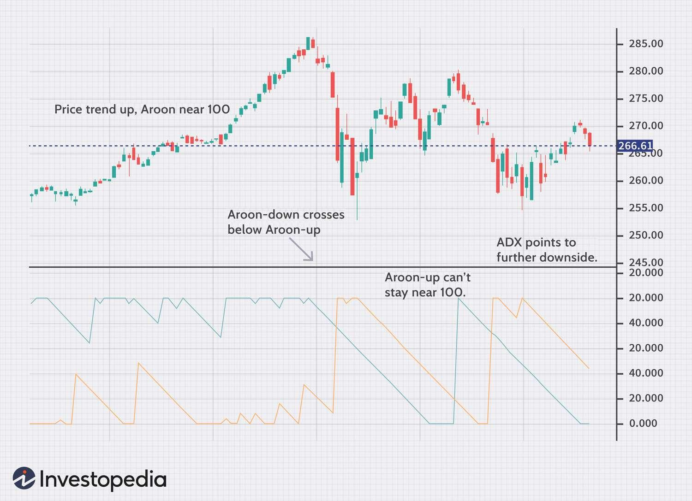

## Table of Contents

## What is a trading indicator and why is it important in trading?

A trading indicator is a tool that helps traders understand what is happening in the market. It uses math to look at things like price and volume of a stock or other things you can trade. This helps traders see patterns and trends that might not be easy to see just by looking at a chart.

Trading indicators are important because they help traders make better decisions. By using these tools, traders can figure out good times to buy or sell. This can help them make more money and avoid losing money. Even though indicators are not perfect and the market can be unpredictable, they give traders useful information to help guide their choices.

## What are the basic types of trading indicators?

There are two main types of trading indicators: leading indicators and lagging indicators. Leading indicators try to predict what the market will do next. They look at things like momentum and volume to guess future price movements. Traders use leading indicators to get into trades early, hoping to make money before big price changes happen. Some common leading indicators are the Relative Strength Index (RSI) and the Stochastic Oscillator.

Lagging indicators, on the other hand, look at what has already happened in the market. They help traders confirm trends that are already in place. Lagging indicators are useful for making sure a trend is real before jumping into a trade. They are often used to help traders decide when to get out of a trade. Popular lagging indicators include moving averages and the Moving Average Convergence Divergence (MACD).

Both types of indicators are important for traders. Leading indicators can help you get into trades early, but they can also be wrong sometimes. Lagging indicators can help you make sure a trend is real, but you might miss the start of a big move. Using both types together can give traders a better picture of the market and help them make smarter trading decisions.

## How do you choose the right trading indicator for your strategy?

Choosing the right trading indicator for your strategy depends on what you want to do in the market. If you want to get into trades early and try to catch big moves, you might want to use leading indicators like the Relative Strength Index (RSI) or the Stochastic Oscillator. These indicators look at things like momentum and volume to guess where the price might go next. They can help you spot opportunities before most other traders see them, but they can also be wrong sometimes because they are trying to predict the future.

On the other hand, if you want to make sure a trend is real before you trade, lagging indicators might be better for you. Moving averages and the Moving Average Convergence Divergence (MACD) are good examples of lagging indicators. They look at what has already happened in the market and help you confirm that a trend is strong and likely to continue. While you might miss the start of a big move, these indicators can help you avoid getting into bad trades. The best approach is often to use a mix of both leading and lagging indicators to get a fuller picture of the market and make more informed trading decisions.

## What are the common components needed to construct a trading indicator?

To build a trading indicator, you need to use some basic parts. These parts include price data, which is just the numbers showing how much something costs at different times. You also need math formulas to turn this price data into something useful. For example, you might use a simple formula to find out the average price over a certain number of days. Another important part is setting rules for when the indicator should show a signal, like when it's a good time to buy or sell. These rules help traders know what the indicator is trying to tell them.

Another key part of making a trading indicator is deciding how it will look on a chart. This could be a line, a bar, or even a color change. The way the indicator looks helps traders see the information quickly and easily. Finally, you need to test the indicator to make sure it works well. This means using old price data to see if the indicator would have given good signals in the past. Testing helps you figure out if the indicator is helpful or if it needs to be changed.

## How can you use historical data to test a trading indicator?

To test a trading indicator using historical data, you look at old price information to see how well the indicator would have worked in the past. You use the same rules and formulas that your indicator uses now, but you apply them to prices from a long time ago. This helps you see if the indicator would have given good signals to buy or sell back then. By doing this, you can find out if the indicator is reliable or if it needs to be changed.

Testing with historical data is important because it lets you see how the indicator might perform in the future. Even though the past doesn't always predict the future perfectly, it gives you a good idea of how well the indicator works. You can see if it makes more good signals than bad ones and if it helps you make money. This way, you can feel more confident using the indicator in real trading, knowing it has been tested and works well with past data.

## What programming languages are commonly used to develop trading indicators?

To make trading indicators, people often use a few common programming languages. One of the most popular is Python. Python is easy to learn and has lots of tools that help with math and working with data. This makes it great for creating and testing trading indicators. Another language that's used a lot is R. R is really good for doing math and looking at data, which is important for making trading indicators.

Besides Python and R, some people also use specific languages made just for trading, like MQL4 and MQL5. These languages are used with the MetaTrader platform, which many traders use. MQL4 and MQL5 are made to work well with trading charts and data, so they're good for building indicators that can be used right away in trading. Each language has its own strengths, so the best choice depends on what you need and what tools you like to use.

## How do you implement a simple moving average indicator?

To make a simple moving average indicator, you need to know the price of something over time and decide how many days you want to look at. Let's say you want to use the last 10 days of prices. You add up the closing prices of those 10 days and then divide by 10. This gives you the average price over those 10 days. You do this every day, always using the most recent 10 days. This way, you get a new average each day that shows you the trend of the price.

You can show this moving average on a chart as a line. This line helps you see if the price is going up or down over time. If the line is going up, it means the price has been going up on average. If it's going down, the price has been going down. Traders use this line to help them decide when to buy or sell. If the price goes above the moving average line, it might be a good time to buy. If it goes below, it might be a good time to sell.

## What are the steps to backtest a trading indicator?

To backtest a trading indicator, you start by collecting historical data for the thing you want to trade, like a stock or currency. This data should include prices over a long time, so you can see how the indicator would have worked in the past. Next, you use the rules of your indicator on this old data to see what signals it would have given. You pretend to buy or sell based on these signals and keep track of how much money you would have made or lost. This helps you see if the indicator is good at predicting price changes.

After you run the test, you look at the results to see if the indicator helped you make more money than you lost. You might use numbers like the total profit, how often you made money, and how big the wins and losses were. If the indicator did well, you can feel more sure about using it in real trading. But if it didn't work well, you might need to change the rules of the indicator or try a different one. Backtesting is important because it gives you a way to check your indicator before you use it with real money.

## How can you optimize a trading indicator for better performance?

To make a trading indicator work better, you need to change its settings and rules to see if it gives better signals. You start by trying different numbers for things like the length of time the indicator looks at or the levels it uses to say when to buy or sell. You test these changes with old price data to see which ones help you make more money. This is called optimization, and it helps you find the best way to use the indicator. You might need to try a lot of different settings to find the best ones, but it's worth it if it makes your trading better.

Once you have tried different settings and found the best ones, you should test the indicator again with more old data. This helps you make sure the changes really work and are not just lucky. You want to be sure that the indicator will keep working well in the future, not just in the past. By carefully testing and changing the indicator, you can make it a better tool for your trading. This way, you can feel more confident that it will help you make good decisions and hopefully make more money.

## What are the advanced techniques for combining multiple indicators?

Combining multiple indicators can help traders get a better view of the market. One way to do this is by using different types of indicators together, like leading and lagging indicators. For example, you might use a leading indicator like the RSI to spot early signs of a trend, and then use a lagging indicator like a moving average to confirm that the trend is strong. This way, you can catch the start of a move with the RSI and make sure it's a real trend with the moving average. Another way is to use indicators that look at different parts of the market, like price and volume. If both indicators agree on a signal, it can make you feel more confident about your trade.

Another advanced technique is to create a custom indicator that mixes the signals from several indicators into one. You could write a computer program to do this, using a language like Python. The program would look at the signals from each indicator and then decide when to buy or sell based on all of them together. This can be more powerful than using any single indicator alone because it uses more information. But it can also be harder to understand and might need a lot of testing to make sure it works well. By combining indicators in smart ways, traders can make better decisions and hopefully make more money.

## How do you handle overfitting when developing a trading indicator?

Overfitting happens when you make a trading indicator that works really well with old data but doesn't work well in the future. It's like making a puzzle piece that fits perfectly with one puzzle but doesn't fit with any others. To avoid overfitting, you need to be careful when you change the settings of your indicator. Don't just keep changing them until the indicator looks perfect with the old data. Instead, try to use settings that make sense and are not too specific to the past.

One way to check for overfitting is to use a method called cross-validation. You split your old data into different parts and test your indicator on each part separately. If the indicator works well on all the parts, it's less likely to be overfitted. Another way is to use a new set of old data that you didn't use when you were making the indicator. If the indicator still works well with this new data, it's a good sign that it's not overfitted. By being careful and testing your indicator in different ways, you can make sure it will work well in the future, not just in the past.

## What are the latest trends in trading indicator development using machine learning?

The latest trends in trading indicator development using [machine learning](/wiki/machine-learning) focus on using advanced algorithms to predict market movements more accurately. Machine learning models, like neural networks and [deep learning](/wiki/deep-learning), are being used to analyze large amounts of data, including price, volume, and even news sentiment. These models can find patterns that are too complex for traditional indicators to see. This means traders can get better signals about when to buy or sell. Many traders are also using [reinforcement learning](/wiki/reinforcement-learning), which is a type of machine learning where the model learns by doing. It tries different trading strategies and gets better over time by learning from its successes and failures.

Another big trend is the use of ensemble methods, where several machine learning models are used together to make better predictions. By combining the results of different models, traders can get more reliable signals. This approach helps to reduce the risk of overfitting, which is a common problem when using machine learning for trading. Additionally, there's a growing interest in using natural language processing (NLP) to analyze news and social media data. This can help traders understand how public sentiment might affect the market. Overall, machine learning is making trading indicators smarter and more useful, helping traders make better decisions.

## What are the Basics of Trading Indicators?

Trading indicators are mathematical tools derived from the historical data of a security or contract, primarily utilizing price, volume, or open interest. These indicators facilitate the prediction of future price movements and market trends, enabling traders to make informed and strategic decisions. The foundation of trading indicators is their ability to provide insights that are not immediately obvious from raw data alone, offering quantitative analysis to guide trading strategies.

**Moving Averages** are among the most commonly used indicators. They smooth out price data by creating a constantly updated average price, helping to identify trends over specific periods. The formula for a simple moving average (SMA) over *n* periods is:

$$
\text{SMA} = \frac{P_1 + P_2 + \ldots + P_n}{n}
$$

where $P_1, P_2, ..., P_n$ are the closing prices over the specified timeframe.

**Relative Strength Index (RSI)** is a momentum oscillator that measures the speed and change of price movements. It ranges from 0 to 100 and is used to identify overbought or oversold conditions. Typically, an RSI above 70 suggests an overbought condition, whereas an RSI below 30 indicates an oversold condition. The RSI is calculated as:

$$
\text{RSI} = 100 - \frac{100}{1 + \text{RS}}
$$

where $\text{RS} = \frac{\text{Average Gain}}{\text{Average Loss}}$.

**Bollinger Bands**, developed by John Bollinger, are volatility indicators that consist of a moving average and two standard deviations away from it. The bands contract and expand with market volatility, providing a visual representation of an asset's volatility. The typical calculation for these bands is:

- Middle Band: Simple Moving Average (SMA)
- Upper Band: SMA + (Standard Deviation \times n)
- Lower Band: SMA - (Standard Deviation \times n)

These indicators play a crucial role in technical analysis, aiding traders in capturing trends, [momentum](/wiki/momentum), and [volatility](/wiki/volatility-trading-strategies), which are essential for making tactical trading decisions.

## What are the types of trading indicators?

There are primarily four types of trading indicators utilized in financial analysis: Volume, Trend, Momentum, and Volatility indicators.

Volume indicators, such as On-Balance Volume (OBV), are designed to show the flow of [volume](/wiki/volume-trading-strategy) over a period of time. OBV, for instance, is calculated by summing the volume on up days and subtracting the volume on down days, aiming to predict market trends based on the relationship between volume changes and price movements.

Trend indicators are instrumental in identifying the direction of market trends, thereby assisting traders in making decisions aligned with market movements. Moving Averages (MA) are a popular example, where the average price of a security over a specified number of periods is plotted to smooth fluctuations and highlight trends. The basic formula for a Simple Moving Average (SMA) is given by:

$$
SMA = \frac{P_1 + P_2 + \ldots + P_n}{n}
$$

where $P$ is the price of the asset, and $n$ is the number of periods.

Momentum indicators, like the Moving Average Convergence Divergence (MACD), focus on the strength or speed of market movements. MACD calculates the difference between a 26-period and a 12-period Exponential Moving Average (EMA), providing signals for potential buy or sell opportunities when the MACD line crosses the signal line, typically a 9-day EMA of the MACD.

Volatility indicators, such as Bollinger Bands, gauge the degree of variation or fluctuations in price levels over time. They consist of a middle band (SMA) and two outer bands, calculated as a specified number of standard deviations from the SMA. Bollinger Bands expand and contract based on market volatility, offering insights into potential overbought or oversold conditions.

$$
\text{Upper Band} = SMA + (k \times \text{Standard Deviation})
$$
$$
\text{Lower Band} = SMA - (k \times \text{Standard Deviation})
$$

where $k$ is typically set to 2.

By leveraging these indicators, traders aim to enhance their market analysis, identify patterns, and make informed decisions.

## What are the popular technical indicators used in algo trading?

Key indicators in [algorithmic trading](/wiki/algorithmic-trading) play a crucial role in automating and enhancing trading decisions. Among these, Moving Averages, Relative Strength Index (RSI), Moving Average Convergence Divergence (MACD), and Fibonacci Retracement Levels are particularly popular due to their effectiveness and ease of integration into trading algorithms.

**Moving Averages** are used to smooth out price data, making it easier to identify trends over time by filtering out short-term fluctuations. The two common types are the Simple Moving Average (SMA) and the Exponential Moving Average (EMA). The SMA calculates the average of a selected range of prices, while the EMA gives more weight to recent prices, providing a closer follow-up on current market conditions. A Python snippet to calculate a simple moving average might look like this:

```python
def simple_moving_average(prices, window):
    weights = np.repeat(1.0, window) / window
    simple_ma = np.convolve(prices, weights, 'valid')
    return simple_ma
```

**Relative Strength Index (RSI)** is a momentum oscillator that measures the speed and change of price movements. RSI values range from 0 to 100, with readings typically considered overbought above 70 and oversold below 30. The RSI is calculated using the formula:

$$
RSI = 100 - \left( \frac{100}{1 + \frac{\text{average gain}}{\text{average loss}}} \right)
$$

Traders use RSI to assess whether an asset is in an overbought or oversold condition.

**Moving Average Convergence Divergence (MACD)** is a trend-following momentum indicator that shows the relationship between two moving averages of a security’s price. The MACD is calculated by subtracting the 26-period EMA from the 12-period EMA. Additionally, a nine-day EMA of the MACD, called the "signal line," is plotted on top of the MACD to act as a trigger for buy and sell signals. Using Python, MACD can be computed as follows:

```python
def calculate_macd(prices, short_window=12, long_window=26, signal_window=9):
    short_ema = prices.ewm(span=short_window, adjust=False).mean()
    long_ema = prices.ewm(span=long_window, adjust=False).mean()
    macd = short_ema - long_ema
    signal = macd.ewm(span=signal_window, adjust=False).mean()
    return macd, signal
```

**Fibonacci Retracement Levels** are horizontal lines that indicate where support and resistance are likely to occur. Each level is associated with a percentage. The levels are calculated by taking the high and low of a price move and then dividing the vertical distance by the key Fibonacci ratios of 23.6%, 38.2%, 50%, 61.8%, and 100%. Traders use these levels to identify potential reversal levels:

$$
\text{Retracement Level} = \text{Low} + (\text{High} - \text{Low}) \times \text{Retracement Percentage}
$$

These technical indicators form the backbone of algorithmic trading strategies, offering quantifiable metrics that can be programmed into trading systems. The ability to automatically generate and react to market signals enhances the trader's ability to execute profitable trades efficiently and consistently.

## References & Further Reading

[1]: Bergstra, J., Bardenet, R., Bengio, Y., & Kégl, B. (2011). ["Algorithms for Hyper-Parameter Optimization."](https://dl.acm.org/doi/10.5555/2986459.2986743) Advances in Neural Information Processing Systems 24.

[2]: ["Advances in Financial Machine Learning"](https://www.amazon.com/Advances-Financial-Machine-Learning-Marcos/dp/1119482089) by Marcos Lopez de Prado

[3]: ["Evidence-Based Technical Analysis: Applying the Scientific Method and Statistical Inference to Trading Signals"](https://www.amazon.com/Evidence-Based-Technical-Analysis-Scientific-Statistical/dp/0470008741) by David Aronson

[4]: ["Machine Learning for Algorithmic Trading"](https://github.com/stefan-jansen/machine-learning-for-trading) by Stefan Jansen

[5]: ["Quantitative Trading: How to Build Your Own Algorithmic Trading Business"](https://www.amazon.com/Quantitative-Trading-Build-Algorithmic-Business/dp/1119800064) by Ernest P. Chan