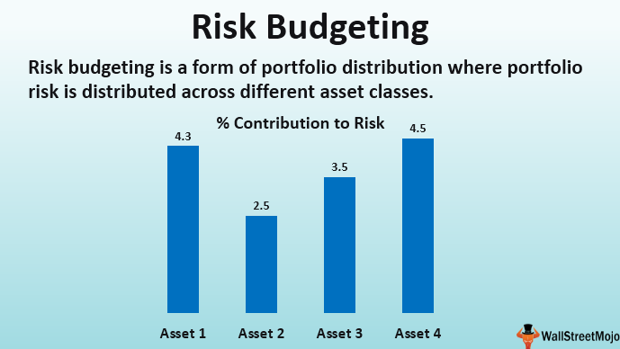

Tracking and measuring construction spending is essential in understanding the modern economy's health. As a critical economic indicator, construction spending provides insights into the financial commitments across various sectors, including residential, commercial, and public infrastructure. This data not only reflects current economic conditions but also influences future policy decisions and economic forecasts.

Algorithmic trading, which leverages computer algorithms to make automated trading decisions, has become increasingly prominent in financial markets. The intersection of construction spending data with these advanced trading strategies presents new opportunities for financial innovation. By integrating construction data into algorithmic models, traders can better predict market trends and adjust their portfolios accordingly. For instance, an increase in construction spending can indicate economic growth, prompting algorithms to increase investments in sectors likely to benefit.



The methodology for tracking construction expenditures is well established, primarily through sources like the U.S. Census Bureau's monthly reports. These reports offer valuable data that contribute to the broader understanding of economic trends. Analyzing this data helps financial decision-makers assess consumer confidence, business investment levels, and overall economic stability.

Technological advancements in data management and financial analytics have enhanced the investment process in real estate and infrastructure projects. Investors now have access to more accurate and timely information, allowing for more strategic and informed investment decisions.

This article will further explore how construction spending is monitored, its role as an economic indicator, and the integration of this data within algorithmic trading frameworks. Through examining key examples and practical applications, the article demonstrates the growing significance of construction spending data and its impact on financial strategies in today's economy.

## Table of Contents

## Understanding Construction Spending

Construction spending is a pivotal economic indicator that evaluates the financial resources allocated for the development of new projects. It encompasses various sectors, including residential, commercial, and public construction. This measure not only reflects current economic health but also provides critical insights into future market trends and policy-making.

The U.S. Census Bureau plays a crucial role in monitoring construction spending by releasing monthly updates that offer a detailed view of economic activities in the construction sector. These data sets capture the nuances of market dynamics and serve as a valuable resource for assessing the nation's economic health. The analyses derived from this data categorize construction spending into distinct segments such as residential and non-residential sectors, shedding light on consumer confidence and business investments. Increased spending in residential construction, for instance, is typically associated with heightened consumer confidence and economic optimism.

Construction expenditure also significantly influences the calculation of Gross Domestic Product (GDP). As construction spending constitutes a considerable portion of the GDP, fluctuations in this metric can bear a substantial impact on the overall economic performance of a country. These variations necessitate careful observation by policymakers and economic analysts, who utilize this data to shape fiscal policies and gauge the effectiveness of economic interventions.

Moreover, understanding the components of construction spending is essential for analyzing broader economic indicators and predicting market shifts. For instance, an uptick in commercial construction spending may suggest business expansion and a favorable economic climate, while a downturn might indicate potential economic slowdowns. Such insights aid investors and financial analysts in devising informed strategies and forecasting economic conditions.

Through the systematic analysis of construction spending, economic stakeholders can interpret the financial state and strategic directions taken by both government and private sector entities. As such, it informs critical decisions regarding investments, resource allocation, and policy-making, ultimately steering economic planning and development initiatives.

## Tracking and Measuring Construction Spending

Tracking and measuring construction spending is a critical aspect of economic analysis, serving as a key indicator of financial health in both the public and private sectors. The primary tool for monitoring this metric is the U.S. Census Bureau's Value of Construction Put in Place Survey. This survey meticulously assesses the expenditures associated with various aspects of construction projects, namely labor, materials, and overhead costs. By encompassing both public and private sector projects, the survey provides a holistic view of construction spending across the nation.

The survey's comprehensive approach involves a detailed monthly estimate of construction expenditures, which plays a significant role in economic forecasting and understanding market cycles. The monthly estimates serve stakeholders by offering insights that guide investment decisions, resource allocation, and policy formulation. Accurate tracking of construction spending is essential for government bodies, real estate developers, financial analysts, and investors aiming to gauge market conditions accurately.

The methodical tracking of construction spending is an invaluable tool for identifying trends within the industry. By analyzing detailed expenditure data, stakeholders can uncover potential growth opportunities and anticipate shifts in market dynamics. For instance, an uptick in spending on residential construction might suggest an increased demand for housing, signaling a healthy real estate market. Conversely, a downturn in non-residential construction spending could indicate a slowing economy or a decrease in business investments.

Overall, the structured and thorough collection of construction spending data provides a foundation for accurate economic forecasting and strategic decision-making. This data empowers various stakeholders by offering timely and precise insights into the construction industry's current state and future direction.

## Algorithmic Trading and Economic Indicators

Algorithmic trading, a vital component of modern financial markets, employs computer algorithms to execute trading strategies based on a wide array of data inputs, including market data and economic indicators. This methodology enables traders to process vast amounts of information far more quickly than human analysis allows. One such economic indicator that holds significant value in [algorithmic trading](/wiki/algorithmic-trading) is construction spending data.

Construction spending data, documenting financial investments in various construction projects, provides essential insights into economic health. When integrated into algorithmic trading models, this data aids in predicting market trends and adjusting portfolios in anticipation of shifts in economic conditions. The central premise relies on understanding the relationship between construction spending trends and underlying economic dynamics. For instance, increased spending in residential or commercial construction can point to economic expansion, prompting algorithms to favour sectors likely to benefit from such growth.

Algorithms designed for trading are equipped to react swiftly to new data, capitalizing on construction spending reports to adjust trading positions. Capability for rapid response offers a competitive edge, as these algorithms can outpace slower, manual processes in capturing profit opportunities or mitigating risks tied to economic fluctuations.

Moreover, the integration of construction data in algorithmic trading exemplifies the growing synergy between data analytics and financial technology. By employing advanced statistical methods and [machine learning](/wiki/machine-learning) techniques, traders can model complex relationships between construction spending and other economic indicators. For example, a Python implementation may leverage libraries such as pandas for data manipulation, scikit-learn for predictive modeling, and Matplotlib for visualization:

```python
import pandas as pd
from sklearn.linear_model import LinearRegression
import matplotlib.pyplot as plt

# Load construction spending data
data = pd.read_csv('construction_spending.csv')

# Simplified model: Predict market trends based on spending
X = data[['residential_spending', 'commercial_spending']]
y = data['market_index']  # Dummy variable representing market trends

# Train-test split
X_train, X_test, y_train, y_test = train_test_split(X, y, test_size=0.2)

# Train model
model = LinearRegression()
model.fit(X_train, y_train)

# Predict market trends
predictions = model.predict(X_test)

# Visualize results
plt.scatter(X_test['residential_spending'], y_test, color='black')
plt.plot(X_test['residential_spending'], predictions, color='blue', linewidth=3)
plt.title('Market Trends vs. Residential Spending')
plt.xlabel('Residential Spending')
plt.ylabel('Market Trends')
plt.show()
```

This integration allows traders to harness detailed insights from construction trends, amplifying the potential for informed decision-making. With continuous innovations, the use of construction spending data in algorithmic trading models will continue to evolve, enhancing the precision and efficacy of financial strategies.

## Examples and Applications

Case studies demonstrate the strategic advantage of incorporating construction spending data into algorithmic trading strategies. This data serves as a critical economic indicator reflecting the health of various sectors, such as residential and commercial real estate, infrastructure, and public projects. By analyzing this information, traders can fine-tune their approaches to stay competitive in the financial markets.

For instance, an increase in residential construction spending typically signals a thriving housing market. This trend can prompt algorithmic trading strategies to allocate more resources toward sectors related to construction and housing, such as home improvement companies, building materials suppliers, or real estate development firms. Algorithms can be designed to detect patterns in the spending data, allowing traders to capitalize on potential growth opportunities.

Conversely, a noticeable decline in construction spending might indicate economic slowdowns or market contractions. In such cases, algorithmic models can be programmed to employ risk mitigation strategies. These might include reducing exposure to sectors heavily reliant on real estate, thus protecting portfolios from potential losses associated with market downturns. Quick adaptation to spending trends ensures that traders maintain an edge over slower, more traditional market players.

Construction companies and investment firms benefit greatly from leveraging construction spending data. By incorporating it into their analytical models, they can enhance their predictions concerning market behaviors, identify emerging trends, and optimize their trading decisions. This proactive approach aids in making more informed investment choices, often leading to better outcomes in volatile markets.

The deployment of robust data sets in algorithmic trading underscores the necessity of having accurate and timely information. Traders employ sophisticated algorithms capable of processing large volumes of data, which in turn informs strategic decisions. The accuracy of construction spending data directly affects the efficacy of trading algorithms. Therefore, maintaining data integrity is paramount for achieving efficient and profitable trades.

The ability to integrate construction spending data into trading models signifies a step forward in financial technology, urging further advancements in data analytics. The seamless fusion of economic indicators with algorithmic trading practices not only enriches the trading experience but also offers a pragmatic approach to navigating the complexities of modern financial markets.

## The Bottom Line

Construction spending remains a crucial economic indicator with broad implications for market analysis and financial strategies. It serves as a barometer for the health of the construction industry and the economy at large. The significance of construction spending data is reflected in its integration into algorithmic trading systems, underscoring the potential of data-driven decision-making in modern finance.

Algorithmic trading, relying on computer algorithms for trading decisions, finds value in incorporating construction data to predict market trends. The synergy between construction spending metrics and algorithmic models allows traders to respond rapidly to economic conditions, ensuring a competitive advantage. As algorithmic trading systems are fed with construction data, this not only optimizes trading performance but also enhances the understanding of market behaviors, which can lead to improved risk management and asset allocation.

Innovations in data analytics continuously refine how investors and traders react to economic signals. The evolution of machine learning and [artificial intelligence](/wiki/ai-artificial-intelligence) has paved the way for more sophisticated analytical models that can process large volumes of economic data, including construction spending figures, more efficiently and accurately. These advancements lead to better forecasting and investment strategies, as predictive models can now anticipate economic shifts with a higher degree of certainty.

As technology progresses, the ability to leverage economic indicators like construction spending in trading becomes increasingly refined. The transition from traditional analysis to more nuanced, algorithm-based interpretations marks a significant shift in financial strategies. This shift enhances the agility of investors, enabling swift adjustments to portfolios that are based on up-to-date economic indications derived from construction spending data.

Ultimately, the intersection of construction spending data and algorithmic trading signifies a paradigm shift in how data is utilized to shape financial markets. The integration of robust and real-time data into trading strategies not only exemplifies the innovative use of technology in finance but also demonstrates the importance of accurate and timely information in maintaining market efficiency. As the financial landscape continues to evolve, the reliance on refined data analytics and algorithmic strategies is likely to expand, continuing to transform how economic indicators are harnessed to drive financial decisions.

## References & Further Reading

[1]: Norfolk, A. L., & LaPlante, J. M. (2018). ["Predicting the stock market using economic indicators: The role of construction expenditures."](https://www.wikitree.com/genealogy/BAGNALL) Applied Economics Letters, 25(9), 540-544.

[2]: ["U.S. Census Bureau's Value of Construction Put in Place Survey"](https://www.census.gov/construction/c30/c30index.html).

[3]: Chan, E. P. (2009). ["Quantitative Trading: How to Build Your Own Algorithmic Trading Business"](https://github.com/ftvision/quant_trading_echan_book). Wiley.

[4]: Lopez de Prado, M. (2018). ["Advances in Financial Machine Learning"](https://www.amazon.com/Advances-Financial-Machine-Learning-Marcos/dp/1119482089). Wiley.

[5]: Jansen, S. (2020). ["Machine Learning for Algorithmic Trading: Second Edition - Discover Data-Driven Strategies, Learn Algorithmic Trading, and Explore Machine Learning Libraries"](https://www.cureus.com/articles/320746-effect-of-platelet-rich-fibrin-coating-on-secondary-stability-of-dental-implants-a-systematic-review-and-meta-analysis#!/). Packt Publishing.

[6]: Aronson, D. R. (2006). ["Evidence-Based Technical Analysis: Applying the Scientific Method and Statistical Inference to Trading Signals"](https://www.amazon.com/Evidence-Based-Technical-Analysis-Scientific-Statistical/dp/0470008741). Wiley.