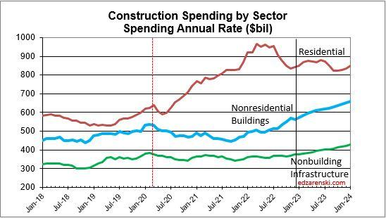

## Table of Contents

## What is construction spending?

Construction spending refers to the total amount of money spent on building new structures or improving existing ones. This includes costs for materials, labor, and other expenses related to construction projects. Governments, businesses, and individuals all contribute to construction spending when they invest in building homes, offices, roads, schools, and other facilities.

Tracking construction spending is important because it helps economists understand the health of the economy. When construction spending goes up, it often means more jobs and more economic activity. On the other hand, if construction spending decreases, it could be a sign that the economy is slowing down. By monitoring these trends, policymakers and businesses can make better decisions about future investments and planning.

## Why is it important to measure and track construction spending?

Measuring and tracking construction spending is important because it helps us understand how the economy is doing. When people and companies spend more money on building things like houses, roads, and schools, it usually means the economy is growing. This is because construction projects create jobs and lead to more money being spent in other areas of the economy.

If construction spending goes down, it can be a warning sign that the economy might be slowing down. By keeping an eye on these spending trends, people who make decisions about the economy, like government leaders and business owners, can plan better for the future. They can decide where to invest money and how to help the economy stay strong.

## What are the main components of construction spending?

Construction spending includes several main parts. The biggest part is the cost of materials, like wood, steel, and concrete, that builders use to make buildings and other structures. Another important part is labor costs, which is the money paid to workers who do the building. There are also other costs like equipment rentals, permits, and design fees that add to the total spending.

These different parts of construction spending can change over time. For example, if the price of materials goes up, then the total spending on construction will go up too. Also, if there are more construction projects happening, more workers will be needed, which can increase labor costs. By looking at these different parts, we can understand what is affecting construction spending and how it might change in the future.

## How is construction spending data collected?

Construction spending data is collected by the government, mainly through surveys. The U.S. Census Bureau, for example, sends out a survey called the "Value of Construction Put in Place" every month. In this survey, they ask construction companies, builders, and other people involved in construction to report how much money they spent on their projects during that month. This includes money spent on materials, labor, and other costs.

The information from these surveys is then put together to create a total number for construction spending across the country. The Census Bureau makes sure the data is accurate by checking it and sometimes asking for more details. They also compare the data with other information, like building permits and housing starts, to make sure everything matches up. This helps give a clear picture of how much money is being spent on construction and how it's changing over time.

## What are the common sources of construction spending data?

The main source of construction spending data comes from the U.S. Census Bureau. They collect this information by sending out a monthly survey called the "Value of Construction Put in Place." In this survey, they ask construction companies, builders, and others involved in construction to report how much money they spent on their projects that month. This includes costs for materials, labor, and other expenses.

The Census Bureau then combines all the survey responses to come up with a total amount of construction spending for the whole country. They make sure the data is correct by checking it carefully and sometimes asking for more details. They also compare the data with other information, like building permits and housing starts, to make sure everything lines up. This helps give a clear picture of how much money is being spent on construction and how it is changing over time.

## How is construction spending measured in different countries?

In different countries, construction spending is measured in ways that are similar to how it is done in the United States, but there can be some differences. Many countries use government agencies to collect data on how much money is being spent on building new things or fixing old ones. They often do this by sending out surveys to companies and builders, asking them to report their spending on materials, labor, and other costs each month or quarter.

For example, in Canada, Statistics Canada collects construction spending data through a survey called the "Investment in Building Construction" and another called the "Monthly Survey of Building Permits." In the United Kingdom, the Office for National Statistics uses surveys like the "Monthly Business Survey" to gather information on construction spending. These agencies then put all the data together to get a total amount of construction spending for their country, helping them understand how the economy is doing.

## What are the key indicators used to track construction spending?

Key indicators used to track construction spending include the total amount of money spent on construction projects each month or quarter. This is often collected through surveys sent to construction companies and builders, asking them about their spending on materials, labor, and other costs. The data helps show whether construction spending is going up or down, which can tell us a lot about the health of the economy. If spending goes up, it usually means more jobs and more economic activity, which is a good sign. If spending goes down, it might mean the economy is slowing down, which can be a warning sign.

Another important indicator is the number of building permits issued. These permits show how many new construction projects are starting, which can be a sign of future construction spending. If more permits are being issued, it suggests that more money will be spent on construction soon. On the other hand, if fewer permits are being issued, it might mean that construction spending will go down in the future. By looking at these indicators, people who make decisions about the economy can plan better and understand what might happen next.

## How does construction spending impact the economy?

Construction spending has a big impact on the economy. When people and companies spend more money on building things like houses, roads, and schools, it usually means the economy is growing. This is because construction projects create jobs for workers who build things. These workers then have more money to spend on other things, like food and clothes, which helps other parts of the economy grow too. So, when construction spending goes up, it can lead to more jobs and more economic activity, which is good for everyone.

On the other hand, if construction spending goes down, it can be a sign that the economy is slowing down. When fewer projects are happening, fewer workers are needed, and this can lead to people losing their jobs. When people have less money, they spend less on other things, which can make the economy weaker. By keeping an eye on construction spending, people who make decisions about the economy can plan better and try to keep the economy strong.

## What are the challenges in accurately measuring construction spending?

Measuring construction spending can be tricky because it's hard to get all the right information. Construction projects can be big and complicated, and it's not always easy for companies to keep track of every penny they spend on materials, labor, and other costs. Sometimes, companies might not report their spending correctly, either by mistake or on purpose. This can make the data less accurate and harder to trust. Also, construction spending can change a lot from month to month, so it's tough to get a clear picture of what's really happening.

Another challenge is that different projects can be very different from each other. For example, building a house is not the same as building a highway, so the costs can be hard to compare. This makes it difficult to come up with one number that shows the total construction spending for a whole country. On top of that, things like weather, economic conditions, and government policies can all affect how much money is spent on construction. All these factors together make it a big challenge to measure construction spending accurately and consistently.

## How can technology improve the tracking of construction spending?

Technology can help make tracking construction spending easier and more accurate. One way is by using special software that keeps track of all the money spent on a project. This software can record every time someone buys materials or pays workers, so it's easy to see where the money is going. It can also help make sure that the numbers are right by checking them automatically. This means that the people who collect the data don't have to do as much work, and they can be more sure that the numbers they get are correct.

Another way technology helps is by using tools like drones and sensors to keep an eye on construction sites. Drones can fly over a site and take pictures or videos, which can show how much work has been done and how much it might cost to finish. Sensors can also be used to track things like how much material is being used or how many workers are on the site. By using these tools, it's easier to get a clear picture of what's happening on a construction project, which helps in understanding how much money is being spent and how it's being used.

## What advanced statistical methods are used to analyze construction spending data?

Advanced statistical methods help us understand construction spending better. One common method is called regression analysis. This is where we look at how different things, like the cost of materials or the number of workers, affect how much money is spent on construction. By using regression analysis, we can see patterns and predict how spending might change in the future. For example, if the price of steel goes up, we can use regression to guess how that will change the total spending on a building project.

Another method is time series analysis, which looks at how construction spending changes over time. This helps us see if there are any regular patterns, like spending going up in the summer and down in the winter. By understanding these patterns, we can make better guesses about what will happen next. Time series analysis can also help us see if there are any big changes that we need to pay attention to, like a sudden drop in spending that might mean the economy is slowing down. Both of these methods help us make sense of the numbers and plan for the future.

## How does construction spending data influence policy and investment decisions?

Construction spending data helps people who make big decisions about the economy, like government leaders and business owners. They look at this data to see if the economy is growing or slowing down. If they see that construction spending is going up, they might decide to invest more money in new projects. This could mean building more roads, schools, or houses. On the other hand, if spending is going down, they might try to help the economy by creating new programs or changing rules to make it easier for companies to build things.

This data also helps investors decide where to put their money. If they see that a lot of money is being spent on building homes, they might invest in companies that make things like bricks or windows. Or, if they see that the government is spending more on highways, they might invest in companies that build roads. By looking at construction spending data, investors can try to guess which parts of the economy will do well and make smart choices about where to spend their money.

## References & Further Reading

[1]: Norfolk, A. L., & LaPlante, J. M. (2018). ["Predicting the stock market using economic indicators: The role of construction expenditures."](https://www.wikitree.com/genealogy/BAGNALL) Applied Economics Letters, 25(9), 540-544.

[2]: ["U.S. Census Bureau's Value of Construction Put in Place Survey"](https://www.census.gov/construction/c30/c30index.html).

[3]: Chan, E. P. (2009). ["Quantitative Trading: How to Build Your Own Algorithmic Trading Business"](https://github.com/ftvision/quant_trading_echan_book). Wiley.

[4]: Lopez de Prado, M. (2018). ["Advances in Financial Machine Learning"](https://www.amazon.com/Advances-Financial-Machine-Learning-Marcos/dp/1119482089). Wiley.

[5]: Jansen, S. (2020). ["Machine Learning for Algorithmic Trading: Second Edition - Discover Data-Driven Strategies, Learn Algorithmic Trading, and Explore Machine Learning Libraries"](https://www.cureus.com/articles/320746-effect-of-platelet-rich-fibrin-coating-on-secondary-stability-of-dental-implants-a-systematic-review-and-meta-analysis#!/). Packt Publishing.

[6]: Aronson, D. R. (2006). ["Evidence-Based Technical Analysis: Applying the Scientific Method and Statistical Inference to Trading Signals"](https://www.amazon.com/Evidence-Based-Technical-Analysis-Scientific-Statistical/dp/0470008741). Wiley.