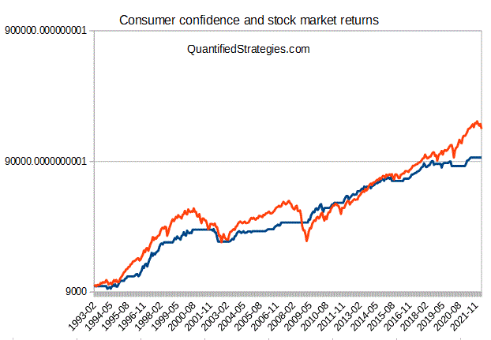

Economic indicators are instrumental in assessing the health and direction of an economy. Among these, consumer sentiment and consumer confidence are invaluable for understanding potential economic trends. Consumer confidence indices, like the Consumer Confidence Index (CCI) and the Michigan Consumer Sentiment Index (MCSI), serve as barometers for gauging future economic behavior. These indices reflect consumer willingness to engage in economic activities such as spending and investment, providing strategic insights for traders.

Algorithmic trading, characterized by its speed and precision, stands to gain considerably from incorporating such economic indicators. By processing vast amounts of data swiftly, algorithmic trading systems can enhance decision-making processes, capitalizing on even the slightest market fluctuations. The integration of consumer sentiment data into trading algorithms offers an opportunity to anticipate market movements more effectively, thereby potentially improving the success rates of trading strategies.



Understanding how consumer confidence affects market dynamics is crucial for traders aiming to extract strategic advantages. These insights allow for the development of more sophisticated and responsive trading strategies. While the potential of using consumer sentiment in algorithmic trading is significant, it is not without challenges. Traders must navigate data integration complexities and ensure timely analysis to avoid lags that could impact trading outcomes.

The exploration of these intertwined concepts—economic indicators like consumer sentiment and the technological prowess of algorithmic trading—provides a foundation to assess their collective impact on trading strategies. By outlining the advantages and obstacles inherent in this integration, the article endeavors to illustrate the evolving landscape of trading driven by consumer sentiment data.

## Table of Contents

## Understanding Economic Indicators: Consumer Sentiment and Confidence

Consumer sentiment and confidence are key economic indicators providing insights into household economic perceptions and spending behavior. These indicators are pivotal in understanding economic trends and potential market movements. 

### The Concept of Consumer Sentiment and Its Calculation

Consumer sentiment reflects the overall economic health as perceived by households. It gauges how optimistic or pessimistic consumers are regarding their financial situation and the general economic environment. The most noteworthy indices in this context are the Consumer Confidence Index (CCI) and the Michigan Consumer Sentiment Index (MSCI).

The **Consumer Confidence Index (CCI)**, produced by The Conference Board, is calculated using survey results from households across various questions about current business and employment conditions as well as their expectations for the next six months. This index is composed of two sub-indices: the Present Situation Index and the Expectations Index. These are quantified through the formula:

$$
\text{Index} = \left( \frac{\text{Current Survey Value}}{\text{Average of Base Year Value}} \right) \times 100
$$

where the base year value facilitates comparison across time periods, with higher numbers indicating increased confidence.

The **Michigan Consumer Sentiment Index (MSCI)**, compiled by the University of Michigan, similarly measures consumer attitudes through telephone surveys. It focuses on personal finances, business conditions, and buying conditions, employing methodologies in capturing both immediate and expected economic changes.

### Significance as Predictive Tools

These indices serve as critical predictive tools for economic behavior. High consumer confidence suggests increased consumer spending, indicative of economic expansion, while low confidence signals potential decreases in spending, often predicting an economic downturn. Since consumer spending contributes significantly to GDP, these indices are valuable for predicting broader economic activities.

### Historical Context and Development

The development of consumer sentiment indices dates back to the mid-20th century. The CCI was first introduced in 1967, during a period demanding more nuanced economic forecasting tools in response to evolving economic structures and consumer behavior. The MSCI began earlier, in 1946, as part of post-war efforts to understand consumer responses to economic policy changes.

These indices have become essential tools for economists and policymakers. Historically, during periods of economic recession, declining trends in these indices have preceded economic downturns, making them inherent in economic forecasting.

### Leading Indicators for Market Trends

Consumer sentiment indices are leading indicators for financial markets. They often predict changes in economic activities such as stock market fluctuations, employment trends, and retail sales growth. As consumers signal their future spending intentions through these indices, traders and investors use them to assess the likely trajectory of financial markets and the economy.

In conclusion, understanding these indices is fundamental for anticipating market trends and economic cycles. Their historical reliability in predicting economic shifts underscores their value in strategic economic analysis and financial decision-making.

## The Role of Consumer Confidence in Economic Analysis

Consumer confidence serves as a vital barometer for projecting economic activity and spending patterns. This economic indicator measures public sentiment regarding the present and future financial conditions, which in turn affects consumption and saving behaviors. In essence, when consumers are confident about their financial prospects, there tends to be an increase in consumer spending, acting as a catalyst for economic growth.

Businesses and policymakers leverage consumer confidence data to make informed strategic decisions. For firms, understanding consumer sentiment can aid in forecasting demand for products and services, steering marketing strategies, and managing inventories. For example, a high consumer confidence index (CCI) may signal businesses to ramp up production and invest more aggressively, anticipating increased consumer demand. For policymakers, consumer confidence provides insights into the public's outlook on the economy, assisting in formulating monetary and fiscal policies. For instance, a falling confidence index could prompt governmental interventions to stimulate economic activity through tax cuts or increased public spending.

The interdependency between consumer confidence and other economic indicators like Gross Domestic Product (GDP) and unemployment rates highlights its predictive prowess. A positive correlation is often observed between consumer confidence and GDP growth; as confidence rises, so does GDP due to increased consumer expenditure. Conversely, an inverse relationship usually exists between unemployment rates and consumer confidence—higher unemployment negatively impacts consumer confidence as financial insecurity takes precedence.

Empirical evidence supports the significant predictive role of consumer confidence. Historical case studies have demonstrated its utility in anticipating economic downturns and recoveries. For instance, prior to the 2008 financial crisis, a sharp drop in consumer confidence indices was recorded, signaling apprehensions about future economic conditions. Similarly, during periods of recovery, improvements in consumer confidence have preceded upticks in economic activity, as observed in various post-recessionary phases.

In summary, consumer confidence is a crucial component in economic analysis, offering valuable foresight into consumption patterns and economic trajectories. By integrating consumer confidence data with other economic indicators, businesses and policymakers can better align strategies to navigate economic fluctuations and foster sustainable growth.

## Algorithmic Trading: A Primer

Algorithmic trading, often referred to as "algo trading," involves the use of computer algorithms to manage trading strategies and execute orders in financial markets. The primary goal of these algorithms is to capitalize on the advantages of speed and precision, which are unattainable through manual trading. By leveraging mathematical models and automated processes, [algorithmic trading](/wiki/algorithmic-trading) allows traders to efficiently explore market trends and execute trades faster than any human trader could.

A fundamental benefit of algorithmic trading lies in its capacity to handle vast amounts of data at high speeds. This capability enables traders to identify and act on minute market fluctuations that would otherwise be invisible or too rapid for manual trading. For example, by executing trades based on pre-defined criteria, traders can maximize opportunities in volatile markets, ensuring they respond to market movements in real time.

Common algorithmic trading strategies include [arbitrage](/wiki/arbitrage), trend-following, and [statistical arbitrage](/wiki/statistical-arbitrage). Arbitrage involves exploiting price discrepancies between different markets or instruments, allowing traders to profit from these inconsistencies. Trend-following strategies aim to capitalize on [momentum](/wiki/momentum) by identifying and following persistent market trends. Statistical arbitrage, on the other hand, uses mathematical models to identify and exploit pricing inefficiencies between related financial instruments.

Arbitrage strategies might involve complex statistical models to identify opportunities across different markets. For example, suppose there is a price difference for the same asset traded on two different exchanges. In algorithmic trading, a program can be written to buy the asset cheaply on one exchange and sell it at a higher price on another, ensuring a profit. This can be represented mathematically as:

$$
\text{Profit} = \sum (P_{\text{sell}} - P_{\text{buy}})
$$

where $P_{\text{sell}}$ is the selling price on one exchange and $P_{\text{buy}}$ is the buying price on another.

Despite these advantages, algorithmic trading is not without regulatory and ethical considerations. Regulatory bodies worldwide are increasingly scrutinizing algo trading due to concerns about market [volatility](/wiki/volatility-trading-strategies) and fairness. These concerns arise particularly around high-frequency trading ([HFT](/wiki/high-frequency-trading-strategies)), where algorithms execute large volumes of trades at extremely high speeds, potentially leading to market destabilization.

Ethical considerations also play a role, as the transparency and fairness of algorithmic trading practices may be called into question. Ensuring that these trading strategies do not disproportionately advantage certain market participants is crucial. This is where regulations aim to ensure fair access to these technologies and maintain market integrity.

In summary, while algorithmic trading offers a multitude of benefits such as increased speed, precision, and efficiency, it also presents challenges that need to be mitigated through regulatory oversight and ethical trading practices. The continued evolution of technology promises to enhance these trading strategies while balancing the need for fair and stable markets.

## Incorporating Consumer Confidence into Trading Algorithms

Integrating consumer confidence data into algorithmic trading strategies provides traders with a valuable tool for making informed decisions in rapidly changing markets. Consumer confidence indices, such as the Consumer Confidence Index (CCI) and the Michigan Consumer Sentiment Index (MCSI), reflect the overall economic sentiment and expectations of consumers, which can directly influence market trends and financial markets. Their inclusion in trading algorithms can offer unique advantages and insights.

The primary benefit of utilizing real-time consumer confidence data is the ability to anticipate market movements and adjust trading positions accordingly. These indices can serve as leading indicators of economic performance, providing early signals of shifts in consumer behavior and spending patterns. By incorporating these signals, traders can enhance their ability to respond to market fluctuations and potentially capitalize on emerging trends before they are fully realized by the broader market.

The process of integrating consumer confidence data into trading algorithms involves several data analysis techniques and tools. Machine learning models are particularly useful in this context, as they can learn from historical data and identify complex patterns that may not be immediately obvious. For instance, a support vector machine (SVM) or a recurrent [neural network](/wiki/neural-network) (RNN) can be employed to predict market trends based on consumer sentiment data. These models allow the algorithm to adapt dynamically and optimize trading strategies in conjunction with consumer sentiment.

Here's an example of how Python can be used to process consumer confidence data and implement a simple trading strategy:

```python
import pandas as pd
from sklearn.model_selection import train_test_split
from sklearn.svm import SVR
import numpy as np

# Load consumer confidence data
data = pd.read_csv('consumer_confidence_data.csv')
X = data[['index_value']]  # Example feature: consumer confidence index value
y = data['market_trend']  # Example target: market trend

# Split the data into training and test sets
X_train, X_test, y_train, y_test = train_test_split(X, y, test_size=0.2, random_state=42)

# Train a Support Vector Regression model
model = SVR(kernel='linear')
model.fit(X_train, y_train)

# Predict market trends based on consumer confidence index
predictions = model.predict(X_test)

# Trading strategy implementation
buy_signal = np.where(predictions > 0.5, 'Buy', 'Hold')  # Simplified trading signal
```

Despite its advantages, the use of consumer confidence data in trading algorithms is not without challenges. Data lag, stemming from the time required to collect and publish these indices, can impede the ability to make timely trading decisions. Moreover, consumer confidence should not be used in isolation; it is imperative to combine it with other economic indicators, such as unemployment rates and GDP growth, to improve predictive accuracy and robustness. This integrated approach helps mitigate the uncertainty and volatility inherent in relying solely on consumer sentiment data.

By thoughtfully incorporating consumer confidence data into trading algorithms and addressing its associated challenges, traders can enhance their strategic decision-making and potentially gain a competitive edge in the financial markets.

## Case Studies and Real-World Applications

Consumer confidence indices have been employed in various algorithmic trading strategies, showcasing their utility in predicting and responding to market dynamics. Several case studies demonstrate the application of consumer sentiment data in crafting more informed and effective trading decisions.

One notable example involves the integration of the Michigan Consumer Sentiment Index into an algorithmic trading model by a quantitative [hedge fund](/wiki/hedge-fund-trading-strategies). The fund utilized historical data from the index to identify patterns and signals correlating with market movements. By employing [machine learning](/wiki/machine-learning) techniques, specifically regression analysis, the fund was able to create predictive models that determined potential future stock price movements based on shifts in consumer sentiment. This strategy enabled the fund to adjust its equity positions preemptively, leading to improved returns compared to models that did not incorporate consumer confidence data.

Another case study highlights the use of the Consumer Confidence Index (CCI) by a proprietary trading firm. The firm developed a trading algorithm that analyzed CCI data alongside traditional market indicators such as moving averages and [volume](/wiki/volume-trading-strategy). By doing so, the algorithm identified periods where positive consumer sentiment coincided with upward market trends, signaling buy opportunities. Conversely, declines in the CCI, when aligned with other bearish signals, prompted sell decisions. The firm reported that integrating consumer sentiment data helped buffer the algorithm against false signals, thereby enhancing trading accuracy and profit margins.

The application of consumer confidence data is not confined to equities alone. In [forex](/wiki/forex-system) markets, traders have also successfully implemented these indices. For instance, a foreign exchange trading company incorporated real-time consumer sentiment metrics into its currency prediction models. Given the close ties between national economic health and currency values, fluctuations in consumer confidence provided the firm with an edge in anticipating currency movements. This approach allowed the company to take advantage of discrepancies between expected and actual economic conditions reflected through currency pairs, thus optimizing its trading strategy.

These real-world applications reveal significant insights about the effective integration of consumer sentiment data in trading. Notably, one of the key lessons learned is the importance of context when interpreting consumer confidence data. The effectiveness of trading strategies often hinges not just on sentiment changes, but also on the broader economic environment and other concurrent indicators. Consequently, traders and firms have found it crucial to deploy sentiment data in tandem with diverse data sources to achieve a holistic view of market conditions.

Additionally, these case studies underscore the challenges associated with data lag and revision. Traders have noted that consumer sentiment indices, typically released on a monthly basis, may not always capture real-time shifts in sentiment. Thus, some firms have adopted supplementary data sources, such as real-time social media analysis, to fill in these gaps and update their models more frequently.

Overall, these implementations of consumer sentiment data in trading underscore its potential to enhance market predictions and decisions. However, they also highlight the necessity for continuous refinement and innovation in trading algorithms to account for the dynamic nature of financial markets and the complexities of economic indicators.

## Future Trends and Innovations

The integration of consumer confidence data into trading strategies is poised for significant evolution, driven by rapid technological advancements and potential regulatory shifts. As [artificial intelligence](/wiki/ai-artificial-intelligence) (AI) and machine learning continue to advance, they are set to transform how consumer sentiment is analyzed and applied within algorithmic trading. These technologies allow for the processing of vast amounts of data in real time, uncovering patterns and insights that are not readily apparent through traditional analytical methods.

Machine learning algorithms can identify complex relationships within datasets, adapting and improving as new data becomes available. This adaptability is crucial when analyzing consumer confidence data, which can be influenced by a myriad of factors, including economic conditions, social trends, and geopolitical events. For instance, by employing natural language processing (NLP) techniques, algorithms can extract sentiment from social media, news articles, and other text-based sources, providing a more nuanced understanding of consumer confidence.

```python
from sklearn.feature_extraction.text import TfidfVectorizer
from sklearn.ensemble import RandomForestClassifier
from sklearn.pipeline import make_pipeline

# Sample Python code to process text data from news articles
def analyze_consumer_sentiment(text_data):
    # Vectorize the text data
    vectorizer = TfidfVectorizer(stop_words='english')

    # Create a RandomForest Classifier pipeline
    model = make_pipeline(vectorizer, RandomForestClassifier(n_estimators=100, random_state=42))

    # Fit model (assuming we have labeled data)
    model.fit(text_data['text'], text_data['sentiment_label'])

    # Predict sentiment on new data
    return model.predict(text_data['new_data'])
```

Regulatory changes could also influence how consumer confidence data is utilized in trading. As algorithmic trading grows more prevalent, regulatory bodies are likely to implement stricter controls to ensure market stability and prevent manipulation. These regulations could mandate greater transparency in how consumer confidence metrics are derived and applied, potentially influencing the strategies employed by traders.

The evolution of consumer confidence data analytics aligns with broader trends in financial markets, emphasizing data-driven decision-making. This shift is encouraged by the availability of enhanced computational power and cloud-based solutions, allowing for more sophisticated algorithms and real-time data processing. As a result, markets are expected to become increasingly efficient, with consumer confidence metrics playing a pivotal role in predicting market movements and informing investment decisions.

As markets continue to embrace technological innovation, the application of consumer confidence data in trading algorithms will likely expand. Future developments may include more personalized trading strategies, leveraging individual-level confidence data, and integrating it with other personal financial indicators. This integration could result in a more comprehensive financial strategy, aligning with the evolving needs of traders and investors.

The future promises a more interconnected and data-rich trading environment, where consumer confidence is not just a standalone metric but an integral component of holistic market analysis. The adaptation of AI and machine learning in this context underscores the importance of continuous innovation and the pursuit of more accurate and effective trading strategies.

## Conclusion

Consumer confidence, as an economic indicator, plays a significant role in enhancing the efficacy of algorithmic trading strategies. Its ability to provide insights into future economic behaviors and trends makes it invaluable for traders seeking a strategic edge. By incorporating consumer sentiment data, trading algorithms can potentially anticipate market movements with greater accuracy, allowing traders to optimize their decision-making processes. The advantages of this integration include the ability to make informed trading decisions based on real-time data, which can lead to increased profitability and reduced risks associated with market uncertainties.

However, the incorporation of consumer confidence into trading algorithms is not without its challenges. One primary concern is data lag, which can lead to outdated information being used in decision-making. Addressing this issue requires the amalgamation of consumer confidence data with other economic indicators to provide a comprehensive analysis of market conditions. Additionally, maintaining the reliability and accuracy of data remains a crucial task, necessitating continuous monitoring and validation to prevent erroneous trading signals.

The ever-evolving landscape of financial markets underscores the need for consistent innovation in trading strategies. Embracing advancements in technology, such as artificial intelligence and machine learning, can facilitate the efficient processing and analysis of consumer sentiment data. Furthermore, as regulatory landscapes shift, adapting trading models to comply with new regulations will be essential in leveraging consumer confidence data effectively.

In summary, while consumer confidence offers substantial benefits as a tool for algorithmic trading, its integration requires careful consideration of potential challenges. By fostering innovation and adaptability in trading strategies, traders can harness the full potential of consumer confidence data, ultimately achieving a more robust and insightful approach to market dynamics.

## References & Further Reading

[1]: ["Consumer Confidence Index (CCI)"](https://www.oecd.org/en/data/indicators/consumer-confidence-index-cci.html) - The Conference Board

[2]: Curtin, R. T. (2002). ["Consumer Sentiment Surveys: Worldwide View."](https://assets.cambridge.org/97811070/04696/frontmatter/9781107004696_frontmatter.pdf) Journal of Economic Perspectives.

[3]: ["The Michigan Consumer Sentiment Index"](http://www.sca.isr.umich.edu/) - University of Michigan

[4]: ["Advances in Financial Machine Learning"](https://www.amazon.com/Advances-Financial-Machine-Learning-Marcos/dp/1119482089) by Marcos Lopez de Prado

[5]: ["Machine Learning for Algorithmic Trading"](https://github.com/stefan-jansen/machine-learning-for-trading) by Stefan Jansen

[6]: Wu, J., & Brynjolfsson, E. (2009). ["The Future of Prediction: How Google Searches Foreshadow Housing Prices and Sales."](https://papers.ssrn.com/sol3/papers.cfm?abstract_id=2022293) 

[7]: Mitra, G., & Mitra, L. (Eds.). (2011). ["The Handbook of News Analytics in Finance."](https://onlinelibrary.wiley.com/doi/book/10.1002/9781118467411) Wiley.

[8]: Chan, E. P. (2009). ["Quantitative Trading: How to Build Your Own Algorithmic Trading Business"](https://github.com/ftvision/quant_trading_echan_book) by Ernest P. Chan