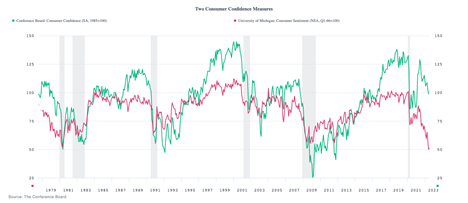

## Table of Contents

## What is consumer confidence?

Consumer confidence is a measure of how people feel about the economy and their personal finances. It shows if people are optimistic or pessimistic about their future financial situation. When people feel good about the economy, they are more likely to spend money on things they want and need. This can help the economy grow because more spending leads to more business activity.

On the other hand, if people are worried about the economy, they might save their money instead of spending it. This can slow down the economy because businesses might not sell as much. Economists and policymakers use consumer confidence data to understand how people are feeling and to make decisions that can help improve the economy.

## What is consumer sentiment?

Consumer sentiment is similar to consumer confidence. It's about how people feel about their money and the economy. It tells us if people think things are going well or if they're worried about the future. When people feel good about their money, they are more likely to spend on things they want and need. This can help the economy grow because more spending means more business.

On the other hand, if people are worried about their money and the economy, they might save more and spend less. This can slow down the economy because businesses might not sell as much. Economists and people who make rules for the country use consumer sentiment to understand how people are feeling. This helps them make choices that can make the economy better.

## How are consumer confidence and sentiment measured?

Consumer confidence and sentiment are measured through surveys that ask people about their views on the economy and their personal finances. These surveys often include questions about current economic conditions and how people think the economy will be in the future. The most well-known survey for consumer confidence in the United States is done by The Conference Board, while the University of Michigan conducts a widely recognized survey for consumer sentiment.

Both surveys collect responses from a large number of people, usually thousands, to get a good picture of how everyone is feeling. The answers are then turned into numbers, like an index or a score. A higher score means people are feeling more positive about the economy, while a lower score means they are feeling more negative. These numbers help economists and policymakers understand trends and make decisions to help the economy.

## What are the main differences between consumer confidence and sentiment?

Consumer confidence and consumer sentiment both measure how people feel about the economy and their money, but they come from different surveys. The main survey for consumer confidence is done by The Conference Board. They ask people about their current and future financial situation and the economy. On the other hand, consumer sentiment is measured by the University of Michigan. They also ask about people's feelings on the economy, but their questions and the way they calculate the results can be a bit different.

Even though both surveys aim to understand how people feel, the way they ask questions and the focus of those questions can lead to slightly different results. For example, The Conference Board's survey might focus more on job availability and business conditions, while the University of Michigan's survey might put more emphasis on personal finances and buying plans. These small differences can make the confidence index and the sentiment index show slightly different pictures of how people are feeling about the economy.

## Why are consumer confidence and sentiment important for the economy?

Consumer confidence and sentiment are important for the economy because they show how people feel about their money and the future. When people feel good about the economy, they are more likely to spend money on things they want and need. This spending helps businesses grow and can create more jobs. If lots of people are spending, it can make the whole economy stronger. Economists and people who make rules for the country watch these numbers to see if people are happy or worried about the economy.

On the other hand, if people are worried about the economy, they might save their money instead of spending it. When people save more and spend less, businesses might sell less and might not need as many workers. This can slow down the economy. By understanding consumer confidence and sentiment, people who make decisions for the country can try to do things that will make people feel better about the economy and encourage them to spend more. This can help keep the economy moving and growing.

## How do consumer confidence and sentiment influence spending and saving behaviors?

Consumer confidence and sentiment are like a mood check for the economy. When people feel good about their money and the economy, they are more likely to spend. They might buy things they want, like new clothes or a vacation, or things they need, like a new fridge. This spending helps businesses because when people buy more, businesses can sell more and maybe even hire more people. So, when consumer confidence and sentiment are high, it can make the economy grow because more spending means more business.

On the other hand, when people are worried about their money and the economy, they might decide to save more instead of spending. They might put their money in a bank or keep it at home, thinking they might need it later if things get worse. When lots of people save instead of spend, businesses might not sell as much, and they might not need as many workers. This can slow down the economy. So, low consumer confidence and sentiment can make people hold onto their money, which can make the economy weaker.

## What are the key indices used to track consumer confidence and sentiment globally?

The main index for tracking consumer confidence around the world is the Consumer Confidence Index by The Conference Board. This index is used a lot in the United States, but it's also looked at by people in other countries. The Conference Board asks people how they feel about their current money situation and how they think the economy will do in the future. The answers help make a number that shows if people are feeling good or bad about the economy. When the number is high, it means people are feeling more positive, and when it's low, it means they're feeling more negative.

Another important index is the Consumer Sentiment Index by the University of Michigan. This index is also popular in the United States, but it's watched by people all over the world too. The University of Michigan asks people about their feelings on the economy, but they focus a bit more on personal money matters and what people plan to buy. They use the answers to make a number that shows how people are feeling. Like the Consumer Confidence Index, a high number means people are feeling good about the economy, and a low number means they're feeling bad.

In other countries, there are also similar indices. For example, in Europe, the European Commission has the Consumer Confidence Indicator, which asks people in different European countries about their views on the economy. In Asia, countries like Japan and China have their own indices to measure how people feel about the economy. All these indices help people understand how people are feeling about their money and the economy in different parts of the world.

## How do different demographic groups perceive consumer confidence and sentiment?

Different groups of people can feel differently about the economy and their money. For example, young people might feel more worried about finding a good job and paying off student loans. They might not be as confident about the future because they are just starting out in their careers. Older people, on the other hand, might feel more secure because they have more experience and maybe have saved up some money. They might feel more confident about the economy because they have seen ups and downs before and know how to handle them.

People with different levels of education and income also have different views. Those with higher education and better-paying jobs might feel more confident because they think they can handle economic changes better. They might spend more and feel good about the economy. People with lower education and income might feel more worried because they might not have as much money saved up. They might save more and spend less, feeling less confident about the economy. These differences in how people feel can affect how much they spend or save, which in turn can impact the whole economy.

## What historical events have significantly impacted consumer confidence and sentiment?

Big events like the Great Depression in the 1930s made people very worried about their money. During that time, lots of people lost their jobs and their savings. They didn't know if things would get better, so they saved their money instead of spending it. This made the economy even worse because businesses couldn't sell as much. The Great Depression showed how important it is for people to feel good about the economy because when they don't, they spend less, and the economy can get stuck.

Another big event was the 2008 financial crisis. It started when housing prices fell a lot, and many people couldn't pay their home loans. This made banks lose a lot of money, and it scared people about their own money too. People started saving more and spending less because they were worried about losing their jobs or their homes. The 2008 financial crisis showed how quickly people's feelings about the economy can change and how these feelings can affect the whole economy.

## How do government policies affect consumer confidence and sentiment?

Government policies can have a big effect on how people feel about the economy. When the government does things like lowering taxes or giving people money to help them, it can make people feel better about their money. They might think they have more to spend and feel more confident about the future. For example, if the government gives out checks to help people during tough times, like they did during the COVID-19 pandemic, it can make people feel like the government is looking out for them. This can make them more likely to spend money and help the economy grow.

On the other hand, if the government raises taxes or cuts back on programs that help people, it can make them feel worse about the economy. They might worry that they won't have enough money and start saving more instead of spending. For example, if the government cuts back on unemployment benefits, people might feel less secure and more worried about their future. This can make them hold onto their money, which can slow down the economy. So, what the government does can really change how people feel about their money and the economy.

## What are the leading indicators that predict changes in consumer confidence and sentiment?

Leading indicators that can predict changes in consumer confidence and sentiment include things like employment numbers and stock market performance. When more people have jobs, they feel more secure about their money and are more likely to spend. This makes them feel more confident about the economy. On the other hand, if lots of people lose their jobs, they might start saving more and spending less because they're worried about the future. The stock market also matters because when it goes up, people with investments feel richer and more confident. But if the stock market goes down, people might feel less confident and spend less.

Another important leading indicator is inflation. When prices go up a lot, people might feel like their money isn't worth as much, and they might start saving more instead of spending. This can make consumer confidence and sentiment go down. On the flip side, if prices are stable or going up slowly, people might feel more confident about their money and spend more. Government policies can also be a leading indicator. If the government does things like lowering taxes or giving out money to help people, it can make people feel more confident about the economy and more likely to spend.

## How can businesses use consumer confidence and sentiment data to strategize marketing and sales?

Businesses can use consumer confidence and sentiment data to plan their marketing and sales better. When consumer confidence is high, people feel good about the economy and are more likely to spend money. Businesses can take advantage of this by running more ads and offering new products or services. They can also use this time to try out new marketing ideas because people are more open to trying new things when they feel good about their money. For example, a business might decide to launch a big sale or a new product line when they see that consumer confidence is going up.

On the other hand, when consumer confidence and sentiment are low, people are more likely to save their money instead of spending it. Businesses need to be careful during these times. They might want to focus on keeping their current customers happy instead of trying to attract new ones. They could offer deals or discounts to encourage people to spend a little bit, even when they're worried about the economy. By understanding how people feel about their money, businesses can adjust their marketing and sales plans to match what people are likely to do.

## What is the relationship between consumer sentiment, confidence, and understanding economic indicators?

Consumer sentiment and confidence are key economic indicators providing insights into household economic perceptions and spending behavior. These indicators are pivotal in understanding economic trends and potential market movements. 

### The Concept of Consumer Sentiment and Its Calculation

Consumer sentiment reflects the overall economic health as perceived by households. It gauges how optimistic or pessimistic consumers are regarding their financial situation and the general economic environment. The most noteworthy indices in this context are the Consumer Confidence Index (CCI) and the Michigan Consumer Sentiment Index (MSCI).

The **Consumer Confidence Index (CCI)**, produced by The Conference Board, is calculated using survey results from households across various questions about current business and employment conditions as well as their expectations for the next six months. This index is composed of two sub-indices: the Present Situation Index and the Expectations Index. These are quantified through the formula:

$$
\text{Index} = \left( \frac{\text{Current Survey Value}}{\text{Average of Base Year Value}} \right) \times 100
$$

where the base year value facilitates comparison across time periods, with higher numbers indicating increased confidence.

The **Michigan Consumer Sentiment Index (MSCI)**, compiled by the University of Michigan, similarly measures consumer attitudes through telephone surveys. It focuses on personal finances, business conditions, and buying conditions, employing methodologies in capturing both immediate and expected economic changes.

### Significance as Predictive Tools

These indices serve as critical predictive tools for economic behavior. High consumer confidence suggests increased consumer spending, indicative of economic expansion, while low confidence signals potential decreases in spending, often predicting an economic downturn. Since consumer spending contributes significantly to GDP, these indices are valuable for predicting broader economic activities.

### Historical Context and Development

The development of consumer sentiment indices dates back to the mid-20th century. The CCI was first introduced in 1967, during a period demanding more nuanced economic forecasting tools in response to evolving economic structures and consumer behavior. The MSCI began earlier, in 1946, as part of post-war efforts to understand consumer responses to economic policy changes.

These indices have become essential tools for economists and policymakers. Historically, during periods of economic recession, declining trends in these indices have preceded economic downturns, making them inherent in economic forecasting.

### Leading Indicators for Market Trends

Consumer sentiment indices are leading indicators for financial markets. They often predict changes in economic activities such as stock market fluctuations, employment trends, and retail sales growth. As consumers signal their future spending intentions through these indices, traders and investors use them to assess the likely trajectory of financial markets and the economy.

In conclusion, understanding these indices is fundamental for anticipating market trends and economic cycles. Their historical reliability in predicting economic shifts underscores their value in strategic economic analysis and financial decision-making.

## What is Algorithmic Trading: A Primer?

Algorithmic trading, often referred to as "algo trading," involves the use of computer algorithms to manage trading strategies and execute orders in financial markets. The primary goal of these algorithms is to capitalize on the advantages of speed and precision, which are unattainable through manual trading. By leveraging mathematical models and automated processes, [algorithmic trading](/wiki/algorithmic-trading) allows traders to efficiently explore market trends and execute trades faster than any human trader could.

A fundamental benefit of algorithmic trading lies in its capacity to handle vast amounts of data at high speeds. This capability enables traders to identify and act on minute market fluctuations that would otherwise be invisible or too rapid for manual trading. For example, by executing trades based on pre-defined criteria, traders can maximize opportunities in volatile markets, ensuring they respond to market movements in real time.

Common algorithmic trading strategies include [arbitrage](/wiki/arbitrage), trend-following, and [statistical arbitrage](/wiki/statistical-arbitrage). Arbitrage involves exploiting price discrepancies between different markets or instruments, allowing traders to profit from these inconsistencies. Trend-following strategies aim to capitalize on [momentum](/wiki/momentum) by identifying and following persistent market trends. Statistical arbitrage, on the other hand, uses mathematical models to identify and exploit pricing inefficiencies between related financial instruments.

Arbitrage strategies might involve complex statistical models to identify opportunities across different markets. For example, suppose there is a price difference for the same asset traded on two different exchanges. In algorithmic trading, a program can be written to buy the asset cheaply on one exchange and sell it at a higher price on another, ensuring a profit. This can be represented mathematically as:

$$
\text{Profit} = \sum (P_{\text{sell}} - P_{\text{buy}})
$$

where $P_{\text{sell}}$ is the selling price on one exchange and $P_{\text{buy}}$ is the buying price on another.

Despite these advantages, algorithmic trading is not without regulatory and ethical considerations. Regulatory bodies worldwide are increasingly scrutinizing algo trading due to concerns about market [volatility](/wiki/volatility-trading-strategies) and fairness. These concerns arise particularly around high-frequency trading ([HFT](/wiki/high-frequency-trading-strategies)), where algorithms execute large volumes of trades at extremely high speeds, potentially leading to market destabilization.

Ethical considerations also play a role, as the transparency and fairness of algorithmic trading practices may be called into question. Ensuring that these trading strategies do not disproportionately advantage certain market participants is crucial. This is where regulations aim to ensure fair access to these technologies and maintain market integrity.

In summary, while algorithmic trading offers a multitude of benefits such as increased speed, precision, and efficiency, it also presents challenges that need to be mitigated through regulatory oversight and ethical trading practices. The continued evolution of technology promises to enhance these trading strategies while balancing the need for fair and stable markets.

## References & Further Reading

[1]: ["Consumer Confidence Index (CCI)"](https://www.oecd.org/en/data/indicators/consumer-confidence-index-cci.html) - The Conference Board

[2]: Curtin, R. T. (2002). ["Consumer Sentiment Surveys: Worldwide View."](https://assets.cambridge.org/97811070/04696/frontmatter/9781107004696_frontmatter.pdf) Journal of Economic Perspectives.

[3]: ["The Michigan Consumer Sentiment Index"](http://www.sca.isr.umich.edu/) - University of Michigan

[4]: ["Advances in Financial Machine Learning"](https://www.amazon.com/Advances-Financial-Machine-Learning-Marcos/dp/1119482089) by Marcos Lopez de Prado

[5]: ["Machine Learning for Algorithmic Trading"](https://github.com/stefan-jansen/machine-learning-for-trading) by Stefan Jansen

[6]: Wu, J., & Brynjolfsson, E. (2009). ["The Future of Prediction: How Google Searches Foreshadow Housing Prices and Sales."](https://papers.ssrn.com/sol3/papers.cfm?abstract_id=2022293) 

[7]: Mitra, G., & Mitra, L. (Eds.). (2011). ["The Handbook of News Analytics in Finance."](https://onlinelibrary.wiley.com/doi/book/10.1002/9781118467411) Wiley.

[8]: Chan, E. P. (2009). ["Quantitative Trading: How to Build Your Own Algorithmic Trading Business"](https://github.com/ftvision/quant_trading_echan_book) by Ernest P. Chan