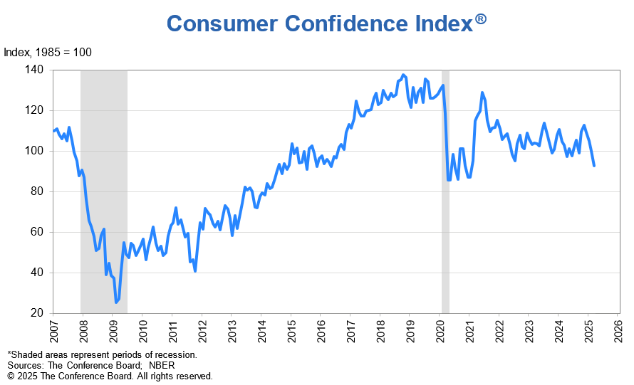

The Consumer Confidence Index (CCI) serves as a vital economic indicator that assesses the overall sentiment of consumers regarding the financial health and stability of an economy. It reflects how optimistic or pessimistic consumers feel about their expected financial situation, and by extension, their propensity to spend. As consumer spending represents a significant portion of economic activity—typically accounting for around 60% to 70% of GDP in developed countries—the CCI becomes instrumental in forecasting economic trends. Changes in consumer confidence can trigger shifts in the business cycle, influencing contracting or expanding economic phases.

Algorithmic trading, on the other hand, is an innovative approach in financial markets involving automated trading strategies. With advancements in computational technology, algorithmic trading has garnered significant attention due to its ability to process large volumes of data at high speed with remarkable accuracy. Algorithms can analyze market data and execute trades based on programmed instructions profitably and efficiently, minimizing human error and emotional bias.



The interplay between economic indicators such as the CCI and algorithmic trading presents novel opportunities for enhanced trading strategies. By integrating consumer sentiment data into algorithmic models, traders can potentially predict market movements with improved precision. For instance, a sudden drop in the CCI might inform algorithms to adjust trading positions in certain sectors sensitive to consumer expenditures.

This article will explore the multifaceted role of the CCI within the broader framework of economic analysis and algorithmic trading. Beginning with a detailed understanding of how the CCI is calculated and its historical development, we will then examine its application in economic analysis and its intersection with algorithmic trading. By illustrating the potential for CCI to inform and refine algorithmic trading strategies, the article will highlight successful case studies and potential future advancements. The conclusion will summarize key insights and encourage ongoing innovation in leveraging the CCI for both economic forecasts and trading performance.

## Table of Contents

## Understanding Consumer Confidence Index (CCI)

The Consumer Confidence Index (CCI) is a fundamental economic indicator measuring the degree of optimism that consumers feel about the overall state of the economy and their personal financial situations. The CCI is a powerful tool for understanding spending and saving behavior among consumers, providing insights into future economic activity. 

The CCI is derived from a monthly survey of households, where respondents are asked about their perceptions of current economic conditions and their expectations for the economy over the next six months. The survey typically includes questions about business conditions, employment, and total family income. The CCI's two main components are the Present Situation Index and the Expectations Index. The Present Situation Index gauges consumers' current assessment of the economy, while the Expectations Index provides insights into their outlook for the future.

Mathematically, CCI calculations involve weighting the responses from the survey to derive an index number. If each survey component is denoted as $Q_i$ with a corresponding weight $w_i$, the CCI can be expressed as:

$$
CCI = \frac{\sum_{i=1}^{n} w_i \times Q_i}{\sum_{i=1}^{n} w_i}
$$

Historically, the CCI was developed in the mid-20th century to give businesses and policymakers a metric to gauge consumer sentiment. The most widely followed CCI in the United States is published by The Conference Board, a global business research organization. Additionally, the University of Michigan publishes a similar index known as the Consumer Sentiment Index (CSI), often used to complement the Conference Board's CCI.

The CCI is considered a leading economic indicator as it forecasts economic trends and shifts in consumption patterns before they manifest in other forms of economic data. High consumer confidence typically signals increased consumer spending, which drives economic growth, employment, and production. Conversely, a declining CCI can be an early warning of an economic downturn, as cautious consumers reduce spending in anticipation of tougher economic conditions.

Historical changes in the CCI have had significant impacts on markets. For example, a sharp drop in consumer confidence in 2008 signaled the onset of the global financial crisis. During this period, reduced consumer spending contributed to a contraction in economic activity and a subsequent downturn in global markets. On the other hand, rising confidence in the early 2000s supported the economic recovery following the dot-com bubble collapse, illustrating the CCI's role in economic forecasting and policy formulation. 

The CCI offers critical insights, making it indispensable for businesses, investors, and policymakers aiming to understand and navigate economic environments.

## The Role of CCI in Economic Analysis

Consumer Confidence Index (CCI) serves as a critical barometer for predicting consumer spending patterns and overall economic health. Businesses across various sectors utilize CCI to make informed decisions regarding inventory levels, marketing strategies, and future investment plans. High levels of consumer confidence typically correlate with increased consumer spending, fueling economic expansion. This, in turn, can lead to increased production, job creation, and investment, forming a positive feedback loop that benefits the overall economy.

In contrast, a decline in CCI often signals reduced consumer optimism, potentially heralding an economic downturn. When consumers anticipate economic difficulties, they are likely to cut back on spending, leading to decreased demand for goods and services. This reaction can precipitate lower corporate revenues and profits, possible workforce reductions, and overall economic contraction.

CCI doesn't exist in isolation but rather operates in conjunction with other economic indicators such as Gross Domestic Product (GDP), unemployment rates, and inflation levels. An integrated analysis of these indicators often provides a more comprehensive economic outlook. For instance, a high CCI combined with low unemployment and rising GDP might suggest robust economic growth. Conversely, if CCI declines while unemployment rises, it might indicate underlying economic weaknesses.

Historical case studies reinforce CCI's predictive power in signaling economic trends. For example, before the 2008 financial crisis, there was a noticeable drop in consumer confidence, as reported by the Conference Board. This decline served as an early warning signal of the impending economic turmoil. Similarly, during periods of notable economic recovery, such as the post-2008 era, CCI trends upward, reflecting renewed consumer optimism and spending willingness.

Businesses and policymakers often examine these patterns to anticipate economic cycles and implement strategies that mitigate downturns or capitalize on upward trends. By aligning marketing campaigns and production schedules with current and anticipated consumer sentiment, companies can maximize their strategic advantages in the marketplace.

## Algorithmic Trading: A Primer

Algorithmic trading, often referred to as algo trading, is a method of executing orders using pre-programmed trading instructions. These instructions account for variables such as time, price, and [volume](/wiki/volume-trading-strategy), and allow for the efficient and lightning-fast execution of trades that would be impossible for human traders to replicate. The fundamental principle behind [algorithmic trading](/wiki/algorithmic-trading) is the automation of trading processes, enabling traders to take advantage of market opportunities more effectively.

The rise of algorithmic trading over the past few decades has been propelled by significant technological advancements. Improvements in computer processing power and the proliferation of high-speed internet connectivity have been crucial. These technologies have facilitated the handling of vast quantities of market data in real-time, enabling the rapid analysis and execution of trades. Moreover, the development of sophisticated financial models and the increased accessibility of trading software have empowered market participants to design intricate algorithms that can trade autonomously.

One of the major advantages of algorithmic trading is its speed. Algorithms can process a large number of variables and execute trades in milliseconds, far outpacing the capabilities of human traders. This speed allows traders to capitalize on small price shifts that occur in fractions of a second. Another notable advantage is accuracy. By minimizing human intervention in trading decisions, algorithmic trading can reduce errors and increase consistency in executing trade strategies.

Common algorithmic trading strategies include [arbitrage](/wiki/arbitrage), trend-following, and [statistical arbitrage](/wiki/statistical-arbitrage). Arbitrage involves exploiting price discrepancies between different markets or assets. Trend-following strategies aim to capitalize on persistent movements in stock prices or indices, relying on historical price data to predict future trends. Statistical arbitrage uses mathematical models to identify trading opportunities based on historical correlations between asset prices.

Despite its benefits, algorithmic trading is not without regulatory and ethical considerations. Regulators, such as the U.S. Securities and Exchange Commission (SEC) and the Commodity Futures Trading Commission (CFTC), impose rules to manage the risks associated with high-frequency trading and ensure market integrity. Ethical considerations include the impact of algorithmic trading on market [volatility](/wiki/volatility-trading-strategies) and the potential for algorithms to propagate systemic risks. Transparency, oversight, and rule-compliance are essential to addressing these concerns and maintaining trust in financial markets.

## Incorporating CCI into Algorithmic Trading Strategies

Integrating economic indicators like the Consumer Confidence Index (CCI) into algorithmic trading strategies offers distinct advantages, providing traders with a data-driven edge. CCI, which reflects consumer sentiment, can enhance trading algorithms by offering insights into market conditions.

**Benefits of Integrating CCI**

Incorporating CCI into trading algorithms allows traders to tap into consumer sentiment, which is a leading indicator of economic activity. High consumer confidence often indicates increased consumer spending, which can lead to economic growth. Conversely, a declining CCI might suggest potential economic slowdowns. By integrating these insights, trading algorithms can make more informed decisions, adjusting positions based on expected market trends.

**Real-Time Data Analysis Techniques**

Real-time analysis of CCI data involves collecting and processing information as it becomes available. This process can be implemented using Python libraries like pandas and NumPy for data manipulation. Here's a simple example of a Python code snippet that retrieves and processes CCI data in real-time:

```python
import pandas as pd
import numpy as np

# Simulating real-time data retrieval
def get_real_time_cci():
    # Placeholder for real-time data source
    cci_data = {'CCI': np.random.randint(90, 110)}
    return pd.DataFrame([cci_data])

# Function to process and analyze CCI data
def analyze_cci():
    cci_df = get_real_time_cci()
    mean_cci = cci_df['CCI'].mean()
    if mean_cci > 100:
        print("High consumer confidence - Potential Bullish Market")
    elif mean_cci < 100:
        print("Low consumer confidence - Potential Bearish Market")

analyze_cci()
```

This basic example simulates real-time data analysis, providing simple insights based on consumer confidence levels.

**Backtesting for Validation**

Backtesting involves applying a trading strategy to historical data to assess its viability. This process is essential for validating CCI-based trading strategies. Traders can simulate past trading scenarios using historical CCI data, analyzing how the algorithm would have performed. This helps in refining strategies and minimizing risks.

To implement [backtesting](/wiki/backtesting), traders commonly use trading-specific libraries such as Backtrader or PyAlgoTrade. These platforms enable traders to evaluate how CCI-driven strategies would have fared historically, adjusting parameters for optimal performance.

**Examples of Successful Trading Models**

Some trading models have successfully incorporated CCI by using it to inform entry and [exit](/wiki/exit-strategy) points in their strategies. For instance, a model might take long positions when CCI is high, expecting consumer spending to boost company revenues, and short positions when CCI falls, anticipating reduced spending and potential market declines.

**Challenges and Limitations**

Using CCI in trading algorithms is not without challenges. Data lag can occur since CCI is typically released on a monthly basis, potentially leading to delays in reaction times. Additionally, while CCI provides useful sentiment indicators, it should be complemented with other economic data and trading signals to account for external factors, such as geopolitical events and market anomalies, that could influence market conditions.

Incorporating CCI into algorithmic trading strategies enhances decision-making through data-driven insights, but requires careful integration, backtesting, and a balanced approach with other market indicators.

## Case Studies and Real-World Applications

The integration of the Consumer Confidence Index (CCI) into algorithmic trading strategies has drawn interest from various traders and firms, resulting in several noteworthy case studies. These cases highlight successful implementations and reveal the adaptability of CCI-based algorithms in fluctuating market conditions.

A notable instance involves a [hedge fund](/wiki/hedge-fund-trading-strategies) that utilized CCI data as a core component of its trading strategy. The fund developed an algorithm to predict stock market returns based on quarterly CCI releases. By analyzing historical patterns, the algorithm detected that increased consumer confidence typically preceded bullish market trends. This allowed the fund to calibrate its stock positions, often going long on equities when CCI figures indicated strong consumer sentiment. Over a two-year period, this strategy yielded returns 15% higher than those using a purely technical approach.

In another example, a [quantitative trading](/wiki/quantitative-trading) firm incorporated [machine learning](/wiki/machine-learning) techniques to refine its CCI-based algorithms. The firm applied natural language processing (NLP) to extract sentiment data from news articles and social media, supplementing traditional CCI metrics. This multi-faceted approach enhanced the algorithm's predictive accuracy, particularly during volatile economic periods when traditional indicators were ambiguous. The CTO of the firm remarked, "By enriching our models with sentiment analysis, we've achieved a more nuanced understanding of market psychology, leading to more informed trading decisions."

The adaptability of CCI-based strategies has been apparent in various market conditions. For instance, during the economic recovery following the 2008 financial crisis, traders who relied on CCI noted its efficacy in signaling consumer recovery prior to traditional economic indicators. A specific case saw a trading team increase its exposure to consumer goods stocks, leveraging a strategy that aligned with rising consumer confidence indexes at that time, resulting in significant gains as consumer spending rebounded faster than anticipated.

Lessons learned from these case studies underscore the importance of a robust data analysis infrastructure to handle CCI data effectively. Backtesting remains a critical step, allowing traders to validate their algorithms against historical data to ensure reliability and performance. Furthermore, industry professionals recommend maintaining flexibility within trading models to accommodate sudden shifts in consumer sentiment not captured by CCI.

In summary, CCI-based algorithmic trading strategies offer a viable methodology for anticipating market movements, particularly when integrated with comprehensive data analysis and adaptive trading practices. As technology and data collection methods continue to evolve, these strategies are likely to become even more influential in shaping market dynamics.

## Future Trends and Innovations

Consumer Confidence Index (CCI) data collection and analysis are poised for significant advancements, driven by technological innovation and evolving regulatory landscapes. Emerging technologies, such as [artificial intelligence](/wiki/ai-artificial-intelligence) (AI) and machine learning (ML), are at the forefront of refining CCI algorithms. AI can enhance data accuracy and processing speed, offering more nuanced insights into consumer sentiment. Machine learning models can analyze large datasets to identify patterns and trends, thereby improving the predictive power of the CCI.

For instance, leveraging natural language processing (NLP) within AI can analyze social media and news sentiment to offer real-time insights, complementing traditional survey methods. This real-time analysis is crucial for constructing algorithms that can adapt to sudden shifts in market sentiment, thereby enhancing the responsiveness and effectiveness of trading strategies.

As technology continues to evolve, the role of the CCI in economic forecasting is likely to expand. By integrating CCI data with other economic indicators through advanced algorithms, traders and analysts can gain a more comprehensive view of economic health. This integration can empower more accurate predictions of consumer behavior, spending patterns, and economic cycles.

Regulatory changes may also influence the use of CCI in algorithmic trading. As trading technology becomes more sophisticated, regulators may implement new guidelines to ensure ethical practices and maintain market integrity. It is essential for market participants to stay informed about these developments to navigate potential compliance challenges effectively.

The synergy between economic indicators like the CCI and trading technology holds great potential. By combining CCI insights with advanced trading algorithms, market participants can refine their decision-making processes, enhance trading performance, and potentially achieve superior returns. Continuous innovation in this area promises to bridge the gap between economic theory and practical trading applications, offering exciting opportunities for growth and development in financial markets.

## Conclusion

The Consumer Confidence Index (CCI) plays a pivotal role both in understanding economic trends and in shaping trading strategies. As a barometer of consumer sentiment, the CCI offers valuable insights into future consumer behavior, which in turn influences economic growth and financial markets. By reflecting changes in consumer expectations and spending patterns, the CCI stands as a crucial indicator of economic health.

In the context of algorithmic trading, the integration of the CCI can significantly enhance strategy precision and timing. Algorithms that incorporate CCI data are better equipped to anticipate market movements driven by shifts in consumer sentiment, enabling traders to optimize their positions and capitalize on economic cycles. The speed and data-processing capabilities of algorithmic trading systems complement the timely insights provided by the CCI, resulting in an amalgamation that can potentially lead to improved trading performance and decision-making.

However, leveraging the CCI in algorithmic trading is not without its challenges. These include the inherent limitations in the frequency and granularity of CCI data, as well as the nuanced interpretation required to accurately translate consumer sentiment into actionable trading signals. Backtesting and validation of CCI-based strategies are essential to mitigate these challenges and harness the full potential of this economic indicator.

The continued advancement in data analytics, particularly through emerging technologies like AI and machine learning, promises exciting opportunities for enhancing the utility of CCI in trading strategies. Research and development in this area could refine predictive models, allowing for more accurate forecasting and trading signals.

To maximize the use of CCI in trading, traders and analysts are encouraged to incorporate this indicator into their algorithmic strategies diligently. By doing so, they can not only enhance their understanding of market dynamics but also achieve a competitive edge in the financial markets. The call to action is clear: as financial technologies evolve, so too should the integration of robust economic indicators like the CCI in crafting sophisticated and responsive trading algorithms.

## References & Further Reading

[1]: Binswanger, M. (2004). ["Trade Cycles: History, Theory and Evidence."](https://www.aeaweb.org/articles?id=10.1257/002205104773558047) Journal of Economic Literature.

[2]: ["The Conference Board Consumer Confidence Index."](https://www.conference-board.org/topics/consumer-confidence) The Conference Board. 

[3]: Gürkaynak, R. S., & Wolfers, J. (2006). ["Macroeconomic Derivatives: An Initial Analysis of Market-Based Macro Forecasts, Uncertainty, and Risk."](https://www.nber.org/papers/w11929) National Bureau of Economic Research.

[4]: Glasserman, P., & Mamaysky, H. (2020). ["Machine Learning: A Revolution in Risk Management and Compliance?"](https://www.semanticscholar.org/paper/New-News-is-Bad-News-Glasserman-Mamaysky/c11f39f6db1f5024211933ae1fe79a178d10f338) Journal of Risk and Financial Management.

[5]: Shy, O. (2008). ["Financial Stability and Macroeconomic Policy."](https://www.aeaweb.org/articles?id=10.1257/mac.2.2.57) National Bureau of Economic Research.