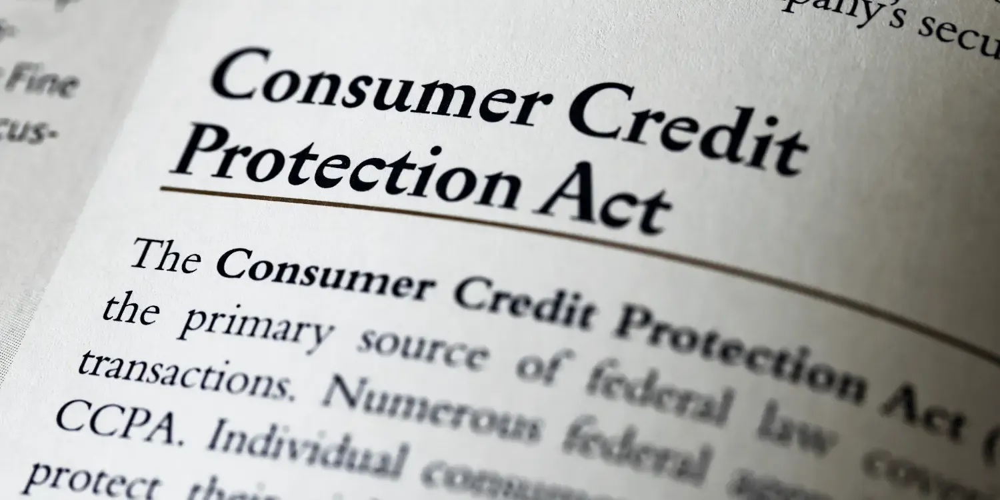

## Table of Contents

## What is the Consumer Credit Protection Act?

The Consumer Credit Protection Act is a law in the United States that helps protect people who borrow money. It was passed in 1968 to make sure that lenders treat borrowers fairly. This law covers many different types of credit, like credit cards, loans, and mortgages. It sets rules that lenders must follow when they give out credit and when they collect payments.

One important part of the Consumer Credit Protection Act is the Truth in Lending Act. This part of the law requires lenders to tell borrowers the true cost of borrowing money. This includes things like the interest rate and any fees. By knowing this information, borrowers can make better choices about whether to borrow money and from whom. The law also helps protect people from being treated unfairly because of their race, gender, or other personal characteristics when they apply for credit.

## When was the Consumer Credit Protection Act enacted?

The Consumer Credit Protection Act was enacted on May 29, 1968. This law was created to help protect people who borrow money by making sure that lenders treat them fairly.

The law covers many types of credit, like credit cards, loans, and mortgages. It sets rules that lenders must follow when they give out credit and collect payments. One important part of this law is the Truth in Lending Act, which makes lenders tell borrowers the true cost of borrowing money, including interest rates and fees.

## What are the main purposes of the Consumer Credit Protection Act?

The main purpose of the Consumer Credit Protection Act is to make sure that people who borrow money are treated fairly by lenders. This law helps to protect borrowers by setting rules that lenders must follow when they give out credit and when they collect payments. It covers many types of credit, like credit cards, loans, and mortgages, so it helps a lot of people.

Another important purpose is to make sure that borrowers know the true cost of borrowing money. The Truth in Lending Act, which is part of the Consumer Credit Protection Act, requires lenders to tell borrowers about things like interest rates and fees. This way, borrowers can make better choices about whether to borrow money and from whom. The law also helps protect people from being treated unfairly because of their race, gender, or other personal characteristics when they apply for credit.

## Which federal agencies are responsible for enforcing the Consumer Credit Protection Act?

Several federal agencies are responsible for enforcing the Consumer Credit Protection Act. The main agency is the Consumer Financial Protection Bureau (CFPB). The CFPB makes sure that lenders follow the rules set by the law. They can investigate if they think a lender is not treating borrowers fairly. They can also take action against lenders who break the rules.

Other agencies also help enforce the law. The Federal Trade Commission (FTC) works to protect consumers from unfair practices. They can take action against companies that do not follow the law. The Office of the Comptroller of the Currency (OCC) oversees banks and makes sure they follow the rules. These agencies work together to make sure that the Consumer Credit Protection Act is enforced and that borrowers are treated fairly.

## What are some key provisions of the Consumer Credit Protection Act?

The Consumer Credit Protection Act has several important rules to help protect people who borrow money. One key part is the Truth in Lending Act. This rule says that lenders must tell borrowers the true cost of borrowing money. This includes things like the interest rate and any fees. By knowing this information, borrowers can make better choices about whether to borrow money and from whom. The law also makes sure that lenders give out clear and easy-to-understand information about credit terms.

Another important part of the Consumer Credit Protection Act is the Fair Credit Reporting Act. This rule helps protect the privacy of people's credit information. It says that credit reporting agencies must make sure the information they have about people is correct. If there are mistakes, people can ask for them to be fixed. The law also says that credit reports can only be used for certain reasons, like when someone applies for a loan or a job. This helps keep people's personal information safe.

The law also includes the Equal Credit Opportunity Act, which makes sure that lenders treat everyone fairly when they apply for credit. This rule says that lenders cannot turn down someone's credit application because of things like their race, gender, or age. This helps make sure that everyone has a fair chance to get credit. These key provisions work together to make sure that borrowers are treated fairly and that their rights are protected.

## How does the Consumer Credit Protection Act protect consumers from unfair credit practices?

The Consumer Credit Protection Act helps protect consumers from unfair credit practices by making sure lenders tell the truth about the cost of borrowing money. This is done through the Truth in Lending Act, which says lenders must clearly tell borrowers about interest rates and fees. When people know the true cost, they can make better choices about borrowing money. This helps stop lenders from hiding costs or tricking people into taking loans they can't afford.

The law also protects consumers by making sure their credit information is handled fairly and kept private. The Fair Credit Reporting Act says that credit reporting agencies must keep people's credit information correct and only share it for certain reasons, like when someone applies for a loan or a job. If there are mistakes in a credit report, people can ask for them to be fixed. This helps keep people's personal information safe and protects them from unfair treatment based on wrong information.

Another way the Consumer Credit Protection Act protects consumers is through the Equal Credit Opportunity Act. This part of the law says that lenders cannot turn down someone's credit application because of things like their race, gender, or age. This makes sure that everyone has a fair chance to get credit. By stopping lenders from treating people unfairly, the law helps make sure that credit is given out in a fair way.

## What is the Truth in Lending Act and how is it related to the Consumer Credit Protection Act?

The Truth in Lending Act is a law that makes sure lenders tell borrowers the true cost of borrowing money. It is a part of the bigger Consumer Credit Protection Act. The Truth in Lending Act says that lenders have to be clear about things like the interest rate and any fees that come with borrowing money. This way, borrowers can understand exactly what they will have to pay back. By knowing this information, people can make better choices about whether to borrow money and from which lender.

The Truth in Lending Act is important because it helps stop lenders from hiding costs or tricking people into taking loans they can't afford. It is related to the Consumer Credit Protection Act because it is one of the key rules that help protect people who borrow money. The Consumer Credit Protection Act covers many different types of credit, like credit cards, loans, and mortgages, and it sets rules that lenders must follow to make sure they treat borrowers fairly. The Truth in Lending Act is a big part of this effort to protect consumers.

## How does the Fair Credit Reporting Act fit into the Consumer Credit Protection Act?

The Fair Credit Reporting Act is an important part of the Consumer Credit Protection Act. It helps protect people's privacy by making sure that credit reporting agencies handle their credit information correctly. The law says that these agencies must make sure the information they have about people is accurate. If there are any mistakes, people can ask for them to be fixed. This helps keep people's credit reports correct and fair.

The Fair Credit Reporting Act also says that credit reports can only be used for certain reasons, like when someone applies for a loan or a job. This helps keep people's personal information safe and stops it from being used in the wrong way. By being part of the Consumer Credit Protection Act, the Fair Credit Reporting Act works with other rules to make sure that people who borrow money are treated fairly and their rights are protected.

## What are the penalties for violating the Consumer Credit Protection Act?

If someone breaks the rules in the Consumer Credit Protection Act, they can face some tough penalties. These penalties can be different depending on which part of the law was broken and how serious the violation was. For example, if a lender does not follow the Truth in Lending Act and does not tell borrowers the true cost of borrowing money, they might have to pay money back to the people they hurt. They could also be fined by the government. If the violation is really bad, the person or company might even have to go to court and could be punished with more fines or other legal actions.

The government agencies that make sure the Consumer Credit Protection Act is followed, like the Consumer Financial Protection Bureau and the Federal Trade Commission, can take action against people or companies that break the law. They can investigate complaints, start legal actions, and make sure that any harm done to consumers is fixed. The goal is to make sure that lenders treat people fairly and to stop bad practices from happening again. By having these penalties, the law helps protect people who borrow money and keeps the credit system fair for everyone.

## How have amendments to the Consumer Credit Protection Act affected consumer rights over time?

Over the years, the Consumer Credit Protection Act has been changed to make it even better at protecting people who borrow money. One big change was the addition of the Credit CARD Act in 2009. This new rule made credit card companies treat people more fairly. For example, it stopped them from raising interest rates without warning and made it easier for people to pay off their cards. These changes helped people understand their credit card bills better and gave them more control over their money.

Another important change was the creation of the Consumer Financial Protection Bureau (CFPB) in 2010. The CFPB was made to make sure that all the rules in the Consumer Credit Protection Act were followed. They can investigate if they think a lender is not treating people fairly and can take action against them. This has helped make sure that lenders are more careful about following the law, which means more protection for people who borrow money. Overall, these amendments have made the law stronger and have given people more rights when it comes to borrowing money.

## What are some common misconceptions about the Consumer Credit Protection Act?

Some people think that the Consumer Credit Protection Act only protects them from high interest rates. But it does much more than that. It also makes sure that lenders tell the truth about the costs of borrowing money, like fees and other charges. It helps protect people's privacy by making sure their credit information is correct and only used for certain reasons. And it stops lenders from treating people unfairly because of things like their race or gender.

Another common misconception is that the law only helps people who are already in debt. But it also helps people before they borrow money. For example, the Truth in Lending Act makes lenders give clear information about credit terms so people can make smart choices about borrowing. The law also helps people who want to fix mistakes in their credit reports. So it protects people at all stages of borrowing money, not just when they're already in debt.

## How can consumers seek redress under the Consumer Credit Protection Act if they believe their rights have been violated?

If consumers think their rights under the Consumer Credit Protection Act have been violated, they can take steps to get help. First, they should gather all the information about their situation, like any documents or records that show what happened. Then, they can file a complaint with the right government agency. For example, they can go to the Consumer Financial Protection Bureau (CFPB) or the Federal Trade Commission (FTC). These agencies can look into the complaint and see if the lender broke the law. They might be able to help the consumer get money back or fix the problem.

Consumers can also talk to a lawyer who knows about consumer rights. A lawyer can help them understand their options and might be able to take the lender to court. If the court finds that the lender broke the law, the consumer could get money back or other help. It's important for consumers to act quickly because there might be time limits for filing complaints or taking legal action. By knowing their rights and taking action, consumers can make sure they are treated fairly when they borrow money.

## References & Further Reading

[1]: ["Truth in Lending: Theory, History, and a Way Forward"](https://books.google.com/books/about/Truth_in_Lending.html?id=vsTAjm76JQgC) by Thomas Durkin and Gregory Elliehausen, Journal of Retail Banking Services.

[2]: ["The Law and Regulation of Credit Scoring"](https://www.theregreview.org/2022/06/07/moss-new-approach-to-regulating-credit-scoring-ai/) by Nicola Jentzsch

[3]: ["Algorithmic Trading and DMA: An Introduction to Direct Access Trading Strategies"](https://www.amazon.com/Algorithmic-Trading-DMA-introduction-strategies/dp/0956399207) by Barry Johnson

[4]: Securities and Exchange Commission. (2014). [Commission Guidance and Frequently Asked Questions on Rule 15c3-5](https://www.sec.gov/files/amendments-broker-dealer-financial-responsibility-rule-faq.htm). 

[5]: European Securities and Markets Authority (ESMA). (2018). [Guidelines on certain aspects of the MiFID II suitability requirements](https://www.esma.europa.eu/press-news/esma-news/esma-publishes-final-guidelines-mifid-ii-suitability-requirements-0).

[6]: ["Consumer Protection Regulation in Financial Services: A UK Perspective"](https://natlawreview.com/article/do-consumers-really-need-more-financial-protections-uk-government-says-yes) by Peter Cartwright, European Journal of Risk Regulation.