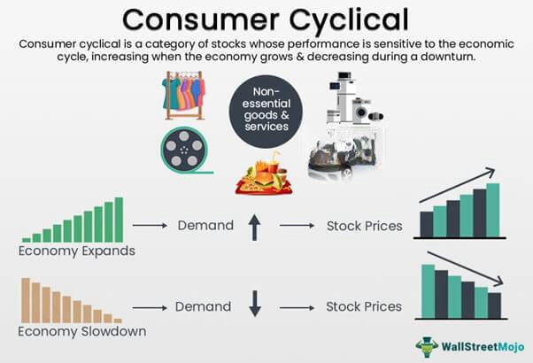

## Table of Contents

## What are consumer cyclicals?

Consumer cyclicals are products and services that people buy more of when the economy is doing well and less of when the economy is struggling. These include things like cars, furniture, and vacations. When people feel confident about their money, they are more likely to spend on these items. But if they are worried about their jobs or money, they might cut back on these purchases.

Companies that make or sell consumer cyclicals can have big ups and downs in their business. When the economy is growing, these companies can do very well because more people are buying their products. But during tough economic times, these companies can struggle because people are not spending as much. This makes consumer cyclicals different from consumer staples, which are things people need to buy no matter what, like food and medicine.

## What are consumer noncyclicals?

Consumer noncyclicals, also known as consumer staples, are products and services that people need to buy all the time, no matter how the economy is doing. These include things like food, medicine, and basic household items. Because people always need these things, the demand for them stays pretty steady, even when times are tough.

Companies that sell consumer noncyclicals usually have a more stable business than those selling cyclicals. This is because people will keep buying these essentials even if they have less money. So, these companies don't see as many ups and downs in their sales as companies that sell things like cars or luxury goods.

## How do consumer cyclicals and noncyclicals differ?

Consumer cyclicals and noncyclicals are different kinds of products that people buy. Cyclicals are things like cars, furniture, and vacations that people buy more of when they feel good about their money and the economy is doing well. But when times are tough, people cut back on these purchases because they are not essential. This means companies that sell cyclicals can have big changes in how much they sell, going up when the economy is good and down when it's bad.

On the other hand, noncyclicals, also called consumer staples, are things people always need, like food, medicine, and basic household items. No matter how the economy is doing, people still need to buy these things. So, the demand for noncyclicals stays pretty steady. Companies that sell these products usually have a more stable business because they don't see the big ups and downs that cyclical companies do.

## Can you provide examples of consumer cyclical industries?

Consumer cyclical industries are the kinds of businesses that do better when people feel good about their money. These industries include things like car makers, because when people have more money, they are more likely to buy a new car. Another example is the furniture industry. When the economy is doing well, people might decide to buy new sofas or tables for their homes. Also, the travel and hospitality industry, like hotels and airlines, falls into this group. When people have extra money, they like to go on vacations and stay in nice places.

Another big part of consumer cyclical industries is the fashion and luxury goods sector. When people feel rich, they might buy more clothes, shoes, and fancy things like watches and jewelry. The entertainment industry, including movie theaters and amusement parks, also counts as a consumer cyclical. People go out to have fun more often when they feel good about their money. All these industries can have big changes in how much they sell, going up when the economy is good and down when it's bad.

## Can you provide examples of consumer noncyclical industries?

Consumer noncyclical industries are the kinds of businesses that sell things people always need, no matter how the economy is doing. These include food and grocery stores. People have to eat every day, so they will always buy food, even if they don't have a lot of money. Another example is the pharmaceutical industry. People need medicine to stay healthy, so they will keep buying it even during tough times. Also, companies that make and sell basic household items like toilet paper, soap, and cleaning supplies are part of this group. These things are essential for everyday life, so people will keep buying them.

Another big part of consumer noncyclical industries is utilities. This includes companies that provide electricity, water, and gas. People need these services to live comfortably, so they will pay for them even if money is tight. The tobacco industry is also considered noncyclical because people who smoke tend to keep buying cigarettes even when they are short on cash. All these industries have steady demand because they sell things that people can't do without, no matter what's happening with the economy.

## How do economic cycles affect consumer cyclicals?

Economic cycles have a big impact on consumer cyclicals. When the economy is doing well, people feel more confident about their money. They are more likely to spend on things like new cars, furniture, and vacations. This means companies that make and sell these products do really well during good economic times. Their sales go up, and they can make more money.

But when the economy is not doing so well, people start to worry about their jobs and money. They cut back on buying things they don't really need. So, they might not buy a new car or go on a big vacation. This makes it hard for companies that sell consumer cyclicals. Their sales go down, and they might have to struggle to make money. This is why these companies can have big ups and downs depending on the economy.

## Why are consumer noncyclicals considered more stable investments?

Consumer noncyclicals are considered more stable investments because they sell things people always need, like food, medicine, and basic household items. No matter if the economy is good or bad, people still have to buy these things. So, the demand for these products stays pretty steady all the time. This means companies that sell noncyclicals don't have the big ups and downs that companies selling cars or vacations might have.

Because of this steady demand, companies in noncyclical industries usually have more predictable sales and profits. Investors like this because it means less risk. They can count on these companies to keep making money even when the economy is struggling. This makes consumer noncyclicals a safer choice for people who want to invest their money without too much worry about economic changes.

## What role do consumer cyclicals play in an investment portfolio?

Consumer cyclicals can add excitement to an investment portfolio because they go up and down with the economy. When things are going well, these companies can make a lot of money because people are buying more cars, furniture, and going on vacations. This means if you invest in these companies during good times, you might see big gains. But, it's also riskier because if the economy turns bad, these companies can lose a lot of money quickly. So, they can make your portfolio more exciting but also more unpredictable.

Because of their ups and downs, consumer cyclicals can be a good way to try to make more money if you think the economy will keep doing well. But it's important to balance them with other kinds of investments. Having some consumer cyclicals in your portfolio can help you take advantage of good economic times, but you should also have safer investments like consumer noncyclicals to protect your money during bad times. This way, you can have a mix that might grow more but also stays safer overall.

## How can investors use consumer noncyclicals to hedge against economic downturns?

Investors can use consumer noncyclicals to protect their money when the economy is not doing well. These are things like food, medicine, and basic household items that people always need to buy, no matter how the economy is doing. Because people keep buying these things even during tough times, companies that sell them usually don't see big drops in their sales and profits. So, if you invest in these companies, your money is safer because they keep making money even when other parts of the economy are struggling.

Having consumer noncyclicals in your investment portfolio can help balance out the risk from other investments that might go down a lot when the economy is bad. For example, if you also have money in companies that sell cars or vacations, those might lose value quickly during an economic downturn. But the steady earnings from consumer noncyclicals can help make up for those losses. This way, your overall investment doesn't go down as much, and you're more protected against economic ups and downs.

## What are the key performance indicators for companies in consumer cyclical sectors?

Key performance indicators for companies in consumer cyclical sectors are important numbers that show how well these companies are doing. One key indicator is sales growth. This shows if more people are buying things like cars, furniture, or going on vacations. When the economy is good, sales growth is usually high because people feel confident about spending money. Another important indicator is profit margins. This tells you how much money the company keeps after paying for everything it needs to make and sell its products. High profit margins mean the company is doing well at making money from what it sells.

Another key indicator is inventory turnover, which shows how quickly a company can sell the products it has. In good economic times, inventory turnover is high because people are buying a lot. But if the economy is bad, inventory might sit around longer because fewer people are buying. Customer satisfaction is also important. Happy customers are more likely to keep buying and tell others about the company, which can help sales grow. These indicators help investors see if a consumer cyclical company is doing well and if it's a good time to invest in it.

## How do global economic factors influence consumer cyclical and noncyclical sectors differently?

Global economic factors can really change how well consumer cyclical sectors do. These sectors, like cars, furniture, and travel, depend a lot on how people feel about their money. If the world economy is doing well, people in different countries might feel rich and spend more on these things. But if there's a big problem, like a global financial crisis or a trade war, people might get worried and stop buying so much. This can make sales drop a lot for companies in consumer cyclical sectors because what they sell is not something people need every day. So, these companies can have big ups and downs depending on what's happening around the world.

On the other hand, consumer noncyclical sectors, like food, medicine, and basic household items, are less affected by global economic changes. People always need to buy these things, no matter what's going on in the world. Even if there's a big economic problem, people still need to eat and stay healthy. So, the demand for these products stays pretty steady. This means companies in consumer noncyclical sectors usually don't see big changes in their sales and profits, even when the global economy is not doing well. They are more stable because they sell things that people can't do without.

## What advanced strategies can investors employ to capitalize on the differences between consumer cyclicals and noncyclicals?

Investors can use a strategy called sector rotation to make money from the differences between consumer cyclicals and noncyclicals. This means they move their money from one type of investment to another based on where they think the economy is going. If they think the economy will get better, they might put more money into consumer cyclicals like car companies or travel businesses. These companies usually do well when people feel good about spending money. But if they think the economy might get worse, they could shift their money to consumer noncyclicals like food and medicine companies. These businesses are more stable because people always need to buy their products.

Another strategy is called diversification, where investors spread their money across both consumer cyclicals and noncyclicals. This way, they can try to make more money from cyclicals when the economy is good, but also protect their money with noncyclicals when times are tough. For example, they might have some money in a car company and some in a grocery store chain. This mix can help balance the ups and downs of the economy. By keeping an eye on economic indicators and global events, investors can adjust their investments to take advantage of the strengths of both sectors and reduce their risks.

## References & Further Reading

[1]: ["Machine Learning for Asset Managers"](https://www.cambridge.org/core/elements/machine-learning-for-asset-managers/6D9211305EA2E425D33A9F38D0AE3545) by Marcos Lopez de Prado

[2]: ["Financial Markets and Algorithmic Trading"](https://www.researchgate.net/publication/378548435_Algorithmic_Trading_and_AI_A_Review_of_Strategies_and_Market_Impact) by Valentin F. Larach

[3]: ["Quantitative Investing: Strategies to exploit anomalies for all investors"](https://www.amazon.com/Quantitative-Investing-Strategies-anomalies-investors/dp/0857193007) by Fred Piard

[4]: ["Advances in Financial Machine Learning"](https://www.amazon.com/Advances-Financial-Machine-Learning-Marcos/dp/1119482089) by Marcos Lopez de Prado

[5]: Stevenson, M., & Francis, B. (2011). ["Cyclicality and Sectoral Linkages in the U.S. Economy."](https://psycnet.apa.org/record/2011-24000-001) Journal of Policy Modeling, 33(6).