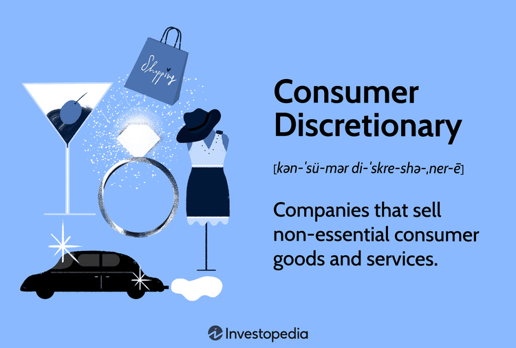

## Table of Contents

## What is meant by consumer discretionary?

Consumer discretionary refers to goods and services that people buy when they have extra money to spend. These are things that you don't really need but might want, like going to the movies, buying new clothes, or eating out at a restaurant. When people feel good about their money situation, they tend to spend more on these kinds of things.

The term is also used to describe a category in the stock market. Companies that make or sell these non-essential items are part of the consumer discretionary sector. This sector can do well when the economy is strong because people have more money to spend on things they want, not just what they need. But, if the economy is not doing well, people might cut back on these extras, and the companies in this sector might not do as well.

## How do consumer discretionary goods differ from consumer staples?

Consumer discretionary goods are things people buy when they have extra money. These are not things you need to live, but things you might want, like a new video game or a vacation. When people feel good about their money, they spend more on these fun things. But if they're worried about money, they might not buy them.

Consumer staples, on the other hand, are things people need no matter what. These are basics like food, soap, and toilet paper. People will always buy these things because they need them to live. Even if the economy is bad, people still need to eat and stay clean, so companies that sell these things usually do okay even in tough times.

## What role do consumer discretionary goods play in the economy?

Consumer discretionary goods are really important for the economy. When people have extra money, they spend it on things like new clothes, going out to eat, or buying a new TV. This spending helps businesses that make and sell these things grow. When these businesses do well, they might hire more people or pay their workers more, which makes the economy stronger. So, when people feel good about their money and spend on these fun things, it can help the whole economy grow.

But, consumer discretionary goods can also show us how the economy is doing. If people start spending less on these extras, it might mean they're worried about money or the economy is not doing well. When this happens, businesses that sell these goods might not do as well, and they might need to cut jobs or lower prices. This can make the economy slow down. So, watching how much people spend on consumer discretionary goods can give us clues about the health of the economy.

## What are some common examples of consumer discretionary products?

Consumer discretionary products are things people buy when they have extra money. These are not things you need to live, but things you might want. Some common examples are new clothes, especially fancy or trendy ones. People also spend on entertainment, like going to the movies or buying video games. Electronics like smartphones, TVs, and computers are also in this group. People might buy these things because they want the latest model, not because they need it.

Another big part of consumer discretionary products is travel and leisure. This includes vacations, going to theme parks, or even just eating out at restaurants. Cars can also be considered consumer discretionary if people are buying them for fun or luxury, not just to get around. Furniture and home decor, like a new couch or fancy pillows, are other examples. These are things people buy to make their homes look nice, not because they need them.

In general, consumer discretionary products are all about spending on things that make life more fun or comfortable, but aren't necessary. When people feel good about their money, they spend more on these kinds of things, which helps the economy grow.

## How are consumer discretionary sectors identified in economic reports?

In economic reports, the consumer discretionary sector is identified by looking at companies that make or sell things people want but don't need. These companies are grouped together because they all depend on people having extra money to spend. For example, reports might talk about how well car companies, clothing stores, and entertainment businesses are doing. If people are buying more of these things, it's a sign that the consumer discretionary sector is doing well.

Economists use different data to track this sector. They look at sales numbers from stores that sell these products, like department stores or electronics shops. They also check how many people are going to restaurants or buying tickets for movies and concerts. By putting all this information together, they can see if people are spending more or less on things they want but don't need. This helps them understand how the economy is doing overall.

## What economic indicators are used to measure consumer discretionary spending?

Economists use several key indicators to measure consumer discretionary spending. One important indicator is retail sales data, which tracks how much people are spending on things like clothes, electronics, and furniture. This data comes from stores and helps economists see if people are buying more or less of these non-essential items. Another indicator is the Consumer Confidence Index, which surveys people to find out how they feel about their financial situation and the economy. When people feel good about their money, they're more likely to spend on fun things.

Another useful indicator is personal consumption expenditures (PCE), which measures how much money people are spending overall, including on discretionary items. Within PCE, economists look at the part that covers things like entertainment, travel, and luxury goods. They also pay attention to employment data, because when more people have jobs and are [earning](/wiki/earning-announcement) money, they're more likely to spend on things they want but don't need. By looking at all these indicators together, economists can get a good picture of how much people are spending on consumer discretionary goods.

## How does consumer discretionary spending reflect economic health?

Consumer discretionary spending shows us how healthy the economy is. When people feel good about their money, they spend more on things they want but don't need, like new clothes or going out to eat. This means the economy is doing well because people have extra money to spend. When businesses see more sales, they might hire more people or pay their workers more, which helps the economy grow even more.

But if people start spending less on these fun things, it can mean they're worried about money or the economy isn't doing well. When this happens, businesses that sell these goods might not do as well and could cut jobs or lower prices. This can slow down the economy. So, by watching how much people spend on things they want, we can tell if the economy is strong or if it's struggling.

## What factors influence changes in consumer discretionary spending?

Changes in consumer discretionary spending can be influenced by many things. One big [factor](/wiki/factor-investing) is how people feel about their money and the economy. If people think their jobs are safe and they might get a raise, they're more likely to spend on fun things like new clothes or going out to eat. But if they're worried about losing their jobs or the economy is shaky, they might save their money instead of spending it on things they don't need.

Another factor is interest rates. When interest rates are low, it's cheaper to borrow money, so people might take out loans to buy things like new cars or go on vacations. But when interest rates go up, borrowing money costs more, so people might cut back on these extra expenses. Government policies can also play a role. For example, if the government gives people more money through tax cuts or stimulus checks, they might spend more on things they want.

Lastly, big events like holidays or sales can boost consumer discretionary spending. During times like Black Friday or Christmas, people often spend more on gifts and fun things. But unexpected events, like a natural disaster or a health crisis, can make people more cautious with their money. All these factors together help explain why consumer discretionary spending goes up or down.

## How do shifts in consumer discretionary spending impact different industries?

When people spend more on things they want but don't need, like new clothes or going out to eat, it's good for industries that make and sell these things. For example, if people are buying more cars, car companies do well. They might hire more workers or pay them more, which helps the economy grow. Stores that sell clothes, electronics, and furniture also do better when people feel good about their money. Restaurants and places like movie theaters and theme parks see more customers too. This extra spending can make these businesses grow and even start new projects.

But if people start spending less on these fun things, it can hurt these industries. Car companies might sell fewer cars, so they might need to cut jobs or lower prices. Clothing stores and electronics shops might see fewer customers, which can make it hard for them to stay open. Restaurants and entertainment places like movie theaters could lose business, and they might have to close down or reduce their hours. When this happens, it can slow down the economy because these businesses are not doing as well and people might lose their jobs.

## What are the leading indicators that predict changes in consumer discretionary trends?

Leading indicators that predict changes in consumer discretionary trends include things like the Consumer Confidence Index, which surveys how people feel about their money and the economy. If people feel good about their jobs and think they might get a raise, they're more likely to spend on fun things like new clothes or going out to eat. Another important indicator is employment data. When more people have jobs and are earning money, they're more likely to spend on things they want but don't need. Retail sales data also helps, showing how much people are buying things like electronics and furniture. If these numbers go up, it means people are spending more on discretionary items.

Another useful leading indicator is interest rates. When interest rates are low, it's cheaper to borrow money, so people might take out loans to buy things like new cars or go on vacations. But if interest rates go up, borrowing money costs more, and people might cut back on these extra expenses. Government policies can also give us clues about future spending. For example, if the government gives people more money through tax cuts or stimulus checks, they might spend more on things they want. By looking at all these indicators together, economists can predict if people will spend more or less on consumer discretionary goods.

## How can businesses use consumer discretionary data to strategize?

Businesses can use consumer discretionary data to make smart plans. They can look at things like the Consumer Confidence Index and retail sales numbers to see if people are spending more or less on fun things. If the data shows people are spending more, businesses might decide to make more of their products or open new stores. They might also start new marketing campaigns to get more people to buy their stuff. But if the data shows people are spending less, businesses might need to lower their prices or offer sales to keep people buying. They might also need to be careful about spending their own money, maybe not starting big new projects until people start spending more again.

Another way businesses can use this data is to plan for the future. By looking at things like employment data and interest rates, they can guess if people will spend more or less on discretionary items in the coming months. If the data suggests people will have more money to spend, businesses might start making new products or planning big sales events. But if the data shows people might be more careful with their money, businesses might hold off on new projects and focus on keeping their current customers happy. This way, they can be ready for whatever happens with consumer spending.

## What advanced statistical methods are used to analyze consumer discretionary trends?

To understand consumer discretionary trends better, businesses and economists use advanced statistical methods. One common method is regression analysis, which helps them see how different things, like employment rates or interest rates, affect how much people spend on fun things. By looking at past data, they can make a model that predicts future spending. Another method is time series analysis, which looks at how spending changes over time. This helps them spot patterns and predict if spending will go up or down in the future.

Another useful tool is cluster analysis, which groups people based on how they spend their money. This can help businesses understand different types of customers and what they like to buy. For example, they might find one group that spends a lot on travel and another that spends more on electronics. By knowing these groups, businesses can make better plans for selling their products. All these methods help businesses and economists make smart guesses about what people will spend their money on next.

## What is Algorithmic Trading: An Overview?

Algorithmic trading employs advanced computer programs to execute trades based on predefined criteria, enabling the handling of complex strategies with remarkable speed and [volume](/wiki/volume-trading-strategy). This method relies on algorithms to analyze market data and identify potential trading opportunities. By automating the trading process, [algorithmic trading](/wiki/algorithmic-trading) can capitalize on market inefficiencies that human traders might miss due to slower reaction times or limitations in data processing capabilities.

At the core of algorithmic trading is the integration of economic indicators and consumer trends into trading models. These models use a variety of inputs such as price, timing, and volume to inform decision-making processes. For instance, the Moving Average Crossover strategy is a common algorithmic approach where trades are executed when a short-term moving average crosses a long-term moving average, signaling potential changes in market direction. This strategy can be mathematically expressed as:

$$
\text{Signal} = \begin{cases} 
\text{Buy} & \text{if } MA_{\text{short}} > MA_{\text{long}} \\
\text{Sell} & \text{if } MA_{\text{short}} < MA_{\text{long}} 
\end{cases}
$$

Algorithmic trading is particularly effective in high-frequency trading ([HFT](/wiki/high-frequency-trading-strategies)), where algorithms execute a large number of orders in fractions of a second. Such strategies often involve [arbitrage](/wiki/arbitrage) opportunities or [statistical arbitrage](/wiki/statistical-arbitrage) models, which seek to identify and exploit small price discrepancies across different markets or financial instruments.

The sophistication of algorithmic trading requires an understanding of both financial markets and technology. Investors interested in algorithmic trading should be familiar with programming languages like Python, which is widely used for developing trading algorithms due to its extensive libraries and tools for data analysis and [machine learning](/wiki/machine-learning). A basic Python snippet for a moving average strategy might look like this:

```python
import pandas as pd

# Sample price data
prices = pd.Series([100, 102, 101, 105, 107, 110])

# Calculate moving averages
short_window = 3
long_window = 5
MA_short = prices.rolling(window=short_window).mean()
MA_long = prices.rolling(window=long_window).mean()

# Generate trading signals
signals = pd.DataFrame(index=prices.index)
signals['Signal'] = 0
signals.loc[MA_short > MA_long, 'Signal'] = 1  # Buy signal
signals.loc[MA_short < MA_long, 'Signal'] = -1 # Sell signal
```

Understanding algorithmic trading is crucial for modern investors, as it plays a significant role in today's financial markets by enhancing trading efficiency and precision. As technology and data availability continue to advance, the influence of algorithmic trading on market dynamics is expected to grow, offering new opportunities and challenges for traders.

## References & Further Reading

[1]: Bergstra, J., Bardenet, R., Bengio, Y., & Kégl, B. (2011). ["Algorithms for Hyper-Parameter Optimization."](https://papers.nips.cc/paper/4443-algorithms-for-hyper-parameter-optimization) Advances in Neural Information Processing Systems 24.

[2]: ["Advances in Financial Machine Learning"](https://www.amazon.com/Advances-Financial-Machine-Learning-Marcos/dp/1119482089) by Marcos Lopez de Prado

[3]: ["Evidence-Based Technical Analysis: Applying the Scientific Method and Statistical Inference to Trading Signals"](https://www.amazon.com/Evidence-Based-Technical-Analysis-Scientific-Statistical/dp/0470008741) by David Aronson

[4]: ["Machine Learning for Algorithmic Trading"](https://github.com/stefan-jansen/machine-learning-for-trading) by Stefan Jansen

[5]: ["Quantitative Trading: How to Build Your Own Algorithmic Trading Business"](https://www.amazon.com/Quantitative-Trading-Build-Algorithmic-Business/dp/1119800064) by Ernest P. Chan