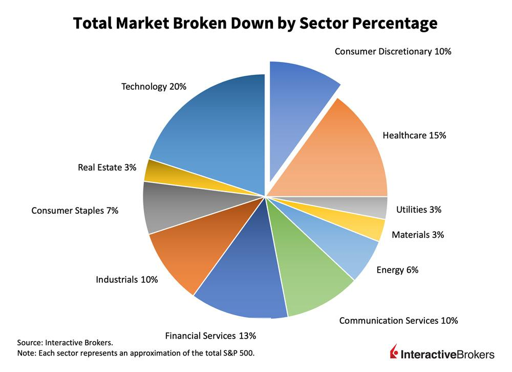

## Table of Contents

## What is the consumer discretionary sector?

The consumer discretionary sector includes businesses that sell goods and services that people want but don't necessarily need. These are things like clothes, cars, and entertainment. When people have more money, they tend to spend more on these kinds of products. This means the sector can do well when the economy is strong.

However, when the economy is not doing well, people might cut back on spending on these items. This can make the consumer discretionary sector struggle during tough economic times. Companies in this sector include big names like Amazon, Nike, and Disney. They all depend on people having extra money to spend on their products and services.

## What types of industries are included in the consumer discretionary sector?

The consumer discretionary sector includes many different types of businesses. Some of these businesses make or sell things like clothes, shoes, and jewelry. These are called apparel and luxury goods. Other businesses in this sector make cars and trucks, which are part of the automotive industry. There are also companies that build homes and make furniture, which are part of the homebuilding and home furnishing industry.

Another big part of the consumer discretionary sector is entertainment and leisure. This includes companies that run theme parks, movie theaters, and sports teams. It also includes businesses that make video games and toys. Restaurants and hotels are also in this sector because they provide services that people enjoy but don't need to survive.

Lastly, there are businesses that sell electronics like TVs and computers. These are part of the consumer electronics industry. Retail stores that sell a wide range of products, like department stores and online marketplaces, are also included in the consumer discretionary sector. All these industries depend on people having extra money to spend on things they want, not just what they need.

## How does the consumer discretionary sector impact the economy?

The consumer discretionary sector has a big impact on the economy because it shows how much extra money people have to spend. When the economy is doing well, people feel confident and spend more on things like clothes, cars, and entertainment. This extra spending helps businesses in the consumer discretionary sector grow and create more jobs. When more people have jobs, they spend even more money, which helps the whole economy keep growing.

On the other hand, when the economy is not doing well, people cut back on spending on things they don't need. This can hurt businesses in the consumer discretionary sector, leading to fewer jobs and less spending overall. Because this sector depends so much on how people feel about the economy, it can be a good sign of how the economy is doing. If people are spending more on consumer discretionary items, it usually means the economy is strong. If they're spending less, it might mean the economy is struggling.

## What are the key drivers of growth in the consumer discretionary sector?

The main thing that helps the consumer discretionary sector grow is how much money people have to spend on things they want but don't need. When people feel good about their money and the economy, they buy more clothes, cars, and go out to eat more often. This extra spending helps businesses in this sector make more money and grow. Another important thing is new products and services. When companies come up with cool new things, like the latest smartphone or a fun new video game, people want to buy them. This also helps the sector grow.

Another big driver is how easy it is for people to get these products. Good online shopping and fast delivery make it easier for people to buy things they want. When shopping is easy and fun, people tend to spend more. Also, when the economy is doing well, it's easier for companies to borrow money to grow their businesses. This can lead to more stores, better products, and more jobs, which all help the consumer discretionary sector keep growing.

## How do consumer discretionary companies generate revenue?

Consumer discretionary companies make money by selling things that people want but don't need, like clothes, cars, and entertainment. When people feel good about their money, they spend more on these items. This means more sales for these companies. For example, a clothing store makes money by selling shirts and pants. The more people buy, the more money the store makes. A car company makes money by selling cars. If more people are buying cars, the company's revenue goes up.

These companies also make money from services like hotels and restaurants. When people go on vacation or eat out, they pay for these services, which adds to the company's revenue. For instance, a hotel makes money from people staying in their rooms. The more rooms they fill, the more money they make. A restaurant earns money from people buying meals. If more people come to eat, the restaurant's revenue increases. So, the key for these companies is to get people to spend on things they want, which helps them earn more money.

## What are the major challenges faced by the consumer discretionary sector?

The consumer discretionary sector faces big challenges because it depends a lot on how people feel about the economy. When people are worried about money, they spend less on things they want but don't need, like clothes and vacations. This can hurt businesses in this sector because they make less money. Also, this sector has to deal with changing what people want. For example, if people start wanting different kinds of clothes or new types of entertainment, companies need to change quickly or they might lose customers.

Another challenge is competition. There are a lot of companies in this sector, and they all want people to buy their products. This can lead to price wars, where companies lower their prices to try to get more customers. But if prices are too low, it can be hard for companies to make enough money to stay in business. Also, things like higher costs for making products or new rules from the government can make it harder for these companies to do well. So, the consumer discretionary sector has to be ready to handle these challenges to keep growing.

## How does consumer sentiment affect the consumer discretionary sector?

Consumer sentiment, or how people feel about their money and the economy, has a big impact on the consumer discretionary sector. When people feel good about their finances, they are more likely to spend money on things they want but don't need, like new clothes, cars, or going out to eat. This extra spending helps businesses in the consumer discretionary sector make more money and grow. For example, if people feel confident, they might buy a new TV or take a vacation, which means more sales for electronics stores and travel companies.

On the other hand, when people are worried about their money, they tend to cut back on spending on these kinds of things. They might choose to save their money instead of buying new clothes or going out to eat. This can hurt businesses in the consumer discretionary sector because they make less money when people are not buying their products and services. For instance, if people are worried about losing their jobs, they might not go to the movies or buy new furniture, which can lead to lower sales for movie theaters and furniture stores.

## What are some leading companies in the consumer discretionary sector?

Some of the biggest companies in the consumer discretionary sector are Amazon, Nike, and Disney. Amazon is a huge online store where people buy all sorts of things they want, like books, electronics, and clothes. Nike makes popular shoes and sports clothes that many people like to wear. Disney runs theme parks and makes movies and TV shows that people enjoy watching.

Other important companies in this sector include McDonald's, which is known for its fast food restaurants, and Ford, which makes cars and trucks. McDonald's is a place where people go to eat out, and when they feel good about their money, they might go there more often. Ford sells vehicles that people want but don't need, like trucks for fun or fancy cars. When the economy is doing well, more people might buy these vehicles.

There are also companies like Walmart and Home Depot that are big in this sector. Walmart is a big store where people can buy a lot of different things they want, from toys to clothes. Home Depot sells things for people who want to fix up their homes or do projects, like tools and furniture. When people feel good about their money, they might spend more at these stores on things they want but don't need.

## How does the consumer discretionary sector perform during different economic cycles?

The consumer discretionary sector does really well when the economy is strong. When people have jobs and feel good about their money, they spend more on things they want but don't need, like new clothes, cars, and going out to eat. This extra spending helps companies in the consumer discretionary sector make more money and grow. For example, if the economy is doing great, people might buy a new TV or go on a vacation, which means more sales for electronics stores and travel companies. So, during good economic times, this sector can see a lot of growth and success.

However, when the economy is not doing well, the consumer discretionary sector can struggle. If people are worried about losing their jobs or having less money, they cut back on spending on things they want but don't need. They might choose to save their money instead of buying new clothes or going out to eat. This can hurt businesses in the consumer discretionary sector because they make less money when people are not buying their products and services. For example, if people are worried about the economy, they might not go to the movies or buy new furniture, which can lead to lower sales for movie theaters and furniture stores. So, during tough economic times, this sector often faces challenges and slower growth.

## What are the emerging trends in the consumer discretionary sector?

One big trend in the consumer discretionary sector is the growth of online shopping. More and more people are buying things they want, like clothes and electronics, from the internet instead of going to stores. This makes it easier for people to shop and can help companies reach more customers. Companies like Amazon are doing really well because of this trend. They are also using technology like fast delivery and easy returns to make shopping even better for people.

Another trend is a focus on experiences instead of things. People are spending more money on fun activities like going to concerts, traveling, and eating out at nice restaurants. This means companies that offer these kinds of experiences, like Disney with their theme parks, or Airbnb for travel, are seeing growth. This shift to experiences is changing how companies in the consumer discretionary sector think about what they offer to customers.

Lastly, there is a growing interest in sustainable and ethical products. More people want to buy things that are good for the environment or made in a fair way. This is pushing companies to change how they make their products. For example, clothing companies like Patagonia are focusing on using eco-friendly materials and fair labor practices. This trend is making the consumer discretionary sector more responsible and is attracting customers who care about these issues.

## How do technological advancements influence the consumer discretionary sector?

Technology is changing the consumer discretionary sector a lot. One big way is through online shopping. Now, people can buy things they want, like clothes and electronics, from their homes. This makes shopping easier and lets companies sell to more people. Companies like Amazon use technology to make shopping fast and easy, with quick delivery and easy returns. They also use data to figure out what people want to buy and show them ads for those things. This helps them sell more and grow their business.

Another way technology helps is by making new products and experiences. For example, video games and virtual reality are becoming more popular. People can have fun and exciting experiences without leaving their homes. Also, technology helps companies make their products better and more personalized. Cars now have cool features like self-driving and entertainment systems. Clothes can be made to fit each person perfectly using 3D printing. These new technologies make the things people want to buy more interesting and useful, which can help companies in the consumer discretionary sector grow.

## What investment strategies are effective for the consumer discretionary sector?

When thinking about investing in the consumer discretionary sector, it's important to look at how the economy is doing. When the economy is strong, people have more money to spend on things they want but don't need, like clothes and cars. This can be a good time to invest in this sector because companies are likely to make more money. You might want to buy stocks in big companies like Amazon, Nike, or Disney, which can do well when people are spending more. Also, keeping an eye on consumer sentiment can help. If people feel good about their money, they are more likely to spend on consumer discretionary items, which can boost the sector's performance.

Another strategy is to look for companies that are doing well with new trends. For example, online shopping and a focus on experiences like travel and dining out are big trends right now. Investing in companies that are leading these trends, like Amazon for online shopping or Airbnb for travel, can be smart. Also, think about companies that are using technology to make their products better or more personalized. This can help them stay ahead of the competition. But remember, the consumer discretionary sector can be risky because it depends a lot on how people feel about the economy. So, it's a good idea to spread your investments around and not put all your money in one place.

## References & Further Reading

[1]: Bergstra, J., Bardenet, R., Bengio, Y., & Kégl, B. (2011). ["Algorithms for Hyper-Parameter Optimization."](https://papers.nips.cc/paper/4443-algorithms-for-hyper-parameter-optimization) Advances in Neural Information Processing Systems 24.

[2]: ["Advances in Financial Machine Learning"](https://www.amazon.com/Advances-Financial-Machine-Learning-Marcos/dp/1119482089) by Marcos Lopez de Prado

[3]: ["Evidence-Based Technical Analysis: Applying the Scientific Method and Statistical Inference to Trading Signals"](https://www.amazon.com/Evidence-Based-Technical-Analysis-Scientific-Statistical/dp/0470008741) by David Aronson

[4]: ["Machine Learning for Algorithmic Trading"](https://github.com/stefan-jansen/machine-learning-for-trading) by Stefan Jansen

[5]: ["Quantitative Trading: How to Build Your Own Algorithmic Trading Business"](https://www.amazon.com/Quantitative-Trading-Build-Algorithmic-Business/dp/1119800064) by Ernest P. Chan

[6]: Aldridge, I. (2013). ["High-Frequency Trading: A Practical Guide to Algorithmic Strategies and Trading Systems."](https://onlinelibrary.wiley.com/doi/pdf/10.1002/9781119203803.fmatter) Wiley.

[7]: Gai, J., Yao, Z., & Ye, M. (2012). ["Market Quality and High-Frequency Trading."](https://papers.ssrn.com/sol3/papers.cfm?abstract_id=2066839) Journal of Financial Markets, 15(4), 547-576.

[8]: Hendershott, T., Jones, C. M., & Menkveld, A. J. (2011). ["Does Algorithmic Trading Improve Liquidity?"](https://onlinelibrary.wiley.com/doi/full/10.1111/j.1540-6261.2010.01624.x) The Review of Financial Studies, 24(3), 675-699.

[9]: ["Artificial Intelligence in Asset Management"](https://www.cfainstitute.org/sites/default/files/-/media/documents/book/rf-lit-review/2020/rflr-artificial-intelligence-in-asset-management.pdf) by Larry Cao, CFA

[10]: Chan, N. (2020). ["Machine Learning and AI for Financial Markets."](https://www.researchgate.net/publication/343858160_Machine_Learning_and_AI_for_Financial_Markets) ResearchGate.