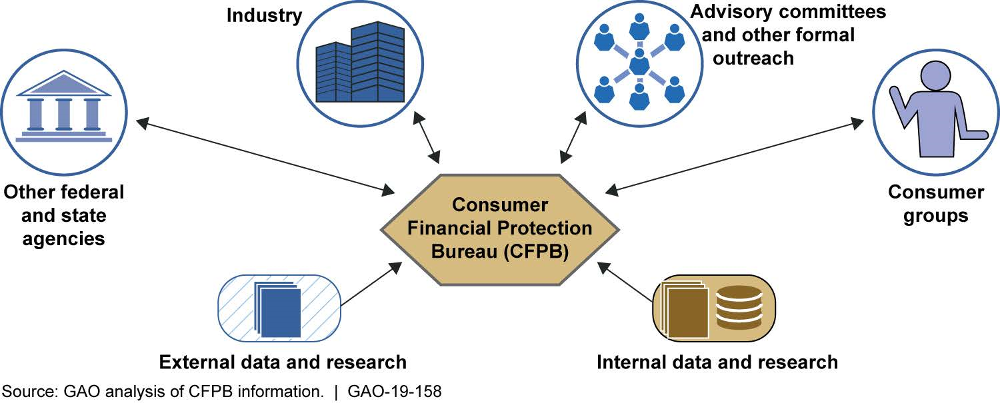

## Table of Contents

## What is the Consumer Financial Protection Act?

The Consumer Financial Protection Act is a law that was created to help protect people who use financial products and services. It was passed in 2010 as part of the Dodd-Frank Wall Street Reform and Consumer Protection Act. The main goal of this law is to make sure that banks and other financial companies treat customers fairly and clearly explain their products and services.

The law created a new government agency called the Consumer Financial Protection Bureau (CFPB). The CFPB's job is to watch over financial companies and make sure they follow the rules. If a company is not treating customers fairly, the CFPB can take action to fix the problem. This can include making the company pay money back to customers or change how they do business. The law helps people feel more confident when they use financial products like loans, credit cards, and bank accounts.

## When was the Consumer Financial Protection Act enacted?

The Consumer Financial Protection Act was enacted in 2010. It is part of a bigger law called the Dodd-Frank Wall Street Reform and Consumer Protection Act. This act was made to help protect people who use financial products and services.

The main goal of the Consumer Financial Protection Act is to make sure that banks and other financial companies treat customers fairly. It also wants to make sure that these companies clearly explain their products and services. To do this, the law created a new government agency called the Consumer Financial Protection Bureau (CFPB). The CFPB watches over financial companies to make sure they follow the rules and treats customers right.

## What are the main goals of the Consumer Financial Protection Act?

The Consumer Financial Protection Act aims to make sure that banks and other financial companies treat their customers fairly. It wants to stop these companies from tricking people or using confusing language when they explain their products and services. This law helps people feel more confident when they use things like loans, credit cards, and bank accounts.

To make sure these goals are met, the law created a new government agency called the Consumer Financial Protection Bureau (CFPB). The CFPB watches over financial companies to make sure they follow the rules. If a company is not treating customers fairly, the CFPB can take action to fix the problem. This can include making the company pay money back to customers or change how they do business.

## Who does the Consumer Financial Protection Act protect?

The Consumer Financial Protection Act protects people who use financial products and services. This includes anyone who has a bank account, uses a credit card, or takes out a loan. The law wants to make sure that banks and other financial companies treat these people fairly and don't trick them with confusing language or hidden fees.

To make sure this happens, the law created the Consumer Financial Protection Bureau (CFPB). The CFPB watches over financial companies to make sure they follow the rules. If a company is not treating customers right, the CFPB can step in and make the company fix the problem. This could mean the company has to pay money back to customers or change the way it does business.

## How does the Consumer Financial Protection Act affect financial institutions?

The Consumer Financial Protection Act affects financial institutions by making them follow strict rules to treat customers fairly. This law, which was passed in 2010, means banks and other financial companies have to be clear about their products and services. They can't use confusing language or hide fees. If they don't follow these rules, they could get in trouble with the Consumer Financial Protection Bureau (CFPB), which is a government agency set up to watch over them.

The CFPB has the power to make financial institutions change their ways if they're not treating customers right. For example, if a bank is charging hidden fees, the CFPB can make the bank stop doing that and even pay money back to customers who were affected. This law helps make sure that financial companies are honest and fair, which can make people feel more confident when they use things like loans, credit cards, and bank accounts.

## What are the key provisions of the Consumer Financial Protection Act?

The Consumer Financial Protection Act has some important rules that financial companies must follow. One key rule is that these companies have to be clear and honest when they explain their products and services. This means they can't use confusing language or hide fees. They need to make sure that people understand what they're getting into when they use things like loans, credit cards, or bank accounts. Another important rule is that financial companies can't trick people. They have to treat customers fairly and can't use sneaky tricks to make more money.

To make sure these rules are followed, the law created the Consumer Financial Protection Bureau (CFPB). The CFPB is a government agency that watches over financial companies. If a company is not treating customers right, the CFPB can step in and make the company fix the problem. This might mean the company has to pay money back to customers or change the way it does business. The CFPB also helps people by giving them information and tools to understand their rights and make good financial choices.

## How is the Consumer Financial Protection Bureau structured?

The Consumer Financial Protection Bureau (CFPB) is set up to make sure that banks and other financial companies treat people fairly. It's led by a director who is chosen by the President of the United States and confirmed by the Senate. The director is in charge of making sure the CFPB does its job well. The CFPB also has different offices that focus on specific tasks, like helping people understand their rights, watching over financial companies, and making sure the rules are followed.

The CFPB works with other government agencies to make sure financial companies are doing what they're supposed to do. For example, it works with the Federal Reserve, the Federal Trade Commission, and others to make sure banks and other financial companies follow the rules. The CFPB also has a special office called the Office of Fair Lending and Equal Opportunity, which makes sure that financial companies don't treat people unfairly because of their race, gender, or other personal traits. This structure helps the CFPB protect people who use financial products and services.

## What powers does the Consumer Financial Protection Bureau have?

The Consumer Financial Protection Bureau (CFPB) has the power to make sure that banks and other financial companies treat people fairly. If a company is not following the rules, the CFPB can step in and make the company fix the problem. This could mean the company has to pay money back to customers who were treated unfairly or change the way it does business. The CFPB also has the power to make new rules that financial companies have to follow. These rules help make sure that companies are clear and honest when they explain their products and services.

The CFPB can also take companies to court if they break the rules. This means the CFPB can sue a company if it's not treating customers right. The CFPB also helps people by giving them information and tools to understand their rights and make good financial choices. It has special offices, like the Office of Fair Lending and Equal Opportunity, that make sure financial companies don't treat people unfairly because of things like their race or gender. All these powers help the CFPB protect people who use financial products and services.

## How does the Consumer Financial Protection Act combat unfair financial practices?

The Consumer Financial Protection Act fights unfair financial practices by making rules that banks and other financial companies have to follow. These rules say that companies must be clear and honest when they explain their products and services. They can't use confusing language or hide fees. This helps people understand what they're getting into when they use things like loans, credit cards, or bank accounts. If a company doesn't follow these rules, the Consumer Financial Protection Bureau (CFPB) can step in and make them fix the problem. This might mean the company has to pay money back to customers or change the way it does business.

The CFPB plays a big role in stopping unfair financial practices. It watches over financial companies to make sure they're treating customers fairly. If a company is not doing what it's supposed to do, the CFPB can take action. This could mean taking the company to court or making new rules that all financial companies have to follow. The CFPB also helps people by giving them information and tools to understand their rights and make good financial choices. This way, the Consumer Financial Protection Act helps protect people from being tricked or treated unfairly by financial companies.

## What are some notable cases or actions taken under the Consumer Financial Protection Act?

One notable case under the Consumer Financial Protection Act involved Wells Fargo. The CFPB found out that Wells Fargo was opening fake accounts in people's names without their permission. This was a big problem because it hurt people's credit scores and trust in the bank. The CFPB made Wells Fargo pay back money to the affected customers and also pay a big fine. This case showed that the CFPB can take strong action against big banks when they break the rules.

Another important action was taken against Navient, a company that helps people manage their student loans. The CFPB said that Navient was not helping people with their loans in the right way and was making it hard for them to pay back their loans. The CFPB made Navient pay back money to the people who were affected and also pay a fine. This case helped show that the CFPB cares about protecting people who have student loans and making sure companies treat them fairly.

These cases are just a couple of examples of how the Consumer Financial Protection Act works to stop unfair practices in the financial world. By taking action against big companies like Wells Fargo and Navient, the CFPB shows that it can protect people and make sure financial companies follow the rules.

## How has the Consumer Financial Protection Act evolved since its enactment?

Since the Consumer Financial Protection Act was passed in 2010, it has gone through some changes to make it work better. One big change happened in 2017 when the leadership of the CFPB changed. The new director, who was picked by the President, started to focus on different things. For example, the CFPB started to take fewer enforcement actions against companies. This meant the CFPB was not as tough on banks and other financial companies as it used to be. Also, the CFPB started to focus more on helping people understand their rights and less on making new rules for companies to follow.

In 2018, another change happened when the law was updated to make the CFPB's funding come from Congress instead of the Federal Reserve. This change was meant to make the CFPB more accountable to the people who elect Congress. Some people thought this could make the CFPB weaker because it might not have as much money to do its job. Despite these changes, the Consumer Financial Protection Act still works to protect people from unfair financial practices. The CFPB keeps watching over financial companies and helps people understand their rights, even if it does things a bit differently now.

## What are the criticisms and controversies surrounding the Consumer Financial Protection Act?

Some people have criticized the Consumer Financial Protection Act because they think it gives the Consumer Financial Protection Bureau (CFPB) too much power. They say the CFPB can make rules and take action against companies without enough oversight from other parts of the government. Critics also worry that the CFPB's rules might make it harder for people to get loans or other financial products because banks might be scared to do business in case they get in trouble with the CFPB. Some people even think the CFPB focuses too much on punishing big companies and not enough on helping consumers directly.

There have been controversies about how the CFPB is funded. At first, the CFPB got its money from the Federal Reserve, which some people thought made it too independent. In 2018, the law was changed so that the CFPB's funding would come from Congress instead. This change made some people happy because they thought it would make the CFPB more accountable to the public. But others worried that this could make the CFPB weaker because it might not have as much money to do its job. These criticisms and controversies show that while the Consumer Financial Protection Act aims to protect people from unfair financial practices, not everyone agrees on the best way to do that.

## References & Further Reading

[1]: Securities and Exchange Commission. ["Dodd-Frank Wall Street Reform and Consumer Protection Act."](https://www.sec.gov/spotlight/dodd-frank/whistleblower.shtml)

[2]: U.S. Consumer Financial Protection Bureau. ["About Us."](https://www.consumerfinance.gov/about-us/)

[3]: U.S. Commodity Futures Trading Commission. ["Algorithmic Trading."](https://www.cftc.gov/PressRoom/PressReleases/7283-15)

[4]: Cartea, Á., Jaimungal, S., & Penalva, J. (2015). ["Algorithmic and High-Frequency Trading."](https://assets.cambridge.org/97811070/91146/frontmatter/9781107091146_frontmatter.pdf) Cambridge University Press.

[5]: Aldrich, E. M. (2010). ["The Dodd-Frank Wall Street Reform and Consumer Protection Act: Background, Regulation, and Implementation."](https://en.wikipedia.org/wiki/What_Ever_Happened_to_Baby_Jane%3F_(film)) Congressional Research Service.

[6]: Zuckerman, G. (2019). ["The Man Who Solved the Market: How Jim Simons Launched the Quant Revolution."](https://www.amazon.com/Man-Who-Solved-Market-Revolution/dp/073521798X) Penguin Random House.

[7]: Patterson, S. (2013). ["Dark Pools: High-Speed Traders, A.I. Bandits, and the Threat to the Global Financial System."](https://dl.acm.org/doi/10.5555/2385786) Crown Business.