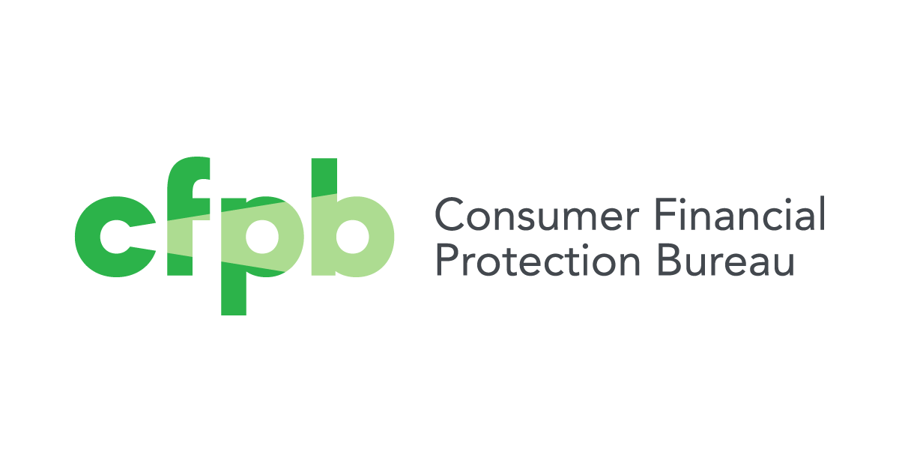

## Table of Contents

## What is the Consumer Financial Protection Bureau (CFPB)?

The Consumer Financial Protection Bureau, or CFPB, is a government agency in the United States. It was created to protect consumers who use financial products and services like loans, credit cards, and bank accounts. The CFPB makes sure that companies offering these services treat people fairly and follow the rules.

The CFPB helps people by giving them information and tools to make smart choices about money. If someone has a problem with a financial company, they can complain to the CFPB, which will work to solve the issue. The agency also writes rules that financial companies must follow to keep things fair for everyone.

## When was the CFPB established and why?

The CFPB was established in 2011. It was created because of the Dodd-Frank Wall Street Reform and Consumer Protection Act, which was a big law passed in 2010 after the financial crisis. The idea was to help prevent another crisis by making sure financial companies treat people fairly and don't take advantage of them.

Before the CFPB, there were many different agencies watching over banks and other financial companies, but they didn't always work together well. This made it hard to protect consumers. The CFPB was set up to bring all these efforts together into one place, so it could be easier to keep an eye on financial companies and help people if they had problems with them.

## What are the main goals of the CFPB?

The main goal of the CFPB is to make sure that financial companies treat people fairly. This means they want banks, credit card companies, and other financial services to be honest and clear with people about what they are getting into. The CFPB wants to stop companies from tricking people or charging them too much money for things they don't need.

Another big goal is to help people understand their money better. The CFPB gives out information and tools that can help people make good choices about things like loans, credit cards, and bank accounts. If someone has a problem with a financial company, they can complain to the CFPB, which will try to fix the issue and make things right.

## How does the CFPB protect consumers?

The CFPB protects consumers by making rules that financial companies have to follow. These rules make sure that companies are fair and honest with people. For example, the CFPB can stop companies from charging hidden fees or tricking people into loans they can't afford. If a company breaks these rules, the CFPB can make them fix the problem and even pay money back to the people they hurt.

The CFPB also helps people by listening to their complaints. If someone has a problem with a bank or a credit card company, they can tell the CFPB about it. The CFPB will then work to solve the problem and make sure the company does the right thing. This way, people know they have someone on their side who can help them if a financial company is not treating them fairly.

On top of that, the CFPB gives out free tools and information to help people understand money better. They have websites and guides that explain things like how to choose a good credit card or what to look out for when getting a loan. By helping people learn more, the CFPB makes it easier for everyone to make smart choices about their money and avoid getting into trouble with financial companies.

## What types of financial products does the CFPB regulate?

The CFPB regulates many types of financial products that people use every day. This includes things like credit cards, mortgages, and car loans. They also look after bank accounts, like checking and savings accounts, and make sure companies are fair when they give out these products. If a company is not treating people right, the CFPB steps in to fix it.

The CFPB also keeps an eye on other financial services, like payday loans and debt collection. Payday loans are short-term loans that people might use when they need money quickly, but they can be risky because they often have high fees. Debt collectors are companies that try to get money back from people who owe it. The CFPB makes sure these companies follow the rules and don't treat people badly. By watching over all these different products and services, the CFPB helps keep the financial world fair for everyone.

## Who can file a complaint with the CFPB?

Anyone can file a complaint with the CFPB if they have a problem with a financial product or service. This includes people who use credit cards, have bank accounts, or have taken out loans like mortgages or car loans. Even if you have issues with payday loans or debt collectors, you can go to the CFPB for help.

You don't need to be a U.S. citizen to file a complaint. If you live in the U.S. and use financial services here, you can ask the CFPB for help. The CFPB will listen to your problem and work to solve it, making sure the financial company treats you fairly.

## How does one file a complaint with the CFPB?

To file a complaint with the CFPB, you can go to their website at www.consumerfinance.gov. On the homepage, look for a button that says "Submit a Complaint." Click on it and you'll be taken to a form where you can tell the CFPB about your problem. You'll need to pick the type of financial product or service you're having trouble with, like a credit card or a loan. Then, you'll fill out details about your issue, like what happened and how you want it fixed. You can also upload any documents that help explain your problem.

After you submit your complaint, the CFPB will send it to the company you're having trouble with. The company has to look at your complaint and give the CFPB an answer within a certain time. The CFPB will keep you updated on what's happening with your complaint. If the company doesn't fix the problem, the CFPB might step in to help you more. You can also call the CFPB if you need help filing your complaint or if you have questions about the process.

## What powers does the CFPB have to enforce regulations?

The CFPB has strong powers to make sure financial companies follow the rules. They can look into a company if they think it's doing something wrong. This means they can ask the company for information and even visit them to check things out. If the CFPB finds that a company broke the rules, they can make the company fix the problem. They can also make the company pay money back to people who were hurt and pay a fine to the government.

If a company doesn't listen to the CFPB, they can take the company to court. This is a big deal because it can force the company to do what the CFPB says. The CFPB can also write new rules that all financial companies have to follow. These rules help keep things fair for everyone. By using these powers, the CFPB makes sure that financial companies treat people right and follow the law.

## How does the CFPB collaborate with other federal and state agencies?

The CFPB works with other federal and state agencies to make sure financial companies treat people fairly. They share information with other agencies, like the Federal Trade Commission (FTC) and the Department of Justice (DOJ), to keep an eye on companies and catch any problems early. If the CFPB finds something wrong, they might work with these agencies to investigate and fix the issue. This teamwork helps them do a better job of protecting people from unfair financial practices.

The CFPB also works with state agencies, like state attorneys general, to make sure the rules are followed everywhere. They can help each other with investigations and share information about what's happening in different parts of the country. This way, they can stop problems before they get too big and make sure that financial companies follow the same rules no matter where they are. By working together, the CFPB and other agencies can keep the financial world fair and safe for everyone.

## What impact has the CFPB had on the financial industry since its inception?

Since it started in 2011, the CFPB has made a big difference in the financial world. It has helped people by making sure banks and other financial companies treat them fairly. The CFPB has written rules that make it harder for companies to trick people or charge them too much money. They have also made it easier for people to understand their money and make smart choices about things like loans and credit cards. By doing this, the CFPB has helped millions of people feel more confident and safe when they use financial services.

The CFPB has also changed how financial companies do business. They know that the CFPB is watching them, so they are more careful about following the rules. The CFPB has the power to look into companies and make them fix problems if they find something wrong. This has made companies think twice before doing anything unfair. As a result, the financial industry has become more focused on treating people right and being clear about what they offer.

## How does the CFPB handle data privacy and security issues?

The CFPB works hard to keep people's financial information safe. They make rules that companies have to follow to protect your data. For example, they tell companies to use strong security systems to stop hackers from stealing your information. If a company doesn't keep your data safe, the CFPB can make them fix the problem and pay money back to people who were hurt.

The CFPB also listens to people's complaints about data privacy. If you think a company is not keeping your information safe or is using it in a way you don't like, you can tell the CFPB. They will look into your problem and work to make sure the company does the right thing. By doing this, the CFPB helps keep your financial information private and secure.

## What are some criticisms and controversies surrounding the CFPB?

Some people think the CFPB has too much power and doesn't have enough checks to make sure it's doing things right. They say that the CFPB can make rules and punish companies without enough people watching over them. This makes some people worry that the CFPB could be unfair or too tough on businesses. There have been fights in court about how much power the CFPB should have, and some say it should be changed so it has to answer to more people, like Congress.

Another big problem people talk about is how the CFPB is paid for. It gets its money from the Federal Reserve, not from Congress like most government agencies. Some people think this is not fair because it means the CFPB doesn't have to ask Congress for money every year. They say this makes the CFPB less accountable. There have been arguments about whether the CFPB should get its money from Congress instead, so it would have to explain how it spends money and what it's doing.

## References & Further Reading

[1]: Bergstra, J., Bardenet, R., Bengio, Y., & Kégl, B. (2011). ["Algorithms for Hyper-Parameter Optimization."](https://papers.nips.cc/paper/4443-algorithms-for-hyper-parameter-optimization) Advances in Neural Information Processing Systems 24.

[2]: ["Advances in Financial Machine Learning"](https://www.amazon.com/Advances-Financial-Machine-Learning-Marcos/dp/1119482089) by Marcos Lopez de Prado

[3]: ["Evidence-Based Technical Analysis: Applying the Scientific Method and Statistical Inference to Trading Signals"](https://www.amazon.com/Evidence-Based-Technical-Analysis-Scientific-Statistical/dp/0470008741) by David Aronson

[4]: ["Machine Learning for Algorithmic Trading"](https://github.com/stefan-jansen/machine-learning-for-trading) by Stefan Jansen

[5]: ["Quantitative Trading: How to Build Your Own Algorithmic Trading Business"](https://github.com/LucindaYa/quant-resources/blob/master/Quantitative%20Trading%20How%20to%20Build%20Your%20Own%20Algorithmic%20Trading%20Business.pdf) by Ernest P. Chan