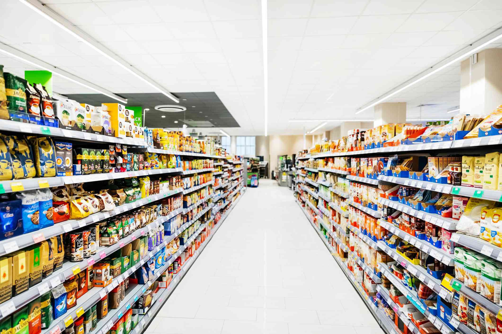

The consumer goods sector encompasses a broad range of industries that focus on producing and selling goods directly to consumers. These goods include everyday items such as food, beverages, clothing, and electronics, crucially driving economic activity and reflecting consumer confidence and spending patterns. Historically, the sector has developed through traditional retail channels, but recent technological advancements and changing consumer behaviors have significantly reshaped its landscape. 

Algorithmic trading represents one of the revolutionary forces influencing this sector. It refers to the use of computer algorithms to manage aspects of trading in financial markets, often executing trades at speeds and frequencies beyond human capability. Initially developed within the confines of Wall Street, algorithmic trading has expanded its influence across various sectors, including consumer goods, altering how stocks are bought, sold, and valued in real time. 



In the context of consumer goods industries, algorithmic trading has introduced new dynamics that impact stock liquidity, market pricing, and investor strategies. These algorithms can process vast datasets, uncovering patterns and trends that inform trading decisions. Consequently, market participants can react to fluctuations in consumer demand and external economic factors with greater precision. Furthermore, algorithms facilitate market efficiency by narrowing bid-ask spreads, increasing trade volumes, and reducing transaction costs, ultimately making the market more accessible and transparent to investors.

This article aims to provide a thorough analysis of the consumer goods sector, emphasizing the profound implications of algorithmic trading on its market dynamics. Through examining key market trends, technological integration, and future prospects, the article seeks to offer valuable insights for investors and stakeholders navigating this ever-evolving landscape. As technological innovation continues to permeate the sector, understanding the interaction between algorithmic trading and consumer goods becomes paramount to crafting informed investment strategies and sustaining competitive advantage in the marketplace.

## Table of Contents

## Understanding the Consumer Goods Sector

The consumer goods sector encompasses companies and industries involved in the production, distribution, and sale of goods used by individuals and households. These goods are essential for daily living and range from food and beverage to clothing and household products. This sector is significant due to its direct impact on the economy, as it is closely tied to consumer behavior, which drives economic activity. The demand for consumer goods is a principal indicator of economic health, as consumer spending constitutes a substantial portion of gross domestic product (GDP).

Consumer goods are broadly categorized into durable goods, nondurable goods, and cyclical and non-cyclical goods:

1. **Durable Goods**: These are items with a long life span, typically more than three years. Examples include automobiles, appliances, and furniture. They represent a substantial investment for consumers and are often sensitive to economic cycles, meaning their demand may decline during economic downturns.

2. **Nondurable Goods**: These are goods consumed quickly or have a short life span, such as food, beverages, and toiletries. Nondurable goods are frequently purchased, making them less sensitive to economic fluctuations compared to durable goods.

3. **Cyclical and Non-Cyclical Goods**: Cyclical goods are those whose demand is closely linked to the overall economic environment, such as luxury items and automobiles. In contrast, non-cyclical goods, also known as defensive goods, include products that consumers continue to purchase regardless of economic conditions, such as healthcare products and utilities.

Key market dynamics impacting the consumer goods sector include consumer behavior, technological advancements, and evolving market trends. Consumer behavior is influenced by various factors such as income levels, cultural trends, and personal preferences, which dictate spending habits. Technology plays a critical role in reshaping the sector, with advancements enabling improved supply chain efficiency, enhanced product customization, and streamlined consumer engagement through digital platforms.

Technological progress has also facilitated the rise of e-commerce, altering the way consumer goods are marketed and distributed. This has allowed companies to reach broader markets while reducing costs associated with physical retail spaces. Furthermore, technology enables the collection and analysis of vast amounts of consumer data, leading to more targeted marketing efforts and personalized consumer experiences.

The consumer goods sector's adaptation to these dynamics is crucial for sustaining growth and maintaining competitive advantage. The continual evolution of consumer preferences and technological innovations necessitates agility and innovation within the sector.

## Market Dynamics and Trends

The consumer goods sector is significantly influenced by several market dynamics, with economic conditions and consumer spending habits playing pivotal roles. An economy's health, characterized by its growth rate, inflation levels, and employment [statistics](/wiki/bayesian-statistics), directly impacts consumers' disposable income and, consequently, their spending habits. During periods of economic prosperity, increased consumer confidence typically leads to higher spending on both essential and non-essential goods. Conversely, in economic downturns, spending tends to decline as consumers prioritize essential goods, affecting the sales of non-essential consumer products.

Current trends reshaping the sector include digital transformation and sustainability. Digital transformation has substantially altered how consumer goods are perceived, advertised, and purchased. The rise of e-commerce has enabled consumer goods companies to reach a broader audience, providing users with a convenient shopping experience. Platforms like Amazon have set new benchmarks for consumer expectations regarding ease of access and speedy delivery, driving many traditional retail businesses to build their online presence. This shift is coupled with the growing use of data analytics and [artificial intelligence](/wiki/ai-artificial-intelligence) to tailor products and marketing strategies to consumer preferences, enhancing personalized shopping experiences.

Sustainability has emerged as a crucial trend in response to growing environmental concerns and consumer awareness. Companies such as Tesla and LVMH have set noteworthy benchmarks in integrating sustainability into their operations and product lines. Tesla, a leader in the electric vehicle market, exemplifies how sustainability initiatives can be synonymous with innovation and market leadership. On the luxury front, LVMH's commitment to sustainable practices includes reducing carbon footprint and adopting eco-friendly materials, reflecting a broader industry trend towards ethical consumerism.

Innovations in e-commerce and brand personalization continue to redefine consumer goods marketing. The proliferation of online shopping has extended beyond traditional websites to include social media marketplaces and mobile applications. This expansion has allowed businesses to harness huge volumes of consumer data, leading to personalized marketing strategies that align closely with individual preferences and behaviors. Retailers are increasingly employing [machine learning](/wiki/machine-learning) algorithms to analyze browsing and purchase histories, enabling targeted promotions and personalized recommendations that enhance consumer engagement and brand loyalty. 

In conclusion, the consumer goods sector is navigating a transformative period marked by digital advancements and an increasing emphasis on sustainable practices. Companies that effectively adapt to these shifts—embracing new technologies and responding to evolving consumer expectations—are likely to maintain competitive advantages in the market.

 to Algorithmic Trading

Algorithmic trading represents a significant evolution in the way financial markets operate. It involves the use of computerized algorithms to manage, execute, and optimize trading decisions at speeds and frequencies beyond human capabilities. The inception of [algorithmic trading](/wiki/algorithmic-trading) dates back to the 1970s with the advent of electronic stock exchanges and has steadily evolved alongside advancements in technology. Today, it plays a vital role in modern financial markets, accounting for a substantial share of trading volumes across major exchanges globally.

Several strategies underpin algorithmic trading. One of the primary strategies is [market making](/wiki/market-making), which involves providing [liquidity](/wiki/liquidity-risk-premium) to the market by simultaneously posting buy and sell orders for a security. By exploiting the bid-ask spread, market makers aim to profit from these transactions. Statistical [arbitrage](/wiki/arbitrage) is another prevalent strategy, relying on mathematical models to identify and exploit short-term price discrepancies between related securities or markets. This strategy typically involves high-frequency trading ([HFT](/wiki/high-frequency-trading-strategies)) and requires sophisticated risk management to mitigate potential losses.

Algorithmic trading offers several advantages that have revolutionized financial markets. Increased trading efficiency is perhaps its most significant benefit. Algorithms can process large volumes of data and execute trades within milliseconds, reducing transaction costs and minimizing the impact of human error. This efficiency contributes to more liquid markets, making it easier for investors to buy and sell securities without causing significant price movements.

However, algorithmic trading also presents notable challenges, particularly related to market [volatility](/wiki/volatility-trading-strategies). The rapid execution of a large number of trades can amplify price swings during times of market stress, leading to events like the "flash crash" of 2010. Additionally, the complexity of algorithms can sometimes lead to unintended market behaviors or exacerbate systemic risks. Market participants and regulators continually work towards improving the robustness and oversight of algorithmic trading systems to mitigate such risks.

In summary, algorithmic trading has transformed the landscape of financial markets through its efficiency and sophisticated trading strategies. While it offers numerous advantages, the associated challenges necessitate careful management and ongoing evaluation to maximize its benefits while minimizing potential risks.

## Impact of Algorithmic Trading on the Consumer Goods Sector

Algorithmic trading has considerably influenced the consumer goods sector, particularly in terms of liquidity and pricing. This automated trading approach employs complex algorithms to execute trades at high speeds and volumes, significantly impacting stock markets.

### Influence on Liquidity and Pricing

Algorithmic trading enhances liquidity in the stock markets. By executing buy and sell orders more efficiently than human traders, it ensures that markets remain liquid, even during volatile periods. This benefit extends to the consumer goods sector, where increased liquidity can lead to tighter bid-ask spreads, thus reducing transaction costs for investors. A more liquid market enables investors to execute large trades without causing significant price fluctuations, contributing to market stability.

Additionally, algorithmic trading affects stock pricing by swiftly incorporating new information into market prices. Algorithms can process vast amounts of data almost instantaneously, ensuring that stock prices reflect all available information. For consumer goods companies, this means their stock prices are influenced quickly by news, earnings reports, and other market developments.

### Case Studies of High-frequency Trading Impact

High-frequency trading (HFT), a subset of algorithmic trading, has shown varied impacts on consumer goods companies. One notable example is the impact of HFT on companies like Procter & Gamble during the "Flash Crash" of May 6, 2010. On this day, the Dow Jones Industrial Average dropped nearly 1,000 points within minutes, partly due to HFT exacerbating the market's volatility. Procter & Gamble's stock saw an extreme drop before rebounding, showcasing how HFT can intensify market movements even for stable consumer goods stocks.

Another case involves the use of HFT by firms like Renaissance Technologies, which are known for their data-driven investment strategies. Their use of sophisticated algorithms allows them to predict and react to consumer goods stock movements ahead of traditional market players, influencing how these stocks are priced and traded.

### Benefits and Potential Risks

The primary benefit of algorithmic trading in the consumer goods sector is improved market efficiency. By rapidly processing information and executing trades, it ensures that stocks are fairly valued and that discrepancies are quickly corrected. This contributes to a more transparent and efficient market. Furthermore, algorithmic trading can handle large volumes of trades, offering scalability and reduced transaction costs.

However, the speed and efficiency of algorithmic trading also introduce potential risks. One significant concern is the increased market volatility, as evidenced by events like the Flash Crash. Algorithms can react to market signals in fractions of a second, leading to rapid price swings that can unsettle markets. Additionally, the lack of transparency in algorithmic trading strategies can make it difficult for regulators to monitor and assess their impact on financial markets.

Another risk is the potential for technological failures, which can exacerbate market disruptions. Instances of erroneous trades caused by algorithm glitches have occasionally led to significant financial losses for companies in the consumer goods sector.

In conclusion, algorithmic trading has brought both opportunities and challenges to the consumer goods sector. While it enhances liquidity and pricing efficiency, it also poses risks that necessitate careful consideration by market participants and regulators.

## Future Outlook and Trends

The future landscape of the consumer goods sector is poised for transformation, heavily influenced by the integration of artificial intelligence (AI) and machine learning (ML) in trading. These technologies are set to enhance decision-making processes by providing more sophisticated data analysis and predictive capabilities. As AI continues to evolve, its application within algorithmic trading allows for more precise forecasting of consumer trends, enabling companies to tailor their offerings to meet changing consumer preferences effectively.

AI and ML technologies are anticipated to optimize supply chain management by predicting demand fluctuations more accurately and minimizing waste through better inventory control. Additionally, these technologies contribute to pricing strategies by analyzing competitive pricing models and adjusting dynamically to maximize profitability without sacrificing market share.

Regulatory environments surrounding algorithmic trading are also evolving to keep pace with technological advancements. Regulatory bodies aim to balance the benefits of technological innovation with the need for market stability and protection against systemic risks. Enhanced regulations may involve stricter oversight on algorithmic trading systems, particularly high-frequency trading, to prevent market manipulation and ensure fair trading practices. This is crucial as algorithmic trading becomes more prevalent and potentially impacts market liquidity and volatility.

Predicting the convergence of technological advancements with consumer demand involves understanding the dynamic interchange between innovation, consumer expectations, and economic factors. As technology increasingly shapes consumer expectations, companies are pressured to integrate digital solutions within the consumer goods sector rapidly. This involves leveraging big data analytics, augmented reality, and blockchain to create personalized and secure consumer experiences.

The intersection of these technological shifts with evolving consumer demand is likely to lead to significant market impacts, including the creation of new business models and revenue streams. For instance, the rise of personalized marketing strategies enabled by AI can lead to increased consumer engagement and loyalty, directly influencing revenue growth.

In conclusion, the future of the consumer goods sector, shaped significantly by AI and ML in trading, presents both opportunities and challenges. Companies that effectively harness these technologies while navigating regulatory landscapes will likely lead the market, capitalizing on enhanced efficiencies and deeper consumer insights. As technological and market demands evolve, continuous adaptation and strategic foresight will be vital for stakeholders aiming to maintain or enhance their competitive advantage.

## Investment Strategies for Navigating the Sector

Investors seeking to leverage algorithmic trading in the consumer goods sector can optimize their strategies by implementing a combination of diversification and data-driven decision-making. These components are crucial in navigating the complexities and mitigating the inherent risks associated with this dynamic industry.

### Diversification

Diversification is a fundamental principle in investment strategy, aimed at reducing risk by allocating investments across various financial instruments, industries, or other categories. The rationale behind diversification is that a well-diversified portfolio will, on average, yield higher returns and pose a lower risk than any individual investment within the portfolio.

In the context of algorithmic trading in the consumer goods sector, diversification should encompass a range of consumer goods sub-sectors, such as durable goods (e.g., home appliances and furniture), nondurable goods (e.g., food and beverages), and discretionary items (e.g., luxury products and automotive vehicles). By spreading investments across these categories, investors can cushion against sector-specific volatility and capitalize on growth opportunities in different market segments.

### Data-Driven Decision-Making

Data-driven decision-making is an approach where decisions are based on analyzed data rather than intuition or observation alone. For investors using algorithmic trading, this involves the integration of advanced analytics and machine learning techniques to interpret complex data sets.

Utilizing historical data on consumer behavior, spending trends, and market conditions enables investors to construct predictive models that anticipate price movements and identify optimal entry and [exit](/wiki/exit-strategy) points for trades. For example, machine learning algorithms can be employed to analyze sentiment data from social media or consumer reviews to gauge public perception of a particular brand or product, thereby influencing trading decisions.

Python is a powerful tool for implementing data-driven strategies, offering numerous libraries such as pandas for data manipulation, scikit-learn for machine learning, and TensorFlow for [deep learning](/wiki/deep-learning). Here is a simple example of Python code to calculate moving averages, a common technique used in algorithmic trading:

```python
import pandas as pd

# Sample stock price time series data
data = {'Date': ['2023-01-01', '2023-01-02', '2023-01-03', '2023-01-04'],
        'Price': [150, 152, 149, 153]}

df = pd.DataFrame(data)
df['Date'] = pd.to_datetime(df['Date'])
df.set_index('Date', inplace=True)

# Calculate moving averages
df['20_MA'] = df['Price'].rolling(window=20).mean()
df['50_MA'] = df['Price'].rolling(window=50).mean()
print(df)
```

### Educational Resources and Toolkits

To build robust investment strategies, continuous learning and access to relevant resources are essential. Several online courses and platforms offer education on algorithmic trading, financial analysis, and data science, which are integral to developing effective strategies. Notable offerings include:

- **Coursera and edX**: Provide courses on financial markets, data analysis, and machine learning.
- **Khan Academy**: Offers free courses on finance and economics fundamentals.
- **QuantInsti**: Specializes in algorithmic trading education and offers a comprehensive executive program.

Additionally, toolkits such as QuantConnect and Alpaca provide platforms for developing and testing algorithmic trading strategies with access to data and trading APIs.

By integrating these strategies and resources, investors can better navigate the consumer goods sector, leveraging algorithmic trading to enhance their portfolio performance and mitigate risks.

## Conclusion

The intricate interplay between the consumer goods sector and algorithmic trading has undeniable implications for both industries. The dynamic nature of consumer goods, characterized by ever-changing consumer preferences and technological advancements, makes it a fertile ground for the application of algorithmic trading. Algorithmic trading has demonstrated the capability to significantly influence stock liquidity and pricing mechanisms within the sector, creating both opportunities and challenges for investors and companies alike.

Technological innovations, particularly in data analytics and machine learning, have reshaped how market trends are perceived and responded to. As these innovations continue to permeate the consumer goods sector, the role of algorithmic trading becomes increasingly crucial. Investors must adapt investment strategies to leverage these technological advancements, employing data-driven approaches to mitigate risks and capitalize on emerging trends.

Furthermore, maintaining awareness of regulatory changes is essential. The regulatory landscape governing algorithmic trading is continuously evolving, and staying informed about these changes is vital for compliance and strategic planning. Investors and companies must prioritize continuous learning to navigate these changes effectively, ensuring they remain competitive and informed in a rapidly shifting market environment.

The convergence of consumer demand with advanced trading technologies is setting a new trajectory for the consumer goods industry. By acknowledging the impact of algorithmic trading and adapting to its implications, stakeholders can better position themselves to thrive in this dynamic interface between technology and consumer behavior.

## References & Further Reading

[1]: Bergstra, J., Bardenet, R., Bengio, Y., & Kégl, B. (2011). ["Algorithms for Hyper-Parameter Optimization."](https://dl.acm.org/doi/10.5555/2986459.2986743) Advances in Neural Information Processing Systems 24.

[2]: ["Advances in Financial Machine Learning"](https://www.amazon.com/Advances-Financial-Machine-Learning-Marcos/dp/1119482089) by Marcos Lopez de Prado

[3]: ["Evidence-Based Technical Analysis: Applying the Scientific Method and Statistical Inference to Trading Signals"](https://www.amazon.com/Evidence-Based-Technical-Analysis-Scientific-Statistical/dp/0470008741) by David Aronson

[4]: ["Machine Learning for Algorithmic Trading"](https://github.com/stefan-jansen/machine-learning-for-trading) by Stefan Jansen

[5]: ["Quantitative Trading: How to Build Your Own Algorithmic Trading Business"](https://github.com/LucindaYa/quant-resources/blob/master/Quantitative%20Trading%20How%20to%20Build%20Your%20Own%20Algorithmic%20Trading%20Business.pdf) by Ernest P. Chan