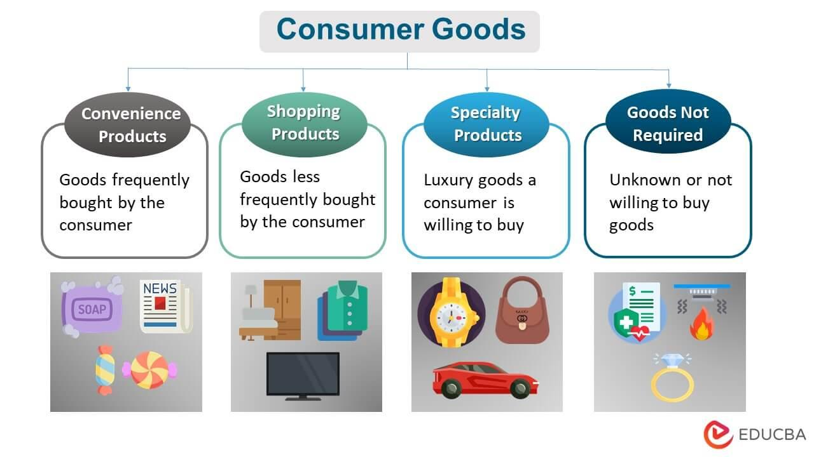

## Table of Contents

## What are consumer goods?

Consumer goods are products that people buy for their own use. These can be things like food, clothes, and toys. They are different from things that businesses buy to make other products or to run their operations. Consumer goods are important because they meet the everyday needs and wants of people.

There are different types of consumer goods. Some are used up quickly, like food and drinks, and these are called fast-moving consumer goods. Others last longer, like furniture and cars, and these are called durable goods. Understanding the difference helps businesses know how to sell these products and helps people decide what to buy.

## What are the main categories of consumer goods?

Consumer goods can be divided into three main categories: convenience goods, shopping goods, and specialty goods. Convenience goods are things that people buy often and without much thought, like snacks or toothpaste. They are easy to find and usually not very expensive. Shopping goods are things that people take more time to choose, like clothes or electronics. People compare different options and prices before buying these items.

Specialty goods are unique items that people are willing to make extra effort to find, like a specific brand of watch or a rare book. These items are not bought often, and people are usually very particular about what they want. Each category helps businesses understand how to market their products and helps consumers know what to expect when they go shopping.

## Can you provide examples of durable consumer goods?

Durable consumer goods are things that last a long time. They are not like food or drinks that you use up quickly. Examples of durable goods include furniture, like sofas and tables, and appliances, like refrigerators and washing machines. These items are usually more expensive because they are made to last for many years.

Another example of durable goods is electronics, such as televisions and computers. People often keep these items for a long time before they need to buy new ones. Cars are also durable goods. They can last for many years with proper care and maintenance. Because they last so long, people usually think carefully before buying durable goods.

## What are non-durable consumer goods and their examples?

Non-durable consumer goods are things that don't last long. They are used up or wear out quickly, so people need to buy them again and again. These goods are usually cheaper than durable goods because they don't last as long.

Examples of non-durable goods include food, like bread and milk, and drinks, like soda and juice. Other examples are things like paper towels, soap, and toilet paper. These items are used every day and need to be replaced often.

## How do consumer goods differ from capital goods?

Consumer goods are things that people buy to use every day. They can be things like food, clothes, and toys. These goods are meant for personal use and are bought by regular people. They are different from capital goods because consumer goods are used up quickly or wear out over time. People need to keep buying them to meet their everyday needs and wants.

Capital goods, on the other hand, are things that businesses buy to help them make other products or to run their operations. These can be machines, tools, or buildings. Capital goods are not meant for personal use but are used to produce other goods or services. They are usually more expensive and last longer than consumer goods. Understanding the difference helps businesses know what to invest in and helps people know what they are buying.

## What role do consumer goods play in the economy?

Consumer goods are very important for the economy. When people buy things like food, clothes, and toys, they help businesses make money. This money helps businesses grow and hire more people. When more people have jobs, they can buy more things, which keeps the economy going. So, consumer goods help keep the cycle of spending and earning strong.

Consumer goods also help measure how well the economy is doing. If people are buying a lot of things, it usually means they feel good about their money and the future. This is called consumer confidence. When consumer confidence is high, it can make the whole economy grow. But if people stop buying things, it might mean they are worried about their money, and this can slow down the economy. So, watching what people buy helps us understand the health of the economy.

## How has the classification of consumer goods evolved over time?

The way we group consumer goods has changed over time as people's needs and wants have changed. A long time ago, consumer goods were mostly simple things like food, clothes, and tools. These were the basic things people needed to live. As time went on, new inventions and more factories meant there were more kinds of goods. This led to new ways of grouping them, like convenience goods, which people buy often and without much thought, and shopping goods, which people take more time to choose.

Today, the groups we use for consumer goods keep changing because of new technology and different ways people live. For example, things like smartphones and computers are now very important, and they fit into a new group called durable goods. Also, because people care more about the environment, there are now groups for eco-friendly goods. These changes help businesses know how to sell things and help people know what to buy.

## What are some emerging trends in the consumer goods market?

One big trend in the consumer goods market is the focus on sustainability. More and more people want to buy things that are good for the environment. This means companies are making products that can be recycled or are made from things that don't hurt the planet. For example, you might see more reusable water bottles and less plastic packaging. This trend is important because it helps the earth stay healthy and shows that people care about the future.

Another trend is the use of technology in shopping. People are buying more things online, using their phones or computers. This has changed how companies sell things. They need to make it easy for people to shop online and sometimes use things like drones to deliver products quickly. Also, technology like virtual reality is starting to be used so people can see what a product looks like before they buy it. This makes shopping more fun and easier for everyone.

A third trend is personalization. People want things that are made just for them. Companies are using data to learn about what people like and then making products that fit those likes. For example, you might be able to design your own shoes or get a special flavor of ice cream. This trend makes people feel special and helps companies sell more things because people are happy with what they get.

## How do companies market different types of consumer goods?

Companies use different ways to market different types of consumer goods. For convenience goods, like snacks or toothpaste, companies focus on making them easy to find and buy. They put these goods in lots of stores and use ads on TV or online to remind people to buy them. The goal is to make these goods a regular part of people's lives. Companies also often offer deals or discounts to get people to buy more.

For shopping goods, like clothes or electronics, companies use different marketing strategies. They make ads that show why their products are better than others. They might use celebrities or show how the product works in real life. Companies also make sure their products are in stores where people can touch and try them. Online, they use detailed product descriptions and customer reviews to help people make choices. The goal is to help people feel confident in their decision to buy.

For specialty goods, like a special brand of watch or a rare book, companies use very targeted marketing. They focus on people who really want these unique items. They might use social media or special events to reach these people. Companies also make sure these goods are sold in places where people who want them will look. The goal is to make these goods seem special and worth the extra effort to find.

## What are the challenges faced by manufacturers of consumer goods?

Manufacturers of consumer goods face many challenges. One big challenge is competition. There are a lot of companies making similar products, so it can be hard to stand out. Manufacturers need to find ways to make their products better or cheaper than others. They also need to spend a lot of money on advertising to let people know about their products. This can be tough because it costs a lot and there's no guarantee it will work.

Another challenge is keeping up with what people want. People's tastes and needs change all the time, so manufacturers need to keep making new products or changing old ones. This can be expensive and risky because if people don't like the new products, the company can lose money. Also, manufacturers have to deal with supply chain problems. They need to make sure they have enough materials to make their products and that they can get those products to stores on time. If something goes wrong, like a factory closing or a ship being delayed, it can cause big problems.

Lastly, there are challenges with regulations and sustainability. Governments have rules about how products can be made and what they can contain. Manufacturers have to follow these rules, which can be hard and expensive. Also, more and more people want products that are good for the environment. Manufacturers need to find ways to make eco-friendly products, which can be difficult and costly. But if they don't do it, they might lose customers who care about the planet.

## How do consumer preferences influence the development of new consumer goods?

Consumer preferences play a big role in the development of new consumer goods. When companies see that people want something different or new, they try to make products that fit those wants. For example, if a lot of people start caring about the environment, companies might make more eco-friendly products. They use surveys, social media, and sales data to figure out what people like and don't like. This helps them decide what new products to make and how to make them better.

Once companies know what people want, they start working on new products. They might change the ingredients, the design, or even the way the product is packaged. This can take a lot of time and money, but it's worth it if the new product is something people will buy. For example, if people want healthier snacks, companies might make snacks with less sugar or more natural ingredients. By listening to what consumers want, companies can make products that people will love and keep buying.

## What are the sustainability issues related to consumer goods production and disposal?

Making and getting rid of consumer goods can harm the environment. When companies make things like clothes, toys, and electronics, they often use a lot of energy and materials. This can lead to more pollution and less of the earth's resources. For example, making plastic uses oil, which is not good for the planet. Also, when companies make things far away and ship them around the world, it uses a lot of fuel and makes more pollution.

Getting rid of consumer goods is another big problem. Many things, like plastic bottles and old electronics, end up in landfills or the ocean. These things can take hundreds of years to break down and can hurt animals and the environment. Recycling helps, but not everything can be recycled, and sometimes recycling can use a lot of energy too. People are trying to use less and throw away less, but it's still a big challenge to make consumer goods in a way that's good for the earth.

## References & Further Reading

[1]: ["Advances in Financial Machine Learning"](https://www.amazon.com/Advances-Financial-Machine-Learning-Marcos/dp/1119482089) by Marcos Lopez de Prado

[2]: ["Machine Learning for Algorithmic Trading"](https://github.com/PacktPublishing/Machine-Learning-for-Algorithmic-Trading-Second-Edition) by Stefan Jansen

[3]: ["Quantitative Trading: How to Build Your Own Algorithmic Trading Business"](https://books.google.com/books/about/Quantitative_Trading.html?id=j70yEAAAQBAJ) by Ernest P. Chan

[4]: Schmuckler, M. A., & Yatskel, A. (2022). ["Exploiting AI and Algorithmic Trading in the Consumer Goods Sector."](https://www.sciencedirect.com/science/article/pii/S0275531922000344) Decision Support Systems, Volume 150. 

[5]: Tesfatsion, L. (2002). ["Agent-Based Computational Economics: Growing Economies from the Bottom Up"](https://ieeexplore.ieee.org/abstract/document/6790809), Artificaial Life (8), 55-82.