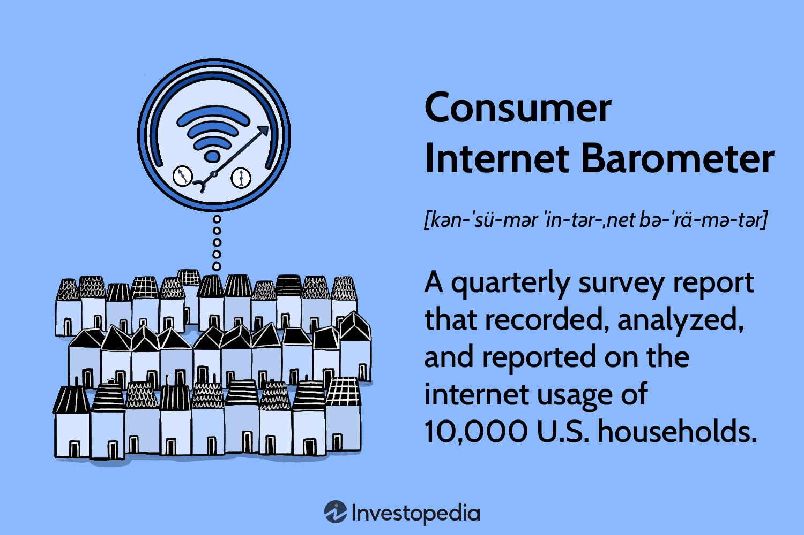

The digital age has profoundly transformed the ways in which markets and consumer behavior are analyzed. With the advent of the Internet and advanced technological tools, there has been a paradigm shift in understanding how consumers interact with products and services. Internet trends have emerged as pivotal forces in shaping consumer behavior, influencing everything from purchasing habits to engagement with brands. This article explores the impact of these trends on consumer behavior while also examining the role of algorithmic trading in financial markets.

In today's interconnected world, market research and technology adoption are more important than ever. Businesses and investors who harness the power of these tools gain significant competitive advantages. Market research provides insights into consumer preferences and emerging trends, enabling organizations to tailor their strategies effectively. Simultaneously, technology adoption, especially in the context of algorithmic trading, enhances decision-making efficiency and accuracy in financial markets. The synergy between these domains is crucial for understanding the dynamics of modern markets.



Understanding the intersection of these areas offers a unique perspective on how businesses and investors can thrive. For instance, algorithmic trading, leveraging artificial intelligence and machine learning, can lead to more efficient trading systems with reduced human error. Additionally, market research supported by data analytics offers clarity into evolving consumer expectations, assisting businesses in designing personalized experiences. As we progress through this fast-paced market environment, the integration of these insights can drive innovation and growth. By exploring these key components, this article aims to shed light on the evolving landscape of market dynamics.

## Table of Contents

## Understanding Internet Trends and Consumer Behavior

Internet trends have significantly influenced consumer interaction with products and services, reshaping purchasing behavior and expectations. The surge in e-commerce exemplifies the transformative impact of online engagement on consumer habits. Consumers now have unprecedented access to a global marketplace, allowing for comparison shopping, price tracking, and product reviews before purchase decisions. This democratization of information and accessibility has prompted a shift towards more informed and discerning consumer behaviors.

With increasing online engagement, consumers demand personalized experiences tailored to their preferences and behaviors. Businesses have responded to this by leveraging data-driven insights, which involve collecting and analyzing vast amounts of consumer data to tailor marketing efforts and enhance overall customer satisfaction. This targeted approach not only improves customer experiences but also fosters brand loyalty as consumers are more likely to engage with brands that recognize and cater to their individual needs.

Data analytics has become an essential tool in understanding these trends, enabling businesses to decipher complex consumer patterns and predict future behaviors. Techniques such as machine learning models can process large datasets to identify consumer preferences and segment markets effectively. This allows for the development of strategic marketing campaigns that resonate with specific consumer groups.

Moreover, social media platforms and other digital channels have become vital arenas for brand-consumer interaction, where trends often originate and propagate quickly. The virality potential of these platforms can significantly impact consumer behavior, with trends often dictating consumer purchasing decisions and brand perceptions. Therefore, continuously monitoring and adapting to these internet trends is crucial for businesses aiming to maintain competitiveness and relevance in the digital marketplace.

## Market Research: Bridging the Gap

Market research is an indispensable element in aligning corporate offerings with consumer desires, a pivotal strategy in the ever-evolving market landscape. Data analytics plays a vital role in this process, empowering companies to glean insights from vast data sets concerning consumer preferences and emerging trends. By harnessing these insights, businesses can tailor their strategies to meet the nuanced demands of their customers, thereby gaining a competitive edge.

Key to effective market research is the strategic collection, analysis, and interpretation of data. Companies employ various methodologies to achieve these ends. Quantitative methods such as surveys and questionnaires provide measurable data about consumer behaviors and preferences. Qualitative research, including focus groups and in-depth interviews, offers valuable insights into consumer motivations and attitudes. By leveraging these methodologies, businesses can develop a comprehensive understanding of their target markets.

Moreover, advanced tools such as predictive analytics and [machine learning](/wiki/machine-learning) algorithms have revolutionized market research. These technologies enable businesses to predict future consumer behaviors and identify potential trends ahead of time. For example, regression analysis can be used to examine the relationship between different variables, helping companies identify key factors that influence consumer purchasing decisions. Additionally, clustering algorithms can segment consumers into distinct groups, allowing for more targeted marketing strategies.

Being adaptive is crucial for sustaining competitive advantage. As market conditions and consumer behaviors shift, businesses must continuously refine their market research approaches. This necessitates an iterative process of testing and validation, where initial findings are evaluated and strategies are adjusted accordingly.

Python, with its rich ecosystem of libraries, is often utilized for data analysis in market research. A simple Python example for performing linear regression can illustrate how data-driven decisions are supported:

```python
import pandas as pd
from sklearn.linear_model import LinearRegression

# Sample data
data = {'Advertising': [10, 15, 12, 18, 14],
        'Sales': [30, 45, 40, 55, 50]}
df = pd.DataFrame(data)

# Prepare the data
X = df[['Advertising']]
y = df['Sales']

# Initialize and fit the model
model = LinearRegression()
model.fit(X, y)

# Predict future sales based on advertising budget
new_advertising = [[20]]
predicted_sales = model.predict(new_advertising)

print(f"Predicted Sales: {predicted_sales[0]}")
```

This example illustrates predictive analysis, a backbone of modern market research techniques.

In conclusion, market research is a dynamic and crucial function that bridges the gap between consumer expectations and corporate offerings. By integrating advanced data analytics and adaptive methodologies, businesses can better navigate the complexities of consumer markets, aligning their strategies to drive growth and innovation.

## The Role of Algorithmic Trading

Algorithmic trading has become an indispensable element in modern financial markets, driving considerable changes in trading practices. It offers significant advantages by enhancing efficiency and speed, allowing for the execution of multiple trades swiftly based on predetermined conditions. This reduced reliance on human intervention not only minimizes human error but also ensures a more structured and disciplined approach to trading.

An essential component of [algorithmic trading](/wiki/algorithmic-trading) is the use of machine learning and [artificial intelligence](/wiki/ai-artificial-intelligence) (AI). These technologies are integrated into trading algorithms to enhance decision-making processes. For instance, machine learning models can analyze vast amounts of historical data to identify patterns or trends that might not be immediately apparent to human traders. AI enhances these insights by offering predictive analytics, enabling traders to anticipate market movements and adjust strategies accordingly.

Algorithmic trading platforms are constantly evolving, adopting innovative technologies to maintain competitiveness. One such advancement is the integration of high-frequency trading ([HFT](/wiki/high-frequency-trading-strategies)), wherein algorithms execute thousands of orders in fractions of a second. This approach capitalizes on minute price discrepancies, often invisible in slower trading systems.

The influence of algorithmic trading extends to market [volatility](/wiki/volatility-trading-strategies) and investor strategies. Its ability to respond rapidly to market changes can, at times, lead to increased volatility. For example, during market events with sharp price movements, algorithms might react simultaneously, amplifying volatility. Moreover, algorithmic trading affects investor strategies by shifting focus towards data-driven approaches, requiring investors to consider both algorithmic and traditional factors in their decision-making processes.

In summary, algorithmic trading is a transformative force in financial markets, streamlining operations, enhancing decision-making, and influencing market behaviors. As technology continues to advance, the strategic integration and adaptation of algorithmic trading are imperative for sustaining a competitive edge in the financial landscape.

## Integration of Generative AI in Trading

Generative AI is increasingly transforming trading algorithms to enhance their efficiency and predictive accuracy. This technology's ability to process vast datasets enables it to identify intricate patterns within financial markets, thereby improving trading strategies.

At the core of generative AI in trading lies the use of complex machine learning models, such as neural networks, that learn from historical data to forecast future market trends. Unlike traditional models, which might rely on predefined rules or historical correlation matrices, generative AI can dynamically adjust its predictions based on evolving data patterns. This adaptability is vital in financial markets, where conditions can change rapidly due to economic, political, or social factors.

One key advantage of generative AI is its capacity to analyze and extract insights from unstructured data, including news articles, social media posts, and other [alternative data](/wiki/best-alternative-data) sources. These insights are crucial for capturing market sentiment and predicting how it might impact asset prices. For instance, by employing natural language processing (NLP) techniques, AI models can gauge the tone of financial news, analyze sentiments reflected in social media posts, and incorporate these qualitative measures into [quantitative trading](/wiki/quantitative-trading) algorithms.

Here’s a simple Python example illustrating how sentiment analysis might be applied in a trading context using a natural language processing library like nltk:

```python
import nltk
from nltk.sentiment import SentimentIntensityAnalyzer

nltk.download('vader_lexicon')
sia = SentimentIntensityAnalyzer()

def analyze_sentiment(text):
    return sia.polarity_scores(text)

# Example usage:
news_headline = "Market shows unprecedented growth amid tech boom"
sentiment = analyze_sentiment(news_headline)
print(sentiment)  # Could inform a trading strategy
```

Generative AI models, such as Generative Adversarial Networks (GANs), also contribute to the development of more sophisticated trading strategies. GANs can simulate different market scenarios and stress-test trading algorithms against these scenarios to optimize their robustness and adaptability.

The integration of AI-driven models in trading platforms not only enhances their execution speed and accuracy but also allows for the automation of entire trading processes. This automation is particularly beneficial for high-frequency trading (HFT) firms that execute a large number of trades in milliseconds. It significantly reduces the likelihood of human error and enables these firms to capitalize on minute price inefficiencies across markets.

Furthermore, AI’s capability to provide adaptive solutions is embodied in [reinforcement learning](/wiki/reinforcement-learning) models, which continuously learn from their trading environments to refine strategies based on performance outcomes. This aspect of AI provides a significant competitive edge, allowing firms to stay ahead of market changes by continually optimizing their strategies.

Overall, the integration of generative AI into trading systems offers substantial competitive advantages in execution and efficiency. It not only enhances the robustness of trading models but also ensures that these models remain responsive to new information and changing market conditions. As the financial industry continues to embrace AI technologies, the potential for further innovation and growth within trading systems is considerable.

## Future Trends and Considerations

The convergence of market research, consumer behavior analysis, and algorithmic trading presents a set of emerging opportunities and considerations crucial for stakeholders aiming to harness future advancements. As technology continues to evolve, companies must remain agile and responsive to the rapid pace of change to capitalize on these emerging opportunities. A critical aspect of staying competitive in this landscape includes focusing on the integration of advanced technologies such as artificial intelligence (AI) and machine learning (ML) in both consumer analytics and trading strategies.

AI and ML offer sophisticated tools for processing and analyzing vast datasets, allowing for deeper insights into consumer behavior and market dynamics. This capability is pivotal for businesses aiming to develop personalized marketing strategies and for traders seeking to formulate more accurate predictive models. As these technologies advance, their integration becomes not only beneficial but essential for maintaining a competitive edge.

One emerging trend is the use of blockchain technology in enhancing transparency and security in data transactions and algorithms used in market research. Blockchain can ensure the integrity and authenticity of data used for algorithmic trading decisions, thus enhancing trust and accuracy. Furthermore, the decentralization offered by blockchain could potentially democratize market access, allowing smaller players to participate more meaningfully.

Investors and marketers should also pay attention to sustainability trends, as consumers increasingly demand ethical and environmentally friendly products. Market research must adapt by incorporating these values into their analyses to predict shifts in consumer preferences. Algorithmic trading could leverage these insights by adjusting portfolios to include more sustainable companies, aligning financial strategies with emerging social values.

Moreover, the increasing emphasis on data privacy and protection poses a challenge but also an opportunity for innovation. New regulatory requirements necessitate the development of privacy-preserving technologies, which could become a significant area of focus and investment. This shift presents potential for growth in sectors dealing with cybersecurity and data management solutions.

Additionally, the integration of generative AI models capable of creating novel trading strategies or marketing plans represents a growing area of interest. These models can autonomously learn from new data patterns and adapt accordingly, offering potential boosts in efficiency and effectiveness.

In conclusion, the intersection of market research, consumer behavior, and algorithmic trading is ripe with potential for future growth. Companies that stay informed about technological advancements and emerging trends, while remaining adaptable to new consumer demands and regulatory environments, are likely to thrive. Embracing these changes, while fostering innovation, will be key to leveraging the opportunities of tomorrow's markets.

## Conclusion

The ongoing digital transformation is significantly altering consumer behaviors and market dynamics, presenting both opportunities and challenges for businesses and investors. Leveraging internet trends, market research, and algorithmic trading has become essential for navigating this changing landscape.

Internet trends provide invaluable insights into consumer preferences and behaviors, enabling businesses to tailor their offerings and marketing strategies to meet evolving demands. Market research plays a critical role in this process by providing data-driven insights that inform decision-making. As technology continues to evolve, the methods and tools used in market research are also advancing, offering more precise and actionable insights.

Algorithmic trading, meanwhile, has introduced new levels of efficiency and speed to financial markets. By incorporating machine learning and AI, trading algorithms can process vast amounts of data and execute trades based on complex conditions with minimal human intervention. This not only reduces errors but also enhances the decision-making process, giving traders a competitive edge.

Adapting to these changes is crucial for maintaining competitiveness. Organizations that effectively integrate insights from internet trends, market research, and algorithmic trading can drive innovation, improve customer satisfaction, and boost financial performance. However, the rapid pace of technological change also poses challenges, requiring businesses to remain agile and responsive.

In conclusion, the integration of digital transformation elements is not merely beneficial but essential for modern businesses and investors. By embracing the opportunities presented by these changes, organizations can foster growth, enhance efficiency, and secure a competitive position in an increasingly complex market environment.

## References & Further Reading

[1]: Shapiro, C. (2018). ["The Economics of Information and Internet Markets."](https://assets.cambridge.org/97805218/44154/frontmatter/9780521844154_frontmatter.pdf) Journal of Economic Perspectives.

[2]: Narayanan, V. G., & Raman, A. (2004). ["Aligning Incentives in Supply Chains."](https://hbr.org/2004/11/aligning-incentives-in-supply-chains) Harvard Business Review.

[3]: Chopra, S., & Meindl, P. (2013). ["Supply Chain Management: Strategy, Planning, and Operation."](https://books.google.com/books/about/Supply_Chain_Management_Strategy_Plannin.html?id=gPDQCQAAQBAJ) Pearson Education.

[4]: Lopez de Prado, M. (2018). ["Advances in Financial Machine Learning."](https://www.amazon.com/Advances-Financial-Machine-Learning-Marcos/dp/1119482089) Wiley.

[5]: Chan, E. P. (2009). ["Quantitative Trading: How to Build Your Own Algorithmic Trading Business."](https://github.com/ftvision/quant_trading_echan_book) Wiley Trading.

[6]: Armstrong, J. S. (2011). ["Principles of Forecasting: A Handbook for Researchers and Practitioners."](https://www.sciencedirect.com/science/article/pii/S0169207002000341) Springer.

[7]: Jansen, S. (2018). ["Machine Learning for Algorithmic Trading."](https://github.com/stefan-jansen/machine-learning-for-trading) Packt Publishing.

[8]: Aronson, D. R. (2006). ["Evidence-Based Technical Analysis: Applying the Scientific Method and Statistical Inference to Trading Signals."](https://www.amazon.com/Evidence-Based-Technical-Analysis-Scientific-Statistical/dp/0470008741) Wiley Trading.