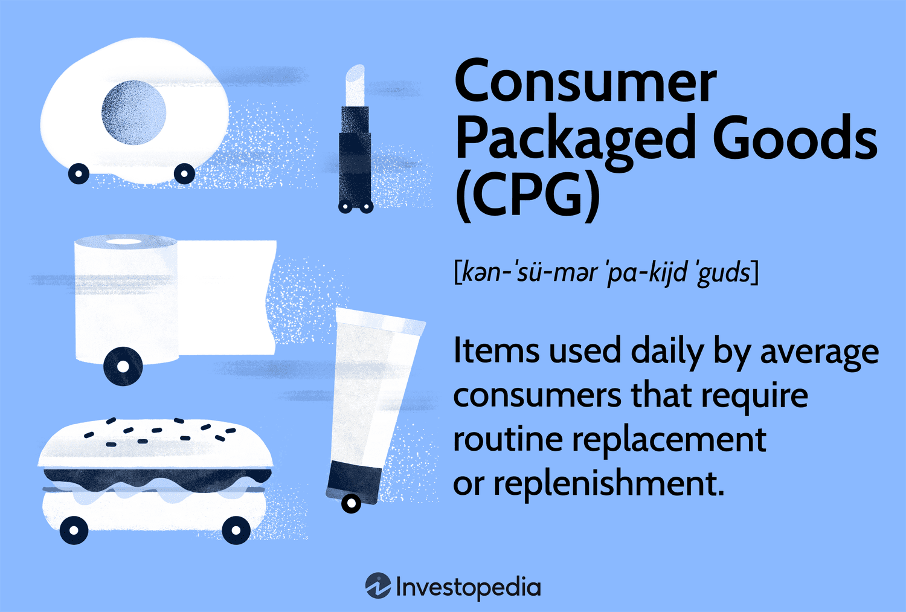

In the rapidly evolving financial landscape, algorithmic trading has emerged as a significant force, particularly within the domains of Durable Goods and Consumer Packaged Goods (CPG). This method utilizes computer algorithms to make trading decisions at speed and scale, offering a strategic advantage in analyzing complex market dynamics and executing transactions efficiently. The adoption of algo trading is transforming these sectors, providing firms with the tools to enhance their market strategies and tap into new investment opportunities.

Durable goods, characterized by their longevity and substantial investment, like automobiles and appliances, present a unique trading scenario. They are less frequently purchased than CPGs, such as food items and personal care products, which require more frequent restocking. This fundamental difference in purchasing cycles influences how algorithmic trading can be applied. For instance, trading strategies in the durable goods sector might focus on optimizing for macroeconomic indicators that impact consumer spending patterns, while CPG trading might concentrate on consumer behavior analytics and supply chain optimization.

Understanding these distinct market characteristics is essential for recognizing how algorithmic trading can reshape strategies in each sector. By leveraging data analytics, firms can better predict trends, manage supply chains, and respond swiftly to market changes. The integration of technology in trading not only minimizes human error but also enhances decision-making processes, offering a more agile and responsive approach to market challenges.

This article explores the intersection of algorithmic trading with the durable goods and CPG industries, providing insights into the transformative potential of these technologies. By unraveling the complexities of these sectors, we can appreciate the dynamic interplay between traditional economic forces and modern technological innovations in trading. As these industries continue to adopt and integrate algorithmic strategies, the potential for innovation and competitive advantage grows, setting the stage for a new era in market strategy and investment.

## Table of Contents

## Understanding Durable Goods and Consumer Packaged Goods (CPG)

Durable goods are defined as products with a prolonged lifespan, typically three years or more, requiring a considerable financial outlay and less frequent replacement cycles. Examples include automobiles, home appliances, and furniture. These items are generally considered investments by consumers and are often linked with higher levels of consumer deliberation before purchase, given their significant cost and enduring nature.

On the other hand, Consumer Packaged Goods (CPG) encompass products meant for regular consumption and frequent purchase. This category includes everyday items such as food, beverages, toiletries, and cleaning products. CPGs are characterized by their high turnover rates in retail environments and are typically lower in price per unit compared to durable goods, fostering repeat purchase behavior among consumers.

Market dynamics between these two sectors are distinct, primarily due to their differing responses to economic shifts. Durable goods' demand is highly sensitive to economic conditions, often experiencing fluctuations in line with broader economic trends, such as employment rates and consumer confidence. This cyclical nature means these goods are typically bought more during times of economic prosperity and less during downturns.

Conversely, the demand for CPGs tends to remain relatively stable, even in challenging economic periods, as these goods fulfill essential consumer needs. This stability in demand is a result of the repetitive purchase cycle and necessity-driven consumption patterns associated with CPGs.

Key industry players must address specific challenges inherent to each sector. For durable goods, managing long product life cycles and adapting to technological advancements are crucial. Additionally, market participants need to consider financing options for consumers, given the substantial investments required for such purchases.

For CPGs, navigating supply chain logistics efficiently is paramount, due to the products' perishable nature and short shelf life. Additionally, the CPG sector must continuously respond to consumer preference shifts, driven by lifestyle changes, health trends, and environmental concerns. This requires agility in product development and marketing strategies to maintain competitiveness and consumer loyalty.

Understanding the nuanced differences between durable goods and CPGs is vital for crafting effective trading and investment strategies. These differences influence everything from inventory management and production planning to marketing approaches and market entry strategies. Recognizing the economic and consumer behavior patterns in each sector aids in informed decision-making, optimizing both operational efficiency and market responsiveness.

## The Role of Algorithmic Trading in Durable and CPG Sectors

Algorithmic trading, commonly known as 'algo trading,' employs computer algorithms to execute trades at remarkable speeds and volumes. This method is particularly beneficial in sectors like durable goods and Consumer Packaged Goods (CPG), where market timing and data-driven decision making are crucial.

In the durable goods sector, algorithms can significantly enhance trading strategies by optimizing the timing and selection of trades. They achieve this by analyzing a multitude of economic indicators and market data. For instance, algorithms can assess macroeconomic trends, such as [interest rate](/wiki/interest-rate-trading-strategies) changes and economic growth projections, to predict demand shifts for durable goods like vehicles and appliances. This foresight allows traders and companies to adjust their strategies promptly, optimizing investment portfolios and enhancing profitability.

In the CPG sector, the dynamic nature of consumer preferences and inventory cycles poses distinct challenges. Here, algorithms can provide a competitive advantage by tracking consumer trends and predicting purchasing patterns. By analyzing data from consumer transactions, social media, and market research, algorithms can identify emerging trends and shifts in consumer behavior. This insight enables companies to adjust their marketing, inventory management, and production accordingly, ensuring they meet consumer demand efficiently.

Furthermore, algorithms reduce the risk of human error and improve decision-making processes by executing trades based on predetermined criteria without emotional bias. This precision is crucial in both sectors, where timely decision-making can lead to significant competitive advantages.

Both the durable goods and CPG sectors can significantly benefit from advancements in predictive analytics and [machine learning](/wiki/machine-learning). These technologies enable more accurate forecasting and adaptive trading strategies. By utilizing machine learning models, traders can continuously learn from new data, updating their strategies in real time and improving their predictive accuracy.

In summary, [algorithmic trading](/wiki/algorithmic-trading) enhances the trading strategies of durable and CPG sectors by leveraging data-driven insights and automation. This technological application not only optimizes investment decisions but also aligns operations with ever-changing market conditions, enabling firms to sustain and improve their market position.

## Impact of Algo Trading on Market Efficiency and Strategy

Algorithmic trading, also known as algo trading, plays a pivotal role in enhancing market efficiency across various sectors, including durable goods and Consumer Packaged Goods (CPG). By automating the trading process, algo trading provides several benefits, such as increased [liquidity](/wiki/liquidity-risk-premium), reduced trading costs, and stabilized prices.

In the CPG sector, where competition is intense and margins are often thin, algorithmic strategies are crucial for optimizing pricing. Algorithms can analyze vast amounts of market data to identify trends and predict price movements, enabling companies to adjust prices in real-time and maintain a competitive edge. This proactive pricing strategy helps businesses not only to maximize profits but also to manage inventory levels effectively, reducing the risk of overstock or stockouts.

For durable goods, which are typically sensitive to economic fluctuations, algorithmic trading is indispensable for portfolio management. Algorithms assess various economic indicators and market data to mitigate the impact of economic cycles. They can forecast demand shifts and adjust investments accordingly, ensuring that portfolios remain aligned with current market conditions. This capability is particularly vital in navigating periods of economic uncertainty, as it allows businesses to reallocate resources efficiently and mitigate risks.

The integration of algo trading strategies contributes to more robust financial planning and risk management. Algorithms enhance decision-making by minimizing human errors and improving the precision of financial forecasts. This ability to quickly adapt to market changes puts companies in a better position to seize market opportunities and avoid potential losses. By leveraging predictive analytics and machine learning, firms can refine their trading models and consistently achieve superior financial performance.

In conclusion, companies that effectively incorporate algorithmic trading technologies are well-equipped to capitalize on emerging market opportunities while safeguarding against adverse market movements. This strategic advantage not only leads to improved operational efficiency but also positions firms to drive sustainable growth in a competitive landscape.

## Challenges and Considerations in Implementing Algo Trading

Algorithmic trading offers numerous advantages but also presents several challenges and considerations that companies must address to implement it effectively. One major challenge is the risk of technical failures. These failures can stem from hardware malfunction, software bugs, or network disruptions, potentially leading to substantial financial losses. To mitigate these risks, companies should invest in redundancy systems and real-time monitoring tools to ensure contingency plans are in place.

Regulatory compliance is another significant concern. The algorithmic trading landscape is subject to stringent regulations to protect against market manipulation and ensure fair trading practices. Firms must stay abreast of these regulatory requirements, which can vary across jurisdictions, and integrate them into their systems. This often necessitates regular audits, transparency in algorithmic decisions, and reporting mechanisms to regulators.

In the Consumer Packaged Goods (CPG) sector, rapid changes in consumer behavior add complexity to algorithmic models. Algorithms must quickly adapt to shifts in consumer preferences, which can be driven by factors such as seasonal trends, new products, or changes in pricing strategies. Despite advancements in machine learning, these models can occasionally fail to predict sudden consumer behavior shifts, leading to forecasting errors. Continuous data analysis and model updates are essential to maintain accuracy.

For the durable goods sector, large-scale economic shifts, like interest rate changes or economic recessions, pose challenges for algorithmic models. These shifts can significantly impact consumer purchasing power and demand patterns. Consequently, algorithms require recalibration to adjust to new market conditions, which involves modifying parameters and incorporating new data sources to enhance predictive accuracy.

Companies must also focus on ensuring their algo trading systems are robust and scalable. This involves integrating cutting-edge technology that can handle large data volumes and perform high-frequency trading reliably. Aligning these systems with regulatory standards is crucial. Firms should implement comprehensive risk management frameworks that include scenarios for stress testing and failure response strategies.

Finally, while automation drives efficiencies, human oversight remains essential in algorithmic trading, particularly for decision-making and error correction. Firms should integrate human judgment into their processes, allowing for intervention when anomalies or unexpected market conditions arise. Encouraging a collaborative approach that combines technological prowess with human insight can optimize trading outcomes and mitigate risks. As algorithmic trading evolves, companies need to continuously adapt and refine their strategies to navigate these challenges effectively.

## Future Trends and Developments

The future of algorithmic trading in the durable goods and Consumer Packaged Goods (CPG) sectors is brimming with potential, driven by advanced technologies. The integration of [artificial intelligence](/wiki/ai-artificial-intelligence) (AI) and big data analytics is set to revolutionize these markets, offering unprecedented depth in market insight and strategic precision.

Predictive modelling is expected to undergo significant refinement, enhancing the ability to forecast market trends and consumer behaviors accurately. Real-time analytics will further augment this capability, enabling traders and companies to respond swiftly to market changes. For example, algorithms leveraging machine learning can analyze vast datasets to predict shifts in consumer demand or changes in economic indicators relevant to durable goods.

Regulatory developments will also play a crucial role, shaping the landscape by emphasizing transparency and ethical considerations. As algorithmic strategies grow more sophisticated, regulatory bodies will likely implement stricter guidelines to ensure fair market practices and prevent manipulative trading. This will require companies to maintain a balance between innovation and compliance, continually updating their systems to meet new standards.

The evolving nature of consumer expectations is another driving force for innovation. As consumers demand faster service and more personalized products, algorithms will need to become increasingly adaptive. They must process vast amounts of data quickly to understand and anticipate these demands, ensuring that supply chains and inventory levels are optimized accordingly. The use of natural language processing and sentiment analysis, for instance, can help algorithms understand consumer feedback and adapt strategies in near real-time.

Industries seeking to fully leverage algorithmic trading must stay ahead of these trends. Investments in AI and analytics infrastructure, coupled with a robust framework for regulatory compliance, will be essential. Companies that effectively harness these developments will not only enhance their trading strategies but also position themselves as leaders in market innovation and efficiency. By embracing these technologies, industries can achieve a competitive edge, ensuring sustainable growth and adaptability in an ever-evolving market landscape.

## Conclusion

Algorithmic trading has fundamentally altered the landscape of the durable goods and Consumer Packaged Goods (CPG) industries. By automating trading processes, these advanced systems enable improved operational efficiency, heightened accuracy, and strategic flexibility, offering companies a substantial competitive advantage. The automation reduces the latency and potential for human error, thereby streamlining decision-making processes and optimizing market timing.

Despite the numerous benefits, algorithmic trading does introduce certain challenges that must be addressed. The potential for technical failures and the necessity for ongoing compliance with evolving regulations are significant concerns. Yet, these challenges also present opportunities for innovation. They drive the continuous refinement of trading algorithms, spurring advancements in predictive analytics and machine learning capabilities.

As market conditions and consumer demands continue to shift, companies that successfully integrate algorithmic trading into their operations are better positioned to achieve sustainable growth. The agility provided by these automated systems allows businesses to adjust swiftly to market fluctuations and seize emerging opportunities.

To fully capitalize on the advantages of algorithmic trading, ongoing exploration and adaptation are essential. As technologies advance, companies must ensure that their systems are both robust and scalable, while maintaining a balance between automation and human oversight. Such proactive adaptation will be vital for firms looking to harness the full potential of algorithmic trading as industries evolve and new developments emerge.

## References & Further Reading

[1]: Bertsimas, D., & Lo, A. W. (1998). ["Optimal control of execution costs."](http://web.mit.edu/dbertsim/www/papers/Finance/Optimal%20control%20of%20execution%20costs.pdf) Journal of Financial Markets, 1(1).

[2]: Gomber, P., Arndt, B., Lutat, M., & Uhle, T. (2011). ["High-frequency trading."](https://papers.ssrn.com/sol3/papers.cfm?abstract_id=1858626) Bankers, Markets & Investors.

[3]: Kissell, R. (2013). ["The Science of Algorithmic Trading and Portfolio Management"](https://www.sciencedirect.com/book/9780124016897/the-science-of-algorithmic-trading-and-portfolio-management). Academic Press.

[4]: O'Hara, M. (2015). ["High frequency market microstructure."](https://www.sciencedirect.com/science/article/pii/S0304405X15000045) Journal of Financial Economics, 116(2).

[5]: Treleaven, P., Galas, M., & Lalchand, V. (2013). ["Algorithmic trading review."](https://dl.acm.org/doi/10.1145/2500117) Communications of the ACM, 56(11).