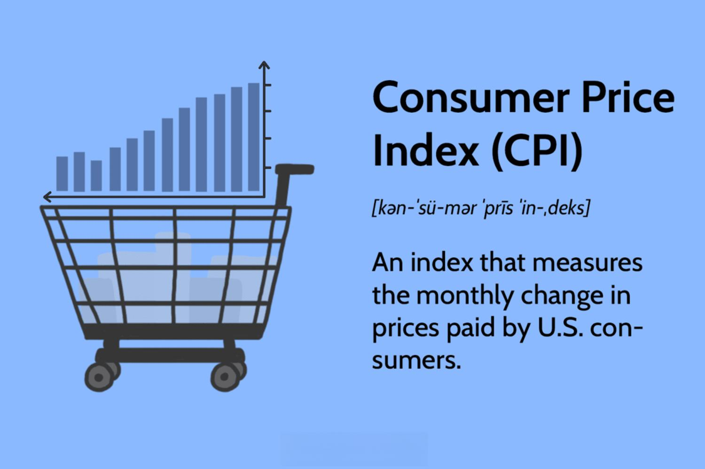

## Table of Contents

## What is the Consumer Price Index (CPI)?

The Consumer Price Index, or CPI, is a measure that shows how the prices of goods and services that people buy change over time. It's like a big shopping list that includes things like food, clothes, rent, and other everyday items. By tracking these prices, the CPI helps us understand if things are getting more expensive or cheaper. This information is important because it affects everyone who buys things.

The CPI is calculated by taking price information from thousands of places where people shop, like stores and online. Every month, experts gather this data and compare it to the prices from the same month in the previous year. If the CPI goes up, it means prices have gone up on average, which is called inflation. If it goes down, it means prices have dropped, which is called deflation. Governments and businesses use the CPI to make decisions about things like wages and interest rates.

## How is the CPI calculated?

The CPI is calculated by looking at the prices of a big list of things that people usually buy, like food, clothes, and rent. This list is called a market basket. Every month, people from the government go out and check the prices of these items at lots of different stores and places. They compare these new prices to the prices from the same month last year. If the prices are higher now, the CPI goes up, which means things are more expensive.

To make the CPI fair, the government uses a special formula. They take the total cost of the market basket now and divide it by the total cost of the same basket from the base year, which is a year they use as a starting point. Then, they multiply this number by 100 to get the CPI. This way, the CPI shows how much more or less people have to pay for the same stuff compared to the base year.

## What are the main components of the CPI?

The CPI is made up of a bunch of different things that people buy every day. These things are grouped into categories like food and drinks, housing, clothes, transportation, medical care, entertainment, and education. Each category has a lot of specific items in it. For example, the food and drinks category includes things like bread, milk, and coffee.

Each category in the CPI is given a weight, which means some categories are more important than others. The weights are based on how much money people spend on each category. For example, people usually spend a lot on housing, so it has a big weight in the CPI. On the other hand, things like entertainment might have a smaller weight because people don't spend as much money on those things.

The CPI is updated regularly to make sure it reflects what people are actually buying. Sometimes, new items are added to the list, and old ones are taken out. This helps keep the CPI accurate and useful for understanding how prices are changing over time.

## Why is the CPI important for consumers?

The CPI is really important for consumers because it helps them understand if things are getting more expensive or cheaper. When the CPI goes up, it means that prices are going up, which is called inflation. This can affect how much money people have to spend on things they need, like food and rent. If the CPI goes down, it means prices are going down, which is called deflation. Knowing this can help people plan their budgets better and make smart choices about what to buy.

The CPI also helps the government and businesses make decisions that can affect consumers. For example, if the CPI shows that prices are going up a lot, the government might decide to change interest rates or give people more money to help them keep up with the higher prices. Businesses might use the CPI to decide if they should raise their prices or offer discounts. So, the CPI is a big deal because it affects everyone's wallet and helps make sure that the economy works well for consumers.

## How does the CPI affect economic policy?

The CPI is a big help for people who make rules about money and the economy. When the CPI shows that prices are going up a lot, it can mean that inflation is happening. This might make the government decide to change interest rates. If interest rates go up, it can make people borrow less money and spend less, which can help slow down inflation. On the other hand, if the CPI shows that prices are not going up much or are even going down, the government might lower interest rates to encourage people to spend more and help the economy grow.

The CPI also helps the government decide if they should give people more money or change taxes. If prices are going up and people are finding it hard to buy what they need, the government might give out more money or lower taxes to help. This can make sure that people can still afford things even when prices are higher. So, the CPI is really important because it helps the government make choices that keep the economy working well for everyone.

## What is the difference between CPI and other inflation measures like the Producer Price Index (PPI)?

The Consumer Price Index (CPI) and the Producer Price Index (PPI) are both used to measure inflation, but they look at different parts of the economy. The CPI measures the average change over time in the prices paid by urban consumers for a market basket of consumer goods and services, like food, housing, and clothes. It's all about what people have to pay when they go shopping. On the other hand, the PPI measures the average change over time in the selling prices received by domestic producers for their output, which includes goods and services at different stages of production before they reach the consumer. So, the PPI focuses on what businesses are getting paid for what they make, not what consumers are paying.

These two indexes give us different information about inflation. The CPI is more important for understanding how inflation affects everyday people because it directly shows changes in the cost of living. When the CPI goes up, it means that people have to spend more money to buy the same things. The PPI, however, can be a good early warning sign for future consumer price changes. If the PPI goes up, it might mean that the prices of goods and services will go up for consumers later on because businesses might pass on their higher costs. So, while the CPI tells us about inflation from the consumer's side, the PPI gives us a look from the producer's side.

## How often is the CPI updated and reported?

The CPI is updated and reported every month. This means that every month, the people who work on the CPI look at the prices of things that people buy, like food, clothes, and rent, and then they tell everyone how much those prices have changed compared to last month and the same month last year.

The monthly report comes out usually around the middle of the month, and it covers the prices from the previous month. For example, the report that comes out in mid-February will tell us about the prices from January. This regular update helps everyone, from regular people to the government, keep track of how prices are changing over time.

## Can the CPI be used to adjust wages and salaries?

Yes, the CPI can be used to adjust wages and salaries. When the CPI goes up, it means that the cost of living is getting higher because prices for things like food, rent, and clothes are going up. If wages and salaries don't go up too, people might find it harder to buy what they need. So, some jobs use the CPI to make sure that people's pay keeps up with the rising prices. This is called a cost-of-living adjustment, or COLA. It helps make sure that workers can still afford things even when prices go up.

For example, if the CPI shows that prices have gone up by 3% over the last year, a company might decide to increase everyone's salary by 3% too. This way, the workers can still buy the same amount of stuff as before, even though everything costs more. Governments also use the CPI to adjust things like social security payments or pensions, so that people who rely on these payments can keep up with the cost of living. By using the CPI to adjust wages and salaries, it helps make sure that people's money goes as far as it used to.

## What are the limitations and criticisms of the CPI?

The CPI is a helpful tool, but it has some problems. One big issue is that it might not always show the real changes in the cost of living for everyone. The CPI uses a fixed list of things that people buy, but what people actually buy can change over time. For example, if a new gadget comes out and a lot of people start buying it, the CPI might not include it right away. Also, the CPI uses weights to show how important different things are, but these weights might not be the same for everyone. Someone living in a big city might spend more on rent than someone in a small town, so the CPI might not be perfect for everyone.

Another criticism is that the CPI might not show the full effect of inflation. Sometimes, when prices go up, people might switch to cheaper options or buy less of something. The CPI might not catch these changes because it looks at the prices of a set list of items, not how people change what they buy. This can make the CPI seem like it's showing less inflation than what people are really feeling. Also, some people think that the CPI can be slow to update, so it might not always be up to date with the latest price changes. This can make it harder for the CPI to help people and the government make quick decisions about things like wages and interest rates.

## How does the CPI vary across different countries?

The CPI can be different in different countries because people in each country buy different things and have different costs of living. For example, in a country where people spend a lot on healthcare, the CPI might give a bigger weight to healthcare costs. In another country, where people spend more on food, the CPI might focus more on food prices. Also, the way each country calculates the CPI can be different. Some countries might update their list of items more often, while others might keep the same list for a longer time. This means that the CPI in one country might show different changes in prices compared to another country, even if the overall inflation is similar.

Another reason the CPI varies across countries is because of the economic conditions and the way prices are collected. In some countries, the government might have more resources to collect detailed price information from many places, which can make their CPI more accurate. In other countries, they might not have as many resources, so their CPI might not be as detailed. Also, economic policies like taxes and subsidies can affect prices differently in each country, which can show up in the CPI. So, while the CPI is a useful tool to understand inflation in each country, it's important to know that it can be different from one place to another because of these reasons.

## What role does the CPI play in monetary policy decisions?

The CPI is really important for people who make decisions about money in a country, like central bankers. They use the CPI to see if prices are going up too fast, which is called inflation. If the CPI shows that prices are going up a lot, central bankers might decide to raise interest rates. When interest rates go up, it can make people borrow less money and spend less, which can help slow down inflation. On the other hand, if the CPI shows that prices are not going up much or are even going down, central bankers might lower interest rates to encourage people to spend more and help the economy grow.

The CPI also helps central bankers understand how well their policies are working. If they see that the CPI is going up even after they've raised interest rates, they might need to do something different. The CPI gives them a clear picture of what's happening with prices, so they can make good choices about how to keep the economy stable. By keeping an eye on the CPI, central bankers can make sure that inflation stays at a level that's good for everyone, helping to keep the economy running smoothly.

## How can businesses use the CPI for strategic planning?

Businesses can use the CPI to plan for the future by understanding how prices are changing. If the CPI shows that prices are going up, businesses might need to raise their own prices to keep up with the costs of making their products. They can also use the CPI to see if people are spending more or less money. If prices are going up a lot, people might not buy as much, so businesses might need to find ways to save money or offer discounts to keep customers coming back.

The CPI can also help businesses decide how much to pay their workers. If the CPI shows that the cost of living is going up, businesses might need to give their employees a raise so they can still afford things like food and rent. This can help keep workers happy and stop them from leaving for better-paying jobs. By keeping an eye on the CPI, businesses can make smart choices about pricing, costs, and wages to stay successful no matter what's happening with prices.

## What is the Consumer Price Index (CPI) and how is it understood?

The Consumer Price Index (CPI) is a critical economic indicator that assesses the average change over time in the prices paid by urban consumers for a market basket of consumer goods and services. It serves as a measure of inflation, reflecting how the purchasing power of currency is eroded as the cost of goods and services rises.

Statistical agencies calculate the CPI by selecting a basket of goods and services representative of typical consumer purchases. This basket is divided into categories such as housing, transportation, food and beverages, medical care, and education. The weights assigned to each category are based on their proportion in the average consumer's total expenditure. This ensures that categories representing a larger share of consumer spending have a proportionately larger impact on the overall CPI.

To compute the CPI, agencies collect price data on thousands of items from various locations and compare them to a base year. The CPI for a given period is calculated using the following formula:

$$
CPI = \frac{\sum (Price_t \times Quantity_{base})}{\sum (Price_{base} \times Quantity_{base})} \times 100
$$

Where:
- $Price_t$ is the current price of the item
- $Price_{base}$ is the price of the item in the base year
- $Quantity_{base}$ is the quantity of the item in the base year

This formula results in a price index that can be used to measure inflation rates by assessing the percentage change in CPI over time.

There are different types of CPI, with the most prominent being headline CPI and core CPI. Headline CPI measures the total inflation within an economy, including all categories within the CPI basket. However, it can be volatile due to the inclusion of categories like food and energy, which are susceptible to frequent price swings.

Core CPI, on the other hand, excludes food and energy prices to provide a clearer picture of long-term inflationary trends. By omitting these volatile components, core CPI is often favored by policymakers for economic analysis and decision-making, giving a more stable indication of ongoing inflation without the short-term noise.

## What is the impact of CPI on financial markets?

The Consumer Price Index (CPI) plays a pivotal role in shaping the dynamics of financial markets, particularly in influencing stock, bond, and currency markets. CPI reports serve as critical indicators for investors seeking to understand inflationary trends and make informed decisions.

CPI reports impact the stock market by affecting investor sentiment and expectations about future economic conditions. An unexpected rise in CPI, indicating higher inflation, often triggers concerns about potential [interest rate](/wiki/interest-rate-trading-strategies) hikes by central banks. Such expectations can lead to stock market [volatility](/wiki/volatility-trading-strategies), as higher interest rates can increase borrowing costs, potentially slowing down economic growth and decreasing corporate profitability. Conversely, a lower-than-expected CPI reading might boost investor confidence, suggesting stable inflation and supportive monetary policy, which can drive stock prices upward.

The bond market is particularly sensitive to CPI announcements due to their direct correlation with interest rate expectations. Inflation diminishes the purchasing power of future bond payments, leading to a rise in bond yields and a decrease in their prices. A surprise increase in CPI can prompt investors to sell bonds, anticipating a tightening of monetary policy to combat inflation. Historically, unexpected spikes in inflation have led to significant shifts in bond yields, reflecting the market's rapid adjustments to anticipated monetary interventions.

Examples of market volatility caused by unexpected CPI readings underscore the profound influence of inflation data. For instance, in February 2021, a higher-than-expected CPI report in the United States resulted in a sharp increase in bond yields, triggering a sell-off in both the bond and equity markets as investors recalibrated their expectations for future interest rates.

CPI data also affects currency exchange rates by altering the relative attractiveness of currencies. A higher inflation rate, as indicated by the CPI, often leads to a depreciation of the currency, since it suggests that the purchasing power of the currency is declining. Conversely, lower inflation can bolster the currency's value. The relationship between CPI and exchange rates is particularly pertinent in the context of [carry](/wiki/carry-trading) trade strategies, where investors borrow in low-interest-rate currencies and invest in higher-yielding ones. Inflation data can significantly influence the risk and return profile of such strategies.

In summary, CPI reports exert substantial effects on financial markets, shaping investor perceptions and reactions. Unexpected CPI outcomes frequently lead to market volatility, affecting stocks, bonds, and currency exchange rates. This underscores the importance of inflation data in financial analysis and decision-making processes.

 to Algorithmic Trading

Algorithmic trading refers to the use of computer algorithms to automate trading decisions and execute trades with minimal human intervention. It is built on the principles of speed, efficiency, and precision, aimed at optimizing returns by exploiting a variety of market conditions. Algorithms, fundamentally mathematical instructions, make decisions on timing, pricing, and quantity of orders based on predefined criteria and market conditions.

### Types of Algorithmic Trading Strategies

1. **Trend Following Strategies**: These algorithms capitalize on market trends by analyzing historical data to predict future market movements. A common formula used in these strategies is the moving average, where the signal to buy or sell is generated when an asset's price crosses its moving average.
$$
   \text{Moving Average} = \frac{\sum_{i=1}^n \text{Price}_i}{n}

$$

2. **Arbitrage Strategies**: These seek to exploit price discrepancies of the same or similar financial instruments across different markets. The arbitrage algorithm identifies these inefficiencies and executes simultaneous buy and sell orders to secure risk-free profits.

3. **Market Making Strategies**: Here, algorithms provide liquidity to markets by placing both buy and sell orders simultaneously. They profit from the bid-ask spread, continuously adjusting orders in response to market activity.

4. **Mean Reversion Strategies**: These assume that asset prices will revert to their historical mean or average level. The algorithm triggers buy and sell actions when prices deviate significantly from historical averages.

5. **Machine Learning-Based Strategies**: Increasingly, machine learning techniques are being employed to identify complex patterns in large datasets, predicting price movements that are not easily captured by traditional algorithms.

### Technological Requirements for Implementing Algos

The implementation of [algorithmic trading](/wiki/algorithmic-trading) requires robust technological infrastructure to ensure speed, accuracy, and reliability. Critical components include:

- **High-Performance Computing**: Fast computation is essential for processing large volumes of data in real-time, executing trades within microseconds.

- **Data Feed Access**: Continuous access to timely and reliable data feeds from exchanges, news providers, and other sources is crucial for informed decision-making.

- **Connectivity to Exchange Networks**: Direct access to trading venues, often through co-location or proximity hosting services, reduces latency and enhances trade execution speed.

- **Algorithm Development and Testing Platforms**: Sophisticated software platforms are necessary for developing, back-testing, and optimizing trading algorithms before they are deployed in live markets.

### The Increasing Role of Data Analysis in Modern Trading

Data analysis forms the backbone of algorithmic trading, leveraging enormous volumes of structured and unstructured data to inform trading decisions. Advanced statistical techniques and [machine learning](/wiki/machine-learning) models allow for analyzing historical and real-time data to uncover insights and predict future price movements. Tools such as Python libraries like Pandas for data manipulation, NumPy for mathematical computations, and Scikit-learn for machine learning, are gaining traction among quantitatively oriented traders. As computational capability and data availability expand, data analysis continues to enhance the sophistication and adaptability of algorithmic strategies in modern financial markets.

## References & Further Reading

[1]: U.S. Bureau of Labor Statistics. ["Consumer Price Index Overview."](https://www.bls.gov/cpi/) U.S. Department of Labor.

[2]: Poterba, J. M., & Rotemberg, J. J. (1990). ["Inflation and Taxation with Optimizing Governments."](https://www.jstor.org/stable/1992124) Journal of Money, Credit and Banking, 22(1), 1-18.

[3]: Marcos López de Prado (2018). ["Advances in Financial Machine Learning."](https://www.amazon.com/Advances-Financial-Machine-Learning-Marcos/dp/1119482089) Wiley.

[4]: Hull, J. C. (2018). ["Options, Futures, and Other Derivatives."](https://www.pearson.com/nl/en_NL/higher-education/subject-catalogue/finance/Options-Futures-and-Other-Derivatives-Hull.html) Pearson Education.

[5]: Jansen, S. (2020). ["Machine Learning for Algorithmic Trading: Predictive models to extract signals from market and alternative data for systematic trading strategies with Python."](https://www.amazon.com/Machine-Learning-Algorithmic-Trading-alternative/dp/1839217715) Packt Publishing.