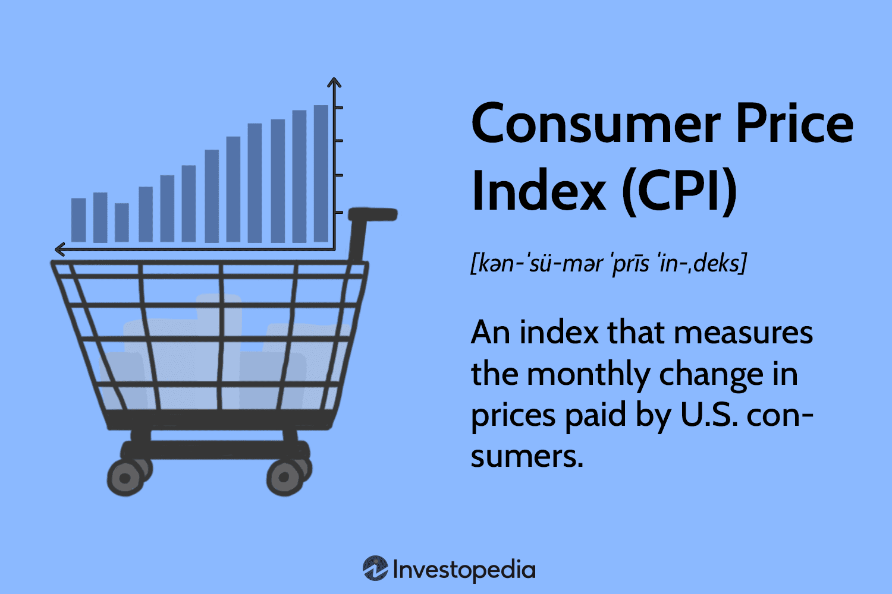

In the rapidly changing economic landscape, businesses seek ways to mitigate risks associated with long-term contracts. Escalation clauses in contracts serve as critical tools, often employing the Consumer Price Index (CPI) as a reliable measure. CPI, calculated by the Bureau of Labor Statistics, tracks changes in the price level of a market basket of consumer goods and services purchased by households. As an inflation indicator, it allows businesses to adjust prices or wages accordingly, maintaining the real value of these figures over time. 

Additionally, CPI plays an essential role in automated trading strategies. Algorithmic trading systems, designed to respond rapidly to market changes, incorporate economic indicators like CPI to forecast trends and execute trades efficiently. This integration allows for adaptive strategies that can better handle market volatility.



This article explores the application of CPI in market escalation contracts and highlights the potential of algorithmic trading in this context. By leveraging CPI data, businesses and traders can implement strategic price adjustments and optimize long-term financial agreements. Understanding the integration and implications of CPI in modern financial systems is crucial for enhancing financial stability and seizing opportunities in a dynamic economic environment.

## Table of Contents

## Understanding the Consumer Price Index (CPI)

The Consumer Price Index (CPI) is a key financial metric that measures the average change over time in the prices paid by urban consumers for a variety of goods and services. This includes essential consumer expenditures such as food, clothing, housing, and transportation. The calculation of the CPI is overseen by the Bureau of Labor Statistics (BLS), which publishes monthly updates that are pivotal to numerous financial and economic decision-making processes.

The BLS employs a methodical approach to compute the CPI, aggregating price data across several categories to produce an index that reflects consumer purchasing power. CPI plays a significant role in financial areas, notably influencing the adjustment of Social Security benefits. As inflation rates fluctuate, the CPI provides a benchmark for increasing these benefits, ensuring they correlate with the actual increase in living costs.

CPI variations occur in the form of specific indices, such as the Consumer Price Index for All Urban Consumers (CPI-U). This variation caters to the price experience of about 93% of the U.S. population, allowing for applications tailored across different regions and economic demographics. The differentiation helps in accommodating regional price variations and ensures that contract terms can be appropriately adjusted on a micro and macroeconomic scale.

Being a widely recognized economic indicator, the CPI is vital for the execution of price adjustments in long-term contracts. Its incorporation helps businesses and stakeholders protect against inflationary pressures, facilitating stable financial planning. Furthermore, by understanding the implications and calculations of the CPI, businesses can make informed decisions about pricing strategies, compensation structures, and strategic planning.

Knowing how the CPI operates and influences the broader economic landscape is essential for anyone engaged in financial management, offering a foundation for better decision-making and strategic planning. By integrating CPI data, businesses and policymakers can develop more responsive economic strategies and manage inflation-related risks more effectively.

## Adding Yearly Increase Clauses with CPI

Escalation clauses in contracts are crucial mechanisms that help adjust prices in response to inflation, utilizing the Consumer Price Index (CPI) as a defining metric. These clauses allow both sellers and buyers to lock in initial prices while maintaining flexibility for periodic strategic adjustments, safeguarding against inflationary pressures that could erode the contract's value over time. 

In practice, these clauses find applications across multiple sectors. For instance, rental agreements often include escalation clauses to adjust rent in line with the CPI, ensuring that property owners retain purchasing power while tenants anticipate predictable increases. Similarly, labor contracts may use these clauses to align wages with rising consumer prices, reflecting cost-of-living adjustments. Government benefit programs also rely on CPI-driven clauses to modify payment levels, keeping benefits aligned with current economic circumstances.

CPI adjustments in contracts offer balanced solutions that facilitate sustainable long-term agreements and fiscal planning. This alignment ensures that both parties can adapt to economic changes without frequent renegotiation, providing a stable footing for long-term commitments. For instance, suppose a contract specifies an annual adjustment based on CPI changes. In that case, the formula for adjustment might be given by:

$$
\text{New Price} = \text{Original Price} \times \left(1 + \frac{\text{CPI change}}{100}\right)
$$

This calculation means that if the CPI increases by 3%, the new price would be 3% higher than the original price.

To achieve clarity and avoid disputes, contracts must explicitly detail how the CPI will be applied. This includes specifying which version of the CPI will be used, the timing of adjustments, and the methodology for calculating changes. Such precision ensures that all parties have a shared understanding of how adjustments will be handled, minimizing potential conflicts and ensuring smooth contract execution. This attention to detail is paramount to leverage the full benefits of CPI-based escalation clauses in financial agreements.

## Algorithmic Trading and CPI-Based Contracts

Algorithmic trading utilizes advanced, pre-programmed strategies to execute transactions in financial markets with precision and speed. In this context, the Consumer Price Index (CPI) assumes a crucial role as it provides traders with vital data to assess market trends and inflationary impacts. By incorporating CPI data into algorithmic models, traders can predict future market movements and adjust their strategies accordingly, enabling transactions to be both timely and cost-effective.

CPI is a significant component of market analytics, aiding in the development of forecasting and hedging strategies within automated trading systems. These systems rely on algorithms that continually analyze CPI data to identify patterns and anomalies in market trends, allowing for proactive decision-making. Traders leverage these insights to hedge against inflation risks and optimize their investment portfolios by anticipating changes driven by CPI variations.

The integration of CPI into [algorithmic trading](/wiki/algorithmic-trading) systems significantly enhances the efficiency of managing escalation contracts, particularly within commodities and securities markets. For example, in commodity trading, algorithms may adjust bidding strategies automatically in response to CPI-driven inflation expectations, maintaining competitiveness and protecting profit margins. Similarly, in securities markets, algorithms that incorporate CPI data can better manage [interest rate](/wiki/interest-rate-trading-strategies) risks by adjusting investment allocations based on expected inflationary pressures.

Algorithmic trading represents an advanced method in managing CPI-based contracts, where the real-time analysis of economic indices such as the CPI can lead to optimized contract outcomes. By automating the interpretation and application of CPI data, traders can rapidly respond to economic changes, reducing latency and exploiting market opportunities with precision unmatched by manual trading methods.

Python, for example, is often used to script these algorithms. A basic framework might involve importing historical CPI data and using libraries such as NumPy or pandas for data manipulation and analysis:

```python
import pandas as pd
import numpy as np

# Load historical CPI data
cpi_data = pd.read_csv('cpi_data.csv')

# Calculate the rolling mean to identify trends
cpi_data['trend'] = cpi_data['CPI'].rolling(window=12).mean()

# Example strategy: Buy if CPI trend is increasing, sell otherwise
def trading_strategy(cpi_trend):
    if cpi_trend[-1] > cpi_trend[-2]:
        return "Buy"
    else:
        return "Sell"

decision = trading_strategy(cpi_data['trend'])
print(f"Trading decision: {decision}")
```

This simple demonstration highlights how CPI data can inform trading decisions, showcasing the potential of algorithmic trading to utilize economic indices for strategic advantage. With continuous advancements in technology, such integration promises to expand further, providing enhanced tools for managing financial risks and optimizing contract management.

## Considerations and Challenges

Accurate implementation of the Consumer Price Index (CPI) in contracts is crucial for minimizing financial uncertainties, but it involves several considerations and challenges. Primarily, clear definitions and a thorough understanding of regional variations are essential. The Consumer Price Index for All Urban Consumers (CPI-U) frequently varies between regions, reflecting local economic climates. Failing to account for these differences might lead to inappropriate adjustments, potentially affecting financial outcomes and fairness in contracts.

The timing and frequency of CPI-based adjustments must be meticulously aligned with contract terms and the release schedules of CPI data. The Bureau of Labor Statistics (BLS) typically updates CPI figures monthly, which means contracts must be clear on whether adjustments occur quarterly, annually, or follow another schedule. Misalignment here could lead to disputes and contractual breaches.

Algorithmic models that rely on CPI data face their own set of challenges. These models require continuous refinement to remain accurate amid economic shifts and CPI data variations. Algorithms must anticipate not only inflation rates but also the broader economic context that might affect pricing. For instance, a sudden economic event affecting the CPI data could render an algorithm’s predictions inaccurate if not well-calibrated. Algorithm robustness, therefore, becomes imperative for maintaining contract integrity and financial performance.

Additionally, potential challenges include data access limitations and algorithmic failures. Access to real-time, accurate CPI data is essential for timely adjustments and decision-making. Any limitations here could impede effective implementation. Moreover, algorithmic failures, whether due to coding errors or unanticipated market conditions, could lead to significant financial consequences. Developing and maintaining a robust risk management framework is crucial to mitigating these challenges. This framework should include regular audits, failure simulations, and contingency plans.

Precise legal language in contracts concerning CPI use is necessary to avoid disputes and miscalculations. Given the complexities of CPI application, legal teams must ensure that all terms are unambiguous and thoroughly explained. Consistent data analysis, conducted by financial analysts and legal experts, helps ensure that CPI adjustments are made accurately, preventing potential disputes. This involves regularly reviewing both the contract terms and the CPI data to confirm that all stipulations are being met correctly.

In summary, the effective application of CPI in contracts hinges on comprehensive understanding, precise language, and robust systems for managing data and algorithmic processes. By addressing these challenges, businesses can leverage the full potential of CPI for stable and responsive financial management.

## Conclusion

CPI is a critical component in formulating responsive escalation clauses for long-term contracts, offering both parties a mechanism to account for inflationary pressures over time. The integration of CPI with algorithmic trading represents a significant evolution in financial risk management strategies. By embedding CPI data within algorithmic systems, traders and businesses are able to respond to market changes with greater precision and agility. Such strategic application of CPI enhances financial stability and growth potential, as it allows for dynamic contract management and forecasting capabilities in volatile markets.

As algorithmic trading technologies continue to advance, there lies a potential for even deeper integration with economic indicators like CPI. This evolution presents new opportunities for businesses to refine their financial models and strategies, ensuring they remain adaptable to economic fluctuations. By staying current with these developments, companies are better positioned to navigate the complexities of the modern financial landscape, leveraging CPI not only as a tool for contract escalation but also as an instrument for broader financial planning and strategy. 

The intersection of CPI and algorithmic trading thus signals a transformative approach to managing financial environments, providing businesses with sophisticated tools to mitigate risks and capitalize on growth opportunities in an ever-changing economic climate.

## References & Further Reading

[1]: Bureau of Labor Statistics. ["Consumer Price Index."](https://www.bls.gov/cpi/) U.S. Department of Labor.

[2]: Chan, E. P. (2013). ["Algorithmic Trading: Winning Strategies and Their Rationale."](https://github.com/ftvision/quant_trading_echan_book) Wiley.

[3]: López de Prado, M. (2018). ["Advances in Financial Machine Learning."](https://www.amazon.com/Advances-Financial-Machine-Learning-Marcos/dp/1119482089) Wiley.

[4]: Jansen, S. (2020). ["Machine Learning for Algorithmic Trading."](https://github.com/stefan-jansen/machine-learning-for-trading) Packt Publishing.

[5]: Bureau of Economic Analysis. ["Price Indexes."](https://www.bea.gov/data/personal-consumption-expenditures-price-index) U.S. Department of Commerce.