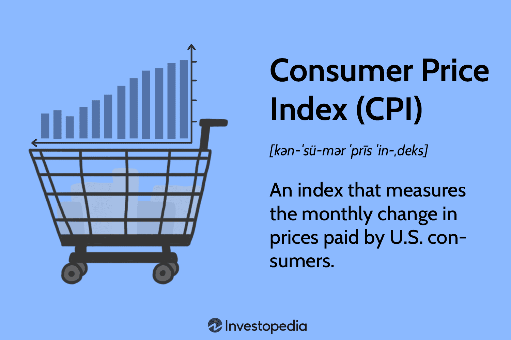

## Table of Contents

## What is the Consumer Price Index (CPI)?

The Consumer Price Index, or CPI, is a measure that shows how the prices of goods and services bought by households change over time. It is like a big shopping list that tracks the cost of things people commonly buy, such as food, clothing, housing, and transportation. By comparing the prices of these items from one period to another, the CPI helps us understand if things are getting more expensive or cheaper.

The CPI is important because it is used to figure out the rate of inflation, which is how fast prices are rising. Governments and businesses use this information to make decisions about economic policies and wages. For example, if the CPI shows that prices are going up a lot, the government might take steps to control inflation. For everyday people, the CPI can help them understand if their money will buy as much in the future as it does now.

## How is the CPI calculated?

The CPI is calculated by first choosing a basket of goods and services that a typical household buys. This basket includes things like food, clothes, rent, and gas. The prices of these items are collected from many places across the country, like stores and service providers. Once the prices are gathered, they are compared to the prices of the same items from a base year, which is a specific year chosen as a reference point.

Next, the price changes are averaged to find out how much the overall cost of the basket has changed. This average is then used to calculate the CPI. If the CPI is higher than it was in the base year, it means prices have gone up, which is called inflation. If it's lower, it means prices have gone down, which is called deflation. The CPI is usually reported as a percentage change from the base year, helping people understand how much prices have changed over time.

## Why is the CPI used as a measure of inflation?

The CPI is used as a measure of inflation because it tracks the average change over time in the prices paid by urban consumers for a market basket of consumer goods and services. This basket includes things like food, clothing, housing, and transportation. By comparing the cost of this basket from one period to another, the CPI gives us a clear picture of whether prices are going up or down. When prices go up, it's called inflation, and when they go down, it's called deflation.

Governments, businesses, and everyday people find the CPI useful because it helps them understand the economy. For example, if the CPI shows that prices are rising quickly, the government might take steps to control inflation, like adjusting interest rates. Businesses use the CPI to decide on price changes for their products or to negotiate wages with employees. For regular people, the CPI helps them see if their money will buy as much in the future as it does now, which can influence their spending and saving decisions.

## What are the different types of CPI?

There are a few different types of CPI that help us understand price changes in different ways. The most common type is the CPI for All Urban Consumers, often called CPI-U. This measures price changes for people living in cities and towns, which is most of the population. It includes a wide range of goods and services that these people typically buy. Another type is the CPI for Urban Wage Earners and Clerical Workers, or CPI-W. This focuses on a specific group of people who work in certain jobs and might have different spending habits than the general urban population.

There's also a type called Chained CPI, which is a bit different. Instead of using a fixed basket of goods and services, Chained CPI adjusts the basket over time. It assumes that if the price of something goes up, people might buy less of it and more of something else that's cheaper. This method can give a more accurate picture of how inflation affects people's spending because it takes into account how they change their buying habits. Each type of CPI can be useful depending on what information you need, whether it's for setting policies, adjusting wages, or understanding economic trends.

## How often is the CPI reported?

The CPI is reported every month. This means that once a month, new numbers come out that tell us how prices have changed compared to the month before and compared to the same month last year.

These monthly reports are important because they help people understand if prices are going up or down quickly or slowly. Governments and businesses use this information to make decisions, and regular people can use it to plan their spending and saving.

## What are the main components of the CPI basket?

The CPI basket includes many things that people buy every day. It has food and drinks, like bread, milk, and coffee. It also has clothes and shoes, like jeans and sneakers. Housing costs are a big part of the basket too, including rent, home maintenance, and utilities like electricity and water. Transportation is another important part, covering things like gas, public transit fares, and car maintenance.

There are also other things in the basket that people use often. These include medical care, like doctor visits and medicine. Entertainment and recreation are in there too, like movie tickets and sports equipment. Education and communication costs, like school fees and phone bills, are also part of the basket. Finally, the basket includes personal care items, like shampoo and toothpaste, and other services, like haircuts and dry cleaning. All these things together help show how prices are changing for what people buy every day.

## How does CPI affect the average consumer?

The CPI affects the average consumer by showing them if things they buy every day are getting more expensive or cheaper. When the CPI goes up, it means prices are going up, which is called inflation. This can make it harder for people to afford the same things they used to buy because their money doesn't go as far. If the CPI shows a lot of inflation, people might have to spend more on things like food, gas, and rent, which can leave them with less money for other things they want or need.

On the other hand, if the CPI goes down, it means prices are going down, which is called deflation. This can be good because people's money can buy more, but it can also mean that businesses might not do well if they can't sell their products for as much. The CPI also helps with things like getting raises at work. Sometimes, wages go up based on the CPI to make sure people can still afford things even if prices go up. So, the CPI is important for understanding how much money people need to live comfortably and plan for the future.

## What are the limitations of using CPI as an inflation measure?

One limitation of using CPI as an inflation measure is that it might not reflect everyone's experience. The CPI basket is based on what a typical urban consumer buys, but not everyone buys the same things. For example, if you live in a rural area or have different spending habits, the CPI might not show how prices are changing for you. Also, the CPI doesn't always keep up with new products and services. If something new becomes popular, it might take a while before it's included in the CPI basket, which can make the CPI less accurate.

Another issue is that the CPI can be affected by how it's calculated. For instance, the CPI uses a fixed basket of goods and services, but people might change what they buy if prices change. If the price of beef goes up, people might buy more chicken instead, but the CPI might not reflect this switch right away. This can make the CPI overestimate inflation. On the other hand, the Chained CPI tries to fix this problem by adjusting the basket over time, but it's still not perfect and can be more complicated to calculate.

## How does CPI differ from other inflation measures like the GDP deflator?

The CPI and the GDP deflator are both used to measure inflation, but they do it in different ways. The CPI looks at the prices of a fixed basket of goods and services that a typical urban consumer buys. It compares these prices to a base year to see how much prices have changed. On the other hand, the GDP deflator measures the prices of all goods and services produced in the economy. It doesn't use a fixed basket but changes every year to reflect what is actually being produced and bought. This means the GDP deflator can show price changes for new products and services more quickly than the CPI.

Another key difference is what they cover. The CPI focuses on what consumers buy, so it includes things like food, rent, and clothes. The GDP deflator, however, covers everything produced in the economy, including things that businesses buy and the government spends money on. This broader coverage can make the GDP deflator a better measure of overall inflation in the economy, while the CPI is more useful for understanding how inflation affects everyday people. Both measures have their strengths and are used for different purposes, depending on what information is needed.

## What role does CPI play in monetary policy?

The CPI is very important for monetary policy, which is how the government and central banks manage the money supply and interest rates. When the CPI shows that prices are going up a lot, it means there's inflation. The central bank might decide to raise interest rates to make borrowing money more expensive. This can slow down spending and help control inflation. On the other hand, if the CPI shows that prices aren't going up much or are even going down, the central bank might lower interest rates to encourage people to borrow and spend more, which can help the economy grow.

The CPI also helps the central bank set goals for inflation. Many central banks have a target for how much they want prices to go up each year, like 2%. They use the CPI to see if they're meeting this target. If the CPI is higher than the target, the central bank might take steps to bring it down. If it's lower, they might do things to get it closer to the target. By watching the CPI, the central bank can make decisions that help keep the economy stable and growing.

## How can CPI data be used to forecast future inflation?

CPI data is really useful for guessing what inflation might do in the future. When we look at how the CPI has changed over time, we can see patterns and trends. If the CPI has been going up steadily, it might mean that prices will keep going up. Economists and experts use this information to make predictions. They look at things like how fast the CPI is growing and what's happening in the economy to guess if inflation will be high or low in the future.

Sometimes, other things can affect what the CPI tells us about future inflation. For example, if there's a sudden big change in the price of something important like oil, it can make the CPI jump up or down. Experts need to think about these special events and see if they'll keep affecting prices or if things will go back to normal. By putting all this information together, they can make better guesses about where inflation is headed and help people and businesses plan for what might happen.

## What are some international variations in CPI calculation and usage?

Different countries have their own ways of calculating and using the CPI. In the United States, the CPI is calculated by the Bureau of Labor Statistics and focuses on urban consumers. It includes a wide range of goods and services, like food, housing, and transportation. Other countries might use different baskets of goods or focus on different groups of people. For example, in the United Kingdom, the CPI includes things like council tax, which is a big part of household spending there but isn't in the U.S. CPI. Each country adjusts the CPI to fit what its people buy and how they live.

The way countries use the CPI can also be different. In the U.S., the CPI is used to adjust Social Security payments and other benefits to keep up with inflation. It's also important for setting monetary policy, like deciding on interest rates. In the European Union, the Harmonized Index of Consumer Prices (HICP) is used to compare inflation across different countries. This helps the European Central Bank make decisions that affect all the countries in the EU. So, while the CPI is a common tool for measuring inflation, how it's calculated and used can vary a lot from one place to another.

## What is the Consumer Price Index (CPI) and how is it understood?

The Consumer Price Index (CPI) is a pivotal economic measure that calculates the average change in prices over time that consumers pay for a basket comprising various goods and services. This basket typically includes expenditures on items that consumers routinely purchase, such as housing, apparel, food, transportation, medical care, and education. By tracking price changes, the CPI serves as an indicator of inflation, allowing analysts to assess shifts in purchasing power and living costs. 

The formula to calculate the CPI is:

$$

\text{CPI} = \frac{\sum (P_t \times Q_0)}{\sum (P_0 \times Q_0)} \times 100 
$$

where $P_t$ represents the current price, $P_0$ is the initial price, and $Q_0$ denotes the base period quantity. 

This index plays a critical role in shaping economic policy. Central banks, such as the Federal Reserve in the United States, heavily rely on CPI data when making decisions on interest rates and other forms of monetary policy. A rise in CPI typically signals higher inflation, potentially prompting central banks to increase interest rates to curb spending and stabilize the economy. Conversely, a lower or declining CPI could lead to reductions in interest rates to spur economic activity.

Beyond economic policy, the CPI significantly influences financial markets. As an indicator of inflation, fluctuations in CPI can affect asset prices, triggering adjustments in stock and bond markets. Investors closely monitor CPI reports to guide their investment strategies, as changes can lead to shifts in market sentiment. For instance, an unexpected rise in CPI might trigger concerns about inflation, causing bond yields to rise and stock prices to fall.

The CPI is subdivided into various categories to offer detailed insights into specific segments within the economy. These subcategories reflect price changes in areas like housing, apparel, and medical care, each providing nuanced views of consumer price variability. Such granularity aids economists and policymakers in identifying which sectors are experiencing inflationary pressures, enabling more targeted interventions. 

In summary, the Consumer Price Index is an indispensable tool for measuring inflation and informing economic decisions. Its role in economic policy and financial markets underscores the importance of accurately interpreting CPI data to understand its broader impact on the economy.

## What is Algorithmic Trading and What Are Its Applications?

Algorithmic trading employs sophisticated computer algorithms to execute trades following predefined strategies, providing traders with the advantages of speed, precision, and emotion-free execution. This technologically driven approach enables simultaneous processing of vast amounts of market data and execution of trades at a speed unattainable by human traders.

Common strategies used in [algorithmic trading](/wiki/algorithmic-trading) include [trend following](/wiki/trend-following), statistical [arbitrage](/wiki/arbitrage), and pairs trading. Trend following involves identifying and capitalizing on market trends by analyzing historical price data through technical indicators such as moving averages. A simple moving average crossover strategy, for example, triggers buy or sell decisions based on the crossover of short-term and long-term moving averages, which can be calculated using:

$$
\text{SMA} = \frac{\sum_{i=1}^{n} \text{Price}_i}{n}
$$

Statistical arbitrage exploits pricing inefficiencies between securities that are statistically correlated. By statistically modeling the price relationship between two or more assets, traders can generate profits from temporary mispricing. This involves employing mathematical and statistical techniques to predict deviations from expected price distributions.

Pairs trading, a specific type of [statistical arbitrage](/wiki/statistical-arbitrage), identifies two historically correlated stocks expected to maintain their equilibrium relationship. When they diverge, the strategy involves shorting the overperforming stock while going long on the underperforming one, anticipating a return to their mean spread.

Integrating economic indicators like the Consumer Price Index (CPI) data into these strategies can significantly enhance their accuracy and profitability. The CPI, an indicator of inflationary trends, affects market expectations and investor sentiment, thus influencing asset prices. By incorporating CPI data, algorithmic trading systems can adjust positions in anticipation of market movements triggered by changes in inflation metrics.

Algorithmic trading systems using CPI data might adjust portfolio allocations during periods of reported inflation changes. For instance, an unexpected rise in CPI could influence a trading algorithm to shift investments towards asset classes perceived as inflation hedges, such as commodities or specific equities.

Ultimately, algorithmic trading benefits from the systematic and efficient processing of data, allowing for dynamic integration of CPI and other economic indicators into the decision-making process. This integration enables strategies that not only react to market conditions but also anticipate potential shifts, providing traders with a significant edge in financial markets.

## References & Further Reading

[1]: ["Consumer Price Index (CPI) Data"](https://www.bls.gov/cpi/) - U.S. Bureau of Labor Statistics

[2]: ["Federal Reserve Economic Data (FRED)"](https://fred.stlouisfed.org/) - Federal Reserve Bank of St. Louis

[3]: Chan, E. P. (2008). ["Algorithmic Trading: Winning Strategies and Their Rationale"](https://github.com/ftvision/quant_trading_echan_book). Wiley.

[4]: Solow, R. M., & Taylor, J. B. (1998). ["Inflation, Unemployment, and Monetary Policy"](https://books.google.com/books/about/Inflation_Unemployment_and_Monetary_Poli.html?id=uk0ljwvtoBwC). MIT Press.

[5]: ["Backtrader - Python Backtesting Library"](https://github.com/mementum/backtrader)

[6]: Jansen, S. (2018). ["Machine Learning for Algorithmic Trading](https://github.com/stefan-jansen/machine-learning-for-trading). Packt Publishing.

[7]: Chan, E. P. (2009). ["Quantitative Trading: How to Build Your Own Algorithmic Trading Business"](https://github.com/ftvision/quant_trading_echan_book). Wiley.