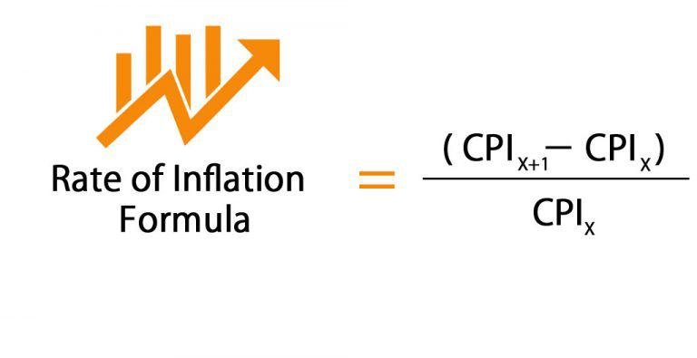

The Consumer Price Index (CPI) is a vital economic indicator used to measure inflation. It does this by tracking price changes across a basket of goods and services typically purchased by urban consumers. The CPI reflects shifts in the costs of living and purchasing power, making it a fundamental component in assessing economic conditions. Understanding the CPI is crucial for investors and traders because this indicator significantly influences monetary policy decisions by central banks, which in turn affect financial markets.

Algorithmic trading, often referred to as algo trading, utilizes computer algorithms to execute trades at speeds and efficiencies impossible for human traders. These algorithms rely on various data inputs, including the CPI, to optimize trading strategies. By integrating CPI data, algorithmic systems can enhance decision-making processes, aligning trading strategies with predicted inflation trends and subsequent market adjustments.



This article explores the intricate relationship between CPI data, its role in measuring inflation, and the application of algorithmic trading strategies. By dissecting this interplay, traders and investors can improve their market engagement, anticipate economic shifts, and refine their trading decisions for more precise and profitable outcomes.

## Table of Contents

## Understanding the Consumer Price Index (CPI)

The Consumer Price Index (CPI) is a pivotal economic measure that calculates the average change in prices over time that consumers pay for a basket comprising various goods and services. This basket typically includes expenditures on items that consumers routinely purchase, such as housing, apparel, food, transportation, medical care, and education. By tracking price changes, the CPI serves as an indicator of inflation, allowing analysts to assess shifts in purchasing power and living costs. 

The formula to calculate the CPI is:

$$

\text{CPI} = \frac{\sum (P_t \times Q_0)}{\sum (P_0 \times Q_0)} \times 100 
$$

where $P_t$ represents the current price, $P_0$ is the initial price, and $Q_0$ denotes the base period quantity. 

This index plays a critical role in shaping economic policy. Central banks, such as the Federal Reserve in the United States, heavily rely on CPI data when making decisions on interest rates and other forms of monetary policy. A rise in CPI typically signals higher inflation, potentially prompting central banks to increase interest rates to curb spending and stabilize the economy. Conversely, a lower or declining CPI could lead to reductions in interest rates to spur economic activity.

Beyond economic policy, the CPI significantly influences financial markets. As an indicator of inflation, fluctuations in CPI can affect asset prices, triggering adjustments in stock and bond markets. Investors closely monitor CPI reports to guide their investment strategies, as changes can lead to shifts in market sentiment. For instance, an unexpected rise in CPI might trigger concerns about inflation, causing bond yields to rise and stock prices to fall.

The CPI is subdivided into various categories to offer detailed insights into specific segments within the economy. These subcategories reflect price changes in areas like housing, apparel, and medical care, each providing nuanced views of consumer price variability. Such granularity aids economists and policymakers in identifying which sectors are experiencing inflationary pressures, enabling more targeted interventions. 

In summary, the Consumer Price Index is an indispensable tool for measuring inflation and informing economic decisions. Its role in economic policy and financial markets underscores the importance of accurately interpreting CPI data to understand its broader impact on the economy.

## Algorithmic Trading and Its Applications

Algorithmic trading employs sophisticated computer algorithms to execute trades following predefined strategies, providing traders with the advantages of speed, precision, and emotion-free execution. This technologically driven approach enables simultaneous processing of vast amounts of market data and execution of trades at a speed unattainable by human traders.

Common strategies used in [algorithmic trading](/wiki/algorithmic-trading) include [trend following](/wiki/trend-following), statistical [arbitrage](/wiki/arbitrage), and pairs trading. Trend following involves identifying and capitalizing on market trends by analyzing historical price data through technical indicators such as moving averages. A simple moving average crossover strategy, for example, triggers buy or sell decisions based on the crossover of short-term and long-term moving averages, which can be calculated using:

$$
\text{SMA} = \frac{\sum_{i=1}^{n} \text{Price}_i}{n}
$$

Statistical arbitrage exploits pricing inefficiencies between securities that are statistically correlated. By statistically modeling the price relationship between two or more assets, traders can generate profits from temporary mispricing. This involves employing mathematical and statistical techniques to predict deviations from expected price distributions.

Pairs trading, a specific type of [statistical arbitrage](/wiki/statistical-arbitrage), identifies two historically correlated stocks expected to maintain their equilibrium relationship. When they diverge, the strategy involves shorting the overperforming stock while going long on the underperforming one, anticipating a return to their mean spread.

Integrating economic indicators like the Consumer Price Index (CPI) data into these strategies can significantly enhance their accuracy and profitability. The CPI, an indicator of inflationary trends, affects market expectations and investor sentiment, thus influencing asset prices. By incorporating CPI data, algorithmic trading systems can adjust positions in anticipation of market movements triggered by changes in inflation metrics.

Algorithmic trading systems using CPI data might adjust portfolio allocations during periods of reported inflation changes. For instance, an unexpected rise in CPI could influence a trading algorithm to shift investments towards asset classes perceived as inflation hedges, such as commodities or specific equities.

Ultimately, algorithmic trading benefits from the systematic and efficient processing of data, allowing for dynamic integration of CPI and other economic indicators into the decision-making process. This integration enables strategies that not only react to market conditions but also anticipate potential shifts, providing traders with a significant edge in financial markets.

## Incorporating CPI Data into Algo Trading Strategies

Incorporating Consumer Price Index (CPI) data into algorithmic trading strategies provides a nuanced approach to optimizing trading decisions by capturing inflation trends and anticipating monetary policy shifts. CPI is a key economic indicator influencing central bank policies. By understanding CPI dynamics, traders can develop strategies that preempt market movements or react swiftly to CPI-related market changes.

**Analyzing Historical CPI Data**

Analyzing historical CPI data is crucial for constructing robust algorithms that respond to market dynamics post-CPI announcements. This analysis can identify patterns and correlations between CPI releases and asset price movements. For instance, plotting historical CPI data against market indices can reveal trends and assist in building predictive models. Here's a simple example using Python to fetch and plot historical data:

```python
import pandas as pd
import matplotlib.pyplot as plt
from fredapi import Fred

fred = Fred(api_key='YOUR_API_KEY')
cpi_data = fred.get_series('CPIAUCSL')  # Consumer Price Index for All Urban Consumers
cpi_data.plot(title='Historical CPI Data')
plt.xlabel('Year')
plt.ylabel('CPI')

plt.show()
```

**Pre-release Positioning**

Traders can adopt pre-release positioning strategies by predicting market sentiment prior to CPI announcements. This involves utilizing econometric models to forecast potential CPI outcomes and position assets accordingly. These models may include multiple regression analysis, leveraging economic indicators that historically correlate with CPI changes.

**Immediate Post-announcement Execution**

Algorithmic trading systems can be programmed to execute trades immediately following CPI announcements. This approach capitalizes on the market's initial reaction to CPI data, often marked by [volatility](/wiki/volatility-trading-strategies) and rapid price adjustments. Algorithms employ if-statements to execute based on CPI deviations from consensus estimates:

```python
cpi_release = fetch_latest_cpi_release()  # Hypothetical function
expected_cpi = 1.8  # Hypothetical expected value

if cpi_release > expected_cpi:
    # Implement buy strategy
elif cpi_release < expected_cpi:
    # Implement sell strategy
```

**Ongoing Risk Management Based on CPI Surprises**

Risk management is essential, especially when CPI data significantly deviates from expectations, which can induce volatility. One method involves setting stop-loss and take-profit levels based on the magnitude of the CPI surprise and its expected market impact. Volatility models like GARCH (Generalized Autoregressive Conditional Heteroskedasticity) can assist in adjusting risk parameters dynamically.

By systematically incorporating CPI data into trading algorithms, market participants can enhance their strategies to better navigate the complexities of inflation-driven market environments.

## Backtesting and Refining CPI-Based Strategies

Backtesting is a crucial process in the development and validation of CPI-based algorithmic trading strategies. By analyzing historical data, traders can assess the viability and effectiveness of their strategies before deploying them in real-time markets. This practice allows for the identification of potential pitfalls and the optimization of strategy parameters to align with historical market patterns.

Python is a widely used programming language for [backtesting](/wiki/backtesting), due to its rich ecosystem of libraries and tools designed for financial analytics. One such tool is Backtrader, a flexible open-source platform that facilitates backtesting of trading strategies. With Backtrader, traders can import CPI data along with other financial indicators to simulate market conditions and calculate key performance metrics such as total returns, Sharpe ratio, and maximum drawdown.

For instance, traders can implement a basic moving average crossover strategy, which can be enhanced by integrating CPI data to adjust positions based on inflation trends:

```python
from backtrader import Cerebro, Strategy
from backtrader.feeds import PandasData
import pandas as pd

class CPIMovingAverageStrategy(Strategy):
    params = (('short_window', 40), ('long_window', 100))

    def __init__(self):
        self.cpi_inflation = self.datas[1].cpi
        self.short_mavg = self.datas[0].close.rolling(window=self.params.short_window).mean()
        self.long_mavg = self.datas[0].close.rolling(window=self.params.long_window).mean()

    def next(self):
        if self.short_mavg[0] > self.long_mavg[0] and self.cpi_inflation[0] < 0.02:
            self.buy()
        elif self.short_mavg[0] < self.long_mavg[0]:
            self.sell()

# Load historical data
cpi_data = pd.read_csv('cpi_data.csv', parse_dates=True, index_col='date')
market_data = pd.read_csv('market_data.csv', parse_dates=True, index_col='date')

cerebro = Cerebro()
cerebro.addstrategy(CPIMovingAverageStrategy)
cerebro.adddata(PandasData(dataname=market_data))
cerebro.adddata(PandasData(dataname=cpi_data, plot=False))
cerebro.run()
```

In this example, the strategy is designed to trigger buy signals when the short-term moving average crosses above the long-term moving average, with an additional condition based on CPI data—buying is only executed when the CPI inflation rate is below 2%, indicating a stable inflation environment.

Even a well-crafted strategy requires ongoing refinement. After initial backtesting, traders should analyze results comprehensively, focusing on periods of significant market movement or unexpected CPI changes. Adaptive strategies may adjust parameters dynamically, responding to evolving market conditions and unexpected CPI fluctuations.

To ensure strategies remain effective, traders must continually update them as new data becomes available, testing different scenarios and stress-testing against adverse market conditions. By maintaining a cycle of backtesting, evaluation, and refinement, traders can optimize the performance of CPI-influenced strategies, enhancing their robustness and profitability in live trading environments.

## Case Studies: CPI and Algo Trading Success Stories

Real-world case studies have demonstrated the effectiveness of Consumer Price Index (CPI)-based algorithmic trading strategies, notably in the forms of trend-following and mean reversion approaches. These methodologies utilize CPI data to predict and respond to shifts in the market, showcasing the potential for significantly enhanced returns.

Trend-following strategies, for instance, capitalize on the [momentum](/wiki/momentum) implied by recent CPI releases. When CPI data indicates accelerating inflation, traders might anticipate tightening monetary policies, leading to shifts in currency and bond markets. By constructing algorithms that track these trends, traders can automate their entry and [exit](/wiki/exit-strategy) points, aiming to capture significant portions of the movement until trends exhaust. A typical trend-following algorithm might involve calculating moving averages or employing other statistical measures to determine directional bias. Python libraries like pandas can be used to implement such strategies:

```python
import pandas as pd

# Sample code to calculate moving averages
def calculate_moving_averages(data, short_window=40, long_window=100):
    data['short_mavg'] = data['CPI'].rolling(window=short_window, min_periods=1, center=False).mean()
    data['long_mavg'] = data['CPI'].rolling(window=long_window, min_periods=1, center=False).mean()
    return data
```

Mean reversion strategies, on the other hand, operate on the principle that prices will revert to their historical averages after overreacting to CPI announcements. These strategies are particularly useful when market reactions to CPI data are severe but temporary. Traders develop algorithms that identify instances when prices deviate substantially from their means and execute trades to capitalize on the anticipated reversion.

The success of these strategies is not solely dependent on CPI data but also on refining the algorithms to account for market conditions, volatility, and correlations. Markets may react differently to CPI releases depending on other concurrent economic indicators like unemployment rates or central bank speeches. Therefore, algorithms need constant updating and testing against a backdrop of current market data. The use of [machine learning](/wiki/machine-learning) models can significantly aid in refining these strategies, allowing for complex pattern recognition beyond simple statistical measures:

```python
from sklearn.linear_model import LinearRegression

# Simple example of using regression for prediction
def predict_price_using_cpi(train_data, test_data):
    model = LinearRegression()
    model.fit(train_data[['CPI']], train_data['MarketPrice'])
    predictions = model.predict(test_data[['CPI']])
    return predictions
```

These case studies underline that successfully exploiting CPI data in algorithmic trading requires strategists to account for elements such as market volatility and correlations. Strategies must be adaptable to the fluid nature of economic indicators and market reactions, underscoring the importance of continuous development and testing to maintain their effectiveness in diverse market environments.

## Conclusion

The Consumer Price Index (CPI) stands as an indispensable tool for measuring inflation, offering a gauge of the average change in prices paid by consumers for goods and services over time. For algorithmic trading strategies, CPI data is not just a statistical measure but a critical input that informs decision-making processes. By integrating CPI data into trading algorithms, traders gain the ability to forecast market reactions more accurately. This anticipation is particularly valuable in financial markets, where inflation figures often dictate central bank monetary policies, impacting interest rates and, consequently, asset prices. Accurate prediction of these shifts can enhance the precision and timing of trading decisions, potentially leading to higher profitability.

To sustain the efficacy of CPI-based algorithmic trading strategies, continual updates and refinements are necessary. Financial markets are inherently dynamic, influenced by a myriad of factors including economic indicators beyond CPI. Thus, maintaining an up-to-date understanding of CPI influences requires regular data refreshes and strategy adjustments. Through backtesting and simulation, traders can validate and adapt their strategies, ensuring resilience and effectiveness amidst changing economic landscapes.

Moreover, leveraging computational power through programming languages such as Python enables the seamless integration of real-time CPI data into trading models. Using libraries like Pandas for data manipulation and Backtrader for backtesting assists in efficiently processing and analyzing CPI data to refine trading strategies. For instance, a Python script can automate the integration of new CPI releases into the trading decision framework, ensuring that strategies remain aligned with current economic conditions.

Ultimately, the inclusion of CPI in algorithmic trading is not merely about following trends but transforming data into actionable insights. As traders continue to refine their approaches, the synthesis of CPI data with robust algorithmic models will remain a cornerstone of successful market engagement.

## Further Resources and Reading

Several platforms provide comprehensive resources for CPI data, which are invaluable for both general economic analysis and algorithmic trading strategies focused on inflation indicators. Notable among these are the U.S. Bureau of Labor Statistics (BLS) and Federal Reserve Economic Data (FRED). The BLS offers detailed reports and datasets that cover various aspects of the Consumer Price Index, including historical data and methodology. Their resources are essential for understanding both the composition of the CPI and its implications for the economy. Similarly, FRED, maintained by the Federal Reserve Bank of St. Louis, provides accessible economic data which can be easily integrated into quantitative models.

For traders leveraging CPI data in algorithmic trading strategies, tools such as QuantConnect and TradingView are highly recommended. QuantConnect offers a comprehensive platform that supports the development and backtesting of trading algorithms, with integrated access to a wide array of financial data including CPI figures. It supports multiple programming languages, but Python is frequently used due to its versatility in handling data analysis. TradingView, on the other hand, provides powerful charting tools and a community-driven platform for sharing trading strategies and insights. It also supports custom script creation with its Pine Script language, allowing traders to build bespoke indicators and strategies.

For those interested in further reading, a wealth of literature is available that covers algorithmic trading, inflation measurement, and economic analysis. Books such as "Algorithmic Trading: Winning Strategies and Their Rationale" by Ernest P. Chan provide insights into developing and refining trading algorithms. Publications on the intricacies of inflation, such as "Inflation, Unemployment, and Monetary Policy" by Robert M. Solow and John B. Taylor, offer foundational knowledge valuable for any trader looking to comprehend the broader economic impacts of CPI data. Additionally, academic journals and articles often explore cutting-edge research and methodologies in economic modeling and statistical analysis, which can offer new perspectives and tools for integrating CPI data into algorithmic trading strategies.

## References & Further Reading

[1]: ["Consumer Price Index (CPI) Data"](https://www.bls.gov/cpi/) - U.S. Bureau of Labor Statistics

[2]: ["Federal Reserve Economic Data (FRED)"](https://fred.stlouisfed.org/) - Federal Reserve Bank of St. Louis

[3]: Chan, E. P. (2008). ["Algorithmic Trading: Winning Strategies and Their Rationale"](https://github.com/ftvision/quant_trading_echan_book). Wiley.

[4]: Solow, R. M., & Taylor, J. B. (1998). ["Inflation, Unemployment, and Monetary Policy"](https://books.google.com/books/about/Inflation_Unemployment_and_Monetary_Poli.html?id=uk0ljwvtoBwC). MIT Press.

[5]: ["Backtrader - Python Backtesting Library"](https://github.com/mementum/backtrader)

[6]: Jansen, S. (2018). ["Machine Learning for Algorithmic Trading](https://github.com/stefan-jansen/machine-learning-for-trading). Packt Publishing.

[7]: Chan, E. P. (2009). ["Quantitative Trading: How to Build Your Own Algorithmic Trading Business"](https://github.com/ftvision/quant_trading_echan_book). Wiley.