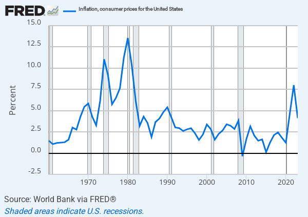

## Table of Contents

## What is the Consumer Price Index for Urban Consumers (CPI-U)?

The Consumer Price Index for Urban Consumers (CPI-U) is a measure that tracks the average change over time in the prices paid by urban consumers for a market basket of consumer goods and services. This index is important because it helps people understand how inflation affects the cost of living. The CPI-U covers about 93% of the U.S. population, focusing on urban areas, which includes cities and towns of all sizes.

The CPI-U is calculated by the U.S. Bureau of Labor Statistics. They collect data on prices for food, housing, transportation, medical care, entertainment, and other items that people buy regularly. By comparing these prices over time, the CPI-U shows whether the cost of living is going up or down. This information is used by the government to adjust Social Security payments and other benefits, and it also helps businesses and workers negotiate wages.

## How is the CPI-U calculated?

The CPI-U is calculated by looking at the prices of a big list of things that people in cities buy every day. This list includes stuff like food, clothes, rent, and even going to the movies. The U.S. Bureau of Labor Statistics, which is a government group, keeps track of these prices in different cities across the country. They check the prices every month to see if they have gone up or down.

To figure out the CPI-U, the Bureau takes the new prices and compares them to the prices from the year before. They use a special math formula to see how much the overall cost of these things has changed. If the prices have gone up, it means the CPI-U has gone up too, which tells us that things are getting more expensive. This number helps everyone understand if they need more money to keep up with the cost of living.

## What is the purpose of the CPI-U?

The CPI-U helps people understand how much more expensive things are getting over time. It looks at the prices of things like food, rent, and clothes that people in cities buy every day. By comparing these prices from one year to the next, the CPI-U shows if the cost of living is going up or down. This information is really useful because it helps everyone know if they need more money to keep up with their regular expenses.

The government uses the CPI-U to make important decisions. For example, they use it to adjust the amount of money people get from Social Security and other benefits. If the CPI-U goes up, the government might increase these payments so that people can still afford the things they need. Businesses and workers also use the CPI-U to talk about wages. If the cost of living is going up, workers might ask for higher pay to cover the increased costs.

## Who uses the CPI-U and for what purposes?

The CPI-U is used by the government to help make decisions about money. They look at the CPI-U to see if the cost of living is going up. If it is, they might increase the payments for things like Social Security and other benefits. This helps people keep up with their expenses even when prices go up. The government also uses the CPI-U to understand how inflation is affecting the economy and to plan their budget.

Businesses and workers also use the CPI-U. Companies look at the CPI-U to see if they need to change their prices or if they can afford to pay their workers more. If the CPI-U shows that the cost of living is going up, workers might ask for higher wages to cover their increased costs. This helps everyone understand if they need more money to buy the things they need every day.

Economists and researchers use the CPI-U to study the economy. They use it to learn about inflation and how it affects people's lives. By looking at the CPI-U, they can see trends over time and make predictions about the future. This helps them give advice to the government and businesses on how to manage the economy.

## How often is the CPI-U updated?

The CPI-U is updated every month. This means that the U.S. Bureau of Labor Statistics looks at the prices of things people buy in cities and calculates the CPI-U again each month. They do this to keep track of how much prices are changing over time.

By updating the CPI-U every month, the government and businesses can see if the cost of living is going up or down quickly. This helps them make decisions about things like Social Security payments and wages. It also helps economists and researchers understand the economy better and plan for the future.

## What types of goods and services are included in the CPI-U?

The CPI-U includes a wide range of things that people in cities buy every day. This includes food and drinks, both at home and when eating out. It also covers housing costs like rent, utilities, and even the cost of buying a home. Clothing and shoes are part of it too, as well as transportation costs like gas, public transit, and car maintenance. 

Medical care is another big part of the CPI-U, including doctor visits, medicines, and hospital stays. Entertainment is included as well, like going to the movies, buying toys, and other fun activities. Other services like haircuts, education, and even things like tobacco and alcohol are also tracked. By looking at all these different things, the CPI-U helps show how much the overall cost of living is changing.

## How does the CPI-U differ from other Consumer Price Indices?

The CPI-U is one of several Consumer Price Indices, and it focuses on urban consumers, which means it looks at the prices of things that people in cities buy. This is different from the CPI-W, which is the Consumer Price Index for Urban Wage Earners and Clerical Workers. The CPI-W only tracks the spending of people who work in certain jobs, like office workers and factory workers, while the CPI-U covers a much broader group of people in urban areas.

Another index is the Chained CPI, which uses a different way to calculate price changes. It takes into account that people might switch to cheaper products if prices go up, which can make the Chained CPI grow more slowly than the CPI-U. The CPI-U, on the other hand, assumes that people keep buying the same things even if prices change. Both indices are useful, but they give slightly different pictures of how inflation is affecting the cost of living.

Overall, the CPI-U is the most widely used index because it covers a large part of the population and gives a good overall view of price changes in urban areas. Other indices like the CPI-W and Chained CPI are more specific and might be used for different purposes, like adjusting wages for certain workers or planning government budgets more accurately.

## What are the geographical areas covered by the CPI-U?

The CPI-U covers prices in urban areas all over the United States. This includes big cities, small cities, and even towns. About 93% of the people in the U.S. live in these urban areas, so the CPI-U looks at the prices of things that most people buy every day.

The U.S. Bureau of Labor Statistics collects price data from 87 urban areas to calculate the CPI-U. These areas are spread out across the country, so the index gives a good picture of how prices are changing everywhere, not just in one place. This helps make sure the CPI-U is a fair and accurate measure of the cost of living for most Americans.

## How does the CPI-U account for changes in consumer behavior?

The CPI-U tries to keep up with how people change what they buy, but it does this in a simple way. Every few years, the people who make the CPI-U look at what people are spending their money on. They do this by asking people to keep track of what they buy for a while. If they see that people are buying different things, like more chicken instead of beef because it's cheaper, they will change the list of things they look at to match what people are actually buying.

Even though the CPI-U updates its list, it doesn't change it every month. So, if people start buying different things really quickly, the CPI-U might not show that right away. It takes a bit of time for the changes in what people buy to show up in the CPI-U. This means the CPI-U gives a good overall picture of how prices are changing, but it might not be perfect if people's buying habits are changing a lot.

## What are the limitations and criticisms of the CPI-U?

One big criticism of the CPI-U is that it might not show the true cost of living for everyone. The CPI-U looks at a big group of people in cities, but not everyone buys the same things or spends their money the same way. For example, older people might spend more on healthcare, while younger people might spend more on entertainment. Because the CPI-U tries to cover everyone, it might not be perfect for any one group. Also, the CPI-U doesn't change its list of things it looks at very often, so if people start buying different things quickly, the CPI-U might not show that right away.

Another limitation is how the CPI-U measures quality changes. When a product gets better or worse, the CPI-U might not always notice that right away. For example, if a new phone is much better than the old one but costs the same, the CPI-U might think the price hasn't changed, even though people are getting more for their money. This can make the CPI-U seem like it's not keeping up with real changes in what people are buying. Critics also say that the CPI-U might not be the best way to measure inflation because it doesn't always account for how people switch to cheaper products when prices go up.

## How does the CPI-U influence economic policy?

The CPI-U helps the government make important decisions about money. When the CPI-U goes up, it means things are getting more expensive, so the government might decide to give people more money from programs like Social Security. This helps people keep up with the higher costs of things they need every day. The government also uses the CPI-U to understand how inflation is affecting the economy. If the CPI-U shows that prices are going up a lot, the government might change its budget or make new rules to try to slow down inflation.

Businesses and workers also use the CPI-U to make decisions. If the CPI-U shows that the cost of living is going up, workers might ask for higher wages so they can still afford the things they need. Businesses look at the CPI-U to see if they need to change their prices or if they can afford to pay their workers more. Economists and researchers use the CPI-U to study the economy and give advice to the government and businesses. By looking at the CPI-U, they can see trends over time and make predictions about what might happen in the future.

## What advanced methodologies are used in the calculation and analysis of the CPI-U?

The CPI-U uses some smart ways to figure out how prices are changing. One way is called the "Laspeyres formula," which looks at the prices of things people bought in the past and compares them to the prices now. This helps the CPI-U show how much more expensive things are getting. The people who make the CPI-U also use something called "hedonic quality adjustment" to see if products are getting better or worse. For example, if a new phone has more features than the old one but costs the same, they adjust the price to show that people are getting more for their money.

Another way the CPI-U keeps up with changes is by using a method called "sampling." They don't check the prices of every single thing in every store, but they pick a smaller group of things and stores to look at. This makes it easier to collect all the information they need. They also use "weighting" to make sure the things people spend the most money on, like housing and food, have a bigger effect on the CPI-U than things people don't buy as much, like fancy jewelry. By using these methods, the CPI-U tries to give a fair and accurate picture of how prices are changing for most people in cities.

## References & Further Reading

[1]: Bergstra, J., Bardenet, R., Bengio, Y., & Kégl, B. (2011). ["Algorithms for Hyper-Parameter Optimization."](https://proceedings.neurips.cc/paper/2011/file/86e8f7ab32cfd12577bc2619bc635690-Paper.pdf) Advances in Neural Information Processing Systems 24.

[2]: ["Advances in Financial Machine Learning"](https://www.amazon.com/Advances-Financial-Machine-Learning-Marcos/dp/1119482089) by Marcos Lopez de Prado

[3]: Bureau of Labor Statistics. (2023). ["Consumer Price Index."](https://www.bls.gov/cpi/)

[4]: ["Evidence-Based Technical Analysis: Applying the Scientific Method and Statistical Inference to Trading Signals"](https://www.amazon.com/Evidence-Based-Technical-Analysis-Scientific-Statistical/dp/0470008741) by David Aronson

[5]: ["Machine Learning for Algorithmic Trading"](https://github.com/PacktPublishing/Machine-Learning-for-Algorithmic-Trading-Second-Edition) by Stefan Jansen

[6]: ["Quantitative Trading: How to Build Your Own Algorithmic Trading Business"](https://books.google.com/books/about/Quantitative_Trading.html?id=j70yEAAAQBAJ) by Ernest P. Chan

[7]: Bernanke, B. S. (2008). ["The Economic Outlook"](https://www.federalreserve.gov/newsevents/speech/bernanke20100827a.htm). Testimony before the Joint Economic Committee, U.S. Congress. 

[8]: Federal Reserve. (2023). ["Monetary Policy."](https://www.federalreserve.gov/monetarypolicy/2023-03-mpr-summary.htm) 

