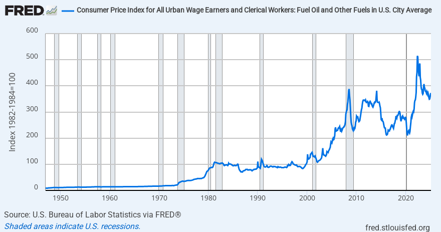

## Table of Contents

## What is the Consumer Price Index for Urban Wage Earners and Clerical Workers (CPI-W)?

The Consumer Price Index for Urban Wage Earners and Clerical Workers, often called CPI-W, is a measure that tracks the average change over time in the prices paid by urban workers for a basket of consumer goods and services. This basket includes things like food, housing, transportation, and medical care. The CPI-W focuses specifically on families where at least half of the income comes from jobs in clerical or wage-earning roles. It helps the government understand how inflation affects these workers.

The CPI-W is important because it is used to adjust Social Security benefits and other government programs. Each year, the cost-of-living adjustment (COLA) for Social Security is based on the CPI-W. This means that if the CPI-W goes up, Social Security payments might increase to help keep up with rising prices. The CPI-W is calculated and released monthly by the U.S. Bureau of Labor Statistics, making it a key tool for understanding and responding to economic changes.

## How is the CPI-W different from the general Consumer Price Index (CPI)?

The CPI-W and the general CPI, also known as CPI-U, measure changes in prices over time, but they focus on different groups of people. The CPI-W looks at the spending habits of urban workers who earn wages or work in clerical jobs. It only includes families where at least half of the income comes from these types of jobs. On the other hand, the CPI-U covers a broader group. It includes all urban consumers, which means it represents spending by everyone living in urban areas, not just workers.

Because they look at different groups of people, the CPI-W and CPI-U can give different results. For example, if the prices of items that wage earners and clerical workers buy a lot of go up more than other items, the CPI-W might show a higher rate of inflation than the CPI-U. The CPI-W is used specifically to adjust Social Security benefits each year, while the CPI-U is used for a wider range of economic policies and adjustments. This difference in focus makes the CPI-W more targeted but also means it might not represent the whole population as well as the CPI-U does.

## Who uses the CPI-W and for what purposes?

The CPI-W is mainly used by the U.S. government to adjust Social Security benefits each year. This is called the cost-of-living adjustment, or COLA. When prices go up, the CPI-W helps the government decide how much to increase Social Security payments so that people can still afford things. This is important because it helps older people and others who rely on Social Security to keep up with inflation.

Besides the government, some private companies and labor unions also use the CPI-W. They might use it to negotiate wages or adjust pension payments. By looking at the CPI-W, they can see how much prices have gone up and make sure their workers or retirees can still buy what they need. So, the CPI-W is a useful tool for making sure that payments keep up with the cost of living for certain groups of people.

## How is the CPI-W calculated?

The CPI-W is calculated by looking at the prices of a bunch of things that urban wage earners and clerical workers buy, like food, housing, and clothes. The U.S. Bureau of Labor Statistics picks a group of these items and tracks their prices every month in different cities. They compare these prices to the prices from the same time last year to see how much they've changed. This helps them figure out the average change in prices, which is the CPI-W.

To make sure the CPI-W is accurate, the Bureau of Labor Statistics also keeps an eye on what these workers are buying. Every few years, they do a big survey to see if people's shopping habits have changed. If they find that people are buying different things, they update the list of items they track. This way, the CPI-W stays up-to-date and gives a good picture of how prices are changing for these workers.

## What types of goods and services are included in the CPI-W basket?

The CPI-W basket includes many things that urban wage earners and clerical workers buy every day. This basket has food and drinks, like bread, milk, and coffee. It also includes housing costs, like rent or the cost of owning a home, and utilities like electricity and water. Clothing is another big part, covering things like shirts, pants, and shoes. Transportation costs, such as the price of gas, car maintenance, and public transit fares, are also in the basket.

There are also other important items in the CPI-W basket. Medical care costs, including doctor visits and medicines, are tracked. Education and communication expenses, like the cost of school supplies and phone bills, are included too. Recreation, which covers things like movie tickets and sports equipment, is another category. Finally, the basket looks at other goods and services, like haircuts, personal care items, and even funeral expenses. All these things together help show how prices are changing for these workers.

## How often is the CPI-W updated and published?

The CPI-W is updated and published every month. The U.S. Bureau of Labor Statistics collects all the price data and calculates the CPI-W to show how prices have changed from the month before and the same month in the previous year.

This monthly update helps people see how prices are changing over time. It's important because it's used to adjust things like Social Security benefits, so people who rely on those payments can keep up with rising costs.

## What are the main factors that influence changes in the CPI-W?

Changes in the CPI-W are influenced by a few main things. One big [factor](/wiki/factor-investing) is the cost of goods and services. If the price of things like food, gas, or rent goes up, the CPI-W will usually go up too. Another important factor is how people spend their money. If people start buying more of something that's getting more expensive, like cars, it can push the CPI-W up. On the other hand, if people buy less of something that's getting cheaper, it might not affect the CPI-W as much.

Seasonal changes can also play a role. For example, the price of heating oil might go up in the winter, which can affect the CPI-W. Government policies, like taxes or subsidies, can also change prices and influence the CPI-W. For instance, if the government decides to put a new tax on cigarettes, their price might go up, which could affect the CPI-W. All these factors together help explain why the CPI-W might go up or down from month to month.

## How does the CPI-W impact cost-of-living adjustments (COLAs) for Social Security benefits?

The CPI-W is very important for figuring out how much to increase Social Security benefits each year. This increase is called the cost-of-living adjustment, or COLA. Every year, the government looks at how much the CPI-W has gone up from the third quarter of the last year to the third quarter of this year. If the CPI-W has gone up, then Social Security benefits get a little bigger to help people keep up with higher prices. For example, if the CPI-W goes up by 2%, then Social Security payments might go up by 2% too.

This system helps make sure that people who get Social Security can still afford things even when prices go up. It's important because many older people and others who rely on Social Security need this money to live. If prices keep going up but their benefits stay the same, it would be hard for them to buy what they need. By using the CPI-W to adjust benefits, the government tries to make sure that Social Security keeps up with the cost of living.

## Can you explain the weighting of different categories in the CPI-W?

The CPI-W uses different weights for different categories of goods and services to show how much each one affects the overall index. These weights are based on how much urban wage earners and clerical workers spend on each category. For example, if these workers spend a lot of their money on housing, then housing will have a big weight in the CPI-W. The weights are updated every few years to make sure they still match what people are buying.

The main categories in the CPI-W and their weights can change a bit over time, but usually, housing has the biggest weight because it's a big part of people's spending. Food and beverages, transportation, and medical care are also important and have significant weights. Other categories like clothing, education, and recreation have smaller weights because people don't spend as much on those things compared to housing or food. By using these weights, the CPI-W gives a good picture of how price changes affect the overall cost of living for these workers.

## How does the CPI-W account for seasonal variations and quality changes in goods and services?

The CPI-W takes care of seasonal changes by using a method called seasonal adjustment. This means they look at the data in a way that takes out the normal ups and downs that happen every year, like higher heating costs in winter or more ice cream sales in summer. By doing this, they can see the real changes in prices, not just the ones that happen because of the time of year. This helps make the CPI-W a better tool for understanding how prices are changing over time, without the seasonal ups and downs getting in the way.

The CPI-W also deals with changes in the quality of goods and services. If a product gets better or worse, just looking at the price might not tell the whole story. So, the people who calculate the CPI-W use something called hedonic quality adjustment. This means they try to figure out how much of a price change is because the product got better or worse, and how much is just because of inflation. By doing this, they can make sure the CPI-W is measuring real price changes, not just changes in quality. This helps keep the CPI-W accurate and useful for understanding how prices are really changing for urban wage earners and clerical workers.

## What are the limitations and criticisms of the CPI-W as a measure of inflation?

The CPI-W has some limitations that can make it less accurate or useful. One big problem is that it only looks at urban wage earners and clerical workers. This means it might not show how inflation affects everyone else, like people who live in rural areas or those who don't work in these jobs. Another issue is that the CPI-W might not catch up quickly to changes in what people buy. If people start spending more on new things, like smartphones or streaming services, it can take a while for the CPI-W to include these in its calculations. Also, the way the CPI-W deals with quality changes in products can be tricky. If a product gets better but costs more, it's hard to tell if the price went up because of inflation or because the product is better.

People also criticize the CPI-W for not always being a good measure of inflation for everyone. For example, older people who get Social Security might spend their money differently than the workers the CPI-W focuses on. This means the CPI-W might not be the best way to adjust their benefits. Some also say the CPI-W can be slow to reflect new trends in spending, which can make it less useful for understanding how prices are changing in real-time. Despite these limitations, the CPI-W is still an important tool, but it's good to know its weaknesses when using it to make decisions about things like Social Security adjustments.

## How have historical trends in the CPI-W reflected broader economic changes?

The CPI-W has shown how prices have changed over time and often reflects bigger changes in the economy. For example, during times of high inflation in the 1970s and early 1980s, the CPI-W went up a lot. This showed that prices were rising quickly, and it was harder for people to buy things. When the economy got better and inflation went down in the late 1980s and 1990s, the CPI-W didn't go up as fast. This meant that prices were more stable, and people's money could buy more.

In more recent times, the CPI-W has also shown how big events can affect prices. For instance, during the 2008 financial crisis, the CPI-W showed that prices didn't go up as much because people were spending less. Then, when the economy started to recover, the CPI-W started to go up again. During the COVID-19 pandemic, the CPI-W went up a lot because of things like supply chain problems and higher demand for certain goods. This showed how the whole economy was changing and how it affected the prices that urban wage earners and clerical workers had to pay.

## References & Further Reading

[1]: Bergstra, J., Bardenet, R., Bengio, Y., & Kégl, B. (2011). ["Algorithms for Hyper-Parameter Optimization."](https://papers.nips.cc/paper/4443-algorithms-for-hyper-parameter-optimization) Advances in Neural Information Processing Systems 24.

[2]: ["Advances in Financial Machine Learning"](https://www.amazon.com/Advances-Financial-Machine-Learning-Marcos/dp/1119482089) by Marcos Lopez de Prado

[3]: ["Evidence-Based Technical Analysis: Applying the Scientific Method and Statistical Inference to Trading Signals"](https://www.amazon.com/Evidence-Based-Technical-Analysis-Scientific-Statistical/dp/0470008741) by David Aronson

[4]: ["Machine Learning for Algorithmic Trading"](https://github.com/stefan-jansen/machine-learning-for-trading) by Stefan Jansen

[5]: ["Quantitative Trading: How to Build Your Own Algorithmic Trading Business"](https://www.amazon.com/Quantitative-Trading-Build-Algorithmic-Business/dp/1119800064) by Ernest P. Chan