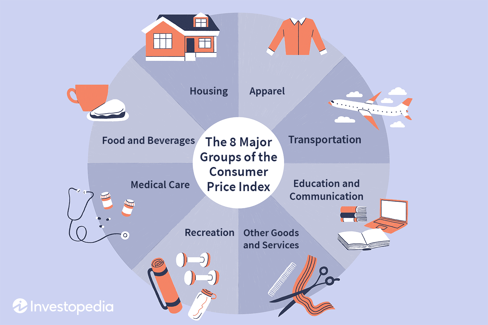

The intersection of economic indicators, price indexes, and inflation plays a critical role in understanding modern financial markets. These elements serve as the backbone for analyzing economic health and market dynamics. Economic indicators, such as GDP growth rates, employment statistics, and manufacturing output, provide essential insights into the current and future economic environment. Price indexes, including the Consumer Price Index (CPI) and Producer Price Index (PPI), measure the average change over time in the prices paid by consumers and producers, serving as crucial tools for assessing inflation levels.

Inflation, defined as the rate at which the general level of prices for goods and services rises, erodes purchasing power and affects economic behavior. It is a significant determinant of monetary policy, as central banks, like the Federal Reserve, often adjust interest rates to control inflationary pressures. These interest rate changes can, in turn, influence financial markets by affecting stock prices, bond yields, and foreign exchange rates. 



Algorithmic trading, commonly known as algo trading, has revolutionized the interpretation and utilization of these economic signals. By leveraging algorithms, traders can process vast amounts of economic data in real-time, enabling them to identify trading opportunities more efficiently and effectively than traditional methods. Algorithms can be programmed to analyze changes in economic indicators, price indexes, and inflation rates, adjusting trading strategies accordingly. For instance, an algorithm might buy or sell stocks based on projected changes in inflation that could affect corporate earnings.

The integration of these economic indicators into trading strategies underscores the increasingly quantitative and technologically advanced nature of financial markets. As this article will explore, understanding how price indexes and inflation inform algorithmic trading is vital for traders and institutions aiming to capitalize on market opportunities and mitigate risks.

## Table of Contents

## Understanding Economic Indicators

Economic indicators are essential tools for analyzing and understanding economic performance and predicting future economic activity. They yield critical statistics about various aspects of economic activities, encapsulating business cycles and broader macroeconomic trends. These indicators are organized into three principal categories: leading, coincident, and lagging indicators, each rendering unique insights into the dynamics of economic conditions.

Leading indicators are predictive in nature. They typically change before the economy as a whole does, offering anticipatory clues about future economic activity. Examples of leading indicators include stock market returns, building permits, and consumer sentiment. These indicators are crucial for forecasting and planning, providing early signals on where the economy might be heading.

Coincident indicators move in sync with the economy, reflecting the current state of economic activity as it unfolds. They provide real-time data on the health of the economy. Key examples of coincident indicators include Gross Domestic Product (GDP), industrial production, and employment levels. GDP measures the total economic output and is a broad indicator of economic health. Employment levels, another significant coincident indicator, provide insight into labor market conditions and consumer spending capacity.

Lagging indicators, as the name suggests, change after the overall economy has already started to follow a particular trend. They provide confirmation that a particular pattern in the economy has been established. Some common lagging indicators are unemployment rates and corporate profits. These are useful for validating historical economic patterns and trends, ensuring that strategies and policies are grounded in proven data.

Among these, key indicators such as GDP, employment levels, and the Consumer Price Index (CPI) play a significant role in both predicting and responding to market changes. GDP is a comprehensive scorecard of a country’s economic health, encompassing all private and public consumption, government outlays, investments, and exports net of imports. Employment levels, aside from offering immediate insight into economic vitality, also influence consumer spending, which can affect numerous industries and their market conditions.

The CPI, a prominent measure of inflation, tracks changes in the price level of a weighted average market basket of consumer goods and services. Fluctuations in the CPI reflect variations in the cost of living, which directly impact consumer purchasing power and economic stability. This indicator is critical for economic planning and policy-making, and it can greatly influence monetary policy decisions, such as [interest rate](/wiki/interest-rate-trading-strategies) adjustments by central banks.

In summation, economic indicators offer invaluable insights into economic activities and trends. Their effective analysis is a cornerstone of strategic decision-making in finance and economic policy, assisting in forecasting economic performance and aligning market strategies accordingly.

## Role of Price Indexes in Measuring Inflation

Price indexes are critical quantitative measures that serve as benchmarks for assessing inflation levels within an economy. Key among these are the Consumer Price Index (CPI) and the Producer Price Index (PPI), both of which play distinct roles in capturing price fluctuations across different sectors. These indexes not only help gauge inflation but also facilitate the assessment of shifts in purchasing power and the cost of living over time.

The Consumer Price Index (CPI) measures the average change in prices paid by consumers for goods and services. Compiled by tracking a "basket" of goods and services, CPI reflects the spending patterns of households and provides insights into changes in the consumer's cost of living. When CPI data indicates a rise, it suggests that consumers are experiencing higher costs, effectively reducing their purchasing power and leading to inflationary pressures.

In contrast, the Producer Price Index (PPI) measures the average change over time in the selling prices received by domestic producers for their output. This index provides insights into price changes from the perspective of the seller, capturing the early stages of inflation transmission in the economy. Changes in PPI can signal impending changes in CPI, as rising costs for producers often lead to higher prices for consumers, highlighting its role as a potential leading indicator.

In financial markets, fluctuations in these price indexes can significantly influence asset prices and currency values. For instance, a higher-than-expected increase in CPI might trigger expectations of tighter monetary policies as central banks aim to curb inflation, leading to adjustments in interest rates. Such scenarios can result in increased market [volatility](/wiki/volatility-trading-strategies), presenting both challenges and opportunities for algo traders who are adept at reacting swiftly to economic news.

Algorithmic trading systems are typically designed to process large volumes of data at high speeds, enabling them to react to changes in economic indicators like CPI and PPI almost instantaneously. By integrating real-time data feeds and employing predictive models, these systems can capitalize on the market movements that follow shifts in inflation measures. For example, if CPI data suggests rising inflation, an algorithm might predict a subsequent interest rate hike, prompting it to adjust its portfolio allocation accordingly to mitigate potential losses or maximize gains.

In summary, price indexes such as CPI and PPI are indispensable tools for measuring inflation, assessing economic conditions, and informing trading strategies. Their ability to reflect changes in the cost of living and producer prices provides valuable insights that can influence financial markets, offering both challenges and opportunities for algorithmic traders.

## Inflation's Impact on Financial Markets

Inflation significantly influences financial markets by impacting stock prices, bond yields, and foreign exchange rates, among other asset classes. When inflation rises, the purchasing power of money diminishes, leading to potential changes in economic behavior and investment strategies.

High inflation primarily affects fixed income returns by eroding their real value. Fixed income securities, such as bonds, offer predetermined interest payments. However, when inflation rates increase, the purchasing power of these payments declines, making them less attractive. This often results in higher bond yields as investors demand more compensation for the inflation risk, driving down bond prices according to the inverse relationship described by the formula:

$$
P = \dfrac{C}{(1 + r)^n}
$$

where $P$ is the bond price, $C$ is the cash flow, $r$ is the discount rate (which includes inflation expectations), and $n$ is the number of periods.

Central banks play a crucial role in managing inflation through monetary policy, often by adjusting interest rates. When inflation is high, central banks may increase interest rates to temper inflationary pressures. This move can lead to higher borrowing costs, which tends to reduce economic consumption and investment, potentially dampening economic growth. In terms of market volatility, changes in interest rates can create fluctuations as investors reassess their portfolio allocations in light of evolving risk-reward profiles. 

Consider the Python function below, which calculates the expected real return of a bond accounting for inflation:

```python
def real_return(nominal_rate, inflation_rate):
    return ((1 + nominal_rate) / (1 + inflation_rate)) - 1

nominal_rate = 0.05  # 5% nominal interest rate
inflation_rate = 0.03  # 3% inflation rate

print("Expected Real Return:", real_return(nominal_rate, inflation_rate))
```

In the context of foreign exchange, inflation can influence exchange rates by affecting the relative purchasing power between currencies. A country with consistently higher inflation than its trading partners may experience depreciation in its currency's exchange rate, as foreign investors require favorable terms to offset the currency's declining purchasing power. Thus, inflation expectations can trigger significant shifts in foreign exchange markets, providing opportunities for algorithmic traders.

In summary, inflation affects various facets of financial markets, necessitating proactive strategies to mitigate risk and capitalize on emergent dynamics. By understanding and anticipating the implications of inflation, traders can better navigate the complexities of today’s financial landscape.

## Integrating Economic Indicators in Algo Trading

Algorithmic trading utilizes mathematical models and real-time data to optimize trading decisions and maximize profitability. By integrating economic indicators into trading algorithms, traders can enhance their ability to predict market behavior and respond effectively to economic fluctuations. Economic indicators such as gross domestic product (GDP), unemployment rates, consumer price index (CPI), and inflation measures are key components that provide insights into market trends and inform algorithmic strategies.

### Integration of Economic Indicators

Economic indicators are incorporated into algorithmic models through various statistical and computational techniques. Algorithms analyze historical data to identify patterns and relationships between these indicators and asset prices. For instance, inflation measures can be directly used to adjust forecasts of future price movements in asset classes sensitive to inflation, such as bonds or commodities. This integration can follow a straightforward approach where quantitative models, like linear regression, assess the impact of inflation on market variables:

$$
Y = \beta_0 + \beta_1 \cdot \text{Inflation} + \epsilon
$$

where $Y$ represents the asset price or return, $\beta_0$ and $\beta_1$ are coefficients, and $\epsilon$ is the error term. This model can be expanded to include other economic indicators as well. More sophisticated models might employ machine learning techniques for non-linear relationships between variables.

### Use of Machine Learning

Machine learning techniques, such as supervised learning algorithms, are widely used to enhance the predictive power of trading algorithms. These models learn from historical data and adjust to new data inputs, improving predictions over time. They can handle complex, non-linear relationships between economic indicators and market behavior. Algorithms such as random forests, support vector machines, or neural networks are often deployed to detect intricate patterns and correlations.

In Python, for example, a [neural network](/wiki/neural-network) could be implemented using libraries like TensorFlow or PyTorch, allowing the model to learn how changes in inflation affect market dynamics. Here is a simplified example illustrating how one might set up a neural network for this purpose:

```python
import tensorflow as tf

# Simulated data
input_data = ...  # Historical economic indicators
output_data = ...  # Corresponding market responses

# Define the model
model = tf.keras.Sequential([
    tf.keras.layers.Dense(64, activation='relu', input_shape=[len(input_data[0])]),
    tf.keras.layers.Dense(64, activation='relu'),
    tf.keras.layers.Dense(1)
])

# Compile the model
model.compile(optimizer='adam', loss='mean_squared_error')

# Train the model
model.fit(input_data, output_data, epochs=10)

# Predict
predictions = model.predict(new_input_data)
```

### Backtesting

Backtesting is an essential aspect of [algorithmic trading](/wiki/algorithmic-trading) that allows traders to test their strategies on historical data. It evaluates how economic indicators should be weighted within the algorithm, simulating the model’s performance under historical market conditions. This process involves rigorous testing to ensure that the algorithm responds adequately to economic changes and does not overfit the historical data. Python libraries such as Backtrader can facilitate this process, offering traders the ability to simulate strategies and assess their viability before deployment in live trading environments.

Overall, integrating economic indicators into algorithmic trading models involves a combination of quantitative analysis, [machine learning](/wiki/machine-learning), and continuous testing. The flexibility and adaptability of these models are crucial, given the constantly changing landscape of financial markets influenced by macroeconomic conditions. As technology progresses, the sophistication of these algorithms will likely increase, further improving their predictive capabilities and effectiveness in the market.

## Practical Examples of Inflation-Adjusted Algo Trading

Leading hedge funds, such as Renaissance Technologies and Bridgewater Associates, employ sophisticated models to exploit trading opportunities created by inflation data. These firms exemplify the intersection of advanced quantitative analysis and economic indicators, resulting in refined algorithmic trading strategies.

Renaissance Technologies, renowned for its Medallion Fund, often integrates macroeconomic variables, including inflation data, into its trading algorithms. These quantitative strategies assess historical patterns and emerging trends, allowing the firm to predict shifts in asset prices reliably. Computational models may incorporate Consumer Price Index (CPI) data alongside other financial metrics to identify anomalies or correlations that traditional models might overlook. The firm’s approach underscores the necessity of high-level data analysis and advanced computing techniques in building effective trading algorithms.

Similarly, Bridgewater Associates implements inflation data into its "All Weather" strategy, which includes sector rotation strategies and the use of inflation-protected securities. Sector rotation involves shifting investment focus between economic sectors based on anticipated changes in inflation and other economic indicators. This strategy might be programmed into an algorithm to monitor key indicators continuously and adjust positions in real-time as conditions change. The inclusion of Treasury Inflation-Protected Securities (TIPS) in their portfolio mitigates the inflation risk by providing returns that rise with inflation, ensuring stability in purchasing power.

Python can assist in constructing such models. For instance:

```python
import pandas as pd
import numpy as np
from sklearn.linear_model import LinearRegression

# Example data
df = pd.DataFrame({
    'CPI': [2.1, 2.3, 2.2, 2.5],  # Consumer Price Index
    'asset_return': [0.05, 0.06, 0.07, 0.04]
})

# Preparing data for modeling
X = df['CPI'].values.reshape(-1, 1)
y = df['asset_return'].values

# Linear Regression Model
model = LinearRegression().fit(X, y)
predictions = model.predict(X)

print("Coefficients:", model.coef_)
print("Predictions:", predictions)
```

The code snippet illustrates a basic model where CPI changes predict asset returns. While simplistic, this foundation can be expanded to include multiple variables and more complex algorithms, reflecting real-world applications.

These examples demonstrate the necessity of rigorous data analysis and adaptability in algorithmic trading. As these strategies evolve with technology, incorporating extensive economic data becomes critical in developing robust models that outperform traditional approaches. The success of firms like Renaissance Technologies and Bridgewater Associates highlights the essential role of advanced quantitative strategies in achieving consistent trading success amidst fluctuating economic conditions.

## Conclusion

Understanding and utilizing economic indicators such as inflation and price indexes are fundamental to the success of algorithmic trading. These indicators act as vital components of trading models, offering a quantitative basis for predicting and responding to market fluctuations. The accurate integration of these economic signals into trading algorithms allows traders to make informed decisions, effectively gauging the market's direction and adjusting their strategies accordingly.

As technology advances, so does the sophistication with which economic indicators are incorporated into trading strategies. Machine learning and [artificial intelligence](/wiki/ai-artificial-intelligence) continue to transform the landscape by enabling the dynamic analysis and interpretation of complex data sets. Algorithms evolve to better understand macroeconomic trends and how these influence asset prices across global markets. This continuous evolution ensures that models remain robust and adaptive, thereby enhancing their predictive precision.

Traders and financial institutions must maintain a vigilant stance in observing economic trends to capitalize on market opportunities effectively. Regular monitoring and analysis of these indicators provide insights into market sentiment and potential future shifts. As the market environment becomes progressively complex, the ability to promptly and accurately interpret economic indicators could pose a significant competitive edge.

Consequently, ongoing research and development in algorithmic trading capabilities are essential. Institutions must invest in state-of-the-art technology and data analytics frameworks to harness the full potential of economic indicators. By doing so, they not only optimize trading strategies but also mitigate risks and enhance returns in an ever-evolving financial landscape.

## References & Further Reading

[1]: Bergstra, J., Bardenet, R., Bengio, Y., & Kégl, B. (2011). ["Algorithms for Hyper-Parameter Optimization."](https://dl.acm.org/doi/10.5555/2986459.2986743) Advances in Neural Information Processing Systems 24.

[2]: ["Advances in Financial Machine Learning"](https://www.amazon.com/Advances-Financial-Machine-Learning-Marcos/dp/1119482089) by Marcos Lopez de Prado

[3]: ["Evidence-Based Technical Analysis: Applying the Scientific Method and Statistical Inference to Trading Signals"](https://www.amazon.com/Evidence-Based-Technical-Analysis-Scientific-Statistical/dp/0470008741) by David Aronson

[4]: ["Machine Learning for Algorithmic Trading"](https://github.com/PacktPublishing/Machine-Learning-for-Algorithmic-Trading-Second-Edition) by Stefan Jansen

[5]: ["Quantitative Trading: How to Build Your Own Algorithmic Trading Business"](https://www.amazon.com/Quantitative-Trading-Build-Algorithmic-Business/dp/1119800064) by Ernest P. Chan