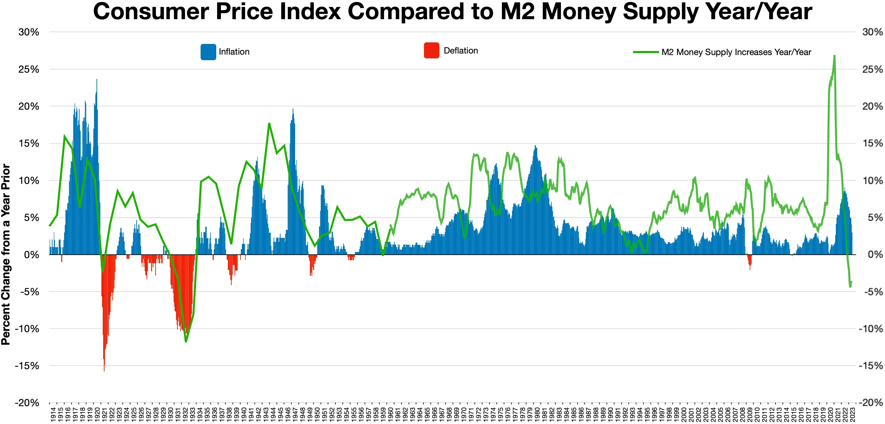

## Table of Contents

## What is the Consumer Price Index (CPI)?

The Consumer Price Index, or CPI, is a measure that shows how the prices of goods and services bought by households change over time. It's like a big shopping list that tracks the cost of things like food, clothes, housing, and transportation. By comparing the prices of these items from one period to another, the CPI helps us understand if things are getting more expensive or cheaper.

The CPI is important because it helps people understand inflation, which is when prices generally go up. Governments and businesses use the CPI to make decisions about things like wages, interest rates, and economic policies. For example, if the CPI shows that prices are rising quickly, the government might take steps to slow down inflation. For everyday people, the CPI can help them see if their money is going as far as it used to, or if they need to adjust their spending.

## How is the CPI calculated?

The CPI is calculated by first choosing a basket of goods and services that a typical household buys. This basket includes things like food, housing, transportation, and medical care. Each item in the basket is given a weight, which shows how important it is in the average household's spending. For example, if people spend a lot on housing, it gets a bigger weight. The prices of these items are collected from places like stores, rental agencies, and service providers all over the country.

Once the prices are collected, they are compared to the prices of the same items in a base period, which is a specific time chosen as a reference point. The CPI is then calculated by finding the total cost of the basket in the current period and dividing it by the total cost of the basket in the base period. This gives a ratio that is then multiplied by 100 to get the CPI number. If the CPI is higher than 100, it means prices have gone up since the base period. If it's lower than 100, prices have gone down.

## Why is the CPI important for understanding inflation?

The CPI is important for understanding inflation because it shows how the prices of things we buy every day are changing. When the CPI goes up, it means that, on average, things are getting more expensive. This is what we call inflation. By looking at the CPI, we can see if inflation is happening and how fast prices are rising. This helps everyone from regular people to big businesses understand if their money is buying less than before.

Governments and central banks use the CPI to make important decisions. If the CPI shows that inflation is too high, they might raise interest rates or change other policies to try to slow it down. This can affect things like how much it costs to borrow money or how much people get paid. For everyday people, knowing the CPI helps them plan their spending and saving. If they see prices going up, they might decide to spend less or look for ways to earn more money.

## What are the different types of CPI?

There are different types of CPI that help us understand price changes in different ways. The main type is the CPI for All Urban Consumers, or CPI-U. This one looks at the prices of things that urban people buy, which is most of the population. Another type is the CPI for Urban Wage Earners and Clerical Workers, or CPI-W. This one focuses on a smaller group of people who work certain kinds of jobs. Both of these types help us see how prices are changing for different groups of people.

Another type of CPI is the Chained CPI, or C-CPI-U. This one tries to be more accurate by thinking about how people change what they buy when prices go up. For example, if the price of beef goes up, people might buy more chicken instead. The Chained CPI takes this into account, so it might show a different rate of inflation than the regular CPI. These different types of CPI help us get a fuller picture of how prices are changing and how inflation is affecting different people.

## How often is the CPI updated?

The CPI is updated every month. This means that every month, the people who calculate the CPI go out and collect new prices for all the things in their basket. They then use these new prices to figure out if things are getting more expensive or cheaper compared to last month.

Having the CPI updated every month is really helpful. It lets us see how prices are changing quickly, so we can understand what's happening with inflation right away. This monthly update helps everyone from the government to regular people make better decisions about money and spending.

## What goods and services are included in the CPI basket?

The CPI basket includes a lot of different things that people buy every day. It has food and drinks like bread, milk, and coffee. It also has things for the house like furniture, appliances, and cleaning supplies. Clothes and shoes are in there too, along with things like jewelry and watches. The basket also includes things we need for getting around, like cars, gasoline, and public transportation. There are also services in the basket, like haircuts, going to the movies, and paying for cable TV.

Healthcare is a big part of the CPI basket too. This includes the cost of going to the doctor, getting medicine, and staying in the hospital. Education and communication are also included, like the cost of going to school, buying books, and paying for phone and internet service. Finally, the basket has things like rent or the cost of owning a home, as well as things for fun like toys, sports equipment, and going on vacation. All these things together help us see how prices are changing for what people buy every day.

## How does the CPI affect monetary policy?

The CPI is really important for the people who decide about money in a country, like the central bank. When the CPI goes up, it means prices are rising, which is called inflation. If inflation is too high, the central bank might decide to make borrowing money more expensive by raising interest rates. This can slow down spending and help bring prices back down. On the other hand, if the CPI shows that prices are not going up much or are even going down, the central bank might lower interest rates to encourage people to spend more and help the economy grow.

The CPI also helps the government make other decisions about money. For example, if the CPI shows that prices are going up a lot, the government might change how much they pay people who get benefits like social security. They might also change taxes or other policies to help people deal with higher prices. By keeping an eye on the CPI, the government and the central bank can try to keep the economy stable and make sure that people's money stays useful.

## What are the limitations of the CPI as a measure of inflation?

The CPI has some problems when it's used to measure inflation. One big problem is that it doesn't always show how people change what they buy when prices go up. For example, if the price of beef goes up, people might buy more chicken instead. The regular CPI doesn't take this into account, so it might say that inflation is higher than it really is. Another issue is that the CPI might not include new things that people start buying, like new kinds of technology or services. This can make the CPI less accurate because it's not looking at everything people are spending money on.

Another limitation is that the CPI can be different in different places. Prices can go up a lot in one city but not as much in another, but the CPI might just give an average number for the whole country. This can make it hard for people in different places to understand how inflation is affecting them. Also, the CPI doesn't always think about how the quality of things changes over time. If a product gets better but costs the same, the CPI might say there's no inflation, even though people are getting more for their money. These problems mean that the CPI is a good tool, but it's not perfect, and we need to be careful when we use it to understand inflation.

## How does the CPI differ from the Producer Price Index (PPI)?

The CPI and the PPI are two different ways to measure price changes, but they look at different things. The CPI, or Consumer Price Index, measures how the prices of things that people buy every day are changing. This includes stuff like food, clothes, and services like haircuts. It helps us see how inflation is affecting what we spend our money on. On the other hand, the PPI, or Producer Price Index, looks at the prices that businesses pay for things they need to make their products. This can include raw materials like steel or oil, and it helps us understand how costs are changing for companies before they sell their products to us.

While the CPI focuses on what consumers pay, the PPI gives us a look at the earlier stages of the economy. If the PPI goes up, it might mean that businesses will have to charge more for their products later on, which could lead to higher prices for consumers. This is why the PPI can sometimes be a good way to predict what might happen with the CPI in the future. Both indexes are important, but they tell us different stories about how prices are changing and how that might affect the economy.

## Can the CPI be used to compare the cost of living between different countries?

The CPI can give us an idea about how prices are changing in one country, but it's not the best tool for comparing the cost of living between different countries. Each country calculates its CPI in its own way, using a basket of goods and services that might be different from what other countries use. For example, what people buy every day in the United States might be very different from what people buy in Japan. Also, the CPI is usually measured in the local currency, so to compare it between countries, you would need to convert the numbers to the same currency, which can be tricky because exchange rates change all the time.

A better way to compare the cost of living between different countries is to use something called the Purchasing Power Parity (PPP). PPP looks at how much money you need in different countries to buy the same things. It takes into account the prices of goods and services in each country and converts them to a common currency, so you can see how far your money will go in different places. While the CPI is great for understanding inflation within a country, PPP is more useful for understanding how the cost of living compares across countries.

## How has the methodology of calculating the CPI evolved over time?

The way we calculate the CPI has changed a lot over time to make it more accurate. In the beginning, the CPI was just a simple list of prices for things people bought. But as time went on, people realized that they needed to think about more than just the prices. They started using a basket of goods and services that represented what a typical household bought. They also began to give different weights to different items in the basket, so things that people spent more money on, like housing, had a bigger impact on the CPI. This made the CPI a better tool for understanding how prices were changing for everyday people.

Over the years, the CPI has gotten even more detailed. One big change was the introduction of the Chained CPI, which tries to account for how people change what they buy when prices go up. For example, if the price of beef goes up, people might buy more chicken instead. The Chained CPI takes this into account, which can make it a more accurate measure of inflation. Also, the way prices are collected has changed. Now, instead of just looking at prices in stores, they also look at prices online and from other sources. These changes have made the CPI a better tool for understanding inflation and how it affects people's lives.

## What impact does the CPI have on economic forecasts and wage negotiations?

The CPI helps people who make predictions about the economy. When they see the CPI going up, it tells them that prices are getting higher, which means inflation is happening. This helps them guess what might happen next in the economy. For example, if the CPI is going up fast, they might predict that the central bank will raise interest rates to slow down inflation. This can affect things like how much people spend and how much businesses invest. So, the CPI is like a guide that helps people see where the economy might be headed.

The CPI also plays a big role in wage negotiations. When workers and their bosses talk about how much people should get paid, they often look at the CPI. If the CPI shows that prices are going up a lot, workers might ask for higher wages to keep up with inflation. This way, they can still buy the same things they used to with their money. On the other hand, if the CPI is not going up much, bosses might say that they don't need to raise wages as much. So, the CPI helps both sides understand what's fair when they're deciding on pay.

## How does inflation impact financial markets?

Inflation significantly influences financial markets by impacting stock prices, bond yields, and foreign exchange rates, among other asset classes. When inflation rises, the purchasing power of money diminishes, leading to potential changes in economic behavior and investment strategies.

High inflation primarily affects fixed income returns by eroding their real value. Fixed income securities, such as bonds, offer predetermined interest payments. However, when inflation rates increase, the purchasing power of these payments declines, making them less attractive. This often results in higher bond yields as investors demand more compensation for the inflation risk, driving down bond prices according to the inverse relationship described by the formula:

$$
P = \dfrac{C}{(1 + r)^n}
$$

where $P$ is the bond price, $C$ is the cash flow, $r$ is the discount rate (which includes inflation expectations), and $n$ is the number of periods.

Central banks play a crucial role in managing inflation through monetary policy, often by adjusting interest rates. When inflation is high, central banks may increase interest rates to temper inflationary pressures. This move can lead to higher borrowing costs, which tends to reduce economic consumption and investment, potentially dampening economic growth. In terms of market volatility, changes in interest rates can create fluctuations as investors reassess their portfolio allocations in light of evolving risk-reward profiles. 

Consider the Python function below, which calculates the expected real return of a bond accounting for inflation:

```python
def real_return(nominal_rate, inflation_rate):
    return ((1 + nominal_rate) / (1 + inflation_rate)) - 1

nominal_rate = 0.05  # 5% nominal interest rate
inflation_rate = 0.03  # 3% inflation rate

print("Expected Real Return:", real_return(nominal_rate, inflation_rate))
```

In the context of foreign exchange, inflation can influence exchange rates by affecting the relative purchasing power between currencies. A country with consistently higher inflation than its trading partners may experience depreciation in its currency's exchange rate, as foreign investors require favorable terms to offset the currency's declining purchasing power. Thus, inflation expectations can trigger significant shifts in foreign exchange markets, providing opportunities for algorithmic traders.

In summary, inflation affects various facets of financial markets, necessitating proactive strategies to mitigate risk and capitalize on emergent dynamics. By understanding and anticipating the implications of inflation, traders can better navigate the complexities of today’s financial landscape.

## How can economic indicators be integrated into algo trading?

Algorithmic trading utilizes mathematical models and real-time data to optimize trading decisions and maximize profitability. By integrating economic indicators into trading algorithms, traders can enhance their ability to predict market behavior and respond effectively to economic fluctuations. Economic indicators such as gross domestic product (GDP), unemployment rates, consumer price index (CPI), and inflation measures are key components that provide insights into market trends and inform algorithmic strategies.

### Integration of Economic Indicators

Economic indicators are incorporated into algorithmic models through various statistical and computational techniques. Algorithms analyze historical data to identify patterns and relationships between these indicators and asset prices. For instance, inflation measures can be directly used to adjust forecasts of future price movements in asset classes sensitive to inflation, such as bonds or commodities. This integration can follow a straightforward approach where quantitative models, like linear regression, assess the impact of inflation on market variables:

$$
Y = \beta_0 + \beta_1 \cdot \text{Inflation} + \epsilon
$$

where $Y$ represents the asset price or return, $\beta_0$ and $\beta_1$ are coefficients, and $\epsilon$ is the error term. This model can be expanded to include other economic indicators as well. More sophisticated models might employ machine learning techniques for non-linear relationships between variables.

### Use of Machine Learning

Machine learning techniques, such as supervised learning algorithms, are widely used to enhance the predictive power of trading algorithms. These models learn from historical data and adjust to new data inputs, improving predictions over time. They can handle complex, non-linear relationships between economic indicators and market behavior. Algorithms such as random forests, support vector machines, or neural networks are often deployed to detect intricate patterns and correlations.

In Python, for example, a [neural network](/wiki/neural-network) could be implemented using libraries like TensorFlow or PyTorch, allowing the model to learn how changes in inflation affect market dynamics. Here is a simplified example illustrating how one might set up a neural network for this purpose:

```python
import tensorflow as tf

# Simulated data
input_data = ...  # Historical economic indicators
output_data = ...  # Corresponding market responses

# Define the model
model = tf.keras.Sequential([
    tf.keras.layers.Dense(64, activation='relu', input_shape=[len(input_data[0])]),
    tf.keras.layers.Dense(64, activation='relu'),
    tf.keras.layers.Dense(1)
])

# Compile the model
model.compile(optimizer='adam', loss='mean_squared_error')

# Train the model
model.fit(input_data, output_data, epochs=10)

# Predict
predictions = model.predict(new_input_data)
```

### Backtesting

Backtesting is an essential aspect of [algorithmic trading](/wiki/algorithmic-trading) that allows traders to test their strategies on historical data. It evaluates how economic indicators should be weighted within the algorithm, simulating the model’s performance under historical market conditions. This process involves rigorous testing to ensure that the algorithm responds adequately to economic changes and does not overfit the historical data. Python libraries such as Backtrader can facilitate this process, offering traders the ability to simulate strategies and assess their viability before deployment in live trading environments.

Overall, integrating economic indicators into algorithmic trading models involves a combination of quantitative analysis, [machine learning](/wiki/machine-learning), and continuous testing. The flexibility and adaptability of these models are crucial, given the constantly changing landscape of financial markets influenced by macroeconomic conditions. As technology progresses, the sophistication of these algorithms will likely increase, further improving their predictive capabilities and effectiveness in the market.

## References & Further Reading

[1]: Bergstra, J., Bardenet, R., Bengio, Y., & Kégl, B. (2011). ["Algorithms for Hyper-Parameter Optimization."](https://dl.acm.org/doi/10.5555/2986459.2986743) Advances in Neural Information Processing Systems 24.

[2]: ["Advances in Financial Machine Learning"](https://www.amazon.com/Advances-Financial-Machine-Learning-Marcos/dp/1119482089) by Marcos Lopez de Prado

[3]: ["Evidence-Based Technical Analysis: Applying the Scientific Method and Statistical Inference to Trading Signals"](https://www.amazon.com/Evidence-Based-Technical-Analysis-Scientific-Statistical/dp/0470008741) by David Aronson

[4]: ["Machine Learning for Algorithmic Trading"](https://github.com/PacktPublishing/Machine-Learning-for-Algorithmic-Trading-Second-Edition) by Stefan Jansen

[5]: ["Quantitative Trading: How to Build Your Own Algorithmic Trading Business"](https://www.amazon.com/Quantitative-Trading-Build-Algorithmic-Business/dp/1119800064) by Ernest P. Chan