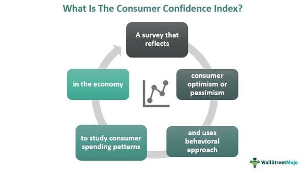

The interplay between economic indicators, consumer sentiment, and market analysis is fundamental to the functioning of modern financial systems. Economic indicators serve as essential metrics for assessing economic health, encompassing a range of data points such as consumer sentiment, inflation rates, and GDP. Among these, consumer sentiment acts as a vital measure of the general public's confidence in the economic environment. This sentiment reflects optimism or pessimism regarding personal financial situations and the wider economic landscape.

Consumer sentiment is instrumental in influencing market trends. When confidence is high, consumers are more likely to spend money, thereby stimulating economic growth. Conversely, low confidence can lead to reduced spending and slower economic expansion. The ability to quantify and analyze consumer sentiment presents opportunities for financial market participants to predict and respond to market changes.



Algorithmic trading has emerged as a powerful tool in financial markets, leveraging technology to automate and optimize trading activities. These systems can incorporate economic indicators, including consumer sentiment, to inform decision-making processes. By analyzing sentiment data, algorithmic trading strategies can potentially predict market shifts and adjust trading algorithms accordingly to capitalize on trends, enhancing trading performance and investment outcomes.

This article examines the concept of consumer sentiment, investigating its definition, measurement, and importance as an economic indicator. The discussion will extend to the integration of consumer sentiment data into algorithmic trading strategies, highlighting how these strategies enable traders to exploit market trends effectively. The marriage of sentiment analysis with algorithmic trading reflects an evolving financial landscape where data-driven insights increasingly inform investment strategies.

## Table of Contents

## Understanding Economic Indicators

Economic indicators are critical tools that provide insights into the health and direction of an economy. These metrics include various data, such as consumer sentiment, inflation rates, and Gross Domestic Product (GDP), which collectively inform market performance and consumer behavior.

Consumer sentiment is a key economic indicator reflecting individuals' and households' confidence in the economic environment. It gauges people's attitudes toward personal finances, business conditions, and purchasing confidence within a given timeframe. Two prominent indices measuring consumer sentiment are the Consumer Confidence Index (CCI) and the Michigan Consumer Sentiment Index (MCSI), both of which provide valuable foresight into future economic activities.

The Consumer Confidence Index (CCI) is a well-established economic indicator formulated by The Conference Board, a global, independent business membership and research association. The CCI assesses consumer attitudes and expectations through surveys focusing on current economic conditions and expectations for the future. A rise in the CCI suggests increased consumer confidence, potentially leading to higher consumer spending, which drives economic growth. Conversely, a decline can indicate consumers are apprehensive about their financial future, possibly resulting in reduced spending and slower economic progression.

Similarly, the Michigan Consumer Sentiment Index (MCSI), compiled by the University of Michigan, is another widely recognized indicator. It evaluates consumer confidence through nationwide random telephone surveys. The MCSI captures consumer expectations about economic prospects, their financial situation, and attitudes toward major purchases. The survey results are used to predict changes in consumer spending, which constitutes a substantial portion of GDP.

These consumer sentiment indices are vital as they not only measure public confidence but also indirectly influence economic activities. For instance, a high consumer sentiment typically correlates with increased consumer spending, stimulating economic growth by driving demand for goods and services. On the other hand, low consumer sentiment may correlate with economic downturns as spending contracts.

By understanding and interpreting these indicators, policymakers and market analysts can anticipate changes in economic trends and adjust strategies accordingly. These tools are indispensable for developing economic policies, financial planning, and investment strategies that aim to optimize growth and stability in the rapidly changing economic landscape.

## Consumer Sentiment and Its Measurement

Consumer sentiment refers to the overall attitude of individuals towards the economic conditions of a country, gauging their willingness to spend money on goods and services. This attitude is a reflection of their confidence in their financial stability. Emerging from the post-World War II era, consumer sentiment has become a crucial metric for understanding economic trends. It acts as an economic statistic that can provide insights into future economic performance, making it invaluable for policymakers, businesses, and investors alike.

The measurement of consumer sentiment typically involves surveys where households are polled about their perceptions of current economic conditions and their expectations for the future. Two of the most widely recognized indices for measuring consumer sentiment are the Consumer Confidence Index (CCI) and the Michigan Consumer Sentiment Index (MCSI).

The Consumer Confidence Index, produced by the Conference Board, is derived from responses to questions regarding current business conditions, business conditions for the next six months, current employment conditions, and employment conditions for the next six months, together with family income for the next six months. A higher index indicates better consumer sentiment about the economic outlook.

The Michigan Consumer Sentiment Index, conducted by the University of Michigan, is based on monthly telephone interviews with at least 500 households, focusing on personal finances, business conditions, and buying conditions. The survey asks five core questions twice a month, and responses are aggregated to form the index.

Consumer sentiment is often considered a lagging indicator of economic health. While it provides information about consumer expectations, it may react to changes in the broader economy after such changes have already occurred. For example, a sustained drop in consumer sentiment could signal an eventual decrease in consumer spending, impacting key economic activities like production and employment. However, shifts in consumer sentiment can sometimes precede significant economic events, signaling changes that might not yet be visible in more traditional economic data such as GDP or unemployment rates. Thus, while consumer sentiment can reflect economic conditions that have already materialized, its predictive power may influence economic policy and investment strategies by highlighting emerging trends or potential downturns.

## The Role of Market Analysis

Market analysis plays a critical role in understanding financial markets by assessing various data points to identify trends and forecast potential market movements. Analysts evaluate a wide range of factors, including economic indicators, financial statements, geopolitical events, and, increasingly, consumer sentiment.

Consumer sentiment is an essential component of market analysis as it reflects the collective mood and confidence of consumers regarding the overall economy and their personal financial situations. This sentiment can significantly impact investment decisions. When consumer sentiment is high, consumers are more likely to spend, driving economic growth and potentially boosting stock markets. Conversely, low consumer sentiment can indicate a reluctance to spend, often leading to slower economic growth and market downturns.

Investment decisions are influenced by consumer sentiment through its impact on market psychology. Investors often use sentiment indicators to gauge market trends. For instance, a positive shift in consumer sentiment may lead investors to anticipate higher corporate earnings due to increased consumer spending, thus encouraging them to buy stocks and push prices higher. Conversely, deteriorating sentiment can lead to bearish market expectations, prompting sales and driving prices down.

There are numerous case studies where consumer sentiment has had a notable impact on stock market performance. One such instance is the Global Financial Crisis of 2008, where plummeting consumer confidence led to significant declines in stock markets worldwide. The rapid drop in the University of Michigan Consumer Sentiment Index (MCSI) and the Consumer Confidence Index (CCI) during this period illustrated consumer fear and uncertainty, which translated into a broader market sell-off.

Similarly, during the COVID-19 pandemic, sharp fluctuations in consumer sentiment due to economic shutdowns and uncertainty about the virus's impact saw corresponding [volatility](/wiki/volatility-trading-strategies) in financial markets. As lockdowns eased and consumer confidence began to recover, markets reflected this with substantial rebounds.

In recent times, [algorithmic trading](/wiki/algorithmic-trading) systems have also started to incorporate consumer sentiment analysis, using advanced techniques like natural language processing to parse consumer feedback across social media platforms, news articles, and other digital content. This real-time analysis allows traders to respond swiftly to sentiment shifts, potentially capitalizing on short-term market inefficiencies.

In summary, consumer sentiment greatly impacts market analysis by offering insights into potential economic trends and influencing investor behavior. Through both traditional approaches and modern algorithmic trading techniques, analyzing consumer sentiment has become integral to forecasting market performance and making informed investment decisions.

## Algorithmic Trading and Consumer Sentiment

Algorithmic trading is a method where financial market transactions are executed using complex algorithms. These algorithms automatically manage trades by analyzing variable market data inputs and executing buy or sell decisions at optimal times. Traditionally, factors such as price patterns, moving averages, and trading volumes have been central to algorithmic strategies. However, with advancements in data processing and analytics, these systems now incorporate economic indicators and consumer sentiment analysis to enhance trading performance.

Economic indicators like GDP growth rates, unemployment [statistics](/wiki/bayesian-statistics), and inflation rates provide a macroeconomic context that algorithms can leverage. Consumer sentiment, however, offers a unique insight into the collective mindset of consumers, reflecting their confidence in economic conditions. By interpreting sentiment expressed in media articles, social media activity, or survey results, algorithms can predict potential market reactions to economic events.

Incorporating consumer sentiment analysis into algorithmic trading provides several advantages. Unlike traditional indicators that often serve as lagging signals, sentiment analysis can offer real-time or leading insights because it captures immediate reactions to economic events. For instance, if a news article about a potential economic downturn garners negative public sentiment, algorithms can quickly respond by adjusting positions in anticipation of market shifts.

Sentiment analysis often utilizes natural language processing (NLP) to parse vast amounts of textual data, extracting meaningful patterns indicative of market sentiment. Machine learning models are trained on datasets labeled with sentiment scores to predict future market movements based on current sentiment data. For example, Python libraries like `nltk` and `TextBlob` can be employed to perform sentiment analysis on textual data collected from various sources. A simple Python implementation might look like this:

```python
from textblob import TextBlob
import requests

# Simulating fetching data from a financial news source
article = requests.get('https://www.example.com/financial-news').text

# Performing sentiment analysis
analysis = TextBlob(article)
sentiment_score = analysis.sentiment.polarity

# Decision based on sentiment score
if sentiment_score > 0:
    print("Positive sentiment detected, consider buying stocks.")
elif sentiment_score < 0:
    print("Negative sentiment detected, consider selling stocks.")
else:
    print("Neutral sentiment, hold position.")
```

The adaptability and speed of algorithmic trading systems make them well-suited for leveraging sentiment analysis. They can process real-time data and adjust trading strategies almost instantaneously, a feat unattainable in manual trading. This integration of sentiment allows traders to hedge risks associated with human emotions and media biases, transforming subjective insights into objective trading decisions.

In summary, the synergy between algorithmic trading and consumer sentiment analysis introduces a dynamic approach to financial markets, capturing both quantitative data and qualitative insights. This innovative combination not only refines trading strategies but also positions traders to better anticipate market reactions, offering a competitive edge in a rapidly evolving financial landscape.

## Integrating Sentiment Analysis into Trading Strategies

Sentiment analysis has become increasingly valuable in trading strategies, particularly with the advent of natural language processing (NLP) and [machine learning](/wiki/machine-learning) technologies. Integrating sentiment analysis into trading strategies involves several systematic steps, enhancing the ability to predict market movements based on the collective mood of a market.

### Steps for Integrating Sentiment Analysis

1. **Data Collection**: The first step involves gathering data from a variety of sources, such as financial news, social media, and company press releases. This data is often unstructured and requires preprocessing. Web scraping tools and APIs are commonly used to collect this data efficiently.

2. **Data Preprocessing**: Raw data must be cleaned and prepared for analysis. Processes such as removing stop words, stemming, and tokenization are necessary. This step often involves converting textual data into a structured format suitable for analysis.

3. **Sentiment Analysis Model Development**: Using NLP, sentiment analysis models are developed to categorize text as positive, negative, or neutral. Machine learning libraries like TensorFlow or PyTorch can be utilized to train models using a labeled dataset. Classifiers such as support vector machines (SVM), Naive Bayes, or deep learning models like LSTM networks are popular choices.

   ```python
   from sklearn.feature_extraction.text import CountVectorizer
   from sklearn.naive_bayes import MultinomialNB
   from sklearn.pipeline import Pipeline

   # Example pipeline for sentiment analysis
   text_clf = Pipeline([
       ('vect', CountVectorizer()),
       ('clf', MultinomialNB()),
   ])
   ```

4. **Sentiment Scoring**: Each piece of text is assigned a sentiment score based on the model's predictions. This score quantifies the degree of positivity or negativity, which can be aggregated to gauge overall market sentiment.

5. **Integration into Trading Algorithms**: These sentiment scores are then integrated into trading strategies. Algorithmic traders use these scores as indicators to make buy, hold, or sell decisions. Strategies might involve reacting to sentiment thresholds or changes over time, adjusting portfolios based on predicted market reactions.

6. **Backtesting and Optimization**: Before deploying sentiment-based strategies, they are backtested using historical data to evaluate their effectiveness and risk. Optimization techniques are applied to refine the parameters for improved performance.

### Examples of Sentiment-Based Trading Strategies

One common strategy is the use of sentiment indicators to trade on news events. For instance, a sudden increase in positive sentiment following a company's earnings report might trigger a buy signal. Conversely, a drop in sentiment due to negative news might prompt a sell.

Another strategy involves sentiment [momentum](/wiki/momentum), where traders analyze trends in sentiment over time. A consistent increase in positive sentiment may indicate a bullish trend, suggesting a long position. This can be implemented using moving averages of sentiment scores to identify cross-over points that signal entry or [exit](/wiki/exit-strategy) from a trade.

### The Future of Sentiment Analysis in Trading

The future of sentiment analysis in trading looks promising, particularly as machine learning algorithms continue to evolve. With the rise of [deep learning](/wiki/deep-learning), models can achieve greater accuracy in sentiment prediction, even in complex language scenarios. Furthermore, the integration of real-time data processing enables traders to react swiftly to changes in sentiment, enhancing decision-making efficiency.

As sentiment analysis tools become more sophisticated, the creation of hybrid models that combine technical indicators with sentiment data may lead to more robust trading systems. Continuous improvements in computational power and data availability will further advance the role of sentiment analysis in financial markets, making it an indispensable tool for modern traders.

## Conclusion

Economic indicators, such as consumer sentiment, inflation rates, and GDP, are crucial for understanding financial markets. They provide insights into economic health and help predict market trends. Consumer sentiment, specifically, acts as a reflection of public confidence in the economy, influencing spending and investment. Measuring this sentiment through indices like the Consumer Confidence Index (CCI) and the Michigan Consumer Sentiment Index (MCSI) allows market participants to gauge potential consumer behavior and its impact on economic performance.

Algorithmic trading capitalizes on these indicators to enhance investment outcomes. By incorporating sentiment analysis, algorithms can offer a targeted approach to trading, leveraging real-time data to anticipate market fluctuations. The application of natural language processing and machine learning enables traders to parse vast amounts of qualitative data, transforming it into actionable strategies. This integration improves decision-making processes and fosters more adaptive strategies that can respond to unexpected market changes swiftly.

The fusion of finance and technology is reshaping market analysis. As algorithmic trading systems grow more sophisticated, they promise greater accuracy and efficiency in trading operations. This evolution indicates a future where financial markets are increasingly driven by data analysis and computational power, improving the ability to predict and respond to economic shifts. In this landscape, the role of consumer sentiment and other economic indicators remains indispensable, as they continue to influence market behaviors and trading strategies.

## References & Further Reading

[1]: ["Consumer Confidence Index (CCI)"](https://www.conference-board.org/topics/consumer-confidence) by The Conference Board

[2]: ["University of Michigan: Surveys of Consumers"](http://www.sca.isr.umich.edu/) - University of Michigan's Survey Research Center

[3]: Jansen, Stefan. ["Machine Learning for Algorithmic Trading"](https://github.com/stefan-jansen/machine-learning-for-trading). Packt Publishing.

[4]: Lopez de Prado, Marcos. ["Advances in Financial Machine Learning"](https://www.amazon.com/Advances-Financial-Machine-Learning-Marcos/dp/1119482089). Wiley.

[5]: Chan, Ernest P. ["Quantitative Trading: How to Build Your Own Algorithmic Trading Business"](https://github.com/ftvision/quant_trading_echan_book). Wiley.

[6]: ["Sentiment Analysis for Financial Traders"](https://blog.quantinsti.com/sentiment-analysis-trading/) by Hagenau, M., Liebmann, M., & Neumann, D. Decision Support Systems, 2013.