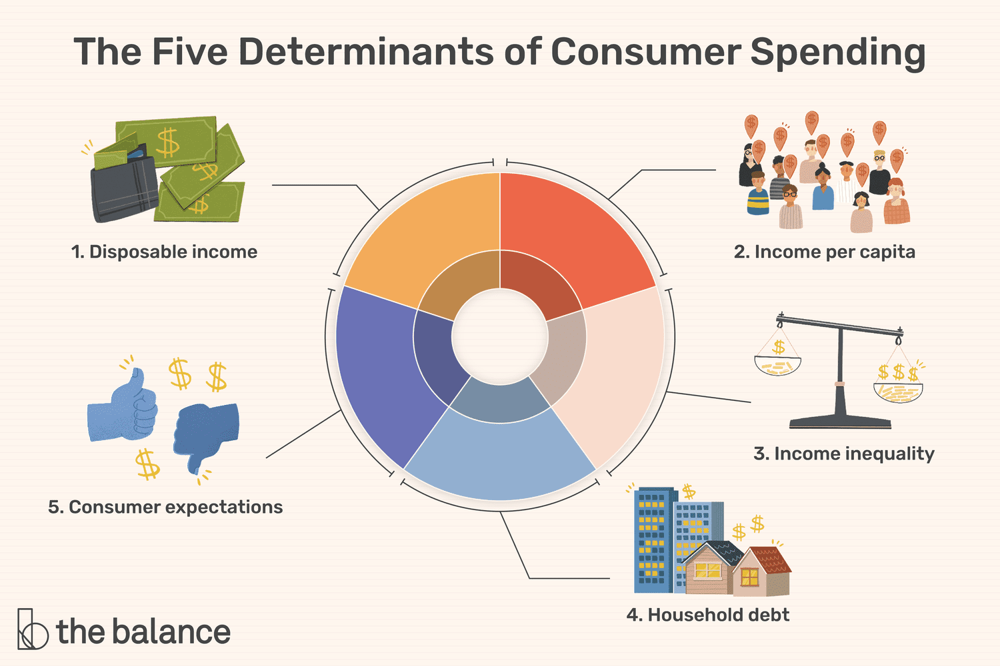

## Table of Contents

## What is consumer spending?

Consumer spending is the total amount of money that people spend on goods and services. This includes things like food, clothes, and entertainment. When people buy these things, they are helping the economy grow because businesses make money from these sales.

Economists pay close attention to consumer spending because it is a big part of the economy. If people are spending more money, it usually means they feel confident about their financial situation. On the other hand, if people are spending less, it might mean they are worried about the future and want to save their money. This can affect how well the economy is doing overall.

## Why is consumer spending important for the economy?

Consumer spending is really important for the economy because it makes up a big part of it. When people buy things like food, clothes, and toys, they help businesses make money. This money helps businesses grow and hire more people. If lots of people are spending money, it means the economy is doing well. It's like a big circle: people spend money, businesses do well, more people get jobs, and then they can spend more money.

If people stop spending as much, it can cause problems for the economy. When people are worried about money, they might decide to save more and buy less. This can make businesses sell less and maybe even have to let people go. When fewer people are working, they have less money to spend, which can make the economy slow down even more. So, keeping an eye on how much people are spending helps us understand how the economy is doing.

## How is consumer spending measured?

Consumer spending is measured by looking at how much money people spend on things like food, clothes, and fun activities. The government and economists use surveys and data from stores to figure this out. They ask people about what they bought and how much they spent. They also get information from businesses about their sales. By putting all this information together, they can see how much money people are spending in total.

This information is often shown as a number called "personal consumption expenditures" or PCE. The PCE is part of a bigger report that comes out every month from the government. It helps everyone see if people are spending more or less money compared to last month or last year. If the number goes up, it usually means the economy is doing well. If it goes down, it might mean people are worried about money and are spending less.

## What are the main components of consumer spending?

Consumer spending is made up of a few main parts. The biggest part is what people spend on things they need every day, like food and clothes. This is called "non-durable goods" because they don't last a long time. Another big part is "services," which is money spent on things like haircuts, going to the doctor, or eating out at a restaurant. Services are things you can't touch but you pay for someone to do something for you.

Another part of consumer spending is "durable goods," which are things that last a long time, like cars, furniture, and appliances. People usually don't buy these things as often, but when they do, it can really help the economy. All these parts together make up the total amount of money people spend, and economists look at each part to see how people are spending their money and what it means for the economy.

## How does consumer spending affect GDP?

Consumer spending is a big part of the Gross Domestic Product (GDP), which is like a scorecard for how well a country's economy is doing. GDP is the total value of everything made and sold in a country in a year. When people buy things, they help businesses make money, and that money counts toward the GDP. So, if people are spending more, the GDP usually goes up, and that's a good sign for the economy.

On the other hand, if people start spending less, it can make the GDP go down. When people are worried about money, they might decide to save more and buy fewer things. This means businesses sell less, and the total value of what's made and sold in the country drops. So, consumer spending is really important because it can make the GDP go up or down, showing whether the economy is growing or shrinking.

## What data sources are used to track consumer spending?

To track consumer spending, economists and government agencies use a lot of different data sources. One main source is surveys where people tell them what they bought and how much they spent. These surveys can be done by asking people directly or by having them fill out forms. Another important source is data from businesses, like stores and restaurants. They report how much they sold, which helps figure out how much people are spending.

Another way to track consumer spending is by looking at credit card and bank data. This shows how much people are spending using cards or taking money out of their accounts. The government also uses data from taxes, like sales taxes, to see how much people are spending. By putting all this information together, they can get a good picture of how much money people are spending and how it's changing over time.

## How do seasonal adjustments impact consumer spending data?

Seasonal adjustments are changes made to consumer spending data to make it easier to see the real trends. Without these adjustments, the data might show big changes just because of the time of year. For example, people usually spend more around the holidays like Christmas. If we didn't adjust for this, it might look like spending goes way up every December and then drops in January. By making seasonal adjustments, we can see if there are other reasons for changes in spending, like people feeling more or less confident about money.

These adjustments help economists and the government understand the economy better. They take out the normal ups and downs that happen every year, so they can focus on what's really happening with consumer spending. If the adjusted data shows spending is going up, it might mean the economy is doing well. If it's going down, it could mean people are worried about money. So, seasonal adjustments are important because they help us see the true picture of how people are spending their money.

## What are the differences between nominal and real consumer spending?

Nominal consumer spending is the total amount of money people spend without adjusting for inflation. It's like looking at the price tags and adding up all the money spent. If prices go up because of inflation, nominal spending will look higher even if people aren't buying more stuff. For example, if a toy costs $10 one year and $11 the next year because of inflation, and people buy the same number of toys, the nominal spending goes up from $10 to $11.

Real consumer spending, on the other hand, takes inflation into account. It adjusts the numbers so we can see if people are really buying more or less stuff, not just spending more because prices went up. Using the toy example, if the price goes from $10 to $11 but we adjust for inflation, we can see if people are actually buying more toys or if they're just paying more for the same number of toys. Real spending gives us a better idea of how the economy is doing because it shows the actual amount of goods and services people are buying.

## How do economic policies influence consumer spending?

Economic policies can really change how much people spend. When the government lowers taxes, people have more money in their pockets. This can make them feel like they can spend more on things they want or need. Also, if the government gives out money to people, like during tough times, people might use that money to buy stuff, which can help the economy grow. On the other hand, if the government raises taxes or cuts back on programs that help people, people might have less money to spend, and they might decide to save more instead.

Interest rates set by the central bank also affect consumer spending. When interest rates are low, it's cheaper for people to borrow money. This can make people more likely to take out loans to buy big things like cars or houses. When interest rates are high, borrowing money costs more, so people might decide to wait before buying those big things. So, by changing taxes, giving out money, and setting interest rates, the government and the central bank can influence how much people spend and help guide the economy.

## What are the leading indicators of changes in consumer spending patterns?

Leading indicators are signs that can help us guess what might happen with consumer spending before it actually changes. One important indicator is consumer confidence. When people feel good about their jobs and money, they're more likely to spend more. Surveys that ask people how they feel about the economy can tell us a lot. Another indicator is the stock market. When the stock market goes up, people might feel richer and spend more. But if the stock market goes down, people might get worried and decide to save their money instead.

Another big indicator is employment data. When more people have jobs, they have more money to spend. So, if the unemployment rate goes down, it's a good sign that consumer spending might go up. On the other hand, if a lot of people are losing their jobs, they might have to cut back on spending. Retail sales numbers are also a good indicator. If stores are selling more stuff, it means people are spending more money. By keeping an eye on these indicators, we can get a good idea of what might happen with consumer spending in the future.

## How can consumer spending data be used to predict economic recessions?

Consumer spending data is really important for figuring out if an economic recession might be coming. When people start spending less money, it can be a warning sign. Economists look at things like how much people are buying at stores, how they feel about the economy, and if more people are losing their jobs. If these numbers start going down, it might mean people are worried about money and are trying to save more. This can slow down the economy and lead to a recession.

By watching these signs, people who study the economy can try to guess if a recession is on the way. If consumer spending keeps dropping for a few months, it's a strong hint that tough times might be ahead. Governments and businesses can then get ready and maybe do things to help, like lowering taxes or interest rates. So, keeping an eye on how much people are spending helps everyone understand and prepare for what might happen with the economy.

## What advanced statistical methods are used to analyze consumer spending trends?

To understand consumer spending trends, economists use fancy math methods like time series analysis. This helps them see patterns in how people spend money over time. They look at things like how spending changes from month to month or year to year. They also use something called regression analysis to figure out what makes people spend more or less. This can help them see if things like lower taxes or more jobs make a big difference in how much people spend.

Another method they use is called econometric modeling. This is a way to make guesses about the future by using past data. They put all the information they have about spending, jobs, and other stuff into a big math equation. This helps them predict what might happen next with consumer spending. By using these advanced methods, economists can get a better idea of what's going on with the economy and help make smart decisions.

## What is the key to understanding consumer spending?

Consumer spending, also known as consumer expenditure, constitutes the total value of goods and services purchased by households and non-profit institutions serving households. It plays a critical role in driving economic activity and is typically divided into three main components: durable goods, nondurable goods, and services. Durable goods are those with a lifespan of more than three years, such as automobiles and appliances. Nondurable goods include items like food and clothing, which are consumed quickly. Services encompass a wide range of activities including healthcare, education, and finance.

### Significance of Consumer Spending in GDP Calculations

Consumer spending is a substantial component of Gross Domestic Product (GDP), which is defined by the expenditure approach as:

$$
\text{GDP} = C + I + G + (X - M)
$$

where $C$ represents consumer spending, $I$ is investment, $G$ is government spending, and $X - M$ is net exports (exports minus imports). In many countries, consumer spending accounts for more than 60% of GDP, underscoring its influence on economic growth and stability.

### Factors Influencing Consumer Spending Behavior

Several factors influence consumer spending behavior, including income levels, employment rates, interest rates, and fiscal policies. Changes in disposable income, defined as total personal income minus personal current taxes, directly impact the purchasing power of consumers. Similarly, interest rates affect consumers' willingness to borrow and spend, with lower rates generally encouraging spending. Consumer confidence, which reflects how optimistic consumers are about their financial situation and the broader economy, also plays a pivotal role. High confidence typically leads to increased spending, while uncertainty or pessimism can lead to reduced expenditure.

### Historical Trends in Consumer Spending

Over time, consumer spending patterns have evolved due to demographic shifts, technological advancements, and globalization. For instance, the rise of e-commerce has transformed retail landscapes, leading to increased consumer spending on online platforms. Historically, economic booms have been characterized by robust consumer spending, whereas recessions often see a contraction in household expenditures. During the economic downturns such as the 2008 financial crisis, consumer spending declined as unemployment rose and financial uncertainty prevailed. Conversely, recovery periods are often marked by a rebound in spending, supported by policy interventions and improved consumer confidence.

### Impact of Consumer Confidence on Spending Patterns

Consumer confidence indexes, such as the Conference Board Consumer Confidence Index in the United States, measure the degree of consumer optimism regarding present and future economic conditions. High consumer confidence translates into increased spending as individuals feel secure in their employment and income prospects, thereby fueling economic activity. Conversely, when confidence wanes, consumers tend to cut back on expenditures, affecting businesses that rely on consumer sales. This relationship underscores the importance of consumer sentiment as both an economic indicator and a driver of spending behavior.

Understanding consumer spending is crucial for policymakers and businesses alike, as it provides insights into economic health and future growth prospects. Policymakers often monitor consumer spending trends to tailor fiscal and monetary policies that can stabilize and stimulate economic activity. For businesses, understanding these patterns can inform strategic decisions, such as product offerings and marketing campaigns, to align with consumer demand.

## What are the economic measurements of consumer spending?

Consumer spending represents a critical component of economic analysis and understanding its measurement is essential for policymakers, businesses, and investors. Several key metrics are used to gauge consumer spending, and these metrics provide insights into the health and direction of the economy.

**Key Metrics Used to Measure Consumer Spending**

Retail sales data and personal consumption expenditures (PCE) are two fundamental metrics for assessing consumer spending. Retail sales data tracks the total receipts of retail stores, offering a monthly indicator of consumer demand for finished goods. This data encompasses various sectors, including automobiles, food services, and clothing, reflecting the immediate spending habits of consumers. On the other hand, PCE is broader, capturing the value of goods and services consumed by households. Unlike retail sales, PCE includes expenditures not just on goods, but also on services such as healthcare and education. The Bureau of Economic Analysis (BEA) provides monthly PCE data, which is a significant input in measuring the gross domestic product (GDP).

**The Impact of Price Indices on Consumer Spending Analysis**

Price indices, particularly the Consumer Price Index (CPI), play a crucial role in consumer spending analysis by accounting for inflation. CPI measures the average change over time in the prices paid by urban consumers for a market basket of consumer goods and services. By adjusting nominal spending figures with CPI, economists can derive real consumer spending, eliminating the effects of price changes and providing a clearer picture of actual spending trends. The formula for real spending is expressed as:

$$
\text{Real Spending} = \frac{\text{Nominal Spending}}{\text{CPI}}
$$

This adjustment is essential for comparing spending across different time periods or regions without the distortion of inflation.

**How National Income and Expenditure Accounts Capture Spending**

The national income and expenditure accounts provide a comprehensive overview of a country's economic activity, capturing all aspects of production and expenditure, including consumer spending. These accounts detail how national output is distributed among various [agents](/wiki/agents), including households, businesses, and the government. Consumer spending is a significant component of national expenditure, represented in these accounts as consumption expenditure. The accounts reveal the relationship between income, savings, consumption, and investment, forming the basis for macroeconomic analysis and policy formulation.

**Challenges in Measuring Consumer Spending Accurately**

Accurate measurement of consumer spending is fraught with challenges. One significant challenge is capturing the full extent of spending due to the informal economy and underreporting. Transactions occurring outside formal financial systems often escape traditional data collection methods. Another challenge lies in accurately categorizing expenditures, especially with the increasing complexity of modern markets where digital and non-traditional forms of commerce prevail. Adjustments made to account for seasonal variations and data revisions also complicate the measurement process. Moreover, the diversity in consumer preferences and regional variations adds further complexity, requiring sophisticated statistical techniques to ensure data accuracy and reliability.

Understanding these economic measurements is paramount for interpreting consumer behavior and anticipating economic trends. These metrics not only illuminate current economic conditions but also aid in forecasting future movements, influencing both policy decisions and trading strategies.

## How does spending impact the economy?

Consumer spending plays a pivotal role in driving economic growth by directly contributing to aggregate demand. When individuals and households increase their consumption of goods and services, businesses experience higher sales revenues, prompting them to boost production. This increase in production often leads to greater demand for labor, thereby reducing unemployment rates and increasing household incomes. Consequently, this bolsters economic expansion, as articulated in the fundamental economic formula:

$$
GDP = C + I + G + (X - M)
$$

where $C$ represents consumer spending, $I$ denotes investments, $G$ stands for government spending, and $(X - M)$ refers to net exports.

The multiplier effect further amplifies the impact of consumer spending on economic growth. The multiplier effect describes how an initial increase in spending leads to a chain reaction of increased income and consumption across the economy. For instance, when consumers spend more, businesses record higher profits, allowing them to invest in new projects or increase employee compensation. These investments and bonuses increase disposable income, encouraging further consumer spending. The concept of the multiplier can be mathematically represented as:

$$
\text{Multiplier} = \frac{1}{1 - MPC}
$$

where $MPC$ is the marginal propensity to consume. A higher MPC indicates a larger multiplier effect, suggesting that a significant portion of additional income will be spent rather than saved.

The relationship between consumer spending and business investment is symbiotic. Rising consumer demand often incentivizes companies to invest in capital goods to increase their capacity and efficiency to meet market needs. As businesses expand production facilities or invest in new technology, it boosts overall economic productivity and potential output, underpinning long-term growth.

Spending levels also significantly influence inflation and monetary policy. High consumer spending can drive prices upward, resulting in inflationary pressures. Central banks monitor these trends and may adjust interest rates to maintain price stability. For instance, if inflation rises due to excessive consumer demand, a central bank might increase interest rates to temper spending and curb inflation. Conversely, in times of stagnant consumer spending and low inflation, monetary policy may shift towards lowering interest rates to stimulate economic activity.

Economic cycles—characterized by booms and recessions—are profoundly affected by consumer spending patterns. During periods of economic boom, consumer confidence is high, leading to increased spending, which further catalyzes economic growth. However, in a downturn, reduced consumer spending can exacerbate recessions. Decreased demand leads to lower business revenues, triggering cutbacks in production and employment, which in turn further depress consumer spending, creating a cyclical pattern that can deepen economic contractions.

In summary, consumer spending is both a driver and a reflection of economic conditions, influencing growth, investment, inflation, and cyclical economic patterns. Understanding its impact is crucial for effective policy-making and economic forecasting.

## References & Further Reading

[1]: Bergstra, J., Bardenet, R., Bengio, Y., & Kégl, B. (2011). ["Algorithms for Hyper-Parameter Optimization."](https://dl.acm.org/doi/10.5555/2986459.2986743) Advances in Neural Information Processing Systems 24.

[2]: ["Advances in Financial Machine Learning"](https://www.amazon.com/Advances-Financial-Machine-Learning-Marcos/dp/1119482089) by Marcos Lopez de Prado

[3]: ["Evidence-Based Technical Analysis: Applying the Scientific Method and Statistical Inference to Trading Signals"](https://www.amazon.com/Evidence-Based-Technical-Analysis-Scientific-Statistical/dp/0470008741) by David Aronson

[4]: ["Machine Learning for Algorithmic Trading"](https://github.com/stefan-jansen/machine-learning-for-trading) by Stefan Jansen

[5]: ["Quantitative Trading: How to Build Your Own Algorithmic Trading Business"](https://github.com/LucindaYa/quant-resources/blob/master/Quantitative%20Trading%20How%20to%20Build%20Your%20Own%20Algorithmic%20Trading%20Business.pdf) by Ernest P. Chan