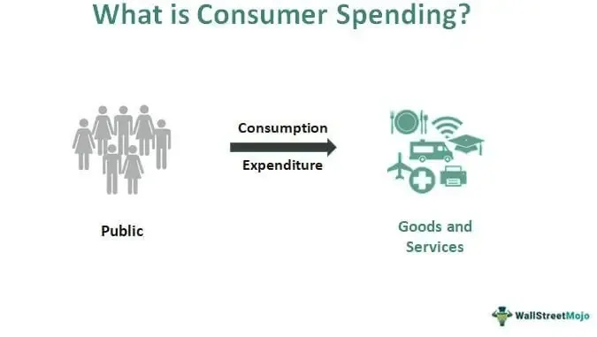

Consumer spending is a fundamental pillar of economic activity, accounting for a substantial portion of the Gross Domestic Product (GDP) in many economies worldwide. By converting individual consumption choices into a measurable economic force, consumer spending drives production, influences business investment decisions, and shapes labor markets. In the United States, for example, consumer spending constitutes approximately two-thirds of GDP, underscoring its critical role as an economic engine.

Economic measurements related to consumer spending are pivotal for analyzing and forecasting economic performance. Key metrics include retail sales data and personal consumption expenditures, which provide comprehensive insights into consumer behavior and spending patterns. These measurements help economists and policymakers gauge the economy's health and make informed decisions. Additionally, price indices like the Consumer Price Index (CPI) are essential tools for understanding how inflation affects purchasing power, further influencing consumer spending.



Algorithmic trading, a subset of electronic trading methods, has gained prominence in financial markets, leveraging algorithms to execute orders at speeds and frequencies beyond human capability. The use of algorithmic trading is increasing due to its ability to process massive datasets, including those related to consumer spending, to predict market movements. By analyzing consumer spending data, algorithmic trading models can identify trends and patterns that inform investment strategies, thereby coupling consumer behavior with market dynamics.

The purpose and scope of this article are to explore the intricate connections between consumer spending and algorithmic trading, examining how spending data drives economic measurements and influences market behavior. The article aims to provide an understanding of the role of consumer spending in macroeconomic frameworks and its intersection with advanced trading techniques. This exploration includes an examination of historical spending trends, the impact of consumer confidence, and the evolving methodologies of algorithmic trading.

The topic's importance is magnified in the current economic landscape, characterized by rapid technological advancements and significant global economic shifts. As consumer habits continue to evolve, influenced by factors such as digitalization and socio-economic changes, understanding their impact on both the economy and trading practices becomes essential. This knowledge aids in navigating the complexities of modern financial markets and making informed economic and investment decisions.

## Table of Contents

## Understanding Consumer Spending

Consumer spending, also known as consumer expenditure, constitutes the total value of goods and services purchased by households and non-profit institutions serving households. It plays a critical role in driving economic activity and is typically divided into three main components: durable goods, nondurable goods, and services. Durable goods are those with a lifespan of more than three years, such as automobiles and appliances. Nondurable goods include items like food and clothing, which are consumed quickly. Services encompass a wide range of activities including healthcare, education, and finance.

### Significance of Consumer Spending in GDP Calculations

Consumer spending is a substantial component of Gross Domestic Product (GDP), which is defined by the expenditure approach as:

$$
\text{GDP} = C + I + G + (X - M)
$$

where $C$ represents consumer spending, $I$ is investment, $G$ is government spending, and $X - M$ is net exports (exports minus imports). In many countries, consumer spending accounts for more than 60% of GDP, underscoring its influence on economic growth and stability.

### Factors Influencing Consumer Spending Behavior

Several factors influence consumer spending behavior, including income levels, employment rates, interest rates, and fiscal policies. Changes in disposable income, defined as total personal income minus personal current taxes, directly impact the purchasing power of consumers. Similarly, interest rates affect consumers' willingness to borrow and spend, with lower rates generally encouraging spending. Consumer confidence, which reflects how optimistic consumers are about their financial situation and the broader economy, also plays a pivotal role. High confidence typically leads to increased spending, while uncertainty or pessimism can lead to reduced expenditure.

### Historical Trends in Consumer Spending

Over time, consumer spending patterns have evolved due to demographic shifts, technological advancements, and globalization. For instance, the rise of e-commerce has transformed retail landscapes, leading to increased consumer spending on online platforms. Historically, economic booms have been characterized by robust consumer spending, whereas recessions often see a contraction in household expenditures. During the economic downturns such as the 2008 financial crisis, consumer spending declined as unemployment rose and financial uncertainty prevailed. Conversely, recovery periods are often marked by a rebound in spending, supported by policy interventions and improved consumer confidence.

### Impact of Consumer Confidence on Spending Patterns

Consumer confidence indexes, such as the Conference Board Consumer Confidence Index in the United States, measure the degree of consumer optimism regarding present and future economic conditions. High consumer confidence translates into increased spending as individuals feel secure in their employment and income prospects, thereby fueling economic activity. Conversely, when confidence wanes, consumers tend to cut back on expenditures, affecting businesses that rely on consumer sales. This relationship underscores the importance of consumer sentiment as both an economic indicator and a driver of spending behavior.

Understanding consumer spending is crucial for policymakers and businesses alike, as it provides insights into economic health and future growth prospects. Policymakers often monitor consumer spending trends to tailor fiscal and monetary policies that can stabilize and stimulate economic activity. For businesses, understanding these patterns can inform strategic decisions, such as product offerings and marketing campaigns, to align with consumer demand.

## Economic Measurements of Consumer Spending

Consumer spending represents a critical component of economic analysis and understanding its measurement is essential for policymakers, businesses, and investors. Several key metrics are used to gauge consumer spending, and these metrics provide insights into the health and direction of the economy.

**Key Metrics Used to Measure Consumer Spending**

Retail sales data and personal consumption expenditures (PCE) are two fundamental metrics for assessing consumer spending. Retail sales data tracks the total receipts of retail stores, offering a monthly indicator of consumer demand for finished goods. This data encompasses various sectors, including automobiles, food services, and clothing, reflecting the immediate spending habits of consumers. On the other hand, PCE is broader, capturing the value of goods and services consumed by households. Unlike retail sales, PCE includes expenditures not just on goods, but also on services such as healthcare and education. The Bureau of Economic Analysis (BEA) provides monthly PCE data, which is a significant input in measuring the gross domestic product (GDP).

**The Impact of Price Indices on Consumer Spending Analysis**

Price indices, particularly the Consumer Price Index (CPI), play a crucial role in consumer spending analysis by accounting for inflation. CPI measures the average change over time in the prices paid by urban consumers for a market basket of consumer goods and services. By adjusting nominal spending figures with CPI, economists can derive real consumer spending, eliminating the effects of price changes and providing a clearer picture of actual spending trends. The formula for real spending is expressed as:

$$
\text{Real Spending} = \frac{\text{Nominal Spending}}{\text{CPI}}
$$

This adjustment is essential for comparing spending across different time periods or regions without the distortion of inflation.

**How National Income and Expenditure Accounts Capture Spending**

The national income and expenditure accounts provide a comprehensive overview of a country's economic activity, capturing all aspects of production and expenditure, including consumer spending. These accounts detail how national output is distributed among various [agents](/wiki/agents), including households, businesses, and the government. Consumer spending is a significant component of national expenditure, represented in these accounts as consumption expenditure. The accounts reveal the relationship between income, savings, consumption, and investment, forming the basis for macroeconomic analysis and policy formulation.

**Challenges in Measuring Consumer Spending Accurately**

Accurate measurement of consumer spending is fraught with challenges. One significant challenge is capturing the full extent of spending due to the informal economy and underreporting. Transactions occurring outside formal financial systems often escape traditional data collection methods. Another challenge lies in accurately categorizing expenditures, especially with the increasing complexity of modern markets where digital and non-traditional forms of commerce prevail. Adjustments made to account for seasonal variations and data revisions also complicate the measurement process. Moreover, the diversity in consumer preferences and regional variations adds further complexity, requiring sophisticated statistical techniques to ensure data accuracy and reliability.

Understanding these economic measurements is paramount for interpreting consumer behavior and anticipating economic trends. These metrics not only illuminate current economic conditions but also aid in forecasting future movements, influencing both policy decisions and trading strategies.

## Spending Impact on the Economy

Consumer spending plays a pivotal role in driving economic growth by directly contributing to aggregate demand. When individuals and households increase their consumption of goods and services, businesses experience higher sales revenues, prompting them to boost production. This increase in production often leads to greater demand for labor, thereby reducing unemployment rates and increasing household incomes. Consequently, this bolsters economic expansion, as articulated in the fundamental economic formula:

$$
GDP = C + I + G + (X - M)
$$

where $C$ represents consumer spending, $I$ denotes investments, $G$ stands for government spending, and $(X - M)$ refers to net exports.

The multiplier effect further amplifies the impact of consumer spending on economic growth. The multiplier effect describes how an initial increase in spending leads to a chain reaction of increased income and consumption across the economy. For instance, when consumers spend more, businesses record higher profits, allowing them to invest in new projects or increase employee compensation. These investments and bonuses increase disposable income, encouraging further consumer spending. The concept of the multiplier can be mathematically represented as:

$$
\text{Multiplier} = \frac{1}{1 - MPC}
$$

where $MPC$ is the marginal propensity to consume. A higher MPC indicates a larger multiplier effect, suggesting that a significant portion of additional income will be spent rather than saved.

The relationship between consumer spending and business investment is symbiotic. Rising consumer demand often incentivizes companies to invest in capital goods to increase their capacity and efficiency to meet market needs. As businesses expand production facilities or invest in new technology, it boosts overall economic productivity and potential output, underpinning long-term growth.

Spending levels also significantly influence inflation and monetary policy. High consumer spending can drive prices upward, resulting in inflationary pressures. Central banks monitor these trends and may adjust interest rates to maintain price stability. For instance, if inflation rises due to excessive consumer demand, a central bank might increase interest rates to temper spending and curb inflation. Conversely, in times of stagnant consumer spending and low inflation, monetary policy may shift towards lowering interest rates to stimulate economic activity.

Economic cycles—characterized by booms and recessions—are profoundly affected by consumer spending patterns. During periods of economic boom, consumer confidence is high, leading to increased spending, which further catalyzes economic growth. However, in a downturn, reduced consumer spending can exacerbate recessions. Decreased demand leads to lower business revenues, triggering cutbacks in production and employment, which in turn further depress consumer spending, creating a cyclical pattern that can deepen economic contractions.

In summary, consumer spending is both a driver and a reflection of economic conditions, influencing growth, investment, inflation, and cyclical economic patterns. Understanding its impact is crucial for effective policy-making and economic forecasting.

## Algorithmic Trading: A New Dimension

Algorithmic trading represents a significant transformation in how financial markets operate, driven primarily by advances in technology and changes in trading strategies. At its core, [algorithmic trading](/wiki/algorithmic-trading) involves the use of computer algorithms to automate complex trading strategies, allowing for the swift execution of trades without human intervention. This technology has been widely adopted by financial institutions for its capacity to process large volumes of data and execute trades at speeds and frequencies that human traders cannot match.

Over the past few decades, trading technologies have evolved dramatically, starting from basic automated systems to the sophisticated high-frequency trading ([HFT](/wiki/high-frequency-trading-strategies)) platforms we see today. The adoption of electronic trading platforms in the late 20th century marked the beginning of a shift towards greater automation, enabling quicker transactions and tighter spreads. With the advancement of computational power and the rise of data science, algorithmic trading has continued to evolve, incorporating [machine learning](/wiki/machine-learning) models and [artificial intelligence](/wiki/ai-artificial-intelligence) to enhance trading decisions.

Key strategies in algorithmic trading encompass a range of approaches, including statistical [arbitrage](/wiki/arbitrage), [market making](/wiki/market-making), and [trend following](/wiki/trend-following). Statistical arbitrage exploits short-term and medium-term patterns using statistical and econometric techniques, while market making involves providing [liquidity](/wiki/liquidity-risk-premium) to markets by quoting both buy and sell prices. Trend following strategies capitalize on market [momentum](/wiki/momentum) by analyzing price movements and trends.

Algorithmic trading is increasingly reflective of changes in consumer behavior, particularly through the incorporation of data analytics that assess consumer spending patterns. Trading algorithms now often integrate consumer behavior data to better predict market movements and adjust their strategies accordingly. For instance, consumer spending reports, which can signal economic health, impact stock prices and are thus valuable inputs for these algorithms. Data on consumer sentiment and retail sales can also influence how these algorithms operate, leading to more dynamic and responsive trading strategies.

In terms of benefits, institutions typically gain more from algorithmic trading due to their access to vast resources and capital. These institutions can invest in the development and maintenance of high-speed connections and trading systems, giving them an edge in executing large orders efficiently. Individuals, on the other hand, benefit from the advances in trading platforms that have democratized access to sophisticated trading tools, although they typically lack the scale and resources to fully capitalize on high-frequency trading advantages.

The intersection of algorithmic trading and consumer behavior reflects a broader trend of increased data reliance in financial markets, pointing towards an era where algorithmic trading continues to grow in complexity and influence.

## Influence of Consumer Spending on Algorithmic Trading

Consumer spending data plays a crucial role in market predictions and the functioning of algorithmic trading systems. By analyzing patterns and trends in consumer expenditure, traders and financial analysts can make informed predictions about market movements, thereby optimizing trading strategies.

Consumer spending trends significantly influence high-frequency trading (HFT) algorithms. HFT relies on the rapid execution of orders in response to market signals, and real-time consumer spending data provides vital inputs for these algorithms. As consumer spending increases or decreases, it affects demand for various goods and services, which can result in stock price fluctuations. HFT algorithms exploit these fluctuations to execute trades that capture marginal profits at high speeds. 

Several trading firms have effectively utilized consumer spending reports to adjust their trading strategies. For instance, firms may alter their positions in retail stocks in anticipation of increased spending during holiday seasons. Historical data shows that spikes in consumer spending can lead to higher retail sales, prompting traders to buy retail stocks in advance of earnings reports. An example of this was observed when several major retail chains reported higher-than-expected sales figures, leading to bullish market behavior amplified by algorithmic trading activities that pre-emptively bought stock based on spending forecasts.

Consumer sentiment data, reflective of the public’s economic outlook, is increasingly integrated into trading algorithms. Sentiment analysis, often derived from social media and survey data, provides insights into consumer confidence and potential future spending behavior. Algorithms utilizing machine learning models can process this sentiment data, alongside traditional spending reports, to forecast market trends. For example, a positive shift in consumer sentiment might signal a propensity for increased expenditure, prompting algorithms to adopt bullish trading positions. 

Despite the advantages of using consumer data, there are significant challenges in leveraging this information effectively for trading decisions. One major challenge is the variability and noise within the data. Consumer spending patterns can be influenced by numerous factors, including seasonality, economic policy changes, and unforeseen external events such as natural disasters or pandemics. Additionally, data quality and timeliness are critical; outdated or inaccurate data can lead to misinformed decisions and financial losses.

In conclusion, while consumer spending data provides valuable input for algorithmic trading, it necessitates sophisticated analysis techniques to handle its complexity and variability. The integration of consumer spending trends and sentiment analysis in trading strategies highlights the dynamic interplay between economic indicators and financial market behavior, underscoring the importance of robust data analysis infrastructure in maintaining competitive advantage in financial trading.

## Implications for the Future

The relationship between consumer spending and financial markets is constantly evolving, as technological advancements continue to reshape the landscape of economic analysis and trading strategies. As consumer spending accounts for a significant portion of GDP in many countries, understanding its patterns and implications is crucial for market participants. In recent years, the integration of consumer spending data into financial market analysis has gained prominence, primarily due to advancements in data analytics and algorithmic trading technologies.

Prospective technological advancements, such as artificial intelligence (AI), machine learning, and big data analytics, are poised to enhance the precision of consumer spending forecasts. These technologies enable the processing of vast amounts of data in real-time, providing traders with timely insights into spending trends. For instance, AI algorithms can analyze social media sentiment or transaction data to predict consumer behavior changes, allowing traders to adjust their strategies accordingly.

Algorithmic trading, characterized by the use of computer algorithms to execute trades based on pre-defined criteria, is set to continue its expansion. Economic changes, such as shifts in consumer preferences and spending habits, will influence the development of new trading models. As consumer spending becomes more complex and unpredictable, trading firms will increasingly rely on advanced algorithms that incorporate real-time consumer data to identify opportunities and mitigate risks.

Consumer spending serves as a leading indicator for trading strategies due to its significant impact on business revenue and economic growth. By monitoring spending trends, traders can anticipate shifts in company performance and adjust their portfolios accordingly. For example, an increase in consumer spending on technology products may signal a bullish outlook for companies in that sector, prompting traders to invest in relevant stocks.

In conclusion, the interplay between consumer spending and financial markets will shape the future of trading strategies. As technological advancements provide more granular insights into consumer behavior, traders will be equipped to make more informed decisions. Key takeaways include the importance of integrating real-time consumer data into trading algorithms and the necessity for continuous adaptation to economic changes. Looking ahead, aligning economic insights with trading strategies will be imperative for market participants seeking to capitalize on evolving consumer trends, underscoring the need for ongoing research and discussion in this dynamic field.

## Conclusion

Consumer spending plays a pivotal role in shaping the economic landscape, serving as both a driver of growth and a barometer of economic health. As explored in this article, consumer spending is a primary component of the Gross Domestic Product (GDP), and its fluctuations can signal the onset of economic cycles such as booms and recessions. Understanding these patterns is essential for policymakers, businesses, and investors to make informed decisions.

Economic measurements such as retail sales data, personal consumption expenditures (PCE), and price indices like the Consumer Price Index (CPI) are critical in interpreting consumer behavior and its impact. These metrics assist in developing trading strategies that are responsive to shifts in the economic environment. For instance, algorithmic trading systems increasingly rely on these data points to execute trades based on anticipated market movements. Implementing consumer sentiment data further refines these algorithms, allowing for more precise market predictions.

Consumer behavior remains a fundamental influence on market trends. As spending patterns adjust to various factors—be it economic policies, inflation, or global events—markets react accordingly. Businesses and trading firms benefit from this understanding, adapting their strategies to align with consumer preferences and behaviors.

Aligning economic insights with trading strategies involves integrating diverse data sources and analytical tools. For example, machine learning algorithms can process vast amounts of consumer data to predict market changes, offering a competitive edge to those employing advanced technologies. Here’s a simple Python code snippet that outlines how machine learning could be integrated for such predictive analyses:

```python
from sklearn.ensemble import RandomForestRegressor
import numpy as np

# Sample data: consumer spending growth rates and market indices
spending_growth = np.array([0.02, 0.03, 0.04, 0.03, 0.05])
market_index = np.array([1.5, 1.7, 1.8, 1.6, 1.85])

# Reshape data for model training
spending_growth = spending_growth.reshape(-1, 1)

# Model initialization and training
model = RandomForestRegressor(n_estimators=100, random_state=42)
model.fit(spending_growth, market_index)

# Predicting market index for new consumer spending growth rate
new_spending_growth = np.array([[0.04]])
predicted_index = model.predict(new_spending_growth)
print("Predicted Market Index:", predicted_index)
```

As the economic interdependence between consumer activity and market dynamics deepens, it is imperative to continue exploring how technological advancements in data analysis and algorithmic trading can leverage these insights. Future research should focus on refining data accuracy and exploring new variables that may impact spending trends.

In conclusion, consumer spending is an indispensable [factor](/wiki/factor-investing) in economic analysis and market prediction. The interplay between consumption metrics and trading strategies is complex yet increasingly integral to anticipating market directions. Further scrutiny and innovation in this area promise to enhance our understanding and yield more sophisticated tools for economic forecasting and investment strategy. The continued evolution of technology in this domain offers exciting possibilities for researchers and practitioners alike.

## References & Further Reading

[1]: Bergstra, J., Bardenet, R., Bengio, Y., & Kégl, B. (2011). ["Algorithms for Hyper-Parameter Optimization."](https://dl.acm.org/doi/10.5555/2986459.2986743) Advances in Neural Information Processing Systems 24.

[2]: ["Advances in Financial Machine Learning"](https://www.amazon.com/Advances-Financial-Machine-Learning-Marcos/dp/1119482089) by Marcos Lopez de Prado

[3]: ["Evidence-Based Technical Analysis: Applying the Scientific Method and Statistical Inference to Trading Signals"](https://www.amazon.com/Evidence-Based-Technical-Analysis-Scientific-Statistical/dp/0470008741) by David Aronson

[4]: ["Machine Learning for Algorithmic Trading"](https://github.com/stefan-jansen/machine-learning-for-trading) by Stefan Jansen

[5]: ["Quantitative Trading: How to Build Your Own Algorithmic Trading Business"](https://github.com/LucindaYa/quant-resources/blob/master/Quantitative%20Trading%20How%20to%20Build%20Your%20Own%20Algorithmic%20Trading%20Business.pdf) by Ernest P. Chan