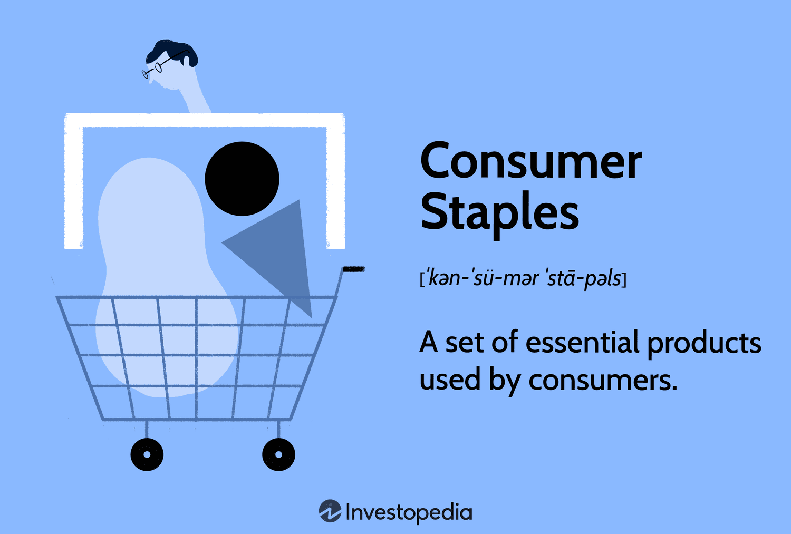

The modern economy is characterized by a intricate network of various sectors, each contributing to its growth and stability. Among these sectors, consumer staples occupy a pivotal role due to their non-cyclical nature. These essential goods and services, including food, beverages, and household products, maintain a steady demand regardless of economic fluctuations, providing a stabilizing force within the economy. This article will discuss how consumer staples contribute to Gross Domestic Product (GDP), their economic importance, and the potential impacts of algorithmic trading on this sector.

The unique position of consumer staples stems from the consistent demand they enjoy, driven by their indispensability in daily life. Unlike other sectors that may experience significant volatility due to economic changes, consumer staples remain resilient, acting as a buffer against downturns. Their stability is reflected in the way consumer spending on these goods forms a substantial part of GDP, underscoring their critical role in national economic health.

Technological advancements, particularly algorithmic trading, have begun to influence the consumer staples sector. As markets become increasingly digitized, algorithms are employed to analyze and predict market trends, potentially affecting stock volatility and liquidity within the consumer staples industry. This integration of technology holds promise for enhancing market efficiency but also introduces risks that need to be managed carefully.

In the following sections, we will explore the unwavering demand for consumer staples and their contribution to economic stability. We will also examine how algorithmic trading and other technological innovations are reshaping this traditional industry, offering both opportunities and challenges for future investment strategies.

## Table of Contents

## Understanding Consumer Staples

Consumer staples are fundamental goods that encompass essential products, including food, beverages, and household items, which maintain consistent demand irrespective of economic conditions. This categorization places them within the non-cyclical sector, characterized by their immunity to the fluctuations that typically affect other segments of the economy. Non-cyclical industries offer stable demand patterns as they provide necessities that consumers continue to purchase even during economic downturns.

The non-cyclical nature of consumer staples ensures that the market for these goods remains robust through various economic cycles. As an integral part of daily life, items such as toiletries, cleaning products, and packaged foods frequently rank as purchasing priorities, thus sustaining a steady flow of consumer spending. This consistent demand underpins economic stability by maintaining sales volumes for producers of these staples even when consumer confidence and discretionary spending dwindle.

From an investment perspective, companies operating within the consumer staples sector are often marked by reliable growth and attractive returns, making them appealing to conservative investors seeking lower-[volatility](/wiki/volatility-trading-strategies) options. These companies typically exhibit strong brand recognition and consumer loyalty, which confer a competitive advantage and contribute to persistent revenue streams. As a result, they are often seen as defensive stocks, offering investors a hedge against economic uncertainty.

The enduring nature of consumer staples also allows these companies to explore profit expansion through operational efficiencies and incremental innovations, further contributing to their appeal. Despite external economic pressures, the enduring demand ensures a degree of resilience and predictability in earnings, which is highly valued in investment portfolios prioritizing steady income and long-term capital preservation.

## Consumer Staples' Role in GDP

Consumer spending is a critical driver of economic activity, significantly influencing the Gross Domestic Product (GDP) in various economies. In certain nations, consumer spending accounts for approximately 70% of the GDP, illustrating its profound impact on economic performance. Within this context, consumer staples play a pivotal role due to their stable demand and non-cyclical nature.

The stable demand for consumer staples acts as a buffer against economic fluctuations. These products, consisting of essential items such as food and household goods, maintain their demand irrespective of the broader economic climate. As a result, they offer a measure of economic resilience during periods of economic volatility. During economic downturns, for instance, consumer staples often experience sustained or even increased demand. This trend underscores their economic importance, as these goods remain essential for daily living, even when discretionary spending might decline.

Moreover, the consistent contribution of consumer staples to GDP highlights their importance in maintaining national economic health. By consistently providing a stable level of output and demand, consumer staples sectors contribute to smoothing GDP fluctuations across economic cycles. This stability is particularly crucial during recessions, when other sectors might experience significant contractions. In such times, the consumer staples sector can help mitigate the downturn's impact on overall economic output.

Economists often quantify the multipliers associated with consumer staples to evaluate their broader influence on the economy. A simple example of this can be represented using the formula for the GDP multiplier effect:

$$
\text{GDP Change} = \text{Initial Change in Spending} \times \frac{1}{1 - MPC}
$$

where $\text{MPC}$ is the marginal propensity to consume. In the case of consumer staples, the MPC is generally higher because these goods are basic necessities that consumers are less likely to cut back on, leading to a larger multiplier effect and a substantial influence on the GDP.

In conclusion, consumer staples play an indispensable role in supporting economic stability and contributing to GDP. Their consistent demand provides a reliable economic base during various economic conditions, reinforcing their status as a crucial component of economic health.

## Industry Structure and Key Players

The consumer staples sector is an integral part of the global economy, encompassing a diverse array of industries. These industries primarily include food products, beverages, household goods, and personal care items. Their non-cyclical nature ensures that these products remain in consistent demand, irrespective of fluctuations in economic conditions. The sustained demand is a testament to their essential role in daily life, making this sector indispensable.

Key players in the consumer staples market wield significant influence due to their expansive reach and well-established brands. Companies such as Procter & Gamble, Nestle, and Coca-Cola are leading figures in this domain. Procter & Gamble is known for its extensive range of household and personal care products, while Nestle is a leader in food and beverages, offering everything from infant nutrition to bottled water. Coca-Cola's dominance in the beverage industry is unparalleled, with a diverse portfolio that includes soft drinks, juices, and other beverages.

Competition within the consumer staples sector is fierce, driven by several factors including price, brand loyalty, and innovation. Price competition is prominent as companies strive to deliver cost-effective solutions to consumers without compromising on quality. Brand loyalty is another critical aspect as these companies rely heavily on consumer trust and long-term relationships with their customer base. Innovation also plays a crucial role; businesses are continually seeking to develop new products and improve existing ones to meet changing consumer preferences and environmental sustainability goals.

Despite the intense competition, the essential nature of consumer staples products guarantees steady market demand. This demand is rooted in the daily necessity of these goods, which ranges from basic food and beverage needs to personal care and hygiene products. As a result, companies in this sector often experience stable revenue streams, making the industry attractive for investors seeking reliability and long-term growth potential.

In summary, the consumer staples sector is marked by its diverse industries, influential key players, and the critical elements of competition that drive it. This sector's ability to maintain demand through economic shifts underscores its stability and importance in the global marketplace.

## Algorithmic Trading and Consumer Staples

Algorithmic trading, often referred to as algo trading, is a method of executing orders using automated and pre-programmed trading instructions. These instructions account for variables such as time, price, and [volume](/wiki/volume-trading-strategy), enabling traders to make decisions at speeds and frequencies far beyond human capability. In the consumer staples sector, [algorithmic trading](/wiki/algorithmic-trading) holds a significant potential to influence both stock volatility and [liquidity](/wiki/liquidity-risk-premium).

The consumer staples sector is characterized by its stability due to the constant demand for essential goods like food, beverages, and personal care products. However, the introduction of algorithmic trading has added a layer of complexity by affecting how stocks in this sector are bought and sold. Algorithms used in trading are designed to identify patterns based on past and current data, predicting future price movements and executing trades in milliseconds. This capability allows traders to react quickly to market conditions that may affect consumer staples, such as economic reports, market sentiment, or sudden geopolitical events.

Enhanced market efficiency is one of the primary benefits of algorithmic trading. By processing large amounts of data quickly, algorithms can help align prices more closely with their true market value, theoretically reducing bid-ask spreads and improving the overall liquidity of consumer staples stocks. Enhanced liquidity ensures that buying and selling stocks can occur more seamlessly, which can be advantageous for both investors and companies within the sector.

However, the risk associated with algo trading should not be understated. One of the most significant concerns is the possibility of flash crashes, which are sudden, deep, and rapid market price declines, swiftly followed by a sharp rebound. These can be triggered by the sheer speed and volume of trades executed by algorithms acting on market anomalies or errors. To mitigate these risks, it is crucial for firms engaged in algorithmic trading to implement robust risk management strategies, such as circuit breakers that temporarily halt trading under volatile conditions.

Algorithmic trading in the consumer staples sector exemplifies how technology advances can reshape traditional industries. While it holds promise for increased efficiency and liquidity, it also necessitates careful oversight and regulation to prevent market disruptions. As algorithms become more sophisticated, their role in trading consumer staples will require continuous evaluation to balance the benefits against the potential risks.

## Investment Opportunities and Challenges

Investing in consumer staples offers several key advantages, primarily revolving around their resilience to economic fluctuations. This sector is renowned for its ability to provide steady dividends and maintain low volatility, characteristics highly sought after by conservative investors. The inherent stability of consumer staples stems from their essential nature, as products within this category are constantly in demand, regardless of the broader economic climate. This perpetual demand supports a reliable cash flow for companies within the sector, enabling them to distribute consistent dividends to shareholders.

Despite these benefits, the growth trajectory of consumer staples is typically slower compared to high-growth sectors like technology. However, during economic downturns, consumer staples present a defensive investment strategy. Their non-cyclical nature means that even in recessionary periods, demand for essentials persists, protecting investors from significant losses experienced in more volatile sectors. This characteristic makes consumer staples an attractive component of a diversified portfolio, particularly for those seeking to mitigate risk.

However, investing in consumer staples is not without its challenges. Rising input costs pose a significant threat to profitability. Costs associated with raw materials, labor, and logistics can fluctuate due to factors such as geopolitical tensions, environmental policies, and supply chain disruptions. These variations can compress profit margins if companies cannot pass these costs onto consumers through higher prices.

Additionally, changing consumer preferences represent another challenge. Today's consumers are increasingly shifting towards health-conscious, organic, and sustainable products, prompting companies in the sector to innovate and adapt. Businesses that fail to evolve may lose market share, impacting their growth potential. 

Moreover, competitive pressures within the sector are intense. Large multinationals dominate the market, utilizing economies of scale to maintain cost leadership and invest in brand loyalty initiatives. Smaller companies often face difficulties competing against established giants unless they can carve out niche markets or introduce unique products that attract consumers.

Investors in consumer staples must therefore balance the growth potential with the stability these companies provide. While the sector promises reliable returns, particularly in tumultuous economic times, capitalizing on investment opportunities requires a keen understanding of market dynamics and an ability to navigate the challenges inherent in this ever-evolving landscape.

## Conclusion

The consumer staples sector holds a pivotal role in maintaining economic stability and contributes significantly to the gross domestic product (GDP). This sector inherently benefits from the consistent demand for essential goods such as food, beverages, and household items, which continue to be purchased regardless of broader economic conditions. As a result, this stability offers a reliable investment avenue, particularly attractive during periods of economic uncertainty when more volatile sectors might pose greater risks.

Algorithmic trading introduces new dynamics to the consumer staples sector, influencing market behavior through rapid trading decisions based on advanced mathematical models. Although algorithmic trading can enhance market efficiency by improving liquidity and discovering trading patterns, it may also introduce risks such as increased volatility or even flash crashes if improperly managed. This modern trading approach, when carefully structured, can coexist with, and even benefit, the traditional resilience of consumer staples investments.

For future investments, the potential for innovation within the consumer staples sector should be considered alongside its time-tested strengths. Investors are increasingly required to balance the stable returns associated with these essential goods against the dynamic market conditions introduced by technological advancements like algorithmic trading. To maximize investment outcomes, a comprehensive strategy that accounts for both innovative developments and the enduring demand for consumer staples will be essential.

## References & Further Reading

[1]: Vassalou, M. (2003). "News Related to Future GDP Growth as a Risk Factor in Equity Returns." Journal of Financial Economics, 68(1), 47-73. [Link](https://www.sciencedirect.com/science/article/pii/S0304405X02002489)

[2]: ["Advances in Financial Machine Learning"](https://www.amazon.com/Advances-Financial-Machine-Learning-Marcos/dp/1119482089) by Marcos Lopez de Prado

[3]: Arora, N., Juul, J., & Zunino, G. (2016). "Algorithmic Trading and Price Volatility." Econometric Reviews, 36(1-3), 195-220. [Link](https://pubmed.ncbi.nlm.nih.gov/19150199/)

[4]: ["Machine Learning for Algorithmic Trading"](https://github.com/stefan-jansen/machine-learning-for-trading) by Stefan Jansen

[5]: Hymans, S. H. (2003). "Consumer Spending and the Economic Recovery." Business Economics, 38(3), 19-27. [Link](https://www.brookings.edu/wp-content/uploads/1970/06/1970b_bpea_hymans_ackley_juster.pdf)