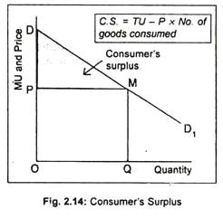

In today's fast-paced economic landscape, understanding consumer surplus is crucial for evaluating market efficiency and consumer satisfaction. Consumer surplus is an essential concept in microeconomics, reflecting the benefits consumers receive when they pay less for a product than they are willing to. By representing the difference between the total amount consumers would be willing to pay for a good or service and the amount they actually pay, consumer surplus serves as a key indicator of consumer welfare and market efficiency.

This article examines the intricacies of consumer surplus and its measurement, underscoring its significance in market analysis with a particular focus on algorithmic trading. Consumer surplus calculation often involves using the demand curve to identify areas representing the surplus, quantified as the area under the demand curve but above the market price.

The article will cover the methods used to determine consumer surplus, its real-world implications, and its effects on market dynamics when algorithmic trading is considered. Algorithmic trading, which employs advanced computer algorithms to execute trades, can influence consumer surplus by affecting how market prices are established. This technology reduces transaction costs and enhances market liquidity, which may alter the distribution of consumer benefits.

Join us as we explore these concepts with practical examples, enabling a more robust grasp of how consumer surplus operates within modern economic systems. By the end of this article, readers will have a comprehensive understanding of consumer surplus and its role in both traditional and algorithmic-driven markets.

## Table of Contents

## Understanding Consumer Surplus

Consumer surplus represents the difference between what consumers are willing to pay and what they actually pay for a good or service. This concept is central to microeconomic theory, providing an important measure of the added benefit that consumers gain from engaging in market transactions. Graphically, consumer surplus is illustrated as the area under the demand curve and above the market price level on a supply and demand diagram. 

The concept of consumer surplus is closely linked to the theory of marginal utility, which describes the additional satisfaction or utility that an individual gains from consuming one more unit of a good or service. As consumers make purchasing decisions, they evaluate whether the utility gained from consumption exceeds the price they have to pay. The positive difference, when consumers pay less than what they would have been willing to pay for a good, constitutes the consumer surplus.

Mathematically, if we denote the consumer's willingness to pay as WTP and the market price as P, the individual consumer surplus for a certain quantity can be expressed using the formula:

$$
\text{Consumer Surplus} = \int_{0}^{Q} (\text{WTP}(q) - P) \,dq
$$

Where $Q$ is the quantity purchased, and $\text{WTP}(q)$ represents the willingness to pay at each quantity $q$.

Consumer surplus serves as a vital indicator of consumer welfare, offering insights into the efficiency of markets. A larger consumer surplus generally suggests that consumers are, on aggregate, receiving greater benefits from goods and services, relative to their expenditures. As such, economists and policymakers often rely on consumer surplus as a benchmark for evaluating the advantages that consumers derive from competitive markets, particularly when assessing the impacts of new policies or market changes on consumer welfare and overall economic efficiency.

## Measuring Consumer Surplus

To calculate consumer surplus, economists use the demand curve, which illustrates the relationship between the price of a product and the quantity demanded by consumers. The demand curve typically slopes downward, reflecting the basic economic principle that as the price of a good decreases, the quantity demanded increases, and vice versa.

Consumer surplus is mathematically calculated using the formula:
$$
\text{Consumer Surplus} = \frac{1}{2} \times Q_d \times \Delta P
$$
where $Q_d$ represents the equilibrium quantity, and $\Delta P$ is the price difference, defined as the difference between what consumers are willing to pay and what they actually pay.

This formula is derived from the geometric representation of consumer surplus on the demand curve, which is the area of the triangle formed by the vertical line at the quantity bought, the price axis, and the demand curve. The height of this triangle is $\Delta P$, and the base is $Q_d$.

By analyzing the demand curve, economists can assess consumer surplus on both individual and aggregate levels, providing insights into overall market dynamics. For instance, when aggregated across individuals, consumer surplus can serve as an indicator of consumer welfare within an economy.

Consumer surplus is not static and varies with several factors, including price elasticity of demand and the marginal utility of goods. Price elasticity measures the responsiveness of the quantity demanded to changes in price; more elastic demand leads to larger potential consumer surplus, as consumers are more willing to change their buying habits in response to price changes. Similarly, the concept of marginal utility, which describes the added satisfaction from consuming additional units of a good, influences how much surplus consumers derive from their purchases. Changes in consumer preferences and external market conditions can also lead to shifts in consumer surplus. As such, consumer surplus serves as a useful tool for understanding consumer behavior and assessing market efficiency.

## Market Examples of Consumer Surplus

In the airline industry, consumer surplus is a frequent phenomenon, particularly when consumers purchase tickets at discounted rates that are valued higher than the purchase price. This surplus emerges because consumers often have a higher willingness to pay compared to the actual price they pay, especially during sales or promotions. For example, a traveler might be prepared to pay $300 for a flight but secures a ticket for $200, resulting in a consumer surplus of $100.

Technological advancements in competitive markets have significantly contributed to reducing prices, thus enhancing consumer surplus. Automation, improved supply chain logistics, and better market data access allow companies to optimize pricing strategies, making products more affordable and accessible. For instance, the adoption of ride-sharing apps has reduced transportation costs considerably, broadening the consumer surplus for individuals using these services. By lowering operational costs and increasing market competition, technology not only makes products more accessible but also stretches consumer benefits through surplus.

Online retail platforms are another domain where consumer surplus is starkly evident. These platforms often utilize algorithms to offer dynamic pricing and promotions that lower prices below what consumers are willing to pay, thereby increasing consumer surplus. For instance, e-commerce companies frequently run sales and special discounts that allow consumers to obtain products at prices lower than their maximum willingness to pay. If a customer is willing to spend $150 on a product but buys it for $100 during a sale, the consumer surplus for that transaction amounts to $50.

These examples highlight how consumer surplus serves as an indicator of consumer benefit and market health. By offering goods and services at prices below consumer willingness to pay, industries enhance consumer welfare, reflecting market efficiency and competitive dynamics.

## Algorithmic Trading and Consumer Surplus

Algorithmic trading, a prevalent component of modern financial markets, employs sophisticated computer algorithms to execute orders based on pre-defined criteria. Its primary advantages include enhancing market [liquidity](/wiki/liquidity-risk-premium) and efficiency by facilitating faster and more accurate trade execution. This form of trading holds significant implications for consumer surplus, an economic measure representing the difference between what consumers are willing to pay for a good versus what they actually pay.

In high-frequency trading environments, algorithms can quickly adapt to shifts in market conditions, potentially influencing both consumer surplus and producer surplus. These trading strategies can adjust bid and ask prices instantaneously, thereby affecting the overall market price and the consumer surplus. For instance, when algorithms enhance price discovery by narrowing the bid-ask spread, it can lead to lower purchasing costs for consumers, thereby increasing consumer surplus.

Furthermore, [algorithmic trading](/wiki/algorithmic-trading) reduces transaction costs and mitigates information asymmetry. Lower transaction costs can result from decreased bid-ask spreads and reduced price impact per trade. These efficiencies often translate to more competitive market prices, which, in turn, can enhance consumer surplus. When market participants, including individual investors and institutional traders, benefit from lower costs, consumer surplus is likely to expand as consumers effectively pay less than their maximum willingness to pay.

However, the influence of algorithmic trading on economic measurements like consumer surplus requires careful examination. While algorithmic trading contributes to market efficiency, it can also introduce [volatility](/wiki/volatility-trading-strategies) and contribute to market phenomena such as flash crashes. This paradox highlights the need for rigorous analysis of algorithmic trading strategies and their implications on market welfare metrics like consumer surplus.

Understanding the broader impacts of algorithmic trading on consumer surplus involves examining how these trading mechanisms interact with various market conditions. Researchers and policymakers need to consider how algorithms' speed and efficiency might alter market dynamics, potentially reshaping the economic landscapes and consumer benefits.

## Conclusion

Consumer surplus stands as a pivotal metric in gauging market health and providing insights into consumer benefits. It reflects not only the advantages that consumers gain through favorable pricing but also serves as a benchmark for understanding broader market efficiency. By analyzing consumer surplus, economists and market analysts gain valuable information about consumer behavior, preferences, and the overall economic environment.

Utilizing examples from various industries enhances our comprehension of consumer surplus's practical implications. For instance, markets like airlines and online retail illustrate how consumer surplus can manifest through discounted pricing—where the price consumers pay is substantially lower than what they are willing to pay. This surplus is amplified by technological advancements and competitive market structures that drive prices down, allowing more consumers to access goods and services.

The integration of algorithmic trading into financial markets adds another layer of complexity. Algorithmic trading, through its efficiency in executing trades at optimal prices, can shift market dynamics, thereby influencing consumer and producer surplus. Such trading reduces transaction costs and can improve market liquidity, which indirectly affects consumer surplus by impacting price structures and accessibility of financial products. Therefore, understanding how algorithmic trading interfaces with traditional economic measurements like consumer surplus is crucial for evaluating its broader effects on markets.

As markets continue to evolve in response to technological innovations and changing consumer demands, grasping the nuances of consumer surplus remains essential. This understanding aids economists and practitioners in navigating the intricate web of economic interactions and ensures that policies and market strategies are aligned with consumer and societal benefits. Therefore, consumer surplus not only reflects current market dynamics but also serves as a strategic tool for anticipating future trends and challenges.

## FAQs

### What factors can lead to an increase in consumer surplus?

Several factors can increase consumer surplus, which is the benefit consumers receive when they pay less for a product than they are willing to pay. A drop in market prices, often driven by increased competition or advancements in technology, is a primary contributor. For instance, technological innovations can result in more efficient production processes, reducing costs and lowering prices. Additionally, increased competition in a market can force sellers to lower prices, thereby enhancing consumer surplus. 

Promotional activities and discounts offered by retailers also expand consumer surplus by temporarily reducing the price of goods below consumers' maximum willingness to pay. Lastly, greater consumer information and transparency can lead consumers to make more informed purchasing decisions, thereby increasing the likelihood of achieving a higher consumer surplus.

### How does consumer surplus differ between elastic and inelastic demand?

Consumer surplus varies significantly based on the price elasticity of demand. Elastic demand implies that consumers are sensitive to price changes; a small decrease in price can lead to a substantial increase in quantity demanded. In such markets, a reduction in price can significantly boost consumer surplus as consumers take advantage of lower prices by purchasing more of the good or service.

Conversely, inelastic demand signifies that consumers are less responsive to changes in price. In these scenarios, price reductions have a less pronounced effect on consumer surplus. Although consumers still benefit from lower prices, the increase in consumer surplus is smaller because the quantity demanded does not increase substantially. This variance arises from the differences in how quantity demanded responds to price changes within elastic and inelastic markets.

### In what ways can algorithmic trading impact consumer surplus?

Algorithmic trading, which uses computer algorithms to execute trades at optimal prices, affects consumer surplus indirectly by influencing market prices, liquidity, and efficiency. By facilitating quick trade executions and reducing transaction costs, algorithmic trading can lead to narrower bid-ask spreads and more efficient price discovery. Improved market conditions can enhance consumer surplus by offering securities at more favorable prices, reflecting lower transaction costs and minimized information asymmetry.

In high-frequency trading environments, algorithms have the capacity to rapidly assess and respond to market information, potentially affecting the price dynamics of traded assets. This capability can have broader implications on consumer surplus, especially if the price changes trickle down to goods and services relied on by consumers. The influence of algorithmic trading on consumer surplus underscores the need for careful market analysis to ensure it contributes positively to economic welfare.

### What role does consumer surplus play in policy-making and market regulation?

Consumer surplus is a critical measure in policy-making and market regulation, as it reflects the welfare of consumers in a market. Policymakers use consumer surplus to evaluate the benefits of regulatory changes or market interventions. For example, when considering antitrust regulations, consumer surplus provides insight into how mergers or monopolies might affect market prices and consumer welfare.

In market regulation, maintaining or enhancing consumer surplus can be a goal to ensure fair market practices and promote consumer welfare. Policies aimed at increasing competition, such as easing entry barriers for new competitors or enforcing antitrust laws, are designed with consumer surplus in mind. By maximizing consumer surplus, regulators strive to ensure that markets operate efficiently and equitably, benefiting consumers through better prices and improved product availability.

## References & Further Reading

[1]: Varian, H. R. (2010). ["Intermediate Microeconomics: A Modern Approach"](https://archive.org/details/hal-r.-varian-intermediate-microeconomics-a-modern-approach-8th-edition-w.-w.-norton-co.-2010). W.W. Norton & Company.

[2]: Pindyck, R. S., & Rubinfeld, D. L. (2017). ["Microeconomics"](https://books.google.com/books/about/Microeconomics.html?id=6-gsDgAAQBAJ). Pearson Education.

[3]: Lopez de Prado, M. (2018). ["Advances in Financial Machine Learning"](https://www.amazon.com/Advances-Financial-Machine-Learning-Marcos/dp/1119482089). Wiley.

[4]: Harris, L. (2003). ["Trading and Exchanges: Market Microstructure for Practitioners"](https://academic.oup.com/book/52292). Oxford University Press.

[5]: O'Hara, M. (1995). ["Market Microstructure Theory"](https://www.semanticscholar.org/paper/Market-Microstructure-Theory-O'Hara/2bd0833b023f3270a2a6bf301e86b8e02e2f28ed). Blackwell Publishers.

[6]: Jarrow, R., Chatterjea, A. (2013). ["Derivative Securities"](https://www.academia.edu/58832068/An_Introduction_to_Derivative_Securities_Financial_Markets_and_Risk_Management). South-Western College Pub.

[7]: Chan, E. P. (2008). ["Quantitative Trading: How to Build Your Own Algorithmic Trading Business"](https://github.com/ftvision/quant_trading_echan_book). Wiley.