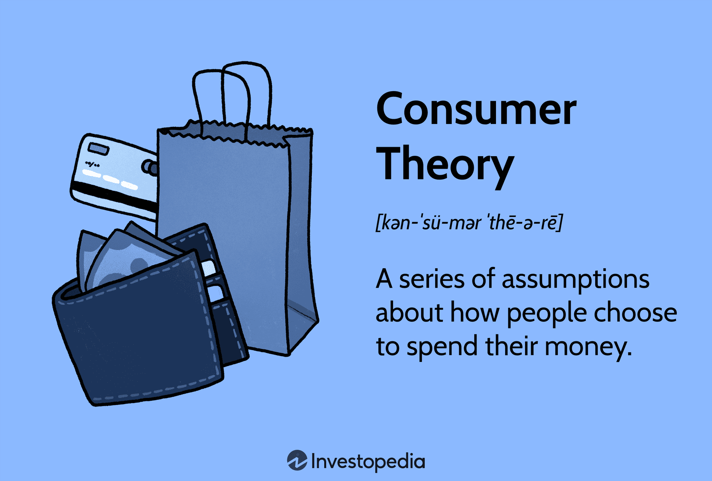

## Table of Contents

## What is consumer theory and why is it important in economics?

Consumer theory is a part of economics that looks at how people decide what to buy. It tries to understand why people choose certain things over others, based on their tastes, how much money they have, and the prices of things. Economists use this theory to predict what people will buy and how they will react if prices change or if they get more money.

This theory is important because it helps businesses and governments make better decisions. Businesses can use it to figure out what products to make and how to price them so that people will want to buy them. Governments can use it to understand how changes in taxes or welfare might affect what people buy and how much they spend. By understanding consumer behavior, both businesses and governments can plan better and help the economy grow in a healthy way.

## What are the basic assumptions of consumer theory?

Consumer theory makes some basic assumptions about how people behave when they buy things. One big assumption is that people always want to get the most out of what they have. This means they try to be as happy as they can with the money they have. Economists call this "utility maximization." Another assumption is that people know what they like and can compare different things to see which one they prefer. They also assume that people's tastes don't change much over time.

Another important assumption is that people have a limited amount of money, which economists call a "budget constraint." This means people can't buy everything they want, so they have to make choices. Consumer theory also assumes that people are rational, meaning they make decisions based on logic and not emotions. They will choose the option that gives them the most satisfaction within their budget. These assumptions help economists build models to predict how people will spend their money.

## How does the concept of utility relate to consumer theory?

Utility is a key idea in consumer theory. It's like a measure of how happy or satisfied someone feels when they use or own something. Economists use the term "utility" to talk about this happiness. In consumer theory, people are thought to always try to get the most utility they can from the money they have. This means they pick the things that make them the happiest within what they can afford.

The idea of utility helps economists understand why people choose one thing over another. For example, if someone likes apples more than oranges, they will get more utility from buying apples. Economists use this to predict what people will buy and how they will act when prices change. By understanding utility, they can see how people make choices to feel as happy as possible with their money.

## What is the difference between total utility and marginal utility?

Total utility is the total amount of happiness or satisfaction someone gets from using or owning all the things they have. Imagine you eat three slices of pizza. The total utility is how happy you feel after eating all three slices together. It's like adding up all the happiness you get from each slice.

Marginal utility, on the other hand, is the extra happiness you get from having just one more of something. Using the pizza example, the marginal utility of the third slice is the extra happiness you feel from eating that slice compared to just eating two slices. It's about the change in your happiness when you add one more item. Economists use both total and marginal utility to understand how people make choices about what to buy.

## What is a budget constraint and how does it affect consumer choices?

A budget constraint is like a limit on how much money someone can spend. It shows all the different combinations of things a person can buy with the money they have. Imagine you have $10. You can buy different things with that $10, but you can't spend more than that. So, if you want to buy something that costs $8, you only have $2 left for other things. That's what a budget constraint is all about.

This budget constraint really affects what people choose to buy. Because they can't spend more money than they have, they have to think carefully about what they want the most. They might really want a new toy, but if it costs too much, they might have to pick something else that's cheaper. This means people often have to make trade-offs, choosing one thing over another to stay within their budget. It's all about making the best choices with the money they have.

## How do indifference curves represent consumer preferences?

Indifference curves are a way to show what a person likes and how they make choices. Imagine you like both apples and oranges. An indifference curve is a line on a graph that shows all the different combinations of apples and oranges that make you just as happy. If you have 2 apples and 3 oranges, you might be just as happy with 1 apple and 5 oranges. Both points would be on the same indifference curve because they give you the same level of happiness.

These curves help economists understand how people make trade-offs. If you're on one indifference curve and you want to move to a higher one, it means you want to be happier. But to do that, you might need more apples, more oranges, or a different mix of both. The shape of the curve shows how much you're willing to trade one thing for another. If the curve is steep, it means you need a lot more of one thing to give up a little of the other. This helps show what you value more and how you make choices based on what you like and what you can afford.

## What is the goal of maximizing utility within a budget constraint?

The goal of maximizing utility within a budget constraint is to make the best use of your money to feel as happy as possible. Imagine you have $20 to spend on snacks. You want to buy the snacks that will make you the happiest within that $20. This means [picking](/wiki/asset-class-picking) the right mix of snacks so that you don't spend more than you have, but you still get the most enjoyment out of what you buy.

To do this, you need to think about what you like and how much each snack costs. If you really love chocolate and it's cheaper than chips, you might buy more chocolate to get more happiness from your money. By carefully choosing what to buy, you can make sure that every dollar you spend helps you feel as good as possible. This is what economists mean by maximizing utility within a budget constraint.

## How does the concept of consumer equilibrium illustrate optimal choice?

Consumer equilibrium is when someone picks the best mix of things to buy that makes them the happiest without spending more money than they have. Imagine you have $10 to spend on apples and oranges. You really like both, but you need to decide how many of each to buy to feel as happy as possible. If you buy too many apples, you might not have enough money for oranges, and if you buy too many oranges, you might miss out on the happiness you get from apples. When you find the right balance, where you can't make yourself happier by changing what you buy, you're at consumer equilibrium.

This idea shows how people make smart choices with their money. At consumer equilibrium, the happiness you get from the last dollar spent on apples is the same as the happiness you get from the last dollar spent on oranges. If it wasn't, you could switch some money from one to the other and be happier. So, being at consumer equilibrium means you've found the best way to spend your money to feel as good as you can within your budget.

## What role do income and substitution effects play in consumer decision-making?

When the price of something changes, it can affect what people decide to buy in two ways: the income effect and the substitution effect. The income effect is about how a price change makes it feel like you have more or less money. If the price of apples goes down, it's like you have more money to spend on other things, so you might buy more apples and other stuff too. But if the price goes up, it feels like you have less money, so you might buy fewer apples and cut back on other things.

The substitution effect is about switching to cheaper things when prices change. If apples get more expensive, you might decide to buy more oranges instead because they're now a better deal. On the other hand, if apples get cheaper, you might buy more apples and fewer oranges because apples are now a better value. Both the income and substitution effects help explain why people change what they buy when prices go up or down. They show how people try to make the best choices with the money they have.

## How can consumer theory be applied to real-world market scenarios?

Consumer theory helps businesses and governments understand how people make buying choices. Imagine a company wants to sell a new type of snack. They can use consumer theory to figure out what price to set for the snack. If they know how much people like the snack and how much money they have, they can guess how many snacks people will buy at different prices. This helps the company decide if they should make the snack cheaper to sell more or keep it expensive to make more money per snack. Governments can also use consumer theory to see how changing taxes might affect what people buy. For example, if they raise taxes on soda, consumer theory can help predict if people will buy less soda or switch to other drinks.

Another way consumer theory is used is in understanding how people react to sales and discounts. Stores often have big sales during holidays like Black Friday. Consumer theory helps them predict how many people will come to the store and what they will buy when prices are lower. It's all about understanding that people want to get the most happiness from their money. If a store knows people really want a certain toy, they might offer a big discount on it to attract more customers. This can help the store sell more toys and make more money overall. By using consumer theory, businesses and governments can make better plans and help the economy work better for everyone.

## What are some advanced models of consumer behavior beyond basic utility theory?

Beyond basic utility theory, there are more advanced models that try to understand how people make choices in a more detailed way. One of these is the behavioral economics model. This model looks at how people's emotions, habits, and other psychological factors affect their buying decisions. For example, it might explain why someone buys something they don't really need just because it's on sale, even if it doesn't fit their budget. Behavioral economics helps us see that people don't always make perfect, logical choices and that things like peer pressure or the way a product is shown can change what people buy.

Another advanced model is the prospect theory, which looks at how people make choices when they're not sure what will happen. This model says that people care more about avoiding losses than gaining something new. For instance, if someone is choosing between a sure thing and a gamble, they might pick the sure thing even if the gamble could give them more. Prospect theory helps explain why people might buy insurance or why they might be scared to invest in the stock market. These models help businesses and governments understand consumer behavior better and make smarter decisions about things like pricing and marketing.

## How do behavioral economics findings challenge traditional consumer theory assumptions?

Behavioral economics findings show that people don't always make the best choices like traditional consumer theory says. Traditional theory assumes people always pick what makes them happiest with the money they have. But behavioral economics says people's feelings, habits, and other things can make them choose differently. For example, people might buy something just because it's on sale, even if they don't really need it. This goes against the idea that people always make logical choices based on what they like and their budget.

Another big challenge from behavioral economics is that people care more about avoiding losses than gaining something new. Traditional consumer theory assumes people are always trying to get the most happiness from their money. But if people are more scared of losing money than excited about gaining it, they might make choices that don't seem to make sense. For instance, they might not take a good deal if it feels risky. This shows that people's choices can be affected by how they feel about risks and losses, not just by what makes them the happiest.

## References & Further Reading

[1]: Bergstra, J., Bardenet, R., Bengio, Y., & Kégl, B. (2011). ["Algorithms for Hyper-Parameter Optimization."](https://papers.nips.cc/paper/4443-algorithms-for-hyper-parameter-optimization) Advances in Neural Information Processing Systems 24.

[2]: ["Advances in Financial Machine Learning"](https://www.amazon.com/Advances-Financial-Machine-Learning-Marcos/dp/1119482089) by Marcos Lopez de Prado

[3]: ["Evidence-Based Technical Analysis: Applying the Scientific Method and Statistical Inference to Trading Signals"](https://www.amazon.com/Evidence-Based-Technical-Analysis-Scientific-Statistical/dp/0470008741) by David Aronson

[4]: ["Machine Learning for Algorithmic Trading"](https://github.com/stefan-jansen/machine-learning-for-trading) by Stefan Jansen

[5]: ["Quantitative Trading: How to Build Your Own Algorithmic Trading Business"](https://www.amazon.com/Quantitative-Trading-Build-Algorithmic-Business/dp/1119800064) by Ernest P. Chan