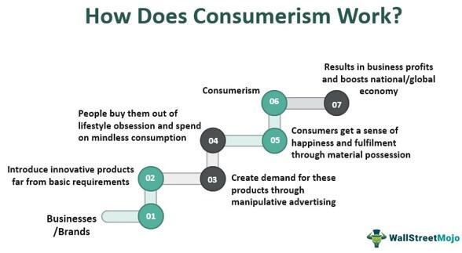

Consumerism and algorithmic trading represent two significant forces shaping the modern economy. Consumerism is an economic and cultural phenomenon characterized by the increased acquisition of goods and services. It primarily serves as a driver of demand within economies, influencing production patterns, employment, and overall economic growth. In contrast, algorithmic trading involves using computer algorithms to make trading decisions, aiming to optimize market operations through speed, efficiency, and the elimination of human error.

Understanding these two concepts is crucial in today's globalized and digital-first marketplace. Consumerism directly affects aggregate demand, influencing everything from GDP growth to employment rates. It reflects cultural values and societal norms, often associated with materialism and a quest for higher standards of living. Algorithmic trading, on the other hand, has revolutionized financial markets since its burgeoning in the 1980s, shifting trading from traditional, human decision-making processes to rapid, automated ones. This shift has significant implications for market liquidity, efficiency, and, occasionally, volatility.



As we consider the economic impacts, advantages, and disadvantages of these phenomena, it is imperative to recognize their broader significance. Both consumerism and algorithmic trading have repercussions beyond their immediate economic outcomes, influencing societal values, environmental considerations, and ethical frameworks. Understanding their roles and impacts enables policymakers, economists, and stakeholders to develop strategies that maximize their benefits while mitigating potential drawbacks, ensuring that they serve a sustainable economic future.

## Table of Contents

## Understanding Consumerism

Consumerism is a cultural and economic paradigm that promotes the accumulation of goods and services in continually increasing quantities. This concept is not merely an indicator of personal lifestyle choices but a profound driver of economic activities. It posits that by encouraging spending and consumption, economies could achieve sustained growth and development.

The roots of consumerism are intricately related to Keynesian economics, which emerged in response to the economic hardships of the Great Depression in the 20th century. Keynesian economics advocates for active government intervention in the economy, primarily through fiscal and monetary measures to manage aggregate demand. Consumerism aligns with this school of thought, emphasizing spending as a means of stimulating economic activity. In Keynesian terms, increased consumption leads to higher demand for goods and services, prompting businesses to expand production and potentially leading to higher employment rates. This cycle, theoretically, propels economic growth—a phenomenon known as the multiplier effect, where an initial increase in spending leads to a more significant increase in national income.

However, consumerism extends its impact beyond economic [statistics](/wiki/bayesian-statistics), seeping into societal values and individual well-being. On a societal level, consumerism can lead to a shift in values, prioritizing material wealth and consumption over other forms of success and fulfillment. This materialist ideology can influence societal norms, establishing consumption as a measure of social status and success.

At the personal level, consumerism can have complex implications for well-being. It can contribute to increased satisfaction through access to goods and services that improve quality of life. Yet, consumerism is also associated with psychological effects such as status anxiety. The pressure to maintain consumption levels can create stress and a perpetual cycle of desire for more, leading to dissatisfaction. Furthermore, consumerism can detract from personal fulfillment when individuals focus excessively on material possessions at the expense of intangible values such as relationships and community engagement.

Thus, while consumerism can be a powerful engine for economic growth, its broader societal and psychological implications suggest that a balance must be struck between encouraging consumption and fostering sustainable personal and societal well-being.

## Economic Impact of Consumerism

Consumerism plays a crucial role in modern economies by substantially influencing Gross Domestic Product (GDP) and aggregate demand. At its core, consumer spending represents the largest component of GDP in most developed nations. According to the expenditure approach of calculating GDP, it is expressed as:

$$
\text{GDP} = C + I + G + (X - M)
$$

where $C$ is consumer spending, $I$ is investment, $G$ is government spending, and $(X - M)$ represents net exports. Consumer spending thus directly affects economic growth, as it comprises a major portion of GDP.

The positive feedback loop between consumerism and economic growth can be explained through the mechanism known as the "multiplier effect". When consumers increase their spending, businesses respond by ramping up production to meet demand, leading to more employment and increased wages. This, in turn, provides consumers with greater income to spend, further amplifying economic activity. Studies indicate that consumer confidence and spending behavior can significantly influence economic cycles, as seen during periods of economic expansion and contraction.

However, the economic impact of consumerism is not solely positive. A significant concern is environmental degradation. Increased consumer demand often necessitates escalated production, which can result in over-extraction of natural resources, pollution, and waste generation. The consumer-driven demand for goods encourages industries to adopt practices that may not be sustainable, leading to long-term ecological consequences. According to the United Nations Environment Programme (UNEP), unsustainable consumption patterns are a leading cause of environmental pressure.

Moreover, consumerism can exacerbate social inequality. While it drives economic growth, the benefits are not evenly distributed. Often, wealthier segments of society experience greater gains, while lower-income sectors may not see proportional improvements. This disparity can lead to increased social stratification, reducing social mobility and leading to societal tension. Economists such as Thomas Piketty have discussed how wealth concentration can intensify due to capitalist structures inherently resistant to equitable distribution.

In summary, while consumerism is a vital driver for GDP and economic expansion due to its stimulation of aggregate demand, it also poses significant challenges. Environmental impacts and social inequalities require careful management and sustainable policy strategies to balance economic growth with ecological and societal well-being.

## Pros and Cons of Consumerism

Consumerism, characterized by an inclination towards acquiring goods and services, plays a pivotal role in modern economies. Among its noted benefits, economic growth stands out prominently. Consumerism fuels demand for products and services, creating a cycle that spurs increased production and generates employment. This demand effectively drives Gross Domestic Product (GDP) expansion, as consumer spending constitutes a substantial component of GDP in many economies. The production uptick associated with consumerism does not merely enhance economic activity; it also encourages innovation and efficiency among producers striving to meet the evolving needs of consumers.

Concomitantly, consumerism contributes to improved standards of living. As production scales up, a variety of goods and services become more accessible, often at reduced costs due to economies of scale. Additionally, this enhancement in accessibility empowers consumers to enjoy higher quality products, potentially improving overall life satisfaction.

However, the perks of consumerism are marred by several drawbacks. Cultural homogenization is one such downside. The global spread of similar consumer goods often erodes cultural diversity, leading to a unified global culture dominated by pervasive brands and products. This phenomenon can diminish unique cultural identities and traditions, leading to a dilution of cultural heritage.

Overconsumption represents another significant issue tied to consumerism. The relentless pursuit of new products can result in wastage and depletion of resources, posing challenges to sustainability. This inclination towards constant consumption is exacerbated by marketing strategies that promote the acquisition of the newest or trendiest items.

Furthermore, the environmental impacts of consumerism are profound. The lifecycle of goods — from production to disposal — often entails resource extraction, energy consumption, and pollution. This trajectory contributes to environmental degradation, manifesting in effects like deforestation, habitat destruction, and climate change.

Consumerism also presents psychological challenges. Status anxiety is one such effect, as individuals strive to maintain or elevate their social standing through material acquisition. This anxiety can lead to a perpetual cycle of comparison and competition, detracting from emotional well-being. Additionally, consumerism is frequently critiqued for propagating materialism — the belief that acquiring goods equates to happiness and success. This mindset can overshadow intrinsic values like relationships and experiences, leading to a hollow pursuit of fulfillment.

The dual nature of consumerism, encompassing both economic benefits and societal costs, necessitates a nuanced understanding that embraces its role in growth while mitigating its less desirable consequences.

 to Algorithmic Trading

Algorithmic trading refers to the process of utilizing computer algorithms to automate financial trading decisions. These algorithms are sequences of instructions that can execute orders rapidly and accurately based on predefined criteria such as timing, price, and quantity. The core advantage of [algorithmic trading](/wiki/algorithmic-trading) is its ability to analyze large datasets at exceptional speeds, enabling traders to capitalize on fleeting market opportunities that human traders might miss. 

The rise of algorithmic trading in financial markets gained [momentum](/wiki/momentum) in the 1980s with the advent of advanced computing technologies and electronic communication networks. This period marked a significant shift from manual to automated trading, primarily driven by the need for efficiency and accuracy. As computational power increased, financial institutions began to adopt algorithm-based systems to manage their trading activities. By the 1990s, algorithmic trading had become a crucial part of equity markets, and its adoption has only expanded with advancements in [machine learning](/wiki/machine-learning), [artificial intelligence](/wiki/ai-artificial-intelligence), and big data analytics.

Algorithmic trading differs significantly from traditional methods of trading, which rely largely on human intuition and decision-making. Traditional trading often involves manual analysis by traders, who make decisions based on a combination of fundamental and technical analyses, as well as market sentiment. In contrast, algorithmic trading minimizes human intervention, leveraging computational methods to process market data and execute trades based on statistical models and historical patterns. This approach reduces the emotional and psychological biases associated with human traders, allowing for more consistent performance.

Furthermore, algorithmic trading facilitates high-frequency trading ([HFT](/wiki/high-frequency-trading-strategies)), a subset of algorithmic trading characterized by extremely high turnover rates and short-term investment horizons. HFT strategies rely on sophisticated algorithms to capitalize on small price discrepancies occurring within milliseconds, thereby requiring an infrastructure capable of executing and canceling orders at lightning speed.

A simple example of an algorithmic trading strategy can be implemented using Python. Consider the following code that executes a moving average crossover strategy:

```python
import pandas as pd
import numpy as np

# Load historical market data
data = pd.read_csv('market_data.csv')
data['MA50'] = data['Close'].rolling(window=50).mean()
data['MA200'] = data['Close'].rolling(window=200).mean()

# Create buy/sell signals
data['Signal'] = 0
data['Signal'][50:] = np.where(data['MA50'][50:] > data['MA200'][50:], 1, 0)

# Calculate the daily returns based on signals
data['Position'] = data['Signal'].shift(1)
data['Strategy Returns'] = data['Position'] * data['Close'].pct_change()

# Evaluate strategy performance
strategy_performance = data['Strategy Returns'].cumsum()
print("Total Strategy Returns: {:.2f}%".format(strategy_performance[-1] * 100))
```

This code demonstrates a basic algorithmic trading strategy using the moving average crossover method, where buy signals are generated when the short-term moving average (50 days) crosses above the long-term moving average (200 days), and vice versa for sell signals. This is a rudimentary example, yet it captures the essence of how algorithms can automate trading processes by responding to specific market conditions. 

Through the integration of automated systems, algorithmic trading has transformed how financial markets operate, introducing new efficiencies and challenges that continue to shape the evolution of trading strategies and market dynamics.

## Economic Impact of Algorithmic Trading

Algorithmic trading has become a significant component of modern financial markets, fundamentally transforming how trading is conducted through its reliance on sophisticated mathematical models and high-speed computing technologies. One of the primary economic impacts of algorithmic trading is its ability to enhance market [liquidity](/wiki/liquidity-risk-premium) and efficiency. Liquidity is improved as algorithms can execute trades rapidly and at a [high frequency](/wiki/high-frequency-trading), thus enabling the swift and efficient matching of buy and sell orders. This increased liquidity reduces bid-ask spreads, minimizing transaction costs for traders and making markets more cost-effective, which in turn can attract further participation and investment. 

Efficiency in markets is achieved through the capacity of algorithmic trading systems to process vast amounts of information almost instantaneously, adjusting quotes and orders based on current conditions with minimal human intervention. This aids in the quick assimilation of new information into prices, thereby increasing the informational efficiency of financial markets. Consequently, this reduces the opportunities for [arbitrage](/wiki/arbitrage) and ensures that prices more accurately reflect underlying values.

Despite these benefits, algorithmic trading can potentially contribute to market [volatility](/wiki/volatility-trading-strategies) and instability. High-frequency algorithms that rapidly generate large volumes of trades can lead to excessive short-term market fluctuations. For instance, during the 2010 Flash Crash, the Dow Jones Industrial Average briefly dropped by about 1,000 points due, in part, to algorithmic trading activities. Such instances highlight how the speed and scale of algorithmic trading can occasionally lead to unintended consequences, creating instability in financial markets.

For market participants and the broader economy, the implications of the widespread adoption of algorithmic trading are multifaceted. While increased liquidity and market efficiency can lower costs and improve resource allocation, the potential for amplified volatility poses risks. Regulators may face challenges in monitoring and managing these trades, especially as algorithms become more complex and pervasive. They must balance fostering innovation and ensuring the stability and integrity of financial markets.

To address these risks, market structures and regulatory frameworks are continuously evolving. Strategies include implementing circuit breakers to pause trading during extreme volatility and mandating transparency in algorithmic trading operations to identify and mitigate potentially destabilizing practices. Overall, the impact of algorithmic trading on economic efficiency and market dynamics underscores the need for a careful calibration of its integration into the financial system to harness its benefits while mitigating inherent risks.

## Pros and Cons of Algorithmic Trading

Algorithmic trading, often referred to as algo-trading, leverages sophisticated mathematical models and automated instructions to execute financial trades at speeds and frequencies that are impossible for a human trader. It offers several advantages and possesses a few drawbacks, alongside ethical considerations.

### Advantages

1. **Speed and Efficiency**: One of the most significant advantages of algorithmic trading is the speed at which transactions are executed. Algorithms can analyze multiple market variables simultaneously and execute trades in fractions of a second. For instance, in high-frequency trading (HFT), which is a subset of algorithmic trading, transactions can occur in microseconds. This speed enables traders to capitalize on tiny price discrepancies before the rest of the market can react.

2. **Elimination of Human Error**: By automating trading strategies, algorithmic trading reduces the likelihood of human errors that stem from emotional and psychological biases. Algorithms operate based on strict code and pre-set conditions, which ensures that trades are executed as intended without deviation that can occur due to human judgment.

3. **Ability to Backtest Strategies**: Algorithmic trading allows for extensive backtesting against historical data. This is a crucial step for traders to evaluate the effectiveness and reliability of their strategies before applying them in live markets. By using programming languages such as Python, traders can simulate how a strategy would have performed in the past, allowing for refinements and optimizations.

   Example Python Code for Backtesting:
   ```python
   import pandas as pd
   import numpy as np

   # Simple example of a moving average crossover strategy
   def backtest_strategy(data, short_window, long_window):
       signals = pd.DataFrame(index=data.index)
       signals['price'] = data['Close']
       signals['short_mavg'] = data['Close'].rolling(window=short_window, min_periods=1, center=False).mean()
       signals['long_mavg'] = data['Close'].rolling(window=long_window, min_periods=1, center=False).mean()
       signals['signal'] = 0.0  
       signals['signal'][short_window:] = np.where(signals['short_mavg'][short_window:] > signals['long_mavg'][short_window:], 1.0, 0.0)   
       signals['positions'] = signals['signal'].diff()
       return signals
   ```

### Disadvantages

1. **Technical Complexity**: Algorithmic trading requires advanced technical expertise. Developing and maintaining trading algorithms demand a robust understanding of financial markets, programming skills, and statistical methods. This complexity can be a barrier to entry for individual traders and smaller firms.

2. **Potential for Technology Failures**: Algo-trading systems are vulnerable to technical anomalies such as software bugs, hardware failures, or connectivity issues. Such failures can result in significant financial losses, especially in high-speed trading environments where transactions occur rapidly without manual intervention.

3. **Regulatory Challenges**: The rapid nature and complex strategies of algorithmic trading pose unique challenges for regulators. Ensuring transparency and preventing market manipulation are ongoing concerns. Regulators strive to adapt existing frameworks to address the nuances of algo-trading, which can create compliance complexities for traders.

### Ethical Considerations and Potential for Market Manipulation

Algorithmic trading raises several ethical issues, particularly concerning fairness and transparency. The capability of certain firms to deploy advanced algorithms at high speeds may lead to unequal competition, disadvantaging traditional traders and investors. Furthermore, algorithmic trading has the potential to be used for market manipulation tactics such as "spoofing," where an algorithm rapidly enters and cancels large orders to create a false sense of demand or supply, influencing market prices.

In response, regulatory bodies have heightened scrutiny and imposed stringent rules to curb manipulative practices. Ensuring ethical conduct in algorithmic trading remains a critical challenge, necessitating a balance between innovation and market integrity.

## Comparative Analysis: Consumerism vs. Algorithmic Trading

Consumerism and algorithmic trading represent two significant forces shaping modern economies. Both exert considerable influence on market dynamics and consumer behaviors, though they manifest in different aspects of the economy.

Consumerism significantly impacts market dynamics by fueling demand for goods and services, which in turn drives production and economic growth. It creates a positive feedback loop where increased consumption leads to economic expansion, further encouraging spending. This cycle not only fosters innovation by driving companies to differentiate their products and services but also leads to shifts in consumer behavior as people are presented with more choices and conveniences.

Algorithmic trading, on the other hand, affects financial markets by using computer algorithms to execute trades at speeds and volumes beyond human capability. This automation enhances market liquidity, making it easier for traders to buy and sell assets without significant price changes. It can also improve market efficiency by narrowing bid-ask spreads and optimizing the allocation of resources in the financial system. However, algorithmic trading can also contribute to market volatility, as exemplified by events like the 2010 Flash Crash, where rapid algorithm-driven trades led to a sudden market plummet.

Both consumerism and algorithmic trading drive innovation within their respective domains. Consumerism encourages technological advancements and new product developments as companies strive to meet evolving consumer demands. Similarly, algorithmic trading pushes the development of sophisticated financial models and technologies to gain competitive advantages in trading strategies, often harnessing artificial intelligence and machine learning.

In a broader context, the rise of consumerism and algorithmic trading reflects significant societal and global market shifts. Consumerism highlights the growing emphasis on material wealth and lifestyle as a measure of success and satisfaction, influencing cultural norms and values. Algorithmic trading illustrates the increasing role of technology and data in financial decision-making, highlighting the shift towards a more digital and automated economy.

Both phenomena reveal the intertwined nature of economic activities in a globalized world, where consumer preferences and trading technologies cross borders and impact economies worldwide. Understanding these dynamics is crucial for developing sustainable economic policies that balance growth with societal well-being and market stability.

## Conclusion

The interplay between consumerism and algorithmic trading has significant economic implications, providing both opportunities and challenges. Consumerism, as a primary engine of economic demand, fuels global markets and spurs production, contributing to economic growth and improved living standards. However, it can also lead to overconsumption, environmental degradation, and social inequality, raising questions about sustainable economic models. Algorithmic trading, on the other hand, enhances market efficiency and liquidity through automation, reducing transaction costs and increasing the speed of trading. Yet, it also presents risks, such as potential market volatility, technical failures, and ethical concerns about market manipulation.

The balance between the economic benefits and societal costs of consumerism and algorithmic trading requires careful consideration. Policymakers and market participants must navigate these complexities to harness the positive aspects while mitigating the adverse effects. This involves not only understanding the underlying mechanisms and impacts but also considering regulatory frameworks that promote sustainability and equity.

Continued exploration and dialogue are essential to integrate these phenomena sustainably into economic policies and market strategies. By fostering innovation and ensuring responsible practices, it is possible to utilize consumer demand and trading technologies to support economic resilience and societal well-being. Such integration is vital in adapting to evolving digital landscapes and maintaining equitable growth in the global economy.

## References & Further Reading

[1]: Schor, J.B. (1999). ["The Overspent American: Why We Want What We Don't Need."](https://books.google.com/books/about/The_Overspent_American.html?id=gu4JXBTxjhgC) Harper Perennial.

[2]: Keen, S. (2020). ["Debunking Economics: The Naked Emperor Dethroned?"](https://archive.org/details/debunkingeconomi0000keen) Zed Books.

[3]: Johnson, B., & Kwak, J. (2012). ["13 Bankers: The Wall Street Takeover and the Next Financial Meltdown."](https://www.emerald.com/insight/content/doi/10.1108/17422041111149543/full/html) Vintage.

[4]: Byrne, D., & Polillo, S. (2012). ["Consumer Debt: Borrowing, Spending and Defaulting in the Modern World"](https://www.taylorfrancis.com/books/edit/10.4324/9780203137628/world-yearbook-education-2012-gita-steiner-khamsi-florian-waldow) Palgrave Macmillan.

[5]: Aldridge, I. (2013). ["High-Frequency Trading: A Practical Guide to Algorithmic Strategies and Trading Systems."](https://books.google.com/books/about/High_Frequency_Trading.html?id=6l0DDQAAQBAJ) Wiley.

[6]: Piketty, T. (2014). ["Capital in the Twenty-First Century."](https://www.jstor.org/stable/j.ctt6wpqbc) Harvard University Press.

[7]: UNEP. (2010). ["Assessing the Environmental Impacts of Consumption and Production."](https://www.unep.org/resources/report/assessing-environmental-impacts-consumption-and-production-priority-products-and) United Nations Environment Programme.

[8]: Shiller, R.J. (2015). ["Irrational Exuberance."](https://press.princeton.edu/books/paperback/9780691173122/irrational-exuberance) Princeton University Press.

[9]: Lewis, M. (2014). ["Flash Boys: A Wall Street Revolt."](https://en.wikipedia.org/wiki/Flash_Boys) W.W. Norton & Company.