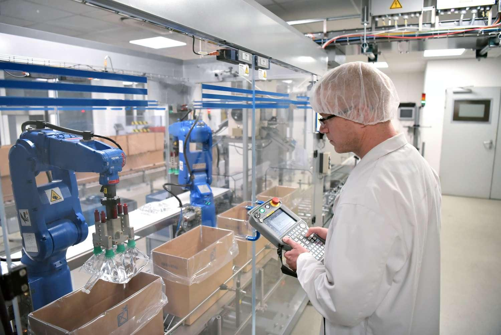

## Table of Contents

## What is the chemical industry?

The chemical industry is a big part of the world's economy. It makes chemicals that are used in many different products, like medicines, plastics, and cleaning supplies. The industry turns raw materials, like oil and natural gas, into useful chemicals. These chemicals are then used to make things we use every day.

There are many different types of jobs in the chemical industry. Some people work in factories, making the chemicals. Others work in labs, doing research to find new and better chemicals. The industry is important because it helps make products safer and more effective. It also helps create new technologies that can improve our lives.

## Who are the primary consumers of the chemical industry?

The primary consumers of the chemical industry are other industries that use chemicals to make their products. For example, the pharmaceutical industry uses chemicals to make medicines. The agriculture industry uses chemicals to make fertilizers and pesticides. The automotive industry uses chemicals to make plastics and paints for cars. These industries buy chemicals from the chemical industry to use in their own manufacturing processes.

Another big group of consumers is made up of companies that make consumer goods. These are things like cleaning products, cosmetics, and food packaging. These companies use chemicals to make their products work better and last longer. For example, a company that makes shampoo might use chemicals to make it smell nice and clean hair well. A company that makes food packaging might use chemicals to make the packaging strong and safe for food.

Lastly, governments and research institutions also use chemicals. Governments might use chemicals for things like water treatment or public health programs. Research institutions use chemicals to do experiments and develop new technologies. These groups often need special chemicals that are not used in everyday products, so they are important customers for the chemical industry.

## How do consumers interact with products from the chemical industry in daily life?

Every day, people use many things that come from the chemical industry without even knowing it. When you brush your teeth in the morning, the toothpaste you use has chemicals that help clean your teeth and keep your mouth healthy. When you eat breakfast, the food might be in plastic packaging, which is made from chemicals. Even the clothes you wear are often made from fabrics that have been treated with chemicals to make them softer or more durable.

As you go about your day, you might use cleaning products to keep your home tidy. These products, like dish soap and laundry detergent, are made from chemicals that help get rid of dirt and stains. If you take medicine, whether it's a pill or a cream, those medicines are also made from chemicals that help you feel better. Even the gasoline you put in your car comes from chemicals that are processed from oil.

In the evening, you might use cosmetics like shampoo, conditioner, or makeup, all of which contain chemicals that help them work well. If you use a smartphone or a computer, the batteries and screens in those devices are made with chemicals too. So, even though you might not think about it, the chemical industry is a big part of your daily life, making the things you use safer, more effective, and more convenient.

## What are the different sectors within the chemical industry that serve consumers?

The chemical industry has many different parts, and each part makes things that people use every day. One big part is the basic chemicals sector. This part makes simple chemicals like acids, bases, and salts. These basic chemicals are used to make other, more complicated things. For example, they are used to make fertilizers for farms, plastics for packaging, and cleaning products for homes. Another part is the specialty chemicals sector. This part makes chemicals that do specific jobs, like making paint stick to walls or making medicine work better.

Another important sector is the consumer chemicals sector. This part makes things that people use directly, like soaps, shampoos, and detergents. These products help people stay clean and keep their homes tidy. The life sciences sector is also very important. It makes chemicals that are used in medicines and health products. These chemicals help doctors treat diseases and keep people healthy. Each of these sectors plays a big role in making the things that people need and use every day.

## How does the chemical industry impact consumer goods?

The chemical industry has a big impact on the things we use every day. It makes the chemicals that go into making all sorts of products, like medicines, cleaning supplies, and even the plastic bottles we drink from. Without the chemical industry, these products would not work as well or be as safe. For example, the chemicals in toothpaste help clean our teeth and keep our mouths healthy. The chemicals in laundry detergent help get our clothes clean and fresh. So, the chemical industry helps make our daily lives easier and better.

The chemical industry also helps make new and better products. Scientists in the industry are always working on finding new chemicals that can do special things. These new chemicals can make products safer, last longer, or work better. For instance, new chemicals can make car tires stronger or help medicine work faster. This means that the things we use every day keep getting better because of the work done in the chemical industry. So, the chemical industry not only helps make the products we use now but also helps create new products for the future.

## What are the safety concerns for consumers regarding chemical products?

When using products made from chemicals, it's important to be careful because some chemicals can be harmful if not used the right way. For example, cleaning products can be strong and might hurt your skin or eyes if you touch them. It's a good idea to read the labels on these products and follow the instructions. This helps keep you safe and makes sure the products work well. If you don't use them correctly, you could get sick or hurt.

Another thing to think about is how chemicals can affect the environment. Some chemicals can pollute the air, water, or soil if they are not thrown away properly. This can harm animals and plants, and even make people sick. To help keep the environment safe, it's important to follow the rules for getting rid of chemical products. For example, you should never pour old paint or motor oil down the drain. Instead, take them to a special place where they can be safely thrown away.

Overall, the chemical industry works hard to make sure their products are safe for people to use. They test their products a lot to make sure they won't hurt anyone. But it's still up to us to use these products the right way and be careful. By doing this, we can enjoy the benefits of chemical products while staying safe and helping protect the environment.

## How do regulations affect the chemical industry's consumer products?

Regulations are rules that governments make to keep people and the environment safe. They tell the chemical industry what they can and cannot do when making products for consumers. For example, there are rules about what chemicals can be used in things like shampoo or cleaning products. These rules help make sure that the products are safe to use and won't hurt people or the environment. The chemical industry has to follow these rules, which can make it harder and more expensive to make new products. But these rules are important because they help keep everyone safe.

Sometimes, regulations can also make the chemical industry find new and better ways to make their products. For example, if a rule says that a certain chemical can't be used anymore, the industry might have to find a safer replacement. This can lead to new and better products that are good for people and the environment. So, while regulations can make things more difficult for the chemical industry, they also push the industry to keep improving and making safer products for consumers.

## What trends are influencing consumer demand in the chemical industry?

One big trend that is changing what people want from the chemical industry is a focus on being green and sustainable. More and more people want to use products that are good for the environment. This means they look for things like cleaning products that don't have harsh chemicals, or plastic bottles that can be recycled. The chemical industry is trying to meet this demand by making new products that are safer for the environment. For example, they are finding ways to make chemicals from plants instead of oil, which is better for the planet.

Another trend is that people want more natural and safe products. They are worried about chemicals that might be bad for their health, so they look for things like natural shampoos or organic cleaning supplies. This has made the chemical industry work on making products that are free from harmful chemicals and are labeled as "natural" or "organic." They are also trying to be more open about what is in their products, so people can make better choices about what they buy. This trend is pushing the industry to be more careful about what they put in their products and how they make them.

## How do innovations in the chemical industry improve consumer products?

Innovations in the chemical industry help make the things we use every day better. Scientists are always working on new ways to make chemicals that can do special things. For example, they might find a new chemical that makes shampoo clean your hair better or makes medicine work faster. These new chemicals can also help make products last longer or be safer to use. So, when the chemical industry comes up with new ideas, it means that the things we buy can work better and be more helpful.

Another way innovations help is by making products more friendly to the environment. People are worried about how chemicals can hurt the planet, so the industry is trying to find new ways to make things that are safer for the earth. For example, they might use plants instead of oil to make chemicals, which is better for the environment. They are also working on making products that can be recycled or that break down naturally. So, innovations in the chemical industry not only make our daily lives easier but also help take care of the planet.

## What role do consumers play in sustainable practices within the chemical industry?

Consumers play a big role in making the chemical industry more sustainable. When people choose to buy products that are good for the environment, like cleaning supplies that don't have harsh chemicals or plastic bottles that can be recycled, it sends a message to the industry. Companies see that people want these kinds of products, so they start making more of them. This means the chemical industry has to find new ways to make things that are safer for the planet, like using plants instead of oil to make chemicals.

By being careful about what they buy, consumers can also push the chemical industry to be more open about what is in their products. When people look for things like natural shampoos or organic cleaning supplies, companies have to tell them what is in the products and how they are made. This makes the industry work harder to find safe and natural chemicals, and it helps everyone make better choices about what they use every day. So, by choosing to buy sustainable products, consumers help the chemical industry move towards practices that are better for the earth and for people.

## How can consumers make informed choices about chemical industry products?

Consumers can make informed choices about chemical industry products by reading the labels carefully. Labels tell you what is in the product and how to use it safely. Look for words like "natural," "organic," or "eco-friendly" if you want products that are good for the environment. Also, check for any warnings or instructions to make sure you use the product the right way. If you're not sure about something, you can look it up online or ask someone at the store for help.

Another way to make informed choices is by doing a little research. You can read reviews from other people who have used the product to see if it worked well for them. Websites and apps can also tell you more about the company that makes the product and how they take care of the environment. By learning more about the products and the companies, you can pick the ones that are safe, work well, and are good for the planet.

## What are the future prospects for consumers in relation to the chemical industry?

In the future, consumers can expect to see more and more products from the chemical industry that are good for the environment. As people keep asking for things like natural cleaning supplies and recyclable packaging, the chemical industry will keep working on new ways to make these things. They might use more plants instead of oil to make chemicals, which is better for the earth. This means that the products we use every day will be safer and more friendly to the planet.

Consumers will also have more information to help them make good choices. Companies will be more open about what is in their products and how they are made. This way, people can pick the products that are safe and work well. With new technology and research, the chemical industry will keep finding ways to make things better, so the things we use in the future will be even more helpful and safe.

## References & Further Reading

[1]: ["The Chemical Industry at a Glance"](https://www2.deloitte.com/us/en/insights/industry/oil-and-gas/chemical-industry-outlook.html) by ICIS

[2]: Hutter, F., Kotthoff, L., & Vanschoren, J. (Eds.). (2019). ["Automated Machine Learning: Methods, Systems, Challenges."](https://link.springer.com/book/10.1007/978-3-030-05318-5) Springer.

[3]: Tobias, T.M., et al. (2020). ["Digital Supply Chain in Chemicals: Catalyzing Performance Improvement."](https://www.tandfonline.com/doi/full/10.1080/16258312.2020.1816361) McKinsey & Company.

[4]: ["Algorithmic Trading: Winning Strategies and Their Rationale"](https://www.amazon.com/Algorithmic-Trading-Winning-Strategies-Rationale-ebook/dp/B00CY5HC0U) by Ernie Chan

[5]: ["Chemical Industry Overview"](https://en.wikipedia.org/wiki/Chemical_industry) by the American Chemical Society

[6]: PWC (2016). ["Chemical Trends: How Digital, Big Data and Innovation Dominate the Future of Chemical Industry."](https://www.pwc.com/gx/en/ceo-survey/2016/industry-focus/chemicals-key-findings-global-ceo-survey-2016.pdf) 

[7]: ["Advances in Financial Machine Learning"](https://www.amazon.com/Advances-Financial-Machine-Learning-Marcos/dp/1119482089) by Marcos Lopez de Prado

[8]: ["High Frequency Trading: A Practical Guide to Algorithmic Strategies and Trading Systems"](https://www.amazon.com/High-Frequency-Trading-Practical-Algorithmic-Strategies/dp/1118343506) by Irene Aldridge