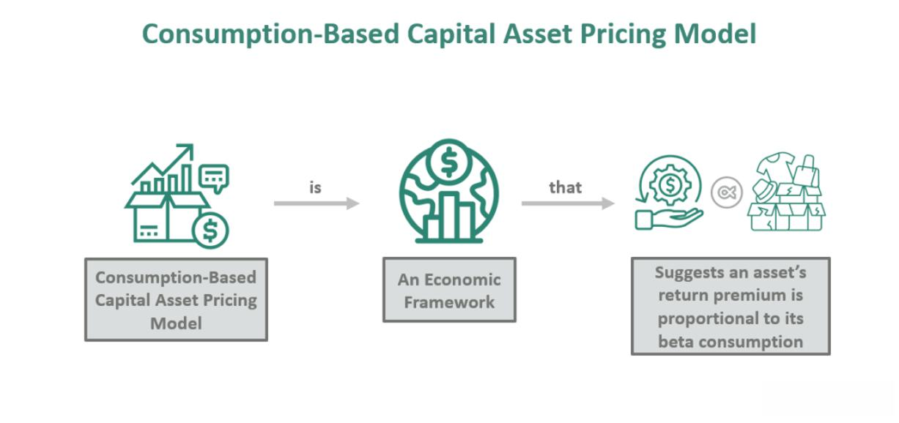

## Table of Contents

## What is the Consumption Capital Asset Pricing Model (CCAPM)?

The Consumption Capital Asset Pricing Model (CCAPM) is a financial model that helps explain how people make decisions about saving and investing based on their consumption habits. It suggests that the expected return on an investment should be related to how that investment affects a person's overall consumption. In simple terms, if an investment makes it easier for someone to consume more in the future, they might be willing to accept a lower return on that investment because it helps them achieve their consumption goals.

The CCAPM is different from other models like the Capital Asset Pricing Model (CAPM) because it focuses on consumption rather than just the risk and return of investments. While the CAPM looks at how investments relate to the overall market, the CCAPM looks at how investments relate to changes in a person's consumption over time. This makes it useful for understanding why people might choose certain investments based on their personal consumption needs and future expectations.

## How does CCAPM differ from the traditional Capital Asset Pricing Model (CAPM)?

The Consumption Capital Asset Pricing Model (CCAPM) and the traditional Capital Asset Pricing Model (CAPM) both try to explain how investments are priced, but they look at different things. The CAPM focuses on how risky an investment is compared to the overall market. It says that the expected return on an investment should be higher if it's riskier than the market. The CAPM uses something called "beta" to measure this risk, and it's all about how an investment moves with the market.

On the other hand, the CCAPM looks at how investments affect a person's consumption over time. It says that people care about how their investments help them consume more in the future. So, if an investment makes it easier for someone to buy more stuff later, they might be okay with a lower return. The CCAPM connects the dots between investing and spending, showing that people's choices about investments are tied to their plans for future consumption.

In simple terms, while the CAPM is all about risk and market movements, the CCAPM is about how investments help people enjoy life by consuming more in the future. The CAPM might tell you to pick investments based on how they compare to the market, but the CCAPM would have you think about how those investments fit into your personal spending plans.

## What are the key assumptions of the CCAPM?

The Consumption Capital Asset Pricing Model (CCAPM) relies on a few key assumptions to work. One big assumption is that people care about their consumption over time. This means they think about how their choices today will affect what they can buy and enjoy in the future. They want to smooth out their consumption, so they save and invest in a way that helps them keep their spending steady. Another assumption is that people are rational and make decisions based on all the information they have. They try to make the best choices for their future consumption, even if it means giving up some immediate pleasures.

Another important assumption of the CCAPM is that the market works perfectly. This means that all investments can be bought and sold easily without any extra costs, and everyone has the same information about these investments. The model also assumes that people can borrow and lend money at the same rate, which helps them plan their consumption. These assumptions help the CCAPM explain how people make investment decisions based on how those decisions will affect their ability to consume in the future.

## How is consumption used as a factor in CCAPM?

In the Consumption Capital Asset Pricing Model (CCAPM), consumption is a key factor because it looks at how investments affect what people can buy and enjoy over time. The model says that people care about keeping their spending steady. So, when they invest, they think about how those investments will help them consume more in the future. If an investment helps someone buy more things later, they might be okay with a lower return on that investment because it fits their plan to keep their consumption smooth.

The CCAPM uses something called the "marginal utility of consumption" to link investments to consumption. This means it looks at how much more happiness or satisfaction someone gets from spending a little bit more. If an investment makes it easier to consume more in the future, it increases this marginal utility. So, the model suggests that people will choose investments that help them maintain or increase their future consumption, even if those investments don't offer the highest returns right away. This way, the CCAPM helps explain why people make certain investment choices based on their consumption goals.

## What is the formula for the CCAPM and how is it derived?

The formula for the Consumption Capital Asset Pricing Model (CCAPM) is E(R_i) - R_f = β_i * (E(R_m) - R_f), where E(R_i) is the expected return on an asset, R_f is the risk-free rate, β_i is the consumption beta of the asset, and E(R_m) is the expected return on the market. This formula looks a lot like the traditional Capital Asset Pricing Model (CAPM), but it uses consumption beta instead of market beta. The consumption beta measures how an asset's return relates to changes in overall consumption, rather than how it moves with the market.

To derive the CCAPM, we start by thinking about how people want to keep their spending smooth over time. They make investment choices based on how those choices will help them consume in the future. The key idea is that people care about the marginal utility of consumption, or how much happier they get from spending a little more. If an investment helps someone consume more in the future, it increases this marginal utility. By connecting the expected return on an asset to how it affects future consumption, we can see that the expected return should be higher for assets that help people maintain or increase their consumption. This leads us to the CCAPM formula, which shows how the expected return on an asset depends on its consumption beta and the overall market's expected return.

## Can you explain the concept of marginal utility of consumption in the context of CCAPM?

In the Consumption Capital Asset Pricing Model (CCAPM), the idea of marginal utility of consumption is really important. It means how much happier or satisfied someone gets from spending a little bit more money. Imagine you have a certain amount of money to spend each month. If you spend a bit more, you might feel happier because you can buy something nice. But, the more you spend, the less extra happiness you get from each additional dollar. In the CCAPM, people care about this because they want to keep their spending smooth over time. They make investment choices based on how those choices will help them spend more in the future.

The CCAPM says that if an investment helps someone spend more in the future, it increases their marginal utility of consumption. So, people might be okay with a lower return on that investment if it helps them keep their spending steady. For example, if an investment makes it easier for you to buy more things next year, you might choose it over another investment that gives you a higher return but doesn't help your future spending as much. This way, the CCAPM helps explain why people make certain investment choices based on how those choices will affect their happiness from spending in the future.

## How does CCAPM account for risk and return in investment decisions?

The Consumption Capital Asset Pricing Model (CCAPM) looks at how investments help people spend more in the future and how that affects their happiness. It says that people care about keeping their spending steady over time. So, when they choose investments, they think about how those investments will help them spend more later. If an investment makes it easier for someone to buy more things in the future, they might be okay with a lower return on that investment. This is because the investment helps them keep their spending smooth, which makes them happier.

The CCAPM also connects the idea of risk and return to how investments affect future spending. It uses something called "consumption beta" to measure how an investment's return relates to changes in overall spending. If an investment has a high consumption beta, it means its return moves a lot with changes in spending. So, people might expect a higher return from this investment because it's riskier in terms of their future spending. But if an investment helps keep their spending steady and doesn't change much with overall spending, they might be happy with a lower return because it fits their plan to keep their consumption smooth.

## What are the empirical challenges and criticisms faced by CCAPM?

The Consumption Capital Asset Pricing Model (CCAPM) faces some big challenges when people try to test it with real data. One of the biggest problems is that it's hard to measure consumption accurately. People's spending habits can change a lot, and it's tough to get good data on this. Also, the CCAPM assumes that people make choices based on how investments will affect their future spending. But in real life, people don't always plan that far ahead or make choices that fit this model perfectly. This makes it hard to find strong evidence that the CCAPM works well in the real world.

Another challenge is that the CCAPM has trouble explaining the big differences in returns between different kinds of investments. For example, it struggles to explain why stocks have much higher returns than bonds over the long term. This is known as the "equity premium puzzle." The CCAPM also assumes that people can borrow and lend money at the same rate, which isn't true in real life. These assumptions make it hard for the CCAPM to match up with what we see in the real world. Critics say these problems show that the CCAPM might not be the best way to understand how people make investment choices based on their spending plans.

## How has CCAPM been tested and what are some of the key findings from these tests?

Researchers have tested the Consumption Capital Asset Pricing Model (CCAPM) in different ways to see if it works in real life. They use data on how people spend money and how investments do over time. One common way is to look at how well the CCAPM can explain the returns on different kinds of investments, like stocks and bonds. They also check if the model can predict how people make choices based on their future spending plans. These tests often use big sets of data from many years to see if the CCAPM's ideas hold up.

The key findings from these tests show that the CCAPM has some big problems. One big issue is that it's hard to measure how people spend money accurately, which makes it tough to test the model. Also, the CCAPM struggles to explain why stocks have much higher returns than bonds over the long term, which is called the "equity premium puzzle." Many tests have found that the CCAPM doesn't match up well with what we see in the real world. This has led some researchers to think that the CCAPM might not be the best way to understand how people make investment choices based on their spending plans.

## In what ways has CCAPM been modified or extended to address its limitations?

To deal with its problems, people have tried to change and expand the Consumption Capital Asset Pricing Model (CCAPM). One big change is adding habits to the model. This means that people care not just about how much they can spend in the future, but also about keeping their spending habits the same. If someone is used to spending a certain amount each month, they might feel unhappy if they have to spend less. So, this new version of the CCAPM looks at how investments help people keep their spending habits steady. Another change is to think about how people might be worried about big drops in their spending. This means they might choose investments that protect them from losing a lot of money, even if it means a lower return. These changes help the CCAPM explain why people make certain investment choices better.

Another way people have tried to fix the CCAPM is by looking at different ways to measure how people spend money. Instead of using total spending, some researchers use spending on things that people really can't do without, like food and housing. This can make the model work better because these kinds of spending are more stable and easier to measure. Also, some people have added other factors to the model, like how much people care about the future or how they feel about taking risks. By thinking about these things, the CCAPM can better explain why people might choose investments that don't fit the old model. These changes show that the CCAPM is still a useful tool, but it needs to be tweaked to match what we see in the real world.

## How does CCAPM apply to different economic environments, such as recessions versus expansions?

The Consumption Capital Asset Pricing Model (CCAPM) helps explain how people choose investments based on how those choices affect what they can buy in the future. In a recession, when the economy is not doing well, people might be more worried about losing their jobs or having less money to spend. The CCAPM says that in these times, people might choose investments that help them keep their spending steady, even if those investments don't give the highest returns. They might be more willing to accept lower returns if it means they can still buy the things they need. So, during a recession, the CCAPM suggests that people will focus more on protecting their future spending than on chasing high returns.

In an economic expansion, when things are going well and people feel more confident, the CCAPM works a bit differently. People might be more willing to take risks with their investments because they feel good about the future. They might choose investments that could give them higher returns, even if those investments could also lead to bigger changes in their spending. The CCAPM says that in good economic times, people care more about growing their wealth and less about keeping their spending perfectly steady. So, during an expansion, the model suggests that people will be more open to investments that might help them consume more in the future, even if those investments are riskier.

## What are the practical implications of CCAPM for portfolio management and financial planning?

The Consumption Capital Asset Pricing Model (CCAPM) helps people who manage money and plan their finances by showing how investments affect what they can buy in the future. In portfolio management, the CCAPM suggests that people should choose investments that help keep their spending steady over time. This means they might pick investments that don't have the highest returns but help them avoid big changes in what they can spend. For example, during tough economic times, someone might choose safer investments to make sure they can still buy what they need, even if it means missing out on higher returns. This way, the CCAPM helps people balance the need for growth with the need for stability in their spending.

For financial planning, the CCAPM is useful because it helps people think about how their investments will help them spend in the future. It says that people should look at how an investment might change their spending, not just how much money it might make. This is important for planning because it helps people make choices that fit their long-term goals for buying things. For instance, if someone wants to make sure they can afford to spend the same amount each year, they might choose investments that help them do that, even if those investments don't grow as fast as others. By using the CCAPM, people can make better plans for their money that match what they want to spend in the future.

## What is the Consumption Capital Asset Pricing Model (CCAPM) and how does it work?

The Consumption Capital Asset Pricing Model (CCAPM) is a sophisticated framework that quantifies the expected return of an asset in connection with consumption growth. This model is a significant evolution from traditional capital asset pricing models, providing insights that extend beyond market returns to include broader economic indicators, specifically consumption patterns.

At the heart of CCAPM is the concept of the consumption beta, which serves as a metric for the asset's risk related to consumption volatility. The consumption beta assesses how changes in consumption levels influence the returns of an asset, offering a nuanced measure of its risk. This approach recognizes that consumer spending habits significantly impact economic cycles and, consequently, asset pricing.

Developed by leading economists such as Robert Lucas and Douglas Breeden, CCAPM offers a multidimensional perspective on asset pricing that integrates macroeconomic consumption data. This makes it particularly beneficial for estimating expected returns, as it accounts for variations in consumption over time. Unlike models that rely solely on market performance, CCAPM considers the broader economic environment, thus providing a more comprehensive view of market dynamics.

The fundamental formula of CCAPM links the expected return of an asset $E(R_i)$ with the risk-free rate $R_f$ and the consumption beta $\beta_c$. The relationship is expressed as follows:

$$
E(R_i) = R_f + \beta_c \cdot \text{Risk Premium}
$$

In this equation, the risk premium corresponds to the additional return expected from holding a risky asset over a risk-free one, adjusted for consumption risk. The inclusion of the consumption beta and risk premium offers profound insights into how consumption fluctuations influence market pricing.

Overall, CCAPM serves as an essential tool for investors and analysts, enabling them to [factor](/wiki/factor-investing) in consumption dynamics when evaluating asset returns. This consumption-oriented perspective allows for enhanced asset valuation and strategic investment decisions, reflecting a more accurate assessment of potential risks and rewards.

## What are the differences between CCAPM and CAPM?

The Consumption Capital Asset Pricing Model (CCAPM) and the Capital Asset Pricing Model (CAPM) are foundational frameworks in finance, each offering distinct methodologies for asset pricing and risk assessment. CAPM, developed by William Sharpe and others in the 1960s, is anchored on the principle that the expected return of an asset is proportional to its market risk, as measured by the market beta. This model simplifies the analysis by considering market portfolio returns as benchmarks, typically in a single-period context, which makes it relatively straightforward to apply.

CAPM is expressed through the equation:

$$

E(R_i) = R_f + \beta_i (E(R_m) - R_f) 
$$

where $E(R_i)$ is the expected return of the asset, $R_f$ is the risk-free rate, $\beta_i$ is the asset’s market beta, and $E(R_m)$ represents the expected return of the market portfolio.

In contrast, CCAPM extends the CAPM by integrating a multi-period perspective and considering consumption patterns as a critical determinant of an asset's risk and return profile. The core concept of CCAPM is the consumption beta, which quantifies the asset's sensitivity to changes in aggregate consumption rather than market fluctuations. This model provides a refined approach by acknowledging that investors’ consumption decisions over time significantly impact asset pricing.

CCAPM can be formulated as:

$$

E(R_i) = R_f + \beta_c (E(C) - R_f) 
$$

where $\beta_c$ is the consumption beta, and $E(C)$ represents the expected growth in consumption. Here, the consumption beta serves as a measure of how much the expected return on the asset changes with shifts in consumption patterns, offering a broader understanding of risk that includes consumption dynamics. This approach becomes particularly informative in recognizing how market volatility can influence consumer spending, subsequently affecting asset values.

The comparisons between CAPM and CCAPM underscore the importance of including macroeconomic consumption data when evaluating assets. While CAPM provides valuable insights through market beta, CCAPM enhances asset valuation by accounting for broader economic conditions, thus helping investors align their strategies with consumption risks. By using consumption metrics as benchmarks, CCAPM facilitates a nuanced view of the economic environment that can be pivotal in long-term investment decision-making.

Incorporating CCAPM can lead to improved valuation of assets by observing how market [volatility](/wiki/volatility-trading-strategies) translates into changes in consumer spending behavior. This integration allows investors to develop strategies that not only focus on short-term market movements but also consider long-term economic patterns, providing a holistic outlook essential for sophisticated investing.

## References & Further Reading

[1]: Breeden, D. T. (1979). ["An Intertemporal Asset Pricing Model with Stochastic Consumption and Investment Opportunities."](https://static.secure.website/wscfus/8149792/uploads/Breeden_1979_JFE_Consumption_CAPM_Theory.pdf) Journal of Financial Economics, 7(3), 265-296.

[2]: Lucas, R. E. Jr. (1978). ["Asset Prices in an Exchange Economy."](https://www.jstor.org/stable/1913837) Econometrica, 46(6), 1429-1445.

[3]: Cochrane, J. H. (2005). ["Asset Pricing (Revised Edition)."](https://press.princeton.edu/books/hardcover/9780691121376/asset-pricing) Princeton University Press.

[4]: Campbell, J. Y. (2003). ["Consumption-Based Asset Pricing."](https://papers.ssrn.com/sol3/papers.cfm?abstract_id=343784)01015-3) In G. M. Constantinides, M. Harris, and R. M. Stulz (Eds.), Handbook of the Economics of Finance (Vol. 1, pp. 803-887). Elsevier.

[5]: LeRoy, S. F., & Singell, L. D. (1987). ["Knight on Risk and Uncertainty."](https://www.semanticscholar.org/paper/Knight-on-Risk-and-Uncertainty-LeRoy-Singell/984a20933a1b0ea1aa050c30b46d5203c28436bd) Journal of Political Economy, 95(2), 394-406.