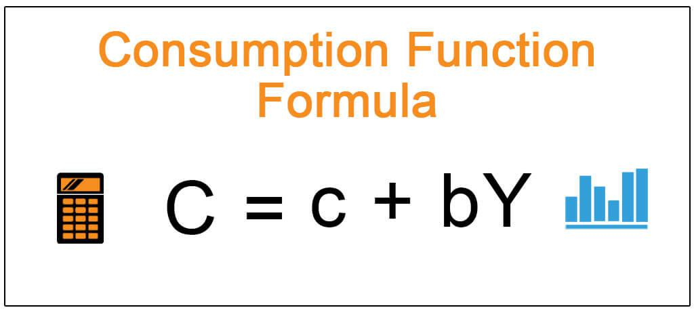

Understanding the intricate relationships within an economy is crucial for economists, policymakers, and investors. These relationships dictate how resources are allocated, how markets respond to various stimuli, and in turn, how strategies are formulated to steer economic growth and stability. This article explores key concepts such as economic assumptions, economic formulas, the consumption function, and algorithmic trading. Each of these components plays a pivotal role in shaping the landscape of modern economics.

Economic assumptions serve as the fundamental groundwork for simplifying the vast complexities of real-world economies. By presuming conditions such as rational behavior and market equilibrium, models become more analyzable. However, these assumptions are often challenged by unpredictable elements within real economies, necessitating the evolution and occasional overhaul of existing models.



Economic formulas are indispensable tools for economists. They quantify relationships and enable the prediction of economic outcomes, which is essential for understanding behavioral patterns within economies. For instance, Gross Domestic Product (GDP) and Consumer Price Index (CPI) formulas are paramount in economic policy-making, offering insights into productivity and inflation, respectively.

The consumption function, introduced by John Maynard Keynes, provides significant insight into how income levels affect consumer spending. It aids in predicting spending behaviors, which is crucial for both economic modeling and informed investment decisions. The formula, represented as $C = A + MD$ (where $C$ is consumption, $A$ is autonomous consumption, $M$ is marginal propensity to consume, and $D$ is disposable income), is integral in understanding the dynamics between income and expenditure.

Algorithmic trading represents the practical application of these economic insights within financial markets. By using sophisticated computer algorithms, trading in securities occurs at speeds and scales unreachable by human capability, enhancing market efficiency and liquidity. Nevertheless, this modern approach is not without risks, as exemplified by potential market volatility induced by algorithmic trading mechanisms.

These concepts not only form the backbone of modern economic theory but also have profound implications for economic modeling and financial markets. Together, they furnish a comprehensive framework for both theoretical inquiry and practical application, ultimately impacting policy formulation and investment strategy development.

## Table of Contents

## Economic Assumptions: A Foundation for Analysis

Economic assumptions serve as the foundation for economic analysis, enabling economists to construct models that represent complex real-world phenomena in more manageable terms. These assumptions often simplify the multitude of variables and interactions that exist in an economy to make it analyzable and comprehensible.

One of the most prevalent assumptions in economic modeling is rational behavior, which posits that individuals and firms aim to maximize their utility and profits, respectively. Under this framework, economic [agents](/wiki/agents) are expected to make decisions that provide them with the greatest benefit or satisfaction, given their resources and preferences. This assumption is crucial for predicting consumer behavior and market dynamics.

Market equilibrium is another key assumption, hypothesizing that in a competitive market, supply and demand will naturally adjust to reach a state where the quantity supplied equals the quantity demanded. This state of equilibrium ensures that resources are allocated efficiently, with no persistent shortages or surpluses, thereby facilitating price stability over time.

Perfect competition, as an assumption, further simplifies economic analysis by envisioning a market structure where numerous small firms operate, producing homogenous products without the ability to influence market prices. In such markets, information is perfectly distributed, allowing all participants to make informed decisions, thus leading to an optimal deployment of resources.

However, the real world often presents challenges to these assumptions. Market imperfections, such as externalities, information asymmetries, and monopolistic practices, can lead to outcomes that deviate significantly from those predicted by traditional models. For instance, rational behavior may be compromised by cognitive biases and emotional influences, resulting in suboptimal decision-making. Similarly, equilibrium and perfect competition may not hold in markets characterized by significant power imbalances or regulatory constraints.

These deviations necessitate the revision of existing models or the development of alternative frameworks that incorporate additional complexities. Behavioral economics, game theory, and agent-based modeling are examples of approaches that address some of these limitations, offering more nuanced insights into economic dynamics.

In summary, while economic assumptions are indispensable for constructing theoretical models, it is essential to acknowledge their limitations and remain open to evolving these frameworks to better align with empirical realities.

## Economic Formulas: Essential Tools for Economists

Economic formulas serve as critical instruments for quantifying relationships between diverse economic variables, facilitating the prediction of economic outcomes and providing insights into economic behavior. These formulas form the foundation of economic analysis and policy-making, enabling economists to interpret complex data and trends accurately.

Gross Domestic Product (GDP) is one of the most fundamental economic formulas, representing the total value of goods and services produced within a country over a specific period. It is commonly calculated using the equation:

$$
GDP = C + I + G + (X - M)
$$

where $C$ stands for consumer spending, $I$ denotes investment by businesses, $G$ is government expenditure, and $(X - M)$ represents net exports (exports minus imports). GDP serves as a key indicator of economic health and growth, aiding policymakers in assessing economic performance and making informed decisions.

Another pivotal economic formula is the Consumer Price Index (CPI), which measures the average change over time in the prices paid by consumers for a basket of goods and services. It is calculated as follows:

$$
CPI = \left( \frac{Cost\, of\, Basket\, in\, Current\, Year}{Cost\, of\, Basket\, in\, Base\, Year} \right) \times 100
$$

The CPI is instrumental in understanding inflationary trends, influencing monetary policy, and adjusting salaries and pensions to maintain purchasing power.

The Phillips Curve, which illustrates the inverse relationship between unemployment and inflation, serves as another important tool. While originally assumed to be a stable and exploitable relationship, the dynamics and interpretations have evolved, emphasizing the complexity of economic models.

For professionals and analysts working with economic data, it can be useful to implement these calculations programmatically. Below is a basic Python example for calculating the GDP:

```python
def calculate_gdp(consumer_spending, investment, government_spending, exports, imports):
    return consumer_spending + investment + government_spending + (exports - imports)

# Example usage
gdp = calculate_gdp(5000, 2000, 1500, 800, 300)
print("GDP:", gdp)
```

Economic formulas such as these not only aid in theoretical evaluations but also have far-reaching implications in real-world applications, influencing economic policies and strategic investment decisions. Their ability to distill complex economic interactions into quantifiable measures makes them indispensable tools for economists globally. Understanding and applying these formulas is crucial for predicting economic trends and preparing for potential shifts in economic landscapes.

## The Consumption Function: An Insight into Spending Patterns

The consumption function is a fundamental concept in Keynesian economics that highlights the relationship between consumer spending and income levels. Introduced by John Maynard Keynes, it provides a systematic way to understand how changes in income influence consumption. The primary equation associated with the consumption function is $C = A + MD$, where $C$ represents total consumption, $A$ stands for autonomous consumption that occurs regardless of income level, and $MD$ denotes the marginal propensity to consume, multiplied by disposable income ($D$).

Autonomous consumption ($A$) reflects the baseline level of consumption that would occur even if income were zero. This could be due to essential expenses that individuals cannot forego, such as food and shelter. On the other hand, the marginal propensity to consume (MPC), represented by $M$, is a crucial concept that indicates the fraction of additional income that will be spent on consumption. For example, if the MPC is 0.8, it suggests that 80% of any additional income will be spent rather than saved.

The consumption function is instrumental for economists and policymakers, offering insights into consumer behavior, predicting consumption trends, and guiding fiscal policy. By understanding how much of their income consumers are likely to spend, policymakers can design effective economic interventions, such as tax cuts or stimulus packages, to influence aggregate demand and stabilize the economy.

In investment decisions, the consumption function aids in anticipating how shifts in income—due to tax changes, wage growth, or unemployment—might affect market conditions. Investors and businesses can use this knowledge to forecast demand for goods and services, thus making informed decisions about production, pricing, and investment.

Moreover, the consumption function forms the basis of more complex economic models that take into account factors such as interest rates, consumer confidence, and wealth effects, adding depth to economic analysis and enhancing the precision of predictions. Consequently, the consumption function is not only a theoretical tool but also a practical guide for navigating economic landscapes.

## Algorithmic Trading: The Modern Approach to Markets

Algorithmic trading employs computer algorithms to execute trades on stock exchanges at speeds and frequencies that surpass human capabilities. This advanced method applies mathematical models and economic theories to automate trading processes, making decisions based on predefined criteria derived from historical data and real-time market information. These algorithms analyze market conditions, perform calculations, and execute orders within microseconds, capitalizing on momentary opportunities that would be otherwise unreachable through manual trading.

The detailed economic formulas embedded in [algorithmic trading](/wiki/algorithmic-trading) systems typically involve various indicators and metrics such as moving averages, price [momentum](/wiki/momentum), and technical analysis indicators like the Relative Strength Index (RSI) and Moving Average Convergence Divergence (MACD). These formulas are designed to optimize trade timing and asset selection to maximize returns or minimize risks. The use of historical price data and sophisticated statistical methods allows for [backtesting](/wiki/backtesting) strategies, ensuring that the algorithms operate efficiently under simulated market conditions before they are deployed in live trading.

Algorithmic trading has significantly enhanced the efficiency and [liquidity](/wiki/liquidity-risk-premium) of financial markets. By facilitating a high [volume](/wiki/volume-trading-strategy) of transactions with minimal latency, it ensures tighter spreads and reduced trading costs, benefiting institutional and retail investors. This increased liquidity contributes to more stable markets by smoothing out price fluctuations that occur due to uneven demand and supply.

However, the advantages of algorithmic trading come with inherent risks. The rapid execution of trades can exacerbate market [volatility](/wiki/volatility-trading-strategies), especially in the face of external shocks or technical failures. Events such as the 2010 Flash Crash illustrate the potential for automated trading systems to propagate errors swiftly across markets, resulting in sudden and sharp declines in asset prices. Furthermore, the complexity of these algorithms can sometimes lead to unanticipated behaviors, posing challenges for regulators attempting to maintain fair and orderly markets.

To mitigate these risks, regulatory bodies in various countries impose stringent guidelines on algorithmic trading activities. These include requirements for circuit breakers to halt trading during severe price movements and the implementation of kill switches to disconnect trading systems during malfunctions. Continuous monitoring and updates to algorithms are essential to adapt to evolving market conditions, enhance robustness, and prevent potential systemic threats.

In response to these challenges, advancements in [machine learning](/wiki/machine-learning) and [artificial intelligence](/wiki/ai-artificial-intelligence) are being integrated into algorithmic trading to improve adaptability and predictive accuracy. By analyzing massive datasets with improved pattern recognition capabilities, these technologies offer the potential to refine existing models, leading to more informed trading decisions and reduced susceptibility to market anomalies.

Overall, algorithmic trading represents a paradigm shift in financial markets, blending economic theory with cutting-edge technology to reshape how securities are traded. While it has increased market efficiency, the ongoing developments and proactive regulation are crucial in ensuring its benefits outweigh the risks associated with its speed and complexity.

## Interconnections and Implications

The consumption function and algorithmic trading exemplify the intersection between economic theory and its practical application in financial markets. The consumption function, introduced by John Maynard Keynes, is a theoretical construct that connects income levels with consumer spending. Its functional form, $C = A + MD$, where $C$ represents total consumption, $A$ is autonomous consumption, $M$ is the marginal propensity to consume, and $D$ denotes disposable income, illustrates how changes in income levels can influence spending patterns. This understanding of consumer behavior is essential for economic forecasts and for shaping policy decisions.

On the other hand, algorithmic trading represents the application of such theoretical insights in real-world financial contexts. By employing sophisticated computer algorithms, this form of trading rapidly processes large volumes of market data and executes trades at speeds unachievable by human traders. Algorithms in trading often incorporate economic indicators, such as those predicted by consumption functions, to make informed decisions on buying or selling assets. The integration of economic theories like the consumption function into these trading systems enhances the relevance and responsiveness of algorithmic trading strategies to current economic conditions.

Understanding how the consumption function can be utilized in algorithmic trading offers invaluable insights into broader economic and market dynamics. When consumer behavior models are applied within trading algorithms, they help forecast market trends and price movements with greater accuracy. This interconnectedness not only improves predictive capabilities but also enables more robust market strategies that respond deftly to economic changes.

In summary, the interplay between the consumption function and algorithmic trading underscores the practical value of economic theory in navigating modern financial markets. By bridging theoretical models and real-world applications, these concepts contribute to a more nuanced understanding of economic health and promote more effective market strategies.

## Challenges and Developments

Economic models and algorithmic trading are cornerstones of modern economic analysis and financial markets, yet they face several significant challenges. Model inaccuracies often stem from the reliance on assumptions that may not hold true in all scenarios. For instance, many economic models assume rational behavior, which does not always reflect real-world decision-making. As a result, these models can sometimes provide misleading predictions or analyses. Policymakers and economists must continuously refine models to better capture complex human behaviors and economic dynamics.

Market unpredictability also poses a substantial challenge. Economic markets are influenced by a multitude of factors, including geopolitical events, natural disasters, and sudden shifts in consumer sentiment. These elements can lead to abrupt changes in market conditions, making it difficult to predict outcomes accurately. Algorithmic trading, which depends heavily on historical data and predefined rules, can struggle to adapt to such unpredictability, potentially leading to substantial financial risks.

Technological failures represent another crucial challenge, particularly in algorithmic trading. The reliance on sophisticated software and real-time data processing means that any technological malfunction can have far-reaching consequences. Instances of "flash crashes," where markets plummet within minutes before recovering, demonstrate the potential impacts of such failures. Ensuring robust technology and having contingency plans are essential to mitigate these risks.

To address these challenges, continuous development and adaptation in economic theories and trading algorithms are vital. Economists and financial analysts need to engage with ongoing research that challenges existing paradigms and introduces new methods of analysis. Innovation in computational approaches, such as machine learning and artificial intelligence, offers promising avenues for improving predictive accuracy and market efficiency.

Python has become an instrumental tool in these efforts. For instance, machine learning libraries like TensorFlow and scikit-learn allow researchers to build models that can learn from data and potentially uncover patterns not visible through traditional methods. The following example demonstrates a simple use of Python for modeling economic data:

```python
import numpy as np
from sklearn.linear_model import LinearRegression

# Sample data: income levels and consumer spending
income = np.array([[25000], [30000], [35000], [40000], [45000]])
spending = np.array([15000, 18000, 21000, 23000, 26000])

# Create a linear regression model
model = LinearRegression()
model.fit(income, spending)

# Predict spending based on new income levels
new_income = np.array([[50000], [55000]])
predicted_spending = model.predict(new_income)

print(predicted_spending)
```

The model can help foresee consumer spending patterns given different income levels, allowing for adjustments in economic strategies.

Ongoing research and innovation remain fundamental in overcoming these challenges. Collaborative efforts among academic institutions, financial institutions, and governmental bodies are essential to developing models and algorithms that are more robust, adaptive, and comprehensive. As technology evolves, so must the frameworks that underpin economic and financial analyses, ensuring they remain relevant and effective in depicting and navigating the complex global economic landscape.

## Conclusion

Economic assumptions, formulas, consumption functions, and algorithmic trading constitute a multifaceted network that underpins the functioning of modern economies. These foundational concepts are pivotal not only for theoretical analysis but also for practical implementation, influencing decisions in policy-making and investment strategies.

Economic assumptions simplify complex realities, allowing analysts to create models that predict market behavior and economic outcomes. While these assumptions provide clarity, they also necessitate adjustments when faced with real-world deviations. This adaptability ensures that economic modeling remains a reliable tool for forecasting and policy guidance.

Formulas such as Gross Domestic Product (GDP) and the Consumer Price Index (CPI) are essential for quantifying economic activities. They provide critical insights, enabling policymakers to make informed decisions regarding fiscal and monetary policies. Understanding these formulas assists economists in tracking economic health and predicting future trends.

The consumption function, integral to Keynesian economics, links income levels to spending patterns. By offering a mathematical approach to consumer behavior, it aids economists and investors in anticipating changes in spending trends—a crucial insight for tailoring economic policies and investment portfolios.

Algorithmic trading exemplifies the practical application of economic theory in financial markets. Leveraging complex algorithms and high-frequency trading, this method enhances market efficiency and liquidity. Despite its benefits, algorithmic trading also brings challenges, such as amplifying market volatility, requiring continual advancement in technology and regulation.

Overall, mastering these concepts equips stakeholders with the knowledge to navigate the economic landscape effectively. The interplay between theoretical models and real-world applications highlights the importance of continuous learning and adaptation. Through robust economic understanding, individuals and institutions can better position themselves to forecast economic changes and make strategic decisions in a dynamic global economy.

## References & Further Reading

[1]: ["The General Theory of Employment, Interest, and Money"](http://keynes-general-theory.com/generaltheory.pdf) by John Maynard Keynes

[2]: Jarrow, R. A., & Protter, P. (2012). ["A short history of stochastic integration and mathematical finance: the early years, 1880-1970."](https://www.jstor.org/stable/4356300) Probability Surveys

[3]: Barberis, N., Thaler, R. (2003). ["A Survey of Behavioral Finance."](https://www.nber.org/papers/w9222) National Bureau of Economic Research Working Paper No. 9222

[4]: ["Algorithmic Trading: Winning Strategies and Their Rationale"](https://www.wiley.com/en-us/Algorithmic+Trading%3A+Winning+Strategies+and+Their+Rationale-p-9781118460146) by Ernie Chan

[5]: Ait-Sahalia, Y., & Lo, A. (2000). ["Nonparametric risk management and implied risk aversion."](https://www.nber.org/papers/w6130) Journal of Econometrics

[6]: Brown, S. J., & Goetzmann, W. N. (1995). ["Performance Persistence."](https://onlinelibrary.wiley.com/doi/abs/10.1111/j.1540-6261.1995.tb04800.x) The Journal of Finance