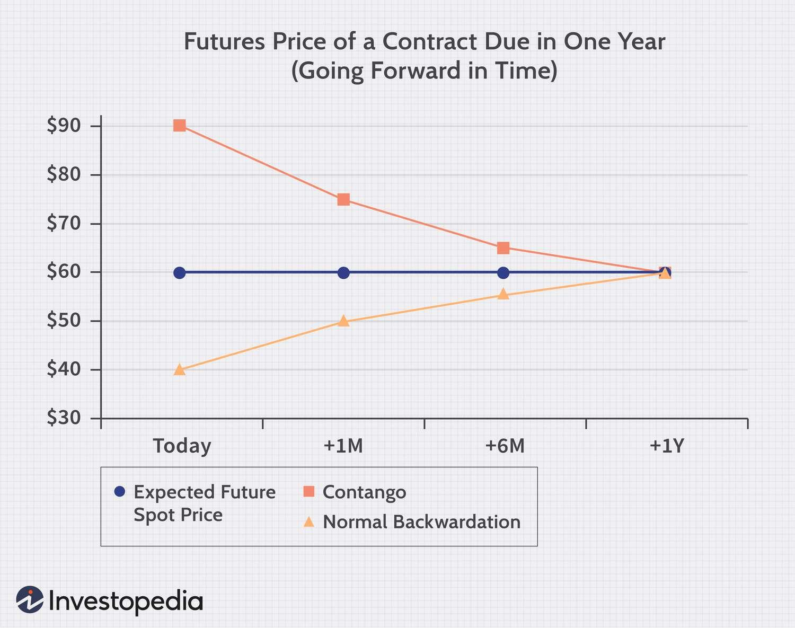

The modern financial landscape is characterized by its complexity and constant evolution, prominently observed in the futures markets. Futures markets serve as a critical component of global finance, enabling investors to hedge risk and speculate on the price movements of a variety of underlying assets, including commodities, currencies, and financial indices. Within these markets, the concepts of contango and backwardation play pivotal roles in influencing pricing structures and trading strategies.

Contango and backwardation are forward curve phenomena reflecting the pricing behavior of futures contracts relative to the current spot prices of underlying assets. In a contango scenario, futures prices are higher than the current spot prices, often driven by factors such as storage costs and future inflation expectations. Conversely, backwardation occurs when futures prices are lower than the spot prices, typically due to immediate supply shortages or high demand, suggesting a short-term bullish market condition.



For algorithmic traders, these market structures offer both opportunities and challenges. Algorithmic trading, which utilizes computer programs and algorithms to execute trades at high speeds based on pre-set criteria, can exploit these pricing inefficiencies. By analyzing statistical patterns and leveraging financial models, algorithmic traders can navigate the nuances of contango and backwardation to uncover profitable trades. However, the ever-changing nature of financial markets requires constant adaptation and risk management to ensure trading success.

This article examines the intricacies of contango and backwardation, their implications for algorithmic trading, and the inherent opportunities they present. The discussion will provide insights into effective trading strategies while considering the associated risks and the need for a comprehensive understanding of market dynamics.

## Table of Contents

## Understanding Futures Contracts

Futures contracts are standardized agreements to buy or sell a specific quantity of an underlying asset at a predetermined price on a set future date. These financial instruments are integral components in markets for commodities, currencies, indices, and other assets, providing mechanisms for both hedging and speculation.

In hedging, futures contracts are used to mitigate risk by locking in prices ahead of time. For instance, a farmer might sell wheat futures to secure a guaranteed price and protect against the risk of declining prices at harvest. Conversely, a bakery could buy the same wheat futures to guard against potential price increases. This risk management capability allows businesses to stabilize costs and revenues in the face of market fluctuations.

Speculation, on the other hand, involves capitalizing on price movements for profit. Traders speculate by buying futures contracts if they anticipate a price increase, or selling them if they expect a decrease. The leveraging effect of futures—requiring only a margin deposit rather than the full asset value—can amplify profits, though it similarly increases the risk of losses.

The mechanics of futures contracts involve several key elements: the contract size, the underlying asset, the maturity date, and the tick size, which is the minimum price movement the contract can make. These features are standardized, which enhances the [liquidity](/wiki/liquidity-risk-premium) and efficiency of futures markets. 

Understanding the purposes and mechanics of futures contracts is essential for investors, especially in navigating market conditions like contango and backwardation. In contango, future prices are higher than the spot price, typically reflecting the costs of carrying an asset. Backwardation sees the opposite, with higher current prices due to immediate demand or supply shortages. Knowing how futures operate allows investors to devise strategies that take advantage of these market conditions.

## What is Contango?

Contango refers to a market condition where the future prices of a commodity are higher than the spot price at a given point in time. This phenomenon arises when market participants expect the asset's value to increase over time. The expectation could be driven by several factors, including storage costs, financing, insurance, and inflation projections. Investors anticipating higher future demand or lower future supply also contribute to this pricing condition.

Storage costs are a primary driver of contango, particularly in commodity markets. When holding a physical commodity such as oil, grain, or metals, there are associated costs for storage, insurance, and deterioration risk, which need to be factored into futures pricing. The cost of [carry](/wiki/carry-trading), $C$, which indicates the cost of holding an asset over time, can be expressed through the formula:

$$
F = S(1 + C)
$$

where $F$ is the futures price, $S$ is the current spot price, and $C$ is the cost of carry over the period.

Inflation expectations also affect futures prices. If inflation is anticipated to rise, future purchasing power diminishes, leading investors to require higher future prices to compensate for the decreased value of money. This adjustment manifests as contango, with the futures prices indicating expected inflation-adjusted valuations.

While storage costs and inflation expectations frequently result in contango, this condition is generally perceived as a typical state in many commodity markets. It reflects a market equilibrium where holders of the commodity are compensated for the opportunity cost and inconvenience of deferring consumption or sale until a future date.

## Market Implications of Contango

Contango implies a bullish market sentiment, as the futures prices of commodities or assets are anticipated to surpass the current spot prices. This price structure can provide valuable [arbitrage](/wiki/arbitrage) opportunities for traders. Arbitrage involves the simultaneous buying and selling of an asset in different markets to exploit price differentials. In the context of contango, traders can buy the commodity at a lower spot price and enter a futures contract to sell it at a higher price.

The exploitation of contango conditions requires a deep understanding of what drives this market structure. Often, the elevated future prices reflect investors' expectations of rising costs, such as storage or inflation, and can also be due to speculative reasons. Recognizing these drivers is essential for forming strategies that maximize profits.

A typical trading strategy involves a cash-and-carry arbitrage, where traders purchase the commodity in the spot market, store it, and simultaneously sell a futures contract to lock in the future price. The profitability of cash-and-carry hinges on the cost of storage and other carrying costs, such as financing charges, being lower than the difference between the futures and spot prices.

For instance, assume the spot price of a commodity is $100, and the futures price is $105, with storage and financing costs totaling $2. A trader can profit by buying the commodity at $100, holding it, and entering a futures contract at $105. On maturity, the gain is $3 ($105 - $100 - $2). Here's a simple Python script to calculate potential profit from such a strategy:

```python
spot_price = 100
futures_price = 105
storage_cost = 2

profit = futures_price - (spot_price + storage_cost)
print(f"Potential Profit: ${profit}")
```

Understanding the nuanced balance between costs and price differentials—and predicting when the market will shift out of contango—is critical for traders. They must also be vigilant about market dynamics that could alter price relationships unexpectedly, such as changes in interest rates, unexpected supply disruptions, or shifts in demand. Proper analysis and responsive trading strategies are paramount in leveraging contango market conditions.

## What is Backwardation?

Backwardation represents a market condition where the futures price of a commodity is lower than the expected future spot price. This phenomenon is often indicative of an intrinsic market imbalance, typically resulting from a scarcity of supply or a spike in demand. As a result, the current prices are driven up relative to future prices. 

In a backwardated market, the strong immediate demand can lead to consumers willing to pay more today, as they anticipate future relief in supply constraints or a reduction in demand pressure. This contrasts with contango, where future prices are higher due to storage costs or inflation expectations. Backwardation is less common and often points to a temporarily disruptive scenario, influencing trading strategies and market sentiment.

Backwardation can offer certain advantages for producers and suppliers. Since the current prices are higher, they may capitalize on the opportunity to sell their products now rather than planning for future sales. It can also signal to consumers and traders a potential opportunity if they expect the situation to revert over time.

In commodities markets, instances of backwardation can be seen during commodity shortages. For example, oil markets may experience backwardation if there is geopolitical instability affecting supply lines, making immediate delivery more valuable in comparison to future contracts, which reflect assumptions of normalized conditions and supply restoration.

Ultimately, backwardation provides critical information regarding market expectations and perceived risks, influencing both trading strategies and economic outlooks. While attractive for those positioned correctly in the market, traders must remain vigilant to revert changes as market conditions stabilize.

## Algorithmic Trading and Market Conditions

Algorithmic trading involves utilizing computer programs carrying pre-defined criteria to execute trades with minimal human intervention. These algorithms analyze statistical data and market trends to identify potential trading opportunities. In futures markets characterized by contango and backwardation, [algorithmic trading](/wiki/algorithmic-trading) can be especially advantageous due to its ability to swiftly respond to market inefficiencies and fluctuations.

Contango, where future contracts trade at a premium compared to the spot price, and backwardation, where future prices are lower than the spot price, can both offer exploitable opportunities. Algorithms can capitalize on these scenarios through various strategies, chief among them being spread trading and technical pattern recognition. 

Spread trading in this context involves taking simultaneous long and short positions in related futures contracts to profit from expected price convergence or divergence. For example, a trader might buy futures in a contango market where spot prices are expected to rise to match future contract prices. Similarly, in backwardation, a trader might sell futures expecting current high spot prices to decline. The intricacies of spread trading require precise timing and execution, tasks well-suited to algorithmic approaches.

To further enhance trading effectiveness, algorithms can employ technical pattern recognition, identifying trends and signals through historical price data and statistical indicators. For instance, algorithms can monitor moving averages, a common tool in technical analysis, to predict potential price shifts in futures contracts.

Python, a preferred choice in algorithmic trading, offers extensive libraries such as Pandas for data handling and NumPy for numerical computations. These tools facilitate advanced data manipulation, allowing algorithms to efficiently process large datasets and perform real-time analysis. A simple example of a moving average calculation in Python might look like this:

```python
import pandas as pd

# Sample price data for calculation
price_data = pd.Series([100, 102, 104, 103, 101, 105])

# Calculating a simple moving average over a 3-period window
moving_average = price_data.rolling(window=3).mean()
print(moving_average)
```

In conclusion, algorithmic trading promises greater precision and speed when navigating futures markets marked by contango and backwardation. By leveraging statistical analyses and technical data, traders can harness these algorithms to effectively exploit market irregularities and optimize their trading performance.

## Risks and Considerations

Futures trading, particularly through arbitrage and spread trading, offers significant profit potential, but it is crucial to recognize the inherent risks involved. Market [volatility](/wiki/volatility-trading-strategies) is a primary concern. Fluctuations in asset prices can dramatically affect profit margins, especially if traders fail to anticipate rapid price changes. Algorithmic trading systems, while designed to exploit market inefficiencies, are not immune to these fluctuations. In fact, rapid market moves can result in algorithmic models generating unexpected and potentially detrimental trades.

Another substantial risk arises from unforeseen economic events. These events, which may include geopolitical tensions, natural disasters, or unexpected changes in government policy, can disrupt market expectations and invalidate the assumptions underlying trading strategies. For example, if a geopolitical event drastically alters the supply chain of a commodity, the anticipated contango or backwardation conditions might shift unexpectedly, leading to potential losses if positions are not adequately hedged.

Hedging, although a common strategy to mitigate risk, requires precision and continuous monitoring. Effective hedging involves structuring trades such that losses in one position are offset by gains in another. However, misjudgments in hedging strategies can amplify losses instead of mitigating them, particularly if the underlying assumptions about market dynamics shift unexpectedly.

Understanding these dynamics requires more than just technical analysis; it demands a keen insight into economic indicators, supply and demand factors, and even weather patterns that might affect asset availability. Traders must continuously monitor these variables to adjust their strategies promptly in response to new information.

Moreover, the technical infrastructure supporting algorithmic trading presents its own set of challenges. Latency issues, system outages, and software vulnerabilities can lead to execution delays or errors, further complicating the trading process. To mitigate these risks, robust risk management protocols should be in place, including redundant systems and real-time monitoring capabilities.

In conclusion, while the allure of profits in arbitrage and spread trading is significant, the associated risks necessitate a comprehensive and agile approach to trading. A deep understanding of market mechanics and external economic factors, coupled with advanced technological tools and continuous vigilance, is essential to navigate the complexities of futures markets successfully.

## Conclusion

Both contango and backwardation are pivotal in understanding market sentiment and future expectations within the futures markets. These conditions offer valuable insights into investor behavior, allowing traders to forecast movements more accurately and plan their strategies accordingly. Recognizing whether the market is in contango or backwardation enables traders to make informed decisions, leveraging these insights to exploit price inefficiencies and predict market trends.

Algorithmic traders stand to gain significantly from a comprehensive understanding of contango and backwardation. By tailoring strategies to align with these market conditions, traders can enhance their ability to capitalize on price movements. For instance, during contango, strategies may focus on arbitrage opportunities or disciplined spread trading, taking advantage of the price differential between futures and spot markets. In contrast, backwardation may call for strategies that focus on immediate price gains due to expected future price decreases.

Ultimately, successful trading in futures markets hinges on a deep understanding of market mechanics, continuous monitoring, and strategic adaptability. Traders need to maintain constant vigilance, assessing market dynamics and adjusting strategies in response to new data and emerging patterns. The inherent complexities and rapid changes within futures markets demand a proactive approach, where traders continuously refine their methods and stay agile in their decision-making.

Staying informed about macroeconomic factors, geopolitical events, and technological advances in trading can also provide a competitive edge. By combining these elements with a robust understanding of contango and backwardation, traders can optimize their strategies for improved risk management and profitability.

## Frequently Asked Questions (FAQs)

### Is contango a bearish or bullish indicator?

Contango is generally considered a bullish indicator. It reflects an expectation that the price of the underlying asset will rise over time. This situation typically occurs when the costs of carrying the asset, such as storage and insurance, are accounted for in the futures prices, leading to higher future prices compared to the current spot prices. In a contango market, investors are willing to pay a premium for the assurance of future commodity availability, anticipating either increased demand or restricted supply.

### How does backwardation affect commodity pricing strategies?

Backwardation affects commodity pricing strategies by creating scenarios where current prices are higher than future prices. This indicates a bearish sentiment, often driven by short-term supply shortages or increased demand. Producers may take advantage of backwardation by selling futures contracts to lock in higher current prices, while consumers might delay purchases hoping for lower prices in the future. Traders can exploit this by implementing strategies such as roll yield, where profit is generated by holding long positions in futures contracts approaching expiration in a backwardated market.

### Can algorithmic trading effectively manage risk in contango and backwardation scenarios?

Algorithmic trading can manage risk in both contango and backwardation scenarios by employing strategies designed to exploit market inefficiencies. Algorithms can continuously analyze large sets of market data to identify trends and execute trades with precision and speed unattainable by humans. In contango, algorithms might focus on arbitrage opportunities between spot prices and futures prices. In backwardation, they might target roll yield strategies. Risk management through algorithms involves using statistical models to predict market movements and implementing stop-loss and take-profit mechanisms to mitigate potential losses.

### What tools are essential for conducting algorithmic trading in futures markets?

Conducting algorithmic trading in futures markets requires a robust set of tools including:

1. **Data Analysis Tools**: Software like Python with libraries such as pandas, NumPy, and SciPy for data manipulation and analysis.

2. **Trading Platforms**: Platforms like MetaTrader or specialized API services that support automated trading strategies.

3. **Risk Management Systems**: Integrating systems that provide real-time risk assessment and execution of predefined risk management strategies.

4. **Machine Learning Tools**: Use of frameworks like TensorFlow or PyTorch for developing predictive models.

5. **Backtesting Frameworks**: Tools that simulate algorithmic strategies using historical data to evaluate potential outcomes and refine strategies.

These tools collectively facilitate the creation, testing, and execution of trading algorithms that can adapt to dynamic market conditions, enhancing precision and efficiency.

## References & Further Reading

[1]: Bessembinder, H., Coughenour, J. F., Seguin, P. J., & Smoller, M. M. (1995). ["Mean Reversion in Equilibrium Asset Prices: Evidence from the Futures Term Structure."](https://www.jstor.org/stable/2329250) The Journal of Finance, 50(1), 361-375.

[2]: Chance, D. M. & Brooks, R. (2013). ["An Introduction to Derivatives and Risk Management."](https://books.google.com/books/about/Introduction_to_Derivatives_and_Risk_Man.html?id=b8PgBQAAQBAJ) Cengage Learning.

[3]: Geman, H. (2005). ["Commodities and Commodity Derivatives: Modelling and Pricing for Agriculturals, Metals and Energy."](https://www.amazon.com/Commodities-Commodity-Derivatives-Modelling-Agriculturals/dp/0470012188) Wiley Finance.

[4]: Hull, J. C. (2017). ["Options, Futures, and Other Derivatives."](https://books.google.com/books/about/Options_Futures_and_Other_Derivatives_eB.html?id=2iopDwAAQBAJ) Pearson.

[5]: Kaminski, K. (2014). ["Navigating the Commodity Markets: A Meta-Analysis of the Determinants of Speculative Returns."](https://www.sciencedirect.com/science/article/pii/S2405851317300405) Wiley.

[6]: Kolb, R. W. (1992). ["Understanding Futures Markets."](https://archive.org/details/understandingfut0000kolb) Prentice Hall.

[7]: Lopez de Prado, M. (2018). ["Advances in Financial Machine Learning."](https://www.amazon.com/Advances-Financial-Machine-Learning-Marcos/dp/1119482089) Wiley.

[8]: Pindyck, R. S. (2001). ["The Dynamics of Commodity Spot and Futures Markets: A Primer."](https://web.mit.edu/rpindyck/www/commodej.pdf) The Energy Journal, Vol. 22, No. 3.

[9]: Tang, K. & Xiong, W. (2012). ["Index Investment and Financialization of Commodities."](https://www.princeton.edu/~wxiong/papers/commodity.pdf) Financial Analysts Journal, 68(6), 54-74.