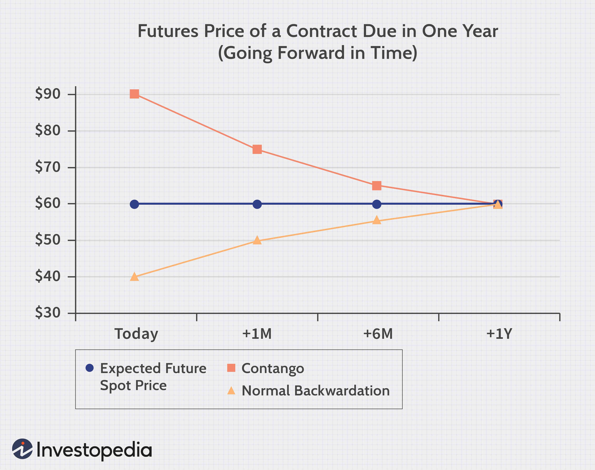

The modern financial landscape is characterized by its complexity and dynamic nature, with futures markets playing a critical role. These markets are fundamental to global finance, providing mechanisms for hedging, price discovery, and risk management. Within futures markets, concepts such as contango and backwardation are essential for traders to understand, as they significantly influence pricing structures and trading strategies. 

Contango and backwardation describe the shape of the futures curve, indicating the relationship between futures prices and spot prices of a given asset over time. Contango typically occurs when futures prices are higher than current spot prices, a situation often driven by factors like storage costs, inflation expectations, and the cost of carry. Conversely, backwardation is marked by futures prices lower than anticipated future spot prices, often reflecting impending supply shortages or heightened demand levels. These conditions are pivotal in guiding market behavior, trader sentiment, and trading opportunities.



The rise of algorithmic trading adds another layer of complexity to the interpretation and exploitation of these market conditions. Algorithmic trading involves executing trades using pre-programmed strategies, often capitalizing on the slight inefficiencies present in contango or backwardation scenarios. Algorithms are adept at processing large volumes of data to make split-second decisions, offering traders the ability to leverage market variations with high precision.

This article will explore the complexities of futures market structure, addressing contango and backwardation's impact on pricing and trading strategies. Additionally, it will examine the integration of algorithmic trading within this framework, highlighting how it can enhance trading execution and optimize investment strategies. Understanding these concepts is pivotal for market participants aiming to navigate the often turbulent waters of modern financial markets effectively.

## Table of Contents

## Understanding Futures Contracts

Futures contracts are financial instruments that create obligations to buy or sell a specific quantity of a commodity, index, or asset at a predetermined price on a set future date. These agreements are standardized across exchanges to facilitate trading, which enhances liquidity and enables efficient hedging and speculation. The attributes of futures contracts include:

1. **Contract Size**: This specifies the amount of the underlying asset covered by the contract. For instance, a crude oil futures contract traded on the New York Mercantile Exchange (NYMEX) represents 1,000 barrels of oil.

2. **Underlying Asset**: Futures contracts can be based on various assets including commodities (e.g., gold, silver, wheat), financial instruments (e.g., treasury bonds, stock indices), or currencies.

3. **Maturity Date**: This is the date on which the contract expires, and the delivery of the underlying asset occurs or, in cash-settled contracts, the cash equivalent is exchanged. Maturity dates are standardized, occurring at regular intervals throughout the year.

4. **Tick Size**: The minimum price movement of a futures contract, also standardized, determines the smallest increment by which prices can change. For instance, a tick size for a treasury bond futures might be 1/32nd of a point.

The standardized nature of futures contracts reduces transaction costs and helps ensure a clear and orderly marketplace. Price discovery is more transparent because the terms are known to all participants, contributing to a competitive trading environment. Understanding these contract specifics is vital as market strategies, particularly in scenarios like contango and backwardation, rely on these fundamental parameters.

In practice, traders employ futures contracts to hedge against price [volatility](/wiki/volatility-trading-strategies) or speculate on future price changes. For hedging, firms might use futures to lock in prices of raw materials or currencies, safeguarding against unfavorable shifts. Speculators, conversely, profit from forecasting price movements and can leverage futures for potential high returns, albeit with higher risk.

The contrasting market conditions of contango and backwardation further emphasize the importance of mastering futures basics. Navigating these conditions requires strategic allocation, risk assessment, and appropriate timing of contract maturities, making thorough knowledge of futures contracts a cornerstone for traders aiming to optimize their positions effectively.

## What is Contango?

Contango is a term used to describe a market structure where the futures prices of a commodity are higher than its current spot price. This condition arises due to several factors, primarily including storage costs, inflation expectations, and the cost of [carry](/wiki/carry-trading). The cost of carry is pivotal in understanding contango, as it encompasses storage expenses, insurance, and the funding costs associated with holding a physical commodity until the delivery date of the futures contract. In a typical contango scenario, the price difference between the futures and the spot markets compensates for these costs, maintaining an equilibrium over time. This relationship can be mathematically described using the cost of carry model:

$$
F = S \times e^{(r + c)t}
$$

Where:
- $F$ is the futures price.
- $S$ is the spot price.
- $r$ is the risk-free interest rate.
- $c$ are the costs associated with carrying the commodity.
- $t$ is the time to maturity of the futures contract.
- $e$ is the base of the natural logarithm.

Contango reflects a market equilibrium state where the expenses related to storing and financing the commodity align with the pricing in the futures market. It is often observed in markets where holding costs are substantial, and the expectation of future price increases covers these costs. For example, oil markets frequently exhibit contango when abundant storage capacities and logistics play significant roles in pricing dynamics.

Understanding contango is vital for traders and investors, as it may influence strategies such as roll yield and shape decisions around entering long or short futures positions. Roll yield, in particular, can be negative in a contango market due to the downward pressure exerted by continually selling nearer-dated positions and buying longer-dated futures contracts at a premium. This phenomenon underscores the importance of being aware of market conditions and their implications for trading strategies.

## Market Implications of Contango

Contango, a condition where futures prices exceed the current spot prices, reflects a bullish market sentiment and offers notable [arbitrage](/wiki/arbitrage) opportunities. This market structure enables traders to benefit from the price disparity between the spot and futures markets. Traders typically engage in strategies that involve purchasing commodities at prevailing lower spot prices and simultaneously entering into futures contracts that lock in a higher selling price for the future. This price differential can create profit margins if the logistical and transaction costs can be adequately managed.

Understanding the fundamental drivers of contango, such as inflation expectations, storage costs, and the cost of carry, is critical for informed decision-making. Storage costs, which include warehousing and insurance, contribute to the premium of futures prices over spot prices, as they reflect the expenses incurred in holding a physical commodity until a future date. The cost of carry formula, given by:

$$
\text{Cost of Carry} = (\text{Storage Costs}) + (\text{Interest Rate}) - (\text{Convenience Yield})
$$

highlights the quantity by which futures prices exceed spot prices due to these underlying costs. Inflation expectations also impact futures pricing, as anticipated depreciation in the purchasing power of money leads traders to price in potential future increases in commodity prices.

Traders seeking to profit from contango must consider these factors and develop strategies that optimize their execution costs and align with their risk tolerance. Analyzing macroeconomic indicators that influence inflation and storage dynamics can offer predictive insights on the persistence or reversal of contango conditions. By leveraging these insights, traders can refine their strategies to capture arbitrage opportunities effectively while hedging against potential adverse market movements.

## What is Backwardation?

Backwardation is a market condition characterized by futures prices being lower than the expected future spot prices. This phenomenon typically arises due to an intrinsic imbalance in the market, often driven by factors such as supply scarcity or elevated demand. As a result, backwardation can significantly influence trading strategies and broader economic outlooks.

In a backwardated market, traders might interpret the lower futures prices as an indication of anticipated near-term shortages or increased demand. This scenario suggests a willingness among market participants to pay a premium for immediate delivery of a commodity, reflecting a belief that spot prices will rise in the future. This dynamic can be especially evident in markets for perishable or consumable commodities, where immediate availability is highly valued.

From a theoretical standpoint, the occurrence of backwardation can be explained by the concepts of convenience yield and storage costs. The convenience yield represents the non-monetary benefits received from holding the physical commodity rather than a futures contract. This yield can sometimes outweigh the costs associated with storing the commodity, thus causing futures prices to dip below expected future spot prices.

For traders, understanding backwardation is crucial for formulating effective strategies. In such markets, strategies might include capitalizing on the roll yield—the return gained by closing near-term contracts and opening longer-term positions as the contract nears expiration. This maneuver can be beneficial if the futures curve remains in backwardation over time, enabling traders to generate profits from the positive roll yield.

Furthermore, backwardation can have broader economic implications. Sustained backwardation in key commodities, like [crude oil](/wiki/crude-oil) or agricultural products, often signals supply chain disruptions or strong demand that can impact pricing across various sectors. Therefore, comprehending the underlying causes of backwardation helps traders and economic analysts to better forecast commodity price movements and develop appropriate hedging strategies.

In summary, backwardation is a critical concept in the futures markets, revealing market sentiments about future supply-demand dynamics. Its occurrence prompts market participants to reassess their strategies and anticipate changes in price levels, both for immediate trading benefits and long-term economic planning.

## Algorithmic Trading and Market Conditions

Algorithmic trading involves the automation of trade execution using computers and algorithms to follow predefined criteria. This method offers precision and adaptability, especially in futures markets characterized by distinct conditions such as contango and backwardation.

In a contango market, where futures prices are higher than current spot prices, [algorithmic trading](/wiki/algorithmic-trading) strategies can capitalize on the price discrepancies between spot and futures. Algorithms can be programmed to identify inefficiencies and take advantage of possible arbitrage opportunities. A typical strategy might involve buying the underlying commodity at the current spot price and simultaneously entering into a futures contract to sell at the elevated future price. The mathematical model supporting this could involve calculating the expected profit as the difference between the future price and the sum of the spot price and carrying costs. These carrying costs include storage fees, insurance, and financing costs, and they contribute significantly to the contango state.

```python
# Example of a simple arbitrage calculation
spot_price = 100  # Current price of the commodity
future_price = 110  # Futures price of the commodity
storage_cost = 5  # Cost to store the commodity until the futures contract matures
profit = future_price - (spot_price + storage_cost)
is_arbitrage_opportunity = profit > 0

print(f"Arbitrage Opportunity: {'Yes' if is_arbitrage_opportunity else 'No'}, Profit: {profit}")
```

Conversely, in backwardation, where futures prices fall below expected future spot prices, algorithmic strategies focus on roll yield, which is the profit earned from rolling over a futures contract to a new one with a later expiration date. This is possible because as the futures contract approaches maturity, its price tends to converge to the spot price, allowing traders to potentially buy the commodity at a lower future price and sell it for a higher spot price.

Algorithmically, this can be approached by programming trades that take advantage of the decreasing future prices as contracts near maturity. Such strategies primarily depend on analyzing historical data and forecasting future price movements to optimize the timing of rolling over contracts.

Both scenarios require sophisticated algorithms capable of real-time data analysis and rapid trade execution to successfully exploit the nuances of contango and backwardation markets. Utilizing [machine learning](/wiki/machine-learning) models or advanced statistical techniques can further enhance the effectiveness of these strategies by better predicting price movements and optimizing trading signals.

## Risks and Considerations

Futures trading presents several risks, notably market volatility, unforeseen economic events, and execution risks. Market volatility can lead to rapid price fluctuations, impacting the value of futures contracts. This volatility can be amplified by factors such as geopolitical events, changes in economic policy, or unexpected shifts in supply and demand.

Unforeseen economic events can trigger abrupt changes in market conditions, including recessions, natural disasters, and pandemics. These events can disrupt established patterns and models, leading to unexpected outcomes for traders. Consequently, it is essential to continuously monitor global events and be prepared for swift market adjustments.

Execution risks pertain to the potential for discrepancies between the expected and actual execution of trades. This can occur due to technological failures, latency in data transmission, or errors in algorithmic systems. Given the high-speed nature of futures trading, even minor delays can lead to significant deviations in trading results.

Effective risk management protocols are crucial for navigating these challenges. Diversification, which involves spreading investments across various assets, can help mitigate the impact of adverse movements in specific markets. Hedging, another key strategy, involves taking positions that offset potential losses in the primary trading strategy. For example, traders might use options or other derivatives to protect against unfavorable price movements.

Understanding market mechanics, including supply and demand dynamics, [interest rate](/wiki/interest-rate-trading-strategies) impacts, and market sentiment indicators, can also offer traders valuable insights. An agile trading strategy that allows for quick adjustments in response to market signals is vital. Implementing robust monitoring systems and maintaining a flexible approach to strategy development can enhance a trader's ability to respond to evolving market conditions effectively.

Incorporating technology, such as real-time data analytics and algorithmic trading tools, can further aid in managing these risks. These technologies can help detect patterns and anomalies, enabling more informed decision-making. However, reliance on technology also necessitates regular updates and system checks to ensure reliability and accuracy in trade execution. By maintaining an adaptable framework and utilizing risk management techniques, traders can better navigate the complexities of futures markets.

## Conclusion

Recognizing whether the market is in contango or backwardation is crucial for effective navigation in futures markets. These market conditions fundamentally impact pricing structures, creating both challenges and opportunities for traders. Understanding the intricacies of contango and backwardation allows traders to anticipate market trends and adapt their strategies accordingly.

Algorithmic trading stands out for its precision and adaptability, making it an invaluable tool for leveraging market inefficiencies inherent in contango and backwardation. By employing sophisticated algorithms, traders can execute a high [volume](/wiki/volume-trading-strategy) of trades at lightning speed, capitalizing on arbitrage opportunities and price discrepancies. Algorithmic models can be fine-tuned to respond to specific market signals, allowing traders to maintain a competitive edge in fluctuating market conditions.

However, the effectiveness of algorithmic trading in these scenarios hinges on continuous monitoring and strategic adaptability. Market dynamics are inherently volatile, with conditions changing rapidly in response to economic events, interest rate fluctuations, and shifts in supply and demand. Maintaining an agile approach enables traders to recalibrate their algorithms and trading parameters, ensuring that their strategies remain aligned with current market realities.

Incorporating risk management protocols is also vital to safeguard against unexpected market shifts. Diversification, hedging strategies, and stress testing trading algorithms can mitigate potential risks and enhance the resilience of trading portfolios.

Ultimately, the key to optimizing trading strategies in futures markets lies in a thorough understanding of market mechanics, coupled with the technological prowess of algorithmic trading systems. By recognizing the signs of contango or backwardation and employing adaptive trading strategies, traders can navigate the complexities of the futures markets with greater confidence and efficacy.

## Frequently Asked Questions (FAQs)

### Is contango a bearish or bullish indicator?

Contango is generally considered a bullish indicator for the futures market. This is because the market condition indicates that future prices of the underlying asset are higher than the current spot price. Traders often interpret contango as reflecting positive market sentiments, where investors expect the asset's value to increase over time. However, it is important to note that contango is not always predictive of future spot price movements but rather a reflection of carrying costs such as storage and interest rates.

### How does backwardation affect commodity pricing strategies?

Backwardation, where futures prices are lower than the anticipated future spot prices, often suggests short-term supply shortages or heightened demand for a commodity. Traders engaged in commodity pricing strategies may take advantage of this scenario by purchasing futures at lower prices compared to the expected future spot price. In this condition, they may benefit from the convergence of futures prices to higher spot prices as the contract approaches maturity. Moreover, backwardation can serve as an impetus for strategic inventory management and prompt escalated production to capitalize on immediate selling opportunities.

### Can algorithmic trading effectively manage risk in contango and backwardation scenarios?

Algorithmic trading can be an effective tool for managing risk in both contango and backwardation scenarios. In contango, algorithms can identify and execute arbitrage opportunities that arise from price inefficiencies, such as buying lower-priced spot assets and selling them at higher future contract prices. During backwardation, algorithms can implement roll yield strategies; this involves rolling over maturing contracts into cheaper, longer-dated contracts to capture profits from the price difference. Additionally, algorithmic systems can rapidly respond to market conditions and adjust positions to minimize exposure to adverse price movements, thereby mitigating risks inherent in futures markets.

### What tools are essential for conducting algorithmic trading in futures markets?

Successful algorithmic trading in futures markets requires a suite of specialized tools:

1. **Data Analytics Platforms**: Tools like Bloomberg Terminal and Thomson Reuters Eikon provide comprehensive data feeds and analytics capabilities.

2. **Execution Systems**: Low-latency trading platforms such as MetaTrader or proprietary systems enable swift execution of trades and order management.

3. **Algorithm Development Environments**: Software like Python's QuantLib or Matlab allow for modeling, backtesting, and optimization of trading algorithms.

4. **Risk Management Software**: Solutions such as RiskMetrics or NumeriX assist in assessing and managing the potential risks associated with trading strategies.

5. **Connectivity to Exchanges**: Direct market access (DMA) ensures algorithms can interface seamlessly with exchanges, executing trades at optimal speeds.

By leveraging these tools, traders can effectively develop, test, and deploy sophisticated algorithms tailored to capitalize on the unique conditions of futures markets.

## References & Further Reading

- Bessembinder, H., Coughenour, J. F., Seguin, P. J., & Smoller, M. M. (1995). Mean Reversion in Equilibrium Asset Prices: Evidence from the Futures Term Structure. *The Journal of Finance*. This paper discusses the concept of mean reversion within the context of futures prices, providing insights into how prices return to their equilibrium over time. The authors investigate how this principle applies across various futures markets, offering an analytical framework for understanding pricing dynamics.

- Chance, D. M. & Brooks, R. (2013). *An Introduction to Derivatives and Risk Management*. Cengage Learning. This comprehensive textbook offers foundational knowledge on derivatives, including futures contracts, options, swaps, and risk management strategies. It explains the pricing mechanisms and economic roles of these financial instruments, making it an essential resource for students and professionals engaging with derivatives markets.

- Geman, H. (2005). *Commodities and Commodity Derivatives: Modelling and Pricing for Agriculturals, Metals and Energy*. Wiley Finance. This book provides a thorough exploration of the commodity markets and the derivatives used within them. Geman examines the pricing models for various commodities, addressing key concepts like contango, backwardation, and the economic factors driving these market conditions.

These references offer a balanced mix of theoretical foundations and practical insights essential for understanding the complex mechanisms governing futures markets. They are particularly valuable for those interested in exploring the nuances of contango and backwardation, their implications for trading strategies, and how algorithmic trading can be employed to navigate these market conditions effectively.

