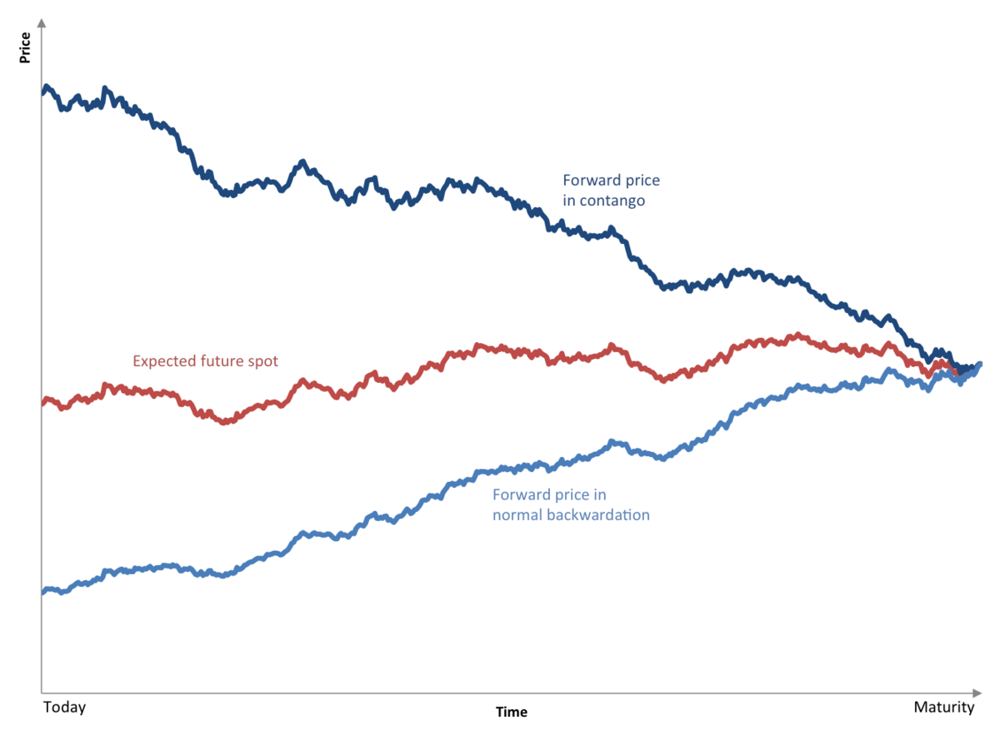

## Table of Contents

## What is contango?

Contango is a situation in the futures market where the price of a futures contract is higher than the expected spot price of the commodity at the time the contract expires. In simpler terms, it means that it costs more to buy a commodity for future delivery than it does to buy it right now. This often happens because of the costs associated with storing and insuring the commodity until the delivery date.

For example, if the current price of oil is $50 per barrel, but the futures contract for oil to be delivered in six months is trading at $55 per barrel, the market is in contango. Investors and traders need to be aware of contango because it can affect their returns, especially if they are holding futures contracts over time. If the market remains in contango, the price of the futures contract might decrease as it gets closer to the delivery date, leading to potential losses for those holding the contracts.

## How does contango affect futures prices?

Contango affects futures prices by making them higher than the current price of the commodity. This happens because when you buy a futures contract, you're not just paying for the commodity itself. You're also paying for the costs of storing it, insuring it, and other expenses until the delivery date. So, the futures price includes these extra costs, which makes it higher than the price you would pay if you bought the commodity right now.

When the market is in contango, the futures price is expected to go down as the delivery date gets closer. This is because the extra costs for storage and insurance decrease over time. If you're holding a futures contract, you might see the value of your contract drop as it approaches the expiration date. This can lead to losses if you're not careful. So, contango is important to understand if you're trading or investing in futures.

## Can you explain the difference between contango and backwardation?

Contango and backwardation are two terms you hear in the futures market. Contango happens when the price of a futures contract is higher than the price of the commodity right now. It's like paying more to get something later than you would if you bought it today. This happens because of the costs of storing and insuring the commodity until it's delivered. So, if you see the futures price going down as the delivery date gets closer, that's a sign of contango.

Backwardation is the opposite. It's when the price of a futures contract is lower than the current price of the commodity. So, it's cheaper to buy the commodity for future delivery than it is to buy it right now. This can happen if people think the commodity will be harder to get or more expensive in the future. If you see the futures price going up as the delivery date approaches, that's a sign of backwardation.

Understanding these terms can help you make better decisions if you're trading or investing in futures. Contango can lead to losses if you're holding onto a futures contract as it gets closer to expiring, while backwardation can mean gains if the market stays the same.

## What causes contango in commodity markets?

Contango in commodity markets happens because of the costs of holding onto the commodity until it's delivered. When you buy a futures contract, you're not just paying for the commodity itself. You're also paying for the costs of storing it, insuring it, and other expenses until the delivery date. These extra costs make the futures price higher than the price you would pay if you bought the commodity right now. So, the market goes into contango because these costs add up over time.

Another reason for contango is when people expect the price of the commodity to stay the same or go down in the future. If everyone thinks the commodity will be cheaper later, they won't want to pay a lot for it now. This can push the futures price up because sellers need to cover their costs, even if they think the commodity won't be worth as much later. So, contango can happen when the market expects prices to stay steady or drop.

## How can investors identify contango in a futures market?

Investors can identify contango in a futures market by looking at the prices of futures contracts and comparing them to the current spot price of the commodity. If the futures price is higher than the spot price, the market is in contango. For example, if oil is trading at $50 per barrel today, but the futures contract for oil to be delivered in six months is trading at $55 per barrel, that's a sign of contango.

You can also see contango by watching how the futures prices change over time. If the price of a futures contract is going down as it gets closer to the delivery date, that's another sign of contango. This happens because the extra costs for storing and insuring the commodity decrease as the delivery date approaches. So, if you see the futures price dropping as time goes on, it's likely the market is in contango.

## What are the implications of contango for investors holding futures contracts?

Contango can be tough for investors who hold onto futures contracts. If you buy a futures contract when the market is in contango, you're paying more for the commodity than its current price. As the delivery date gets closer, the price of the futures contract usually goes down because the costs of storing and insuring the commodity decrease. This means if you're holding the contract, you might see its value drop, which can lead to losses if you don't sell it before it expires.

It's important for investors to watch the market closely if they're in contango. If you think the market will stay in contango, you might want to sell your futures contract before it loses too much value. On the other hand, if you think the market might switch to backwardation, where futures prices are lower than the current price, you might decide to hold onto your contract longer. Understanding contango can help you make smarter choices about when to buy and sell futures contracts.

## How does contango impact the returns of commodity ETFs?

Contango can make it harder for commodity ETFs to make money. These ETFs often use futures contracts to track the price of a commodity. When the market is in contango, the futures contracts they hold are more expensive than the current price of the commodity. As these contracts get closer to expiring, their prices usually go down. This means the ETF has to keep buying new, more expensive futures contracts to stay invested in the commodity, which can eat into their returns.

For example, if an oil ETF holds futures contracts that are in contango, it might have to sell the contracts at a lower price as they near expiration and buy new ones at a higher price. This process, called rolling over the contracts, can lead to losses over time. So, if you're thinking about investing in a commodity ETF, it's a good idea to check if the market is in contango, as it could affect how much money the ETF makes.

## What strategies can traders use to profit from contango?

Traders can profit from contango by selling futures contracts. When the market is in contango, the price of futures contracts is higher than the current price of the commodity. If you sell a futures contract when it's high and buy it back later when the price drops as it gets closer to the delivery date, you can make a profit. This is called going short on the futures contract. Traders who think the market will stay in contango can use this strategy to make money from the price difference.

Another way to profit from contango is by trading in the spot market. If you can buy the commodity at the current price and then sell futures contracts at a higher price, you can make money from the difference. This strategy works well if you have a way to store the commodity until the futures contract expires. It's a bit more complicated because you need to think about the costs of storing and insuring the commodity, but it can be profitable if done right.

## How does contango relate to the cost of carry?

Contango is closely related to the cost of carry, which is the total cost of holding a commodity until it's delivered. When you buy a futures contract, you're not just paying for the commodity itself. You're also paying for the costs of storing it, insuring it, and other expenses until the delivery date. These costs are called the cost of carry. If the futures price is higher than the current price of the commodity, it means the market is in contango because the cost of carry is added to the futures price.

So, contango happens because of the cost of carry. If these costs are high, the futures price will be a lot higher than the current price, making the contango more noticeable. Traders and investors need to understand this relationship because it can affect how much money they make or lose when they're dealing with futures contracts. If the cost of carry goes up, it can push the market further into contango, which might mean bigger losses for those holding futures contracts.

## Can contango be observed in financial futures other than commodities?

Yes, contango can be seen in financial futures other than commodities, like stock index futures or interest rate futures. Just like with commodities, contango in these markets happens when the futures price is higher than the current price of the underlying asset. For example, if the S&P 500 index is at 4,000 points today, but the futures contract for the S&P 500 to be settled in three months is trading at 4,050 points, the market is in contango. This difference in price is because of the costs of holding onto the asset until the futures contract expires, like the cost of borrowing money to buy stocks or the cost of holding onto a bond.

The reasons for contango in financial futures can be a bit different from commodities. For example, in interest rate futures, contango might happen because of expectations about future interest rates. If people think interest rates will go up, the price of the futures contract might be higher to reflect the higher cost of borrowing in the future. Understanding contango in financial futures is important for traders and investors because it can affect their returns, just like it does in commodity markets. If you're holding a futures contract in contango, you might see its value drop as it gets closer to expiring, which could lead to losses.

## What historical examples illustrate the effects of contango?

One famous example of contango happened in the oil market in 2020. When the COVID-19 pandemic hit, people stopped traveling as much, so the demand for oil dropped a lot. Oil prices went down, but the futures contracts for oil stayed high because of the costs of storing all that extra oil. This made the oil market go into a big contango. People who bought oil futures hoping to make money when oil prices went back up ended up losing money because they had to keep buying new futures contracts at higher prices as the old ones expired. This showed how contango can hurt investors if they're not careful.

Another example is from the gold market in the early 2000s. Gold was in contango because the costs of storing and insuring gold were high. If you bought a gold futures contract, you were paying more for the gold than if you bought it right away. As the futures contract got closer to expiring, its price would go down. Some investors who held onto these contracts lost money because they didn't sell them in time. This example shows that contango can happen in different commodity markets and can affect how much money investors make or lose.

## How do market expectations and storage costs influence the degree of contango?

Market expectations and storage costs both play a big role in how much contango there is in the futures market. If people think the price of a commodity will stay the same or go down in the future, the market goes into contango. This is because no one wants to pay a lot for something now if they think it will be cheaper later. So, the futures price goes up to cover the costs of storing and insuring the commodity until it's delivered. The more people expect prices to stay steady or drop, the more contango you see.

Storage costs also make contango worse. If it's expensive to store a commodity, like oil or gold, the futures price has to be higher to cover those costs. The higher the storage costs, the bigger the difference between the current price and the futures price, which means more contango. So, when storage costs go up, the market can go further into contango, making it harder for investors to make money from holding onto futures contracts.

## What are some case studies and examples?

### Case Studies and Examples

The role of contango in algorithmic trading can be illustrated with real-world examples where traders have leveraged this market condition to their advantage. One of the most notable examples is the [crude oil](/wiki/crude-oil) market, particularly during the 2020 COVID-19 pandemic when market dynamics created significant contango opportunities.

During this period, the global oil market experienced a historic drop in demand due to lockdowns and reduced travel. This resulted in an oversupply and caused futures prices for contracts set to expire in the near-term to dip below those of longer-dated contracts, creating a pronounced contango market. Algorithmic traders capitalized on these conditions by implementing strategies that exploited the discrepancy between spot prices and futures prices.

**Crude Oil Market Case Study**

In the spring of 2020, crude oil futures faced unprecedented contango levels as storage capacity became a limiting factor. Traders used algorithms to identify and capitalize on the price differences between contracts. A common strategy employed was the "cash-and-carry" [arbitrage](/wiki/arbitrage). This involved buying the physical commodity at the lower spot price and simultaneously selling a futures contract at the higher futures price, with the trade expected to converge as the expiration date approached.

The strategy math can be outlined as follows:

1. **Buy Spot:** Acquire the physical commodity (crude oil) at today's spot price $S_t$.
2. **Sell Futures:** Sell a futures contract for the same commodity expiring at date $T$ at the futures price $F_t$.
3. **Hold and Store:** Hold onto the physical commodity and incur storage costs $C$ until the futures contract expiration.
4. **Settle:** Upon maturity, deliver the physical commodity and receive the futures price, realizing a profit, assuming the cost of funding and storage does not exceed the futures-spot price difference.

$$
\text{Profit} = F_t - (S_t + C)
$$

Algorithmic systems enable traders to constantly monitor the necessary inputs such as spot prices, futures prices, and storage costs, thereby executing trades rapidly and mitigating risks associated with manual intervention.

**Outcomes and Effectiveness**

Traders with sophisticated algorithms achieved considerable profits during these periods due to rapid computation and execution of trades. Algorithms can efficiently model market conditions and implement strategies like cash-and-carry arbitrage, which require exact timing and precision. The effectiveness of these strategies is reinforced by the ability of algorithms to adapt to market changes and re-optimize based on real-time data inputs.

Moreover, the ability to analyze large datasets helped algorithms identify patterns and potential entry points that human traders might overlook. This computational edge proved crucial during periods of high volatility and uncertainty, such as during the oil price crisis.

In conclusion, the case of the crude oil market during the 2020 pandemic clearly demonstrates how algorithmic trading strategies can exploit contango, achieving profitable outcomes even amidst market chaos. By leveraging mathematical models and live market data, algorithms allow traders to make informed decisions, thus exemplifying the integral role of algorithmic trading under contango conditions.

## References & Further Reading

[1]: ["Contango and Backwardation in the Commodity Futures Market"](https://www.investopedia.com/articles/07/contango_backwardation.asp) - An Investopedia article explaining the concepts of contango and backwardation in futures markets.

[2]: Lemke, C., & Gabrys, B. (2010). ["Meta-learning for time series forecasting and forecast combination."](https://www.sciencedirect.com/science/article/pii/S0925231210001074) Neurocomputing, 73(10-12), 2006-2016.

[3]: Hull, J. (2018). ["Options, Futures, and Other Derivatives"](https://www.amazon.com/Options-Futures-Other-Derivatives-9th/dp/0133456315) (10th Edition). Pearson.

[4]: Fama, E. F., & French, K. R. (1987). ["Commodity Futures Prices: Some Evidence on Forecast Power, Premiums and the Theory of Storage."](https://www.jstor.org/stable/2352947) The Journal of Business, 60(1), 55-73.

[5]: ["Market Microstructure Theory"](https://en.wikipedia.org/wiki/Market_microstructure) by Maureen O'Hara

[6]: Johnson, L. L. (1960). ["The Theory of Hedging and Speculation in Commodity Futures."](https://www.jstor.org/stable/2296076) The Review of Economic Studies, 27(3), 139-151.

[7]: Murphy, J. J. (1999). ["Technical Analysis of the Financial Markets: A Comprehensive Guide to Trading Methods and Applications"](https://archive.org/details/technicalanalysi0000murp). New York Institute of Finance.

[8]: ["High-Frequency Trading: A Practical Guide to Algorithmic Strategies and Trading Systems"](https://www.wiley.com/en-us/High+Frequency+Trading%3A+A+Practical+Guide+to+Algorithmic+Strategies+and+Trading+Systems%2C+2nd+Edition-p-9781118343500) by Irene Aldridge.