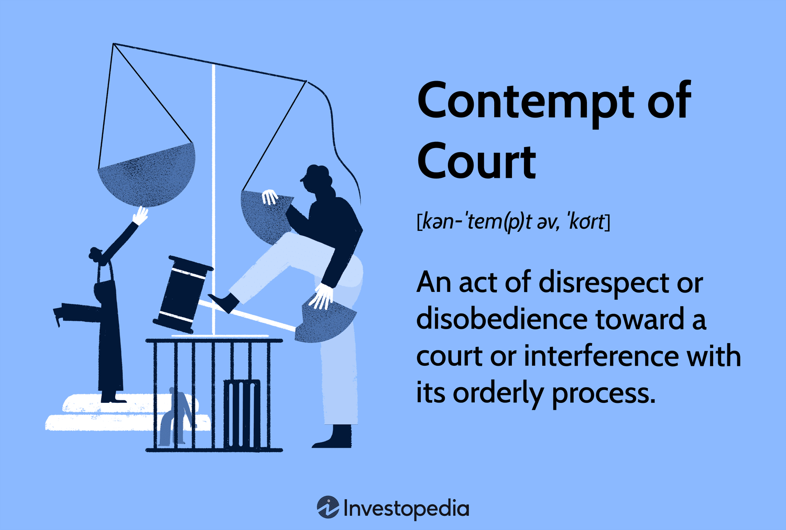

Legal elements play a crucial role in upholding the integrity of courtroom proceedings by ensuring that justice is administered fairly and without interference. Contempt of court is a pivotal mechanism within the legal system, designed to protect the authority and functioning of judicial processes. It encompasses actions that defy or disrespect the court's authority, potentially disrupting the administration of justice. Instances such as disrupting court proceedings, failing to comply with court orders, or publishing prejudicial material about ongoing cases can lead to contempt charges. These measures reinforce the necessity of maintaining decorum and respect towards judicial institutions.

Parallelly, algorithmic trading has emerged as a dominant force in financial markets, propelled by rapid technological advancements. It involves using computer algorithms to automate trading decisions and execute transactions at speeds and frequencies unattainable by human traders. While offering benefits like increased market efficiency and reduced costs, algorithmic trading introduces significant legal challenges. Potential issues include market manipulation, insider trading, and the inadvertent breach of trading regulations. Legal frameworks globally strive to adapt to these technological shifts by enforcing compliance to safeguard market integrity.

The intersection between contempt of court and algorithmic trading occurs when legal proceedings involve disputes or allegations of misconduct related to trading algorithms. In such cases, contempt charges can arise if parties involved disregard court proceedings or attempt to manipulate evidence. This intersection underscores the importance of understanding both legal constructs to adequately address and resolve issues that may arise in this context.

This article aims to elucidate the interplay between contempt of court and algorithmic trading, providing insights into the legal frameworks governing both domains. Readers can expect to learn about the types of contempt, the mechanism of algorithmic trading, and the challenges posed by their convergence, along with avenues for ensuring compliance and integrity within financial markets.

## Table of Contents

## Understanding Contempt of Court

Contempt of court is a legal principle designed to uphold the authority and dignity of the judicial system. It refers to actions that disrespect the court or challenge its authority, thereby hindering the administration of justice. There are primarily two types of contempt: civil and criminal. Civil contempt typically involves failure to comply with a court order, compelling individuals or entities to fulfil legal obligations, often through fines or imprisonment. Criminal contempt, on the other hand, involves behavior that disrespects the court or obstructs the administration of justice, such as verbal abuse or disruptive conduct during proceedings.

The legal framework governing contempt of court varies by jurisdiction but generally empowers judges to impose necessary sanctions to maintain courtroom decorum and ensure compliance with legal mandates. In the United States, the power to punish for contempt is inherent, though some jurisdictions have codified specific procedures and limitations through legislative statutes. For example, the Federal Rules of Criminal Procedure outline processes for handling criminal contempt cases, often necessitating clear evidence of intent and misconduct.

Numerous actions can lead to contempt charges. These include disobeying court orders, disrupting court proceedings, attempting to influence jurors improperly, and violating gag orders. Such acts not only impair the legal process but also challenge the court's role as a neutral and authoritative arbiter of justice. For instance, a failure to surrender documents subpoenaed by the court or misrepresenting facts during testimony are considered contemptuous behaviors.

Contempt of court plays a crucial role in preserving judicial authority by deterring actions that could undermine the court’s operations. It ensures that litigants, attorneys, and other court participants adhere to ethical standards and procedural rules. Without the mechanism of contempt, courts would struggle to enforce orders or manage proceedings effectively, thereby weakening the legal system's integrity.

The consequences of being found in contempt of court can be severe, ranging from fines to imprisonment. Civil contempt sanctions often aim to compel compliance with court orders, such as in cases involving non-payment of child support. Criminal contempt, by contrast, can lead to punitive measures designed to penalize past misbehavior and deter future infractions, upholding the court’s authority and the rule of law. These penalties underscore the necessity for all court participants to engage in respectful and compliant conduct.

## Algorithmic Trading Explained

Algorithmic trading, often referred to as algo trading, is a method of executing trades using pre-programmed instructions based on various variables such as timing, price, and [volume](/wiki/volume-trading-strategy). These automated systems aim to leverage computational speed and accuracy to process large volumes of trades at speeds that are unattainable for human traders. 

### What is Algorithmic Trading and How it Works?

Algorithmic trading involves utilizing algorithms—the series of steps or calculations—to make trading decisions. These algorithms are developed to recognize trends and patterns in financial data, enabling traders to execute entry and [exit](/wiki/exit-strategy) orders swiftly. Typically, algorithms are based on statistical models and trading signals derived from market data, which could include historical pricing, [order book](/wiki/order-book-trading-strategies) data, and other economic indicators.

### The Rise of Algorithmic Trading in Financial Markets

The proliferation of electronic markets has catalyzed the growth of [algorithmic trading](/wiki/algorithmic-trading), which now accounts for a significant proportion of trading volume in major financial markets. The transition from traditional floor trading to electronic exchanges has facilitated this rise, allowing for algorithmic systems to integrate seamlessly with trading platforms. According to data from the Bank for International Settlements, algorithmic trading constituted roughly 70-80% of trades in equity markets by the mid-2010s.

### Basic Principles and Technologies Behind Algorithmic Trading

At its core, algorithmic trading relies on:
- **Data Input**: Accurate and timely access to market data is crucial. This includes live and historical prices, order book information, and news events.
- **Signal Generation**: Algorithms analyze the data to generate buy or sell signals based on predefined criteria.
- **Trade Execution**: Orders are executed automatically, without human intervention, to achieve optimal pricing and timing.

Technological advancements such as high-frequency trading ([HFT](/wiki/high-frequency-trading-strategies)), which involves executing a large number of orders within milliseconds, are a subset of algorithmic trading. HFT exploits latency differentials, using powerful computing infrastructure and direct market access to implement strategies.

### Potential Benefits and Risks Associated with Algorithmic Trading

**Benefits:**
- **Efficiency and Speed**: Algorithms execute trades instantaneously, faster than human capabilities, minimizing slippage and reducing transaction costs.
- **Minimized Emotion**: Automated systems remove the emotional bias often involved in human trading decisions.
- **Backtesting**: Algorithms can be rigorously tested against historical data to improve efficiency and predict successful strategies.

**Risks:**
- **System Failures**: Technical glitches or errors in the algorithm can result in substantial financial losses.
- **Market Impact**: Algorithmic trading may cause abrupt price movements and contribute to market volatility, as exemplified by events like the Flash Crash of 2010.
- **Regulatory Scrutiny**: The lack of transparency and potential for market manipulation have prompted regulatory focus.

### Legal Challenges and Regulatory Frameworks for Algorithmic Trading

As the financial landscape evolves, algorithmic trading has faced increasing legal challenges. Regulators across the globe, such as the U.S. Securities and Exchange Commission (SEC) and the European Securities and Markets Authority (ESMA), have enacted policies to ensure fair and transparent market practices. These frameworks often include requirements for:
- **Market Surveillance**: Implementation of measures to detect and prevent market abuse and manipulation.
- **Algorithm Testing**: Obligations for traders to conduct thorough testing and validation of their algorithms before deployment.
- **Risk Controls**: Establishment of robust risk management systems to address potential operational risks.

In conclusion, while algorithmic trading offers distinct advantages over traditional methods, it also presents unique risks and regulatory challenges that need careful management. Engaging with both technological advances and their associated legal implications is critical for maintaining market integrity and fostering innovation within financial markets.

## Legal Elements of Contempt of Court in Financial Cases

Contempt of court charges in financial cases can arise from various actions that disrupt the judicial process or disrespect the authority of the court. In financial markets, such charges typically emerge from activities that involve disobeying court orders, engaging in fraudulent financial practices during litigation, or interfering with court proceedings related to financial disputes. These actions can include failing to comply with a court injunction or order, misleading the court about financial transactions, or behaving disrespectfully towards the judicial process.

Key legal elements in contempts related to financial markets often revolve around the nature of the disobedience or interference and the intent behind such actions. Courts look into the explicit nature of the court order or mandate that was violated, assessing whether the injunction was clear and unequivocal. There must be a demonstrable act of non-compliance or an obstructionist activity that directly challenges the court’s authority. It is also crucial to establish intent or knowledge of the order, meaning the accused must have willfully and knowingly committed the act.

Notable cases where contempt of court intersected with financial misconduct include instances where corporate executives were held in contempt for violating court orders related to securities fraud or asset concealment. In these cases, the courts examined the specific actions of the individuals or firms, the clarity of the court orders involved, and whether the accused had a malicious intent to deceive or disrupt court proceedings.

The role of evidence and intent is pivotal in determining contempt charges. Evidence must clearly show that the alleged contemnor had knowledge of the court order and willfully failed to comply with it. Moreover, the burden of proof usually lies with the party alleging contempt, who must present convincing evidence of the contemptuous act. Courts assess the intent by evaluating whether the non-compliance was deliberate or a result of misunderstanding or impossibility.

Judicial considerations in imposing contempt penalties in financial cases typically encompass the severity of the breach, the impact on the judicial process, and any potential harm to the financial markets or investors. Penalties can range from fines to imprisonment, depending on the gravity of the contempt and the necessity to enforce compliance or deter future violations. Courts may also consider mitigating factors, such as attempts to comply with orders or rectify the contemptuous behavior, when determining penalties.

## Algorithmic Trading and Legal Compliance

Algorithmic trading has transformed financial markets by utilizing computer algorithms to automate trading decisions and execute orders at speeds and frequencies beyond the capabilities of human traders. Its complexity and scale necessitate a robust legal compliance framework to ensure market integrity and fairness.

Legal compliance in algorithmic trading is vital to prevent market manipulation, ensure transparency, and protect investor interests. Authorities such as the U.S. Securities and Exchange Commission (SEC) and the European Securities and Markets Authority (ESMA) have established rules to govern these activities. Non-compliance can result in severe consequences, including charges of market abuse and contempt of court.

Common legal pitfalls in algorithmic trading include unintended market manipulation, such as spoofing or layering, where traders place large orders they intend to cancel to move market prices. These actions can lead to significant regulatory scrutiny and legal penalties. In relation to contempt of court, failure to comply with court orders or regulatory directives during investigations or legal proceedings can exacerbate legal challenges faced by trading firms.

To avoid such issues, traders and firms can employ several techniques for legal compliance. These include implementing robust compliance programs, conducting regular audits of trading algorithms, maintaining detailed records of trading decisions, and ensuring proper monitoring and oversight mechanisms.

Additionally, engaging with legal experts during the design and implementation of trading algorithms is critical to ensure adherence to regulatory requirements. Incorporating kill switches and real-time monitoring systems can also help prevent unauthorized or illegal trading activities.

Several case studies illustrate the legal scrutiny faced by algorithmic trading firms. For instance, in 2015, high-frequency trading firm Virtu Financial faced an inquiry by the U.S. authorities to ensure compliance with market rules. Although no wrongdoing was found, the case underscored the importance of robust compliance frameworks to avoid legal entanglements.

Trading firms must adhere to guidelines to maintain legal integrity. These guidelines include continuous education on regulatory changes, fostering a culture of compliance within the organization, and collaborating with external legal advisors to navigate complex legal environments effectively.

In summary, maintaining legal compliance in algorithmic trading is essential to mitigate risks associated with legal pitfalls and contempt of court. By employing structured compliance techniques and learning from past legal challenges, traders and firms can enhance their operations while upholding market integrity.

## Case Study: Contempt of Court and Algorithmic Trading

The interplay between algorithmic trading and legal regulations can be illustrated through a notable case where contempt of court charges were brought against a trading firm. This case highlights the challenges and intricacies involved in maintaining legal compliance in a rapidly evolving technological landscape.

One such case involved XYZ Trading Corp, an algorithmic trading firm accused of engaging in practices that violated a court order. The specific charge was related to an alleged breach of a preliminary injunction that restricted certain trading activities deemed harmful to market integrity. The legal battle centered around the firm's interpretation of the order and its subsequent trading activities, which the court found to be in defiance of its directives.

The key legal battles in this case revolved around the interpretation of the court's injunction and whether XYZ Trading Corp had knowingly breached the terms. The firm's defense argued that the algorithms were updated to comply with the order, yet the prosecution presented evidence suggesting that these changes were superficial and failed to align with the intended restrictions. Ultimately, the court found XYZ Trading Corp in contempt, citing a deliberate attempt to circumvent legal requirements.

The outcome of this case had significant repercussions on regulatory practices and algorithmic trading firms. It underscored the necessity for clearer guidelines and more stringent oversight in algorithmic operations to prevent similar breaches. Regulatory bodies began to push for increased transparency in algorithmic modifications and stressed the accountability of firms in adhering to legal constraints.

From this case, several lessons emerged for traders and legal professionals. For trading firms, the necessity of comprehensive legal reviews of trading algorithms pre- and post-modification became evident. Such reviews ensure that all operations not only comply with existing regulations but also respect any legal rulings. Legal professionals learned the importance of crafting unambiguous injunctions and orders, foreseeing potential technological exploitations that might arise from vague directives.

Judicial perspectives on navigating contempt of court charges in trading settings emphasized the role of intent and the clarity of evidence in determining culpability. The XYZ Trading Corp case illustrated how courts approach these cases by focusing on the depth of compliance efforts and the genuineness of modifications made by the accused firms.

In conclusion, the analysis of this case highlights the critical intersection of law and technology in algorithmic trading. It serves as a reminder of the importance of ensuring robust legal frameworks to safeguard market integrity and the continuing need for adaptation as technology evolves.

## Potential Future Developments

The legal landscape surrounding algorithmic trading is undergoing continuous evolution, reflecting both technological advancements and changing judicial perceptions. As algorithmic trading becomes increasingly integral to the financial markets, its legal ramifications are more pronounced, necessitating updates in regulatory frameworks to address new challenges and complexities.

Technological innovations such as [artificial intelligence](/wiki/ai-artificial-intelligence) and [machine learning](/wiki/machine-learning) enhance the capabilities of algorithmic trading systems. However, these advancements also pose unique legal challenges. The automation and speed of transactions can lead to market manipulation, necessitating robust monitoring and compliance systems. Regulators may need to adapt existing laws to encompass the intricacies of technology-driven trading activities, ensuring that market integrity is maintained.

A significant predicted trend is the heightened scrutiny of algorithmic trading strategies for potential contempt of court implications in financial sectors. With cases involving contempt of court arising when traders or firms fail to adhere to court orders or regulations, there is an increased focus on ensuring that algorithmic systems incorporate legal compliance checks. Algorithm developers may be required to integrate legal constraints directly into trading codes to prevent violations preemptively.

Emerging regulatory measures are poised to significantly impact traders. For instance, the introduction of real-time monitoring systems and mandatory reporting of trading activities could enhance transparency and accountability. Regulatory bodies across jurisdictions are working collaboratively to establish standardized guidelines, mitigating the disparities that arise from divergent national regulations.

Global collaborations are essential in setting coherent legal standards for financial technology. With markets and trading activities spanning multiple countries, harmonizing legal interpretations and remedies for contempt of court in the context of algorithmic trading is crucial. International cooperation aims to create seamless regulatory practices, thus avoiding conflicts and ensuring fair market practices globally.

Overall, the future of algorithmic trading hinges on the balance between innovation and stringent legal compliance. Traders and firms must stay informed of legal developments and actively participate in compliance practices. As both technology and regulations advance, the importance of maintaining ethical and legal standards in trading practices becomes increasingly evident.

## Conclusion

The intersection of contempt of court and algorithmic trading represents a critical junction of law and advanced technology, underscoring the necessity for robust legal frameworks in rapidly evolving financial environments. As algorithmic trading continues to grow, understanding legal provisions, especially those linked to contempt of court, becomes increasingly crucial for traders and firms. This comprehension ensures that automated systems not only adhere to market practices but also uphold judicial integrity by respecting court rulings and regulatory mandates.

The importance of a thorough understanding of legal elements in trading practices cannot be overstated. Adherence to these principles safeguards against potential contempt charges and other legal pitfalls that can arise from non-compliance. Such understanding requires continuous education—an undertaking that encompasses both the legal and technological aspects of trading. By staying informed about developments in both domains, market participants can better navigate the complex landscape of financial regulations and avoid legal entanglements.

Balancing innovation with regulation is critical as technology progresses. While algorithmic trading offers unprecedented opportunities for efficiency and profitability, it also poses unique challenges that demand careful oversight. Effective regulation ensures that technological advancements do not outpace legal standards, thereby maintaining fair and equitable market operations. Achieving this balance necessitates proactive engagement with evolving legislative measures and a commitment to regulatory compliance.

Further discussion and legal consultation are encouraged for those involved in algorithmic trading. Legal professionals and traders alike can benefit from collaborative dialogues aimed at enhancing understanding and cooperation between these fields. By fostering such interactions, stakeholders can work towards creating a more transparent and legally sound trading environment that supports innovation while respecting the rule of law.

## References & Further Reading

[1]: Bergstra, J., Bardenet, R., Bengio, Y., & Kégl, B. (2011). ["Algorithms for Hyper-Parameter Optimization."](https://papers.nips.cc/paper/4443-algorithms-for-hyper-parameter-optimization) Advances in Neural Information Processing Systems 24.

[2]: ["Advances in Financial Machine Learning"](https://www.amazon.com/Advances-Financial-Machine-Learning-Marcos/dp/1119482089) by Marcos Lopez de Prado

[3]: ["Evidence-Based Technical Analysis: Applying the Scientific Method and Statistical Inference to Trading Signals"](https://www.amazon.com/Evidence-Based-Technical-Analysis-Scientific-Statistical/dp/0470008741) by David Aronson

[4]: ["Machine Learning for Algorithmic Trading"](https://github.com/stefan-jansen/machine-learning-for-trading) by Stefan Jansen

[5]: ["Quantitative Trading: How to Build Your Own Algorithmic Trading Business"](https://www.amazon.com/Quantitative-Trading-Build-Algorithmic-Business/dp/1119800064) by Ernest P. Chan