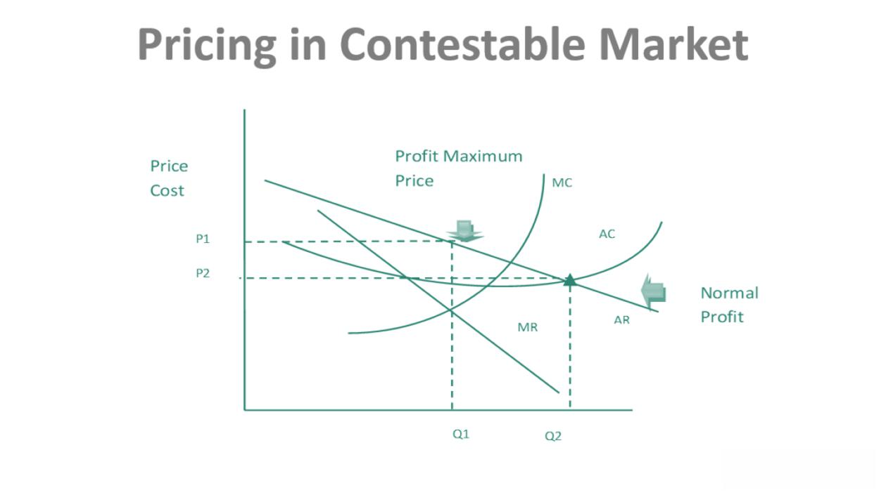

## Table of Contents

## What is Contestable Market Theory?

Contestable Market Theory is an economic idea that says a market can be competitive even if there are only a few companies in it. The key is that it's easy for new companies to enter the market and for existing companies to leave it. If it's easy to enter and exit, the companies already in the market will behave as if they are in a very competitive environment. They'll keep their prices low and their quality high because they know new competitors could come in at any time.

This theory was developed by William Baumol in the 1980s. He argued that the threat of potential competition is just as important as actual competition. Even if there are only a few big companies in a market, they won't take advantage of customers if they know other companies could easily start competing with them. This means that markets can be efficient and good for consumers even if they don't look very competitive on the surface.

## Who developed the Contestable Market Theory?

The Contestable Market Theory was developed by an economist named William Baumol in the 1980s. He came up with this idea to explain how markets can still be competitive even if there are only a few big companies in them.

Baumol's theory says that what really matters is how easy it is for new companies to enter a market and for existing companies to leave it. If it's easy to enter and [exit](/wiki/exit-strategy), the companies already in the market will act as if they are in a very competitive environment. They'll keep their prices low and their quality high because they know new competitors could come in at any time.

## What are the key assumptions of Contestable Market Theory?

The Contestable Market Theory relies on a few important assumptions. First, it assumes that there are no barriers to entry or exit in the market. This means new companies can start up easily and existing companies can leave without facing big costs or penalties. If it's easy to enter and exit, companies will be scared of new competition, so they'll keep their prices low and their service good.

Second, the theory assumes that all companies in the market have access to the same technology and information. This levels the playing field, so new companies can compete effectively right from the start. It also means that existing companies can't use special advantages to keep new competitors out. Together, these assumptions help explain why markets can be competitive even if there are only a few big companies in them.

## How does Contestable Market Theory differ from traditional market structure theories?

Contestable Market Theory is different from traditional market structure theories because it focuses on how easy it is for new companies to enter and leave a market, rather than just looking at the number of companies already in the market. Traditional theories, like perfect competition or monopoly, pay a lot of attention to how many companies are in a market and how much they compete with each other. They say that if there are many companies, the market is competitive, but if there's only one big company, it's a monopoly and not good for customers. Contestable Market Theory says that even if there are only a few big companies, the market can still be competitive if new companies can easily start up and compete.

This theory also puts a big emphasis on the threat of potential competition rather than just the actual competition that's happening right now. Traditional theories mostly look at what's happening in the market at the moment. They might say that a market with only a few companies isn't very competitive. But Contestable Market Theory says that if new companies can easily enter the market, the existing companies will still act as if they're in a very competitive environment. They'll keep their prices low and their quality high because they know new competitors could come in at any time. This makes the market good for customers even if it doesn't look very competitive on the surface.

## What is the role of entry and exit barriers in Contestable Market Theory?

In Contestable Market Theory, entry and exit barriers are super important. They decide how easy it is for new companies to start up and for existing companies to leave the market. If there are no big barriers, new companies can come in easily and start competing. This means the companies already in the market have to be careful. They can't charge too much or give bad service because they know new competitors could show up any time.

On the other hand, if there are big barriers to entry and exit, it's hard for new companies to start and for existing ones to leave. This can make the market less competitive. The companies already in the market might not worry so much about new competition. They could charge higher prices or not try as hard to keep their customers happy. So, in Contestable Market Theory, low barriers to entry and exit are key to keeping the market competitive and good for customers.

## Can you explain the concept of 'hit and run' competition in the context of contestable markets?

In contestable markets, 'hit and run' competition is a cool idea. It means that new companies can quickly enter a market, make some money, and then leave just as fast if they need to. This works because there are no big barriers stopping them from coming in or going out. Imagine a new company sees that the big companies in a market are charging too much. They can jump in, offer lower prices, grab some customers, and then leave before the big companies can do anything about it.

This 'hit and run' competition keeps the big companies on their toes. They know that if they charge too much or don't keep their customers happy, a new company could swoop in and take their business. So, even if there are only a few big companies in the market, they'll act like they're in a super competitive environment. They'll keep their prices low and their service good because they're always worried about new competitors showing up. This makes the market better for customers, even if it doesn't look very competitive on the surface.

## What are the implications of Contestable Market Theory for regulatory policy?

Contestable Market Theory has big implications for how governments should make rules for markets. The theory says that markets can be competitive even if there are only a few big companies, as long as it's easy for new companies to start up and compete. This means that instead of focusing on breaking up big companies or making sure there are lots of companies in a market, governments should make it easier for new companies to enter and leave the market. They can do this by getting rid of rules that make it hard to start a new business or by helping new companies get the technology and information they need to compete.

This way of thinking can change how governments see markets. Instead of just looking at how many companies are in a market, they should also look at how easy it is for new companies to come in and compete. If it's easy, the government might not need to do much because the threat of new competition will keep the big companies in line. But if it's hard for new companies to start up, the government might need to step in and make changes to help new companies enter the market. This can make markets more competitive and better for customers, even if there are only a few big companies around.

## How does the theory apply to real-world markets, and can you provide examples?

Contestable Market Theory can be seen in action in real-world markets where it's easy for new companies to start up and compete. For example, the airline industry shows how this theory works. Even though there are only a few big airlines, new airlines can still start flying on certain routes if they see that the big airlines are charging too much. If a new airline can offer cheaper tickets, they can take customers away from the big airlines. This threat keeps the big airlines from charging too much because they know a new competitor could come in at any time.

Another example is the food truck business. In many cities, it's pretty easy to start a food truck. If a food truck sees that other trucks are charging too much or not offering good food, they can start up and offer better deals. This 'hit and run' competition means that food trucks have to keep their prices low and their food good because they know a new truck could come along and steal their customers. So, even if there are only a few food trucks in an area, the market can still be competitive and good for customers.

## What are the criticisms of Contestable Market Theory?

Some people think Contestable Market Theory doesn't always work in real life. They say that it's often not as easy as the theory thinks for new companies to start up and compete. There can be lots of hidden costs and rules that make it hard for new companies to enter a market. For example, in some industries, new companies might need a lot of money to buy special equipment or to get the right licenses. This can make it tough for them to compete with big companies that already have everything they need.

Another criticism is that the theory doesn't pay enough attention to how companies already in the market can fight back against new competitors. Big companies might use tricks like lowering their prices just for a little while to scare off new companies, or they might make special deals with suppliers to make it harder for new companies to get what they need. This can make it really hard for new companies to succeed, even if it looks easy to enter the market. So, while Contestable Market Theory sounds good on paper, it might not always work as well in the real world.

## How does Contestable Market Theory influence pricing strategies?

Contestable Market Theory says that even if there are only a few big companies in a market, they'll keep their prices low if it's easy for new companies to come in and compete. This is because the big companies know that if they charge too much, a new company could start up and offer lower prices to take their customers. So, to avoid losing business, the big companies will set their prices carefully to make sure they don't give new competitors a chance to come in and steal their customers.

This idea can change how companies think about their pricing strategies. Instead of just looking at what other big companies are doing, they'll also think about what might happen if a new company enters the market. They might keep their prices a bit lower than they would otherwise, just to be safe. This can make the market better for customers because they'll get lower prices, even if there aren't a lot of companies competing right now.

## What is the impact of technological advancements on the contestability of markets?

Technological advancements can make markets more contestable by making it easier for new companies to start up and compete. For example, the internet has made it much easier for new businesses to reach customers without needing a big store or a lot of money. A small company can now sell products online and compete with big companies. Also, new technology can help new companies use the same tools and information as big companies, making it easier for them to enter the market and offer good products or services.

However, technology can also make it harder for new companies to compete in some ways. Big companies might use technology to make it harder for new companies to get started. For example, they might use special software or data that new companies can't afford. Or they might use technology to make special deals with suppliers or customers that new companies can't match. So while technology can help make markets more contestable, it can also create new challenges for new companies trying to compete.

## How can Contestable Market Theory be integrated with other economic theories to enhance market analysis?

Contestable Market Theory can be mixed with other economic theories to make a better picture of how markets work. For example, if you use Contestable Market Theory with the theory of perfect competition, you can see how markets can be competitive even if there are only a few big companies. Perfect competition says that lots of companies selling the same thing will keep prices low. But Contestable Market Theory adds that even if there are only a few companies, they'll still keep prices low if new companies can easily start up and compete. This mix can help explain why some markets with few companies still work well for customers.

Another way to use Contestable Market Theory is with the theory of monopolistic competition. This theory says that companies can be a little different from each other and still compete. When you add Contestable Market Theory, you see that even if a company has a special product, they can't charge too much if new companies can easily come in and offer something similar. By putting these theories together, you get a fuller understanding of how markets can be competitive in different ways. This can help businesses and governments make better decisions about how to keep markets working well for everyone.

## References & Further Reading

[1]: Baumol, W. J., Panzar, J. C., & Willig, R. D. (1982). ["Contestable Markets and the Theory of Industry Structure."](https://www.jstor.org/stable/1808145) MIT Press.

[2]: Lopez de Prado, M. (2018). ["Advances in Financial Machine Learning."](https://books.google.com/books/about/Advances_in_Financial_Machine_Learning.html?id=oU9KDwAAQBAJ) Wiley.

[3]: Aronson, D. R. (2006). ["Evidence-Based Technical Analysis: Applying the Scientific Method and Statistical Inference to Trading Signals."](https://www.amazon.com/Evidence-Based-Technical-Analysis-Scientific-Statistical/dp/0470008741) Wiley.

[4]: Jansen, S. (2020). ["Machine Learning for Algorithmic Trading: Predictive models to extract signals from market and alternative data for systematic trading strategies."](https://www.amazon.com/Machine-Learning-Algorithmic-Trading-alternative/dp/1839217715) Packt Publishing.

[5]: Chan, E. P. (2008). ["Quantitative Trading: How to Build Your Own Algorithmic Trading Business."](https://github.com/ftvision/quant_trading_echan_book) Wiley.

[6]: Hull, J. C. (2018). ["Options, Futures, and Other Derivatives."](https://www.pearson.com/nl/en_NL/higher-education/subject-catalogue/finance/Options-Futures-and-Other-Derivatives-Hull.html) Pearson.

[7]: Fama, E. F. (1970). ["Efficient Capital Markets: A Review of Theory and Empirical Work."](https://www.jstor.org/stable/2325486) The Journal of Finance, 25(2), 383-417.