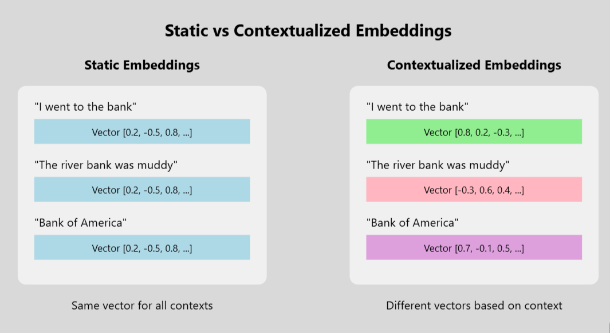

## Table of Contents

## What is Contextualized Language Embedding in machine learning?

Contextualized Language Embedding is a way to represent words in a language model that takes into account the context in which the words are used. Unlike traditional word embeddings, which give the same representation to a word no matter where it appears, contextualized embeddings change based on the surrounding words. This means that the same word can have different embeddings depending on its use in a sentence. For example, the word "bank" would have different embeddings when used in the context of a river versus a financial institution.

These embeddings are typically generated by large language models, such as BERT or ELMo, which are trained on vast amounts of text data. These models use deep neural networks to understand the nuances of language and generate embeddings that capture the meaning of words in their specific contexts. By doing so, they improve the performance of various natural language processing tasks, like text classification, sentiment analysis, and machine translation, because they can better understand the subtleties and variations in human language.

## How does Contextualized Language Embedding differ from traditional word embeddings?

Contextualized Language Embedding and traditional word embeddings differ mainly in how they handle the meaning of words. Traditional word embeddings, like Word2Vec or GloVe, give each word a fixed vector representation. This means that no matter where the word appears, it always has the same embedding. For example, the word "bank" would have the same vector whether it's used in a sentence about a river or money. This can be limiting because it doesn't account for the different meanings a word can have based on context.

On the other hand, Contextualized Language Embeddings, used in models like BERT or ELMo, create embeddings that change depending on the surrounding words. This means that the same word can have different embeddings in different sentences. For instance, "bank" would have one embedding when talking about a river and another when talking about a financial institution. This approach captures the nuances of language better, making it more useful for tasks like understanding text or translating languages.

In summary, while traditional word embeddings are static and context-insensitive, contextualized embeddings are dynamic and context-sensitive, leading to a richer understanding of language.

## Can you explain the basic architecture of models that use Contextualized Language Embeddings?

Models that use Contextualized Language Embeddings, like BERT and ELMo, have a basic architecture that involves deep neural networks. These models are typically built using layers of transformers or recurrent neural networks (RNNs). The transformer architecture, used in BERT, is made up of multiple layers of self-attention mechanisms and feed-forward neural networks. This allows the model to look at different parts of the input text at the same time and understand how words relate to each other. On the other hand, ELMo uses bidirectional LSTM (Long Short-Term Memory) networks, which process the text from left to right and right to left to capture the context around each word.

When you input a sentence into one of these models, it first breaks the sentence into tokens, which are usually words or parts of words. Each token then goes through the layers of the [neural network](/wiki/neural-network). At each layer, the model adjusts the representation of the tokens based on the context provided by the surrounding tokens. For example, in BERT, the self-attention mechanism helps the model focus on different parts of the sentence to better understand each word's role. By the time the tokens reach the final layer, they have been transformed into contextualized embeddings that reflect their meanings within the specific sentence. These embeddings can then be used for various natural language processing tasks, like classification or translation.

## What are some common applications of Contextualized Language Embeddings?

Contextualized Language Embeddings are used in many areas of natural language processing. They help computers understand and work with human language better. One common use is in text classification, where the goal is to sort text into different groups. For example, they can help figure out if an email is spam or not, or if a review is positive or negative. They are also used in sentiment analysis, which looks at what people feel about a topic based on what they write. This can be useful for businesses to see how customers feel about their products.

Another important use is in machine translation, where text is changed from one language to another. Contextualized embeddings help make sure the translation keeps the original meaning, even when words can mean different things in different situations. They are also helpful in question answering systems, where the computer needs to understand a question and find the right answer. For example, if you ask a computer about the weather, it needs to understand the context to give the right information. These embeddings make all these tasks more accurate and useful.

## How do models like BERT and ELMo generate Contextualized Language Embeddings?

Models like BERT and ELMo generate Contextualized Language Embeddings by using deep neural networks to understand the context of words in a sentence. When you input a sentence, these models break it into smaller parts called tokens, which are usually words or pieces of words. Each token goes through multiple layers of the neural network. In BERT, these layers are made up of transformers, which use something called self-attention to look at different parts of the sentence at the same time. This helps the model understand how each word relates to the others. For example, if the word "bank" is used in a sentence about a river, the model will focus on words like "river" or "water" to understand the context. By the time the tokens reach the final layer, they have been turned into embeddings that reflect their meanings within the specific sentence.

ELMo, on the other hand, uses bidirectional LSTM networks, which process the text from left to right and right to left. This helps the model capture the context around each word by looking at what comes before and after it. For instance, if you have the sentence "I went to the bank to deposit money," ELMo will consider the words "deposit" and "money" to understand that "bank" refers to a financial institution. As the tokens pass through the layers, their representations change to reflect this context. By the end, you get embeddings that are unique to each word's use in the sentence. Both BERT and ELMo use these techniques to create embeddings that are much more helpful for tasks like understanding text, translating languages, or answering questions.

## What are the advantages of using Contextualized Language Embeddings over static embeddings?

Contextualized Language Embeddings have several advantages over static embeddings. One big advantage is that they understand words in different ways based on the surrounding text. For example, the word "bank" can mean a place to store money or the side of a river. Static embeddings give the same meaning to "bank" no matter where it is used, but contextualized embeddings change the meaning based on the other words around it. This makes them better at understanding what people are really saying or writing.

Another advantage is that contextualized embeddings can handle words that have more than one meaning, or words that are new and not in the model's training data. Because they look at the whole sentence, they can figure out what a new word might mean based on the words around it. This makes them more useful for tasks like translating languages, figuring out if a review is good or bad, or answering questions. Overall, using contextualized embeddings helps computers understand human language better, making them more helpful in many different situations.

## How can Contextualized Language Embeddings improve natural language processing tasks?

Contextualized Language Embeddings help computers understand human language better by looking at words in the context of the whole sentence. This means that words can have different meanings depending on what is around them. For example, the word "bank" can mean a place to keep money or the side of a river. With contextualized embeddings, a computer can tell which meaning is right based on other words in the sentence. This makes tasks like understanding text, translating languages, and answering questions more accurate because the computer can better understand what people are really saying.

These embeddings also work well with new words or words that have multiple meanings. Because they consider the entire sentence, they can guess the meaning of a new word based on the words around it. This is helpful for tasks like figuring out if a review is positive or negative, or sorting emails into spam and not spam. By using contextualized embeddings, natural language processing tools become more useful and can handle the complexities of human language more effectively.

## What are the challenges and limitations of implementing Contextualized Language Embeddings?

Implementing Contextualized Language Embeddings comes with some challenges. One big challenge is that these models need a lot of computer power and memory to work. They are made up of many layers of deep neural networks, which means they take a long time to train and use a lot of energy. This can make it hard for smaller companies or researchers with less resources to use these models. Another challenge is that these models can sometimes make mistakes with very long texts or texts that are very different from what they were trained on. If a sentence is too long, the model might not be able to keep track of all the context, and if the text is about a topic it hasn't seen before, it might not understand it well.

There are also limitations to consider. Even though contextualized embeddings are good at understanding words in different contexts, they can still struggle with very rare words or words that are used in very unusual ways. Sometimes, these models can also pick up and repeat biases from the data they were trained on, like biases about certain groups of people. This can lead to unfair results in tasks like sorting job applications or understanding customer feedback. Finally, these models can be hard to explain. It's not always clear why they give certain answers, which can make it hard to trust them or fix mistakes they make.

## How do you fine-tune a pre-trained model for Contextualized Language Embeddings?

To fine-tune a pre-trained model for Contextualized Language Embeddings, you start with a model that has already been trained on a large amount of text data, like BERT or ELMo. This pre-trained model has learned to understand the general patterns of language. To make it better at a specific task, like understanding customer reviews or translating languages, you add a new layer on top of the pre-trained model. This new layer is trained on data that is specific to your task. You then train the whole model again, but you do it in a way that focuses more on the new layer and less on the pre-trained parts. This is called fine-tuning, and it helps the model learn the details of your specific task while still keeping its general language knowledge.

During fine-tuning, you use a smaller learning rate for the pre-trained parts of the model to make sure you don't change them too much. You might use a learning rate of $$1e-5$$ for the pre-trained layers and a higher rate like $$1e-3$$ for the new layer. You also need to choose the right data to train on. For example, if you want to use the model to understand customer reviews, you would use a dataset of customer reviews. You train the model by showing it examples from this dataset and adjusting the weights of the neural network to make its predictions more accurate. After fine-tuning, the model will be better at understanding the specific kind of text you are working with, while still being able to use its general language knowledge.

## What metrics are used to evaluate the performance of models using Contextualized Language Embeddings?

To evaluate how well models using Contextualized Language Embeddings work, we use different metrics. One common metric is accuracy, which measures how often the model gets the right answer. For example, if the model is sorting customer reviews into positive or negative, accuracy tells us what percentage of reviews it labeled correctly. Another important metric is F1-score, which is good for tasks where the data is not balanced. The F1-score is the harmonic mean of precision and recall, calculated as $$F1 = 2 \times \frac{\text{precision} \times \text{recall}}{\text{precision} + \text{recall}}$$. Precision measures how many of the model's positive predictions were correct, and recall measures how many of the actual positives the model found. The F1-score gives a single number that balances both.

For tasks like translating languages or generating text, we might use metrics like BLEU (Bilingual Evaluation Understudy) score. The BLEU score compares the model's output to one or more reference translations to see how similar they are. A higher BLEU score means the model's translation is closer to the human translation. Another useful metric is perplexity, which measures how well the model predicts the next word in a sentence. A lower perplexity means the model is better at guessing what comes next, which is important for tasks like language generation. These metrics help us understand how well the model is doing and where it might need to improve.

## How do Contextualized Language Embeddings handle polysemy and homonymy in language?

Contextualized Language Embeddings are really good at understanding words that can mean different things, like polysemy and homonymy. Polysemy is when a word has several related meanings, like "bank" can mean the side of a river or a place to keep money. Homonymy is when a word sounds the same but has different meanings, like "bat" can be an animal or a thing you use to hit a ball. These embeddings look at the words around the one they are trying to understand, so they can tell which meaning is right based on the context. For example, if the sentence is "I went to the bank to deposit money," the embeddings will focus on words like "deposit" and "money" to know that "bank" means a financial place, not a riverbank.

By using deep neural networks, models like BERT and ELMo can create different embeddings for the same word depending on the other words in the sentence. This helps them handle polysemy and homonymy better than older methods that give each word a fixed meaning. When the model sees a word, it doesn't just look at that word alone; it looks at the whole sentence to understand what the word means in that specific situation. This makes the model much better at understanding and working with human language, where words often have different meanings depending on how they are used.

## What are the latest advancements and future directions in the field of Contextualized Language Embeddings?

The field of Contextualized Language Embeddings is moving forward quickly. One big advancement is the development of models like RoBERTa and ALBERT, which are improvements on BERT. These new models use different training methods and architectures to make embeddings even better at understanding context. For example, RoBERTa trains on more data and for longer, which helps it learn more about language. Another exciting area is the use of multilingual models, like mBERT and XLM-R, which can understand and work with many languages at the same time. These models make it easier to handle text from different languages without needing to train a separate model for each one.

Looking ahead, researchers are working on making these models smaller and faster. This is important because big models like BERT need a lot of computer power, which not everyone has. One way to do this is by using techniques like knowledge distillation, where a smaller model learns from a bigger one. Another future direction is to make the models better at understanding specific types of text, like scientific papers or legal documents. This could help in fields like healthcare or law, where understanding complex language is really important. Overall, the goal is to keep improving how well these models understand and work with human language, making them more useful for all kinds of tasks.

## References & Further Reading

[1]: Devlin, J., Chang, M.-W., Lee, K., & Toutanova, K. (2019). ["BERT: Pre-training of Deep Bidirectional Transformers for Language Understanding."](https://aclanthology.org/N19-1423/) arXiv:1810.04805.

[2]: Peters, M. E., Neumann, M., Iyyer, M., Gardner, M., Clark, C., Lee, K., & Zettlemoyer, L. (2018). ["Deep Contextualized Word Representations."](https://arxiv.org/abs/1802.05365) arXiv:1802.05365.

[3]: Vaswani, A., Shazeer, N., Parmar, N., Uszkoreit, J., Jones, L., Gomez, A. N., Kaiser, Ł., & Polosukhin, I. (2017). ["Attention is All You Need."](https://arxiv.org/abs/1706.03762) arXiv:1706.03762.

[4]: Radford, A., Wu, J., Child, R., Luan, D., Amodei, D., & Sutskever, I. (2019). ["Language Models are Unsupervised Multitask Learners."](https://cdn.openai.com/better-language-models/language_models_are_unsupervised_multitask_learners.pdf) OpenAI.

[5]: Liu, Y., Ott, M., Goyal, N., Du, J., Joshi, M., Chen, D., Levy, O., Lewis, M., Zettlemoyer, L., & Stoyanov, V. (2019). ["RoBERTa: A Robustly Optimized BERT Pretraining Approach."](https://arxiv.org/abs/1907.11692) arXiv:1907.11692.

[6]: Lan, Z., Chen, M., Goodman, S., Gimpel, K., Sharma, P., & Soricut, R. (2020). ["ALBERT: A Lite BERT for Self-supervised Learning of Language Representations."](https://arxiv.org/abs/1909.11942) arXiv:1909.11942.

[7]: Conneau, A., Khandelwal, K., Goyal, N., Chaudhary, V., Wenzek, G., Guzmán, F., Grave, E., Ott, M., Zettlemoyer, L., & Stoyanov, V. (2020). ["Unsupervised Cross-lingual Representation Learning at Scale."](https://aclanthology.org/2020.acl-main.747/) arXiv:1911.02116.