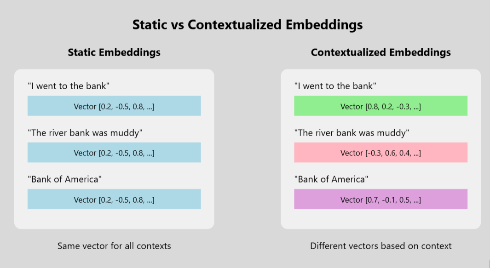

## Table of Contents

## What are word embeddings in the context of machine learning?

Word embeddings are a way to represent words as numbers that computers can understand. In machine learning, words are turned into vectors, which are lists of numbers. These vectors help computers see how words are related to each other. For example, words that often appear together, like "king" and "queen," will have vectors that are close to each other. This makes it easier for computers to understand language and perform tasks like translation or text classification.

To create word embeddings, algorithms like Word2Vec or GloVe are used. These algorithms look at a lot of text and learn how to represent words based on their context. For instance, if "dog" often appears near "bark," the vectors for these words will be similar. This process helps capture the meaning of words in a way that machines can use. By using these embeddings, computers can better understand and process human language, making applications like chatbots and search engines more effective.

## How do contextualized word embeddings differ from traditional word embeddings?

Contextualized word embeddings are different from traditional word embeddings because they take into account the surrounding words when creating the vector for a word. Traditional word embeddings, like those from Word2Vec or GloVe, give each word a single, fixed vector no matter where it appears in a sentence. This means that the word "bank" would have the same vector whether it refers to a riverbank or a financial institution. Contextualized embeddings, on the other hand, create a new vector for each occurrence of a word based on its context, allowing for a more nuanced understanding of language.

For example, in the sentence "I went to the bank to deposit money," the word "bank" would have a different vector than in the sentence "I sat by the bank of the river." This is achieved using models like BERT or ELMo, which process the entire sentence and generate embeddings that reflect the specific context. By doing so, contextualized embeddings can capture subtleties and variations in meaning that traditional embeddings might miss, making them more effective for tasks like natural language understanding and generation.

## What is ELMo and how does it generate contextualized word embeddings?

ELMo, which stands for Embeddings from Language Models, is a way to make word embeddings that change based on the words around them. Instead of giving each word the same vector no matter where it is used, ELMo looks at the whole sentence to understand what the word means in that specific place. This is helpful because words can mean different things depending on the context. For example, the word "bank" can mean a place to store money or the side of a river. ELMo helps computers understand these differences by creating a unique vector for "bank" each time it appears.

ELMo works by using a type of model called a bidirectional LSTM (Long Short-Term Memory). This model reads the sentence from left to right and right to left, capturing information from both directions. By doing this, ELMo can see the context before and after each word, which helps it make better embeddings. Once the model is trained on a lot of text, it can then be used to create these contextualized embeddings for new sentences. This makes ELMo very useful for tasks like understanding and generating language, where knowing the context is important.

## Can you explain the Universal Sentence Encoder (USE) and its approach to contextualization?

The Universal Sentence Encoder (USE) is a tool that turns sentences into numbers that computers can understand. It's made by Google and helps with tasks like understanding what people are saying, translating languages, and answering questions. USE looks at the whole sentence to figure out what it means, not just the individual words. This way, it can understand the context and make better guesses about what the sentence is about.

USE uses a type of model called a transformer, which is good at understanding the order and relationships between words in a sentence. When you give USE a sentence, it creates a vector, which is a list of numbers, for the whole sentence. This vector captures the meaning of the sentence, taking into account the context of each word. By doing this, USE can tell the difference between sentences that might look similar but mean different things, like "I like to run" and "I like to run away." This makes USE very useful for understanding and working with human language.

## What is CoVe and how does it incorporate context in word embeddings?

CoVe, which stands for Contextualized Word Vectors, is a way to make word embeddings that change based on the words around them. It was made to help computers understand language better by looking at the whole sentence, not just single words. CoVe uses a type of model called a sequence-to-sequence model, which is good at understanding the order of words and how they relate to each other. By doing this, CoVe can create vectors for words that change depending on the context, making them more useful for tasks like translation and understanding what people are saying.

When you use CoVe, it first turns a sentence into a set of vectors using a traditional word embedding model like GloVe. Then, it runs these vectors through a sequence-to-sequence model, which looks at the whole sentence and changes the vectors to better fit the context. This means that the same word can have different vectors in different sentences. For example, the word "bank" would get a different vector in "I went to the bank to deposit money" than in "I sat by the bank of the river." By doing this, CoVe helps computers understand the subtle differences in meaning that come from context.

## How does Cross-View Training contribute to the development of contextualized word embeddings?

Cross-View Training is a way to make word embeddings better by using different kinds of information at the same time. It helps computers understand language more like humans do by looking at words from different angles. For example, when you read a book, you might also look at pictures or listen to an audio version. Cross-View Training does something similar by combining different types of data, like text and images, to create word embeddings that capture more context. This makes the embeddings more useful for tasks like translating languages or understanding what people are saying.

In Cross-View Training, the model learns to match up different views of the same information. If you have a sentence and a picture that go together, the model tries to make the word embeddings from the sentence match the visual information from the picture. By doing this, the model gets better at understanding how words relate to the world around them. This approach helps create embeddings that are not just based on the words themselves but also on the broader context, making them more powerful and versatile for different applications.

## What are Contextualized Topic Models and how do they relate to word embeddings?

Contextualized Topic Models are a way to understand what a piece of text is about by looking at the words and how they are used. These models use word embeddings that change based on the words around them, which helps them understand the meaning better. For example, if you have a sentence about a "bank," the model can tell if it's about money or a river by looking at the other words in the sentence. This makes the topics found by the model more accurate and useful.

These models are related to word embeddings because they use them to figure out the topics. Traditional topic models might just count how often words appear, but Contextualized Topic Models use embeddings that capture the meaning of words in context. By doing this, they can find topics that are more meaningful and closer to how humans understand text. This makes them very helpful for tasks like summarizing articles or finding themes in large sets of documents.

## Can you describe the context2vec model and its method for capturing context?

The context2vec model is a way to make word embeddings that take into account the words around them. It was created to help computers understand language better by looking at the whole sentence, not just single words. context2vec uses a method called "skip-gram with negative sampling" to learn how words relate to each other. This means it tries to predict the words that come before and after a target word, which helps it understand the context. By doing this, context2vec can create embeddings that change depending on the situation, making them more useful for tasks like understanding what people are saying or translating languages.

For example, if you have the word "bank," context2vec will give it a different vector in the sentence "I went to the bank to deposit money" than in "I sat by the bank of the river." This is because it looks at the other words in the sentence to figure out what "bank" means in that specific place. By capturing these differences, context2vec helps computers understand the subtle changes in meaning that come from context. This makes it a powerful tool for tasks where understanding the whole sentence is important.

## What is Mirror-BERT and how does it utilize bidirectional context?

Mirror-BERT is a way to make word embeddings that understand the words before and after a specific word. It's like having two BERT models working together. One BERT model reads the sentence from left to right, and the other reads it from right to left. By doing this, Mirror-BERT can see the whole context around each word, which helps it understand the sentence better. This is useful for tasks like understanding what people are saying or translating languages.

When you use Mirror-BERT, it creates two sets of embeddings for each word in the sentence. One set comes from the left-to-right BERT, and the other set comes from the right-to-left BERT. Then, Mirror-BERT combines these two sets to make a final embedding that captures the full context. This way, the model can understand subtle differences in meaning that might be missed if it only looked in one direction. By using bidirectional context, Mirror-BERT helps computers understand language more like humans do.

## How do contextualized word embeddings improve performance in natural language processing tasks?

Contextualized word embeddings help computers understand language better by looking at the words around a specific word. When you read a sentence, the meaning of a word can change based on the other words in the sentence. For example, the word "bank" can mean a place to store money or the side of a river. Traditional word embeddings give the same vector to "bank" no matter where it appears, but contextualized embeddings create a new vector each time, based on the context. This makes the embeddings more accurate and useful for tasks like understanding what people are saying or translating languages.

By using contextualized embeddings, computers can do a better job at natural language processing tasks. These tasks include things like answering questions, summarizing text, and even generating new sentences. When the embeddings capture the full context of a word, the computer can understand the subtle differences in meaning that come from the surrounding words. This leads to more accurate results and better performance in applications like chatbots, search engines, and language translation tools. Contextualized embeddings make it easier for computers to work with human language in a way that feels more natural and intuitive.

## What are the challenges and limitations of implementing contextualized word embeddings?

Implementing contextualized word embeddings can be tricky because they need a lot of computer power. These embeddings look at the whole sentence to understand each word, which means they have to process a lot of information at once. This can make them slower and harder to use on devices that aren't very powerful. Also, training these models takes a lot of time and data. You need big computers and lots of text to teach the model how to understand context correctly. This can be expensive and not everyone has access to the resources needed to do it.

Another challenge is that contextualized embeddings can be hard to understand and explain. Because they change based on the words around them, it's not always clear why the model gives a certain answer. This can make it difficult to trust the model or fix it if it makes mistakes. Also, these embeddings might not work as well for languages that don't have a lot of data available. If there isn't enough text to train on, the model might not learn how to understand the context properly. This means that while contextualized embeddings are very powerful, they come with some big challenges that need to be thought about carefully.

## How can one fine-tune contextualized word embedding models for specific applications?

Fine-tuning contextualized word embedding models for specific applications involves taking a pre-trained model and adjusting it to work better for a particular task. You start with a model like BERT or ELMo that has already learned a lot about language from a big dataset. Then, you train it some more using data that is specific to your task, like customer reviews if you're building a sentiment analysis tool. This helps the model understand the language and context that are important for your specific application. During fine-tuning, you might change the model's settings, like the learning rate, to make sure it learns the new information without forgetting what it already knows.

One way to fine-tune these models is by using a technique called transfer learning. You take the pre-trained model and add a new layer on top that is designed for your specific task. For example, if you're working on a question-answering system, you might add a layer that predicts the start and end positions of the answer in a given text. You then train this new layer along with the rest of the model on your task-specific data. This approach helps the model adapt to the new task while still using its general understanding of language. By fine-tuning, you can make the model more accurate and useful for your specific application, whether it's translating languages, summarizing text, or understanding customer feedback.

## References & Further Reading

[1]: Mikolov, T., Sutskever, I., Chen, K., Corrado, G. S., & Dean, J. (2013). ["Distributed Representations of Words and Phrases and their Compositionality."](https://arxiv.org/abs/1310.4546) Advances in Neural Information Processing Systems 26.

[2]: Pennington, J., Socher, R., & Manning, C. (2014). ["GloVe: Global Vectors for Word Representation."](https://aclanthology.org/D14-1162/) Proceedings of the 2014 Conference on Empirical Methods in Natural Language Processing (EMNLP).

[3]: Devlin, J., Chang, M.-W., Lee, K., & Toutanova, K. (2019). ["BERT: Pre-training of Deep Bidirectional Transformers for Language Understanding."](https://arxiv.org/abs/1810.04805) Proceedings of the 2019 Conference of the North American Chapter of the Association for Computational Linguistics: Human Language Technologies.

[4]: Peters, M. E., Neumann, M., Iyyer, M., Gardner, M., Clark, C., Lee, K., & Zettlemoyer, L. (2018). ["Deep Contextualized Word Representations."](https://arxiv.org/abs/1802.05365) Proceedings of the 2018 Conference of the North American Chapter of the Association for Computational Linguistics: Human Language Technologies.

[5]: McCann, B., Bradbury, J., Xiong, C., & Socher, R. (2017). ["Learned in Translation: Contextualized Word Vectors."](https://arxiv.org/abs/1708.00107) Advances in Neural Information Processing Systems 30.

[6]: Cer, D., Yang, Y., Kong, S.-Y., Hua, N., Limtiaco, N., St. John, R., Constant, N., Guajardo-Cespedes, M., Yuan, S., Tar, C., Strope, B., & Kurzweil, R. (2018). ["Universal Sentence Encoder."](https://arxiv.org/abs/1803.11175) Proceedings of the 2018 Conference on Empirical Methods in Natural Language Processing: System Demonstrations.