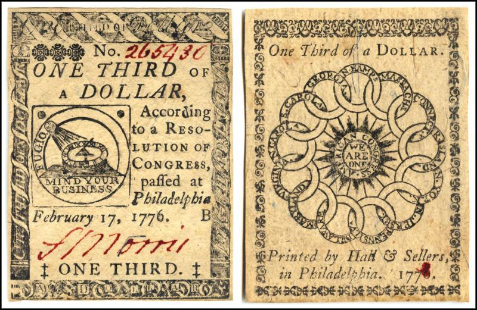

## Table of Contents

## What is continental currency?

Continental currency was money used during the American Revolutionary War. It was created by the Continental Congress, which was a group of leaders from the thirteen colonies. They started using this currency in 1775 to help pay for the war against Great Britain. The money was called "Continentals" and it was supposed to help the new country buy things it needed, like food and weapons.

However, the Continental currency did not work out well. People started to print too much of it, and soon there was too much money and not enough things to buy. This made the money lose its value quickly. By 1780, people did not trust the Continental currency anymore, and it became almost worthless. This situation taught the new country important lessons about money and led to changes in how the United States managed its currency later on.

## When was continental currency first introduced?

Continental currency was first introduced in 1775. This was during the American Revolutionary War, when the thirteen colonies were fighting for independence from Great Britain. The Continental Congress, which was a group of leaders from these colonies, created this money to help pay for the war. They called it "Continentals."

At first, people used the Continental currency to buy things they needed, like food and weapons. But soon, there was a problem. The Continental Congress started printing too much of this money. When there was too much money and not enough things to buy, the value of the money went down. By 1780, the Continental currency was almost worthless, and people stopped trusting it. This experience taught the new country important lessons about managing money.

## Why was continental currency created?

Continental currency was created because the thirteen colonies needed money to fight against Great Britain during the American Revolutionary War. The war started in 1775, and the colonies needed a way to pay for things like food, weapons, and soldiers. The Continental Congress, which was a group of leaders from the colonies, decided to make their own money. They called it "Continentals," and it was meant to help the new country buy what it needed.

However, the Continental currency did not work out well. The Continental Congress printed too much of it, and soon there was more money than there were things to buy. This made the money lose its value quickly. By 1780, people did not trust the Continental currency anymore, and it became almost worthless. This situation taught the new country important lessons about money and led to changes in how the United States managed its currency later on.

## What were the denominations of continental currency?

The Continental currency had different denominations, or types of money. They made coins and paper money. The coins were in amounts like one-sixth of a dollar, one-third of a dollar, and two-thirds of a dollar. They also made paper money in different amounts, like one dollar, two dollars, three dollars, five dollars, six dollars, seven dollars, eight dollars, and thirty dollars.

The Continental Congress, which was a group of leaders from the thirteen colonies, decided on these amounts. They wanted the money to be easy to use and to help pay for the war against Great Britain. But they made too much of it, and soon the money was not worth much. By 1780, people did not trust the Continental currency anymore, and it became almost worthless.

## How was continental currency used during the American Revolutionary War?

During the American Revolutionary War, the thirteen colonies needed money to buy things like food, weapons, and to pay soldiers. The Continental Congress, which was a group of leaders from the colonies, made a new kind of money called Continental currency. They started using it in 1775. People used this money to buy what they needed for the war. The money was called "Continentals," and it came in different amounts, like coins and paper money.

But there was a big problem with the Continental currency. The Continental Congress made too much of it. When there was too much money and not enough things to buy, the value of the money went down. By 1780, the Continental currency was almost worthless. People stopped trusting it and did not want to use it anymore. This experience taught the new country important lessons about money and how to manage it better in the future.

## What led to the depreciation of continental currency?

The main reason the Continental currency lost its value was because the Continental Congress printed too much of it. They started using this money in 1775 to help pay for the American Revolutionary War. At first, people used it to buy things they needed, like food and weapons. But soon, there was too much money and not enough things to buy. This made the money worth less and less.

By 1780, the Continental currency was almost worthless. People did not trust it anymore and stopped using it. This happened because when there is too much money, it loses its value. The experience with the Continental currency taught the new country important lessons about money. It showed them that they needed to be careful about how much money they made and how they managed it. This led to changes in how the United States handled its currency later on.

## What was the impact of continental currency on the American economy?

The Continental currency had a big impact on the American economy. When the Continental Congress started using this money in 1775, it helped them buy things they needed for the Revolutionary War, like food and weapons. But they made too much of it. When there was too much money and not enough things to buy, the value of the money went down. By 1780, the Continental currency was almost worthless. This made it hard for people to buy things they needed, and it hurt the economy.

The problems with the Continental currency taught the new country important lessons about money. They learned that they needed to be careful about how much money they made and how they managed it. This experience led to changes in how the United States handled its currency later on. They made sure not to print too much money and worked to build trust in their new currency. This helped the American economy grow stronger over time.

## How did the phrase 'not worth a continental' originate?

The phrase 'not worth a continental' comes from the time of the American Revolutionary War. During this war, the thirteen colonies needed money to buy things like food and weapons. So, the Continental Congress made a new kind of money called Continental currency. They started using it in 1775. But they made too much of this money. When there was too much money and not enough things to buy, the value of the money went down.

By 1780, the Continental currency was almost worthless. People did not trust it anymore and stopped using it. That's why people started saying 'not worth a continental.' It meant something was not worth anything, just like the Continental currency. This phrase became a way to talk about things that had no value, and it came from the problems the new country had with its money during the Revolutionary War.

## What measures were taken to replace continental currency?

After the Continental currency became almost worthless, the new country needed a new kind of money. In 1781, they made a new currency called the Spanish milled dollar. This was a coin that people already trusted and used a lot. The new country used this coin until they could make their own money. In 1792, they made the Coinage Act. This law said they would make their own coins, like the dollar, half dollar, quarter, dime, and penny. This new money was called the United States dollar.

The United States dollar was different from the Continental currency. The new country learned from their mistakes and made sure not to print too much money. They also made sure the money was backed by something valuable, like gold or silver. This helped people trust the new money. Over time, the United States dollar became strong and helped the economy grow. The problems with the Continental currency taught the new country important lessons about how to manage money better.

## How is the value of surviving continental currency determined today?

Today, the value of surviving Continental currency is determined by how rare it is and how good its condition is. People who collect old money, called numismatists, look at how many of these old bills or coins still exist. If there are not many left, the value goes up. They also check if the money is in good shape. If it looks new and has no tears or stains, it is worth more.

Another thing that affects the value is the history behind the money. If a piece of Continental currency has an interesting story or was used in a famous event, it can be worth more. Collectors and historians are willing to pay more for pieces that have a special story. So, the value of Continental currency today depends on how rare it is, how good its condition is, and any interesting history it might have.

## What are some notable historical events involving continental currency?

During the American Revolutionary War, the Continental Congress made Continental currency to help pay for the war. They started using it in 1775. People used this money to buy food, weapons, and other things they needed. But soon, there was too much money and not enough things to buy. This made the money lose its value quickly. By 1780, the Continental currency was almost worthless. People did not trust it anymore and stopped using it. This led to the phrase 'not worth a continental,' which meant something was not worth anything.

The problems with the Continental currency taught the new country important lessons about money. They learned they needed to be careful about how much money they made. In 1781, they started using the Spanish milled dollar, a coin people already trusted. Then, in 1792, they made the Coinage Act. This law said they would make their own coins, like the dollar, half dollar, quarter, dime, and penny. The new money was called the United States dollar. It was backed by gold or silver, which helped people trust it. Over time, the United States dollar became strong and helped the economy grow.

## How does the study of continental currency inform modern economic policies?

The study of Continental currency shows us what can happen when a country makes too much money. During the American Revolutionary War, the Continental Congress made a lot of Continental currency to pay for the war. But they made too much of it. When there was more money than things to buy, the money lost its value. By 1780, the Continental currency was almost worthless. People stopped trusting it. This taught the new country that they needed to be careful about how much money they made. Today, countries know that printing too much money can cause big problems, like inflation. So, they use this lesson to make sure their money stays valuable.

The experience with Continental currency also showed the importance of trust in money. After the Continental currency failed, the new country used the Spanish milled dollar until they could make their own money. In 1792, they made the Coinage Act and started using the United States dollar. They made sure this new money was backed by something valuable, like gold or silver. This helped people trust the new money. Today, countries work to build and keep trust in their money. They do this by being careful about how much money they make and by making sure their money is backed by something valuable. The lessons from the Continental currency help modern countries manage their economies better.

## What is the relationship between Continental Currency and Algorithmic Trading?

Continental Currency, introduced during the American Revolutionary War, serves as a crucial historical precedent for understanding currency depreciation, which continues to inform modern financial strategies including [algorithmic trading](/wiki/algorithmic-trading). The failure of Continental Currency was primarily due to over-issuance, lack of backing by tangible assets, and counterfeiting, offering valuable lessons in managing currency risk.

Modern algorithmic trading strategies often incorporate complex risk management tools to hedge against currency depreciation. Algorithms can dynamically adjust portfolios by analyzing vast datasets for indicators of potential currency weaknesses, much like historical patterns of Continental Currency depreciation. For instance, algorithms might employ stochastic calculus for predicting exchange rate movements through models like the Geometric Brownian Motion (GBM), defined by:

$$
dS_t = \mu S_t dt + \sigma S_t dW_t
$$

where $S_t$ is the asset price, $\mu$ is the drift component, $\sigma$ the volatility, and $dW_t$ the Wiener process. These models assist in forecasting volatility, a critical element in determining depreciation risks.

Additionally, portfolio diversification and currency hedging techniques such as futures and options are analogous to lessons from Continental Currency's depreciation. The historical [volatility](/wiki/volatility-trading-strategies) experienced can be mirrored through such instruments, allowing traders to mitigate similar risks. Algorithmic trading can leverage historical currency data to structure positions that counter potential depreciation impacts, employing [machine learning](/wiki/machine-learning) for enhanced predictive accuracy.

The implications of historical currency fluctuations on contemporary financial instruments highlight the importance of robust risk management frameworks. By analyzing patterns of Continental Currency, modern strategies aim to anticipate depreciation threats, ensuring stability against volatile market conditions. Integrating historical insights with advanced technological tools in algorithmic trading makes it possible to circumvent pitfalls similar to those seen in the Continental Currency era. This synergy between past events and present-day financial innovation underscores the necessity of vigilant currency management.

## References & Further Reading

[1]: Grubb, F. (2004). ["The Continental Dollar: What Happened to Its Value?"](https://www.semanticscholar.org/paper/The-Continental-Dollar%3A-How-Much-Was-Really-Issued-Grubb/26832239e2aa37bf1b42e741deade8e89bc22435) The Journal of Economic History, 64(2), 330-364.

[2]: Mitchell, W. F. (1903). ["History of the Currency of the Country from 1775 to 1878."](https://chroniclingamerica.loc.gov/lccn/sn83045366/1903-05-23/ed-1/seq-3/) Chicago: Jansen, McClurg & Company.

[3]: Pauls, E. O. (1974). ["Continental currency finance: Loan certificates and the Robert Morris reform."](https://curiosity.lib.harvard.edu/american-currency/feature/continental-currency) The Journal of Economic History, 34(4), 743-771.

[4]: Davies, Glyn. ["A History of Money: From Ancient Times to the Present Day."](https://archive.org/details/historyofmoneyfr0000davi) University of Wales Press.

[5]: Perkins, E. J. (1994). ["American Public Finance and Financial Services, 1700-1815."](https://archive.org/details/americanpublicfi0000perk) University of Virginia Press.