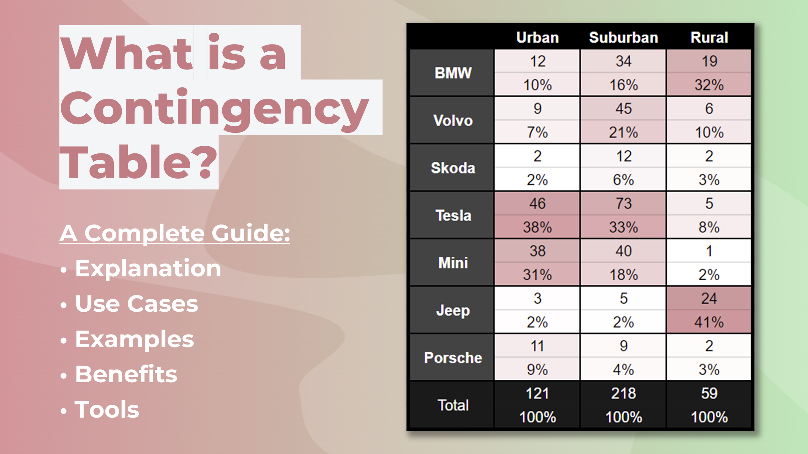

## Table of Contents

## What is a contingency order?

A contingency order is a type of order that a trader or investor places with their broker to buy or sell a security when certain conditions are met. These conditions could be based on price movements, specific events, or other market indicators. The main purpose of a contingency order is to help manage risk and take advantage of market opportunities without needing to constantly monitor the market.

For example, if you own a stock and want to sell it if the price drops to a certain level, you can set a contingency order to automatically sell the stock at that price. This way, you can limit your losses without having to watch the market all the time. Contingency orders are useful tools for both novice and experienced traders because they help automate trading decisions based on predefined criteria.

## Why are contingency orders used in trading?

Contingency orders are used in trading to help traders manage their investments without having to watch the market all the time. They allow traders to set specific conditions for buying or selling a security, so the order will only be executed if those conditions are met. This is helpful because it lets traders take advantage of market opportunities or limit their losses, even when they are not actively monitoring their investments.

For example, if a trader thinks a stock might drop in value, they can set a contingency order to sell the stock at a certain lower price. This way, if the stock does fall to that price, the order will automatically be executed, helping the trader avoid bigger losses. Contingency orders are useful for both new and experienced traders because they help automate trading decisions based on clear rules, making it easier to stick to a trading strategy.

## What are the basic types of contingency orders?

Contingency orders come in different types, but two of the most common ones are stop orders and limit orders. A stop order, also known as a stop-loss order, is used to limit losses. For example, if you own a stock and want to sell it if the price drops too much, you can set a stop order at a certain price. When the stock reaches that price, the stop order turns into a market order and sells the stock, helping you avoid bigger losses.

Another type is a limit order, which is used to buy or sell a stock at a specific price or better. For instance, if you want to buy a stock but only if it falls to a certain price, you can set a limit order at that price. If the stock reaches or goes below that price, the limit order will be executed, and you'll buy the stock at the price you wanted or better. Both stop orders and limit orders help traders manage their investments without needing to watch the market all the time.

## How does a stop-loss order work as a contingency order?

A stop-loss order is a type of contingency order that helps traders limit their losses. When you own a stock and set a stop-loss order, you choose a specific price at which you want to sell the stock if it drops to that level. This price is called the stop price. If the stock's price falls to or below the stop price, the stop-loss order turns into a market order. This means the stock will be sold at the next available price, helping you avoid bigger losses.

For example, imagine you bought a stock for $50 and you want to limit your loss to 10%. You can set a stop-loss order at $45. If the stock price falls to $45 or lower, your stop-loss order will turn into a market order and sell the stock. This way, you don't have to watch the stock all the time, and you can still protect yourself from losing too much money.

## Can you explain the difference between a stop-loss and a stop-limit order?

A stop-loss order and a stop-limit order are both types of contingency orders, but they work a bit differently. A stop-loss order is used to limit your losses by selling a stock when it reaches a certain price. When you set a stop-loss order, you choose a stop price. If the stock falls to this price or lower, the stop-loss order turns into a market order and sells the stock at the next available price. This means you might not get exactly the stop price, but you'll avoid bigger losses.

A stop-limit order adds an extra step to the process. Like a stop-loss order, you set a stop price. But you also set a limit price, which is the lowest price you're willing to accept for selling the stock. If the stock reaches the stop price, the order turns into a limit order instead of a market order. The stock will only be sold if it can be sold at the limit price or better. This gives you more control over the selling price, but there's a risk the stock might keep falling and never reach your limit price, so the order might not be executed at all.

## What is a trailing stop order and how is it implemented?

A trailing stop order is a type of contingency order that helps traders lock in profits while still giving the stock room to grow. It works by setting a stop price that moves along with the stock price. The stop price stays a certain percentage or dollar amount below the stock's highest price since you placed the order. If the stock keeps going up, the stop price goes up with it, but if the stock starts to fall, the stop price stays where it is. This way, you can sell the stock if it starts to drop, but you still have a chance to make more money if it keeps going up.

To implement a trailing stop order, you first decide on the percentage or dollar amount you want the stop price to trail by. For example, if you set a 10% trailing stop on a stock that's currently at $100, the stop price will be $90. If the stock price rises to $110, the stop price will move up to $99, which is still 10% below the new high. If the stock then falls to $99 or lower, the trailing stop order turns into a market order and sells the stock. This helps you protect your gains without having to watch the market all the time.

## How do contingency orders help in risk management?

Contingency orders help in risk management by allowing traders to set rules for buying or selling a stock without needing to watch the market all the time. For example, if you own a stock and are worried it might drop in value, you can set a stop-loss order to sell the stock if it reaches a certain lower price. This way, you can limit your losses without having to keep an eye on the stock's price every minute. Contingency orders help you stick to your trading plan and avoid making emotional decisions based on sudden market changes.

Another way contingency orders help manage risk is by allowing traders to lock in profits. A trailing stop order, for instance, lets the stop price move up with the stock's price, so you can sell the stock if it starts to drop but still give it room to grow. This means you can take advantage of rising stock prices while protecting the gains you've already made. By using contingency orders, traders can better control their investments and reduce the risk of big losses.

## What are the common pitfalls or risks associated with using contingency orders?

Using contingency orders can help manage your investments, but there are some risks to watch out for. One common pitfall is that the market can move quickly, and sometimes the price you set for your order might not be the price you actually get. For example, with a stop-loss order, if the stock price drops suddenly, you might end up selling at a lower price than you planned. This is called slippage, and it can lead to bigger losses than you expected.

Another risk is that your order might not get filled at all. This can happen with a stop-limit order, where you set both a stop price and a limit price. If the stock price falls below your stop price but never reaches your limit price, the order won't be executed. This means you could miss out on selling the stock and end up with a bigger loss if the price keeps dropping. It's important to understand these risks and use contingency orders carefully to make sure they work the way you want them to.

## How can one set up a contingency order on a trading platform?

To set up a contingency order on a trading platform, start by logging into your account and going to the section where you can place orders. Look for options like "stop-loss," "limit," or "trailing stop." Choose the type of contingency order you want. For a stop-loss order, you'll need to enter the stock symbol and the stop price, which is the price at which you want to sell if the stock falls to that level. If you're setting a limit order, enter the stock symbol and the limit price, which is the price at which you want to buy or sell the stock. For a trailing stop order, you'll enter the stock symbol and the percentage or dollar amount you want the stop price to trail by.

Once you've entered all the necessary details, review your order to make sure everything is correct. Some platforms will let you see a summary of your order before you submit it. Double-check the stock symbol, the type of order, and the prices you've set. If everything looks good, submit your order. The trading platform will then monitor the stock price for you and execute the order if the conditions you set are met. Remember, it's important to understand how these orders work and the risks involved, so take your time and make sure you're comfortable with your choices before placing the order.

## What advanced strategies involve the use of multiple contingency orders?

Using multiple contingency orders can help traders manage their investments in more advanced ways. One strategy is called a bracket order, where you set up several orders at the same time. For example, after buying a stock, you might set a stop-loss order to limit your losses if the stock price drops, and also set a limit order to sell the stock if it reaches a higher price. This way, you can protect your investment from big losses while still having a chance to make a profit.

Another advanced strategy is using multiple trailing stop orders. You could set a tighter trailing stop to lock in profits if the stock starts to drop quickly, and a wider trailing stop to give the stock more room to grow. This lets you balance between protecting your gains and giving the stock a chance to increase in value. By using multiple contingency orders together, traders can create a more detailed plan for managing their investments, helping them take advantage of market opportunities while reducing risks.

## How do market conditions affect the effectiveness of contingency orders?

Market conditions can really change how well contingency orders work. In a fast-moving market, prices can jump around a lot. If you set a stop-loss order, the price you get when it sells might be lower than you planned. This is called slippage, and it can make your losses bigger than you wanted. Also, in a market that's not moving much, a stop-limit order might not get filled at all. If the stock price never hits your limit price, you could miss selling it and end up with a bigger loss if the price keeps dropping.

On the other hand, in a stable market, contingency orders can work really well. If the market is calm and prices move slowly, your stop-loss and limit orders are more likely to get filled at the prices you set. This helps you stick to your trading plan and manage your risks better. But it's important to always think about how the market is doing and adjust your contingency orders to make sure they still do what you want them to do.

## What are some real-world examples of contingency orders in action?

Imagine you bought shares of a company called TechCo at $100 each. You're worried the stock might drop, so you set a stop-loss order at $90. A few days later, bad news comes out about TechCo, and the stock price falls quickly to $88. Your stop-loss order turns into a market order and sells your shares at $88. Even though you didn't get the exact $90 you set, you still avoided a bigger loss if the stock kept falling.

Now think about another scenario where you own shares of a company called GreenGrow, and the stock is doing well, rising from $50 to $60. You want to lock in some profits but also let the stock keep growing. So, you set a trailing stop order with a 10% trail. As the stock price rises to $70, the stop price moves up to $63. If the stock then drops to $63 or lower, your order will sell, and you'll keep some of the gains. This way, you can enjoy the stock's rise while still protecting your profits.

## References & Further Reading

[1]: Bergstra, J., Bardenet, R., Bengio, Y., & Kégl, B. (2011). ["Algorithms for Hyper-Parameter Optimization."](https://dl.acm.org/doi/10.5555/2986459.2986743) Advances in Neural Information Processing Systems 24.

[2]: ["Advances in Financial Machine Learning"](https://www.amazon.com/Advances-Financial-Machine-Learning-Marcos/dp/1119482089) by Marcos Lopez de Prado

[3]: ["Evidence-Based Technical Analysis: Applying the Scientific Method and Statistical Inference to Trading Signals"](https://www.amazon.com/Evidence-Based-Technical-Analysis-Scientific-Statistical/dp/0470008741) by David Aronson

[4]: ["Machine Learning for Algorithmic Trading"](https://github.com/stefan-jansen/machine-learning-for-trading) by Stefan Jansen

[5]: ["Quantitative Trading: How to Build Your Own Algorithmic Trading Business"](https://www.amazon.com/Quantitative-Trading-Build-Algorithmic-Business/dp/1119800064) by Ernest P. Chan