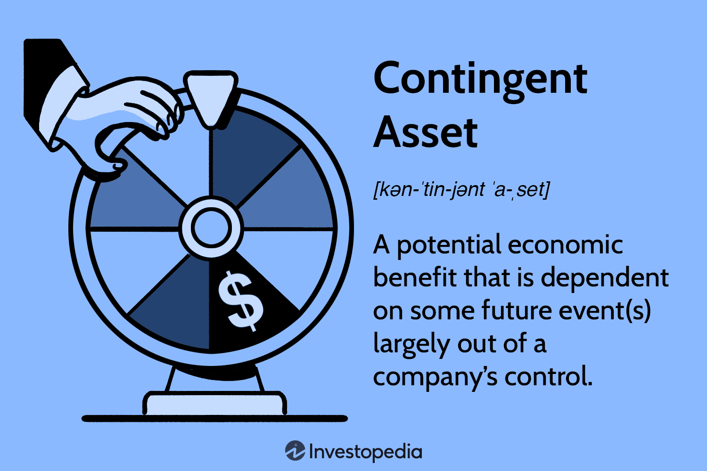

In the evolving landscape of finance, asset management remains a pivotal component for investors and institutions seeking to maximize returns and minimize risks. Asset management encompasses the strategic allocation, monitoring, and optimization of investments across diverse financial instruments such as stocks, bonds, and real estate. This endeavor is crucial as it directly influences the growth of capital and achievement of long-term financial goals. As such, effective asset management strategies are indispensable to both individual and institutional investors.

This article explores several key financial considerations that intersect with asset management, highlighting contingent assets and the role of algorithmic trading. Contingent assets, defined as potential economic benefits that depend on the occurrence of uncertain future events, pose unique challenges for asset managers. These assets are not reflected on balance sheets until the likelihood of realization is high, making their valuation and impact on financial statements complex yet significant. Understanding their influence is essential for accurate business valuation and financial reporting.

In recent years, algorithmic trading has emerged as a transformative force within financial markets. By utilizing sophisticated computer algorithms, traders can automate transactions, improving speed and reducing human error. This technological advancement enables high-frequency trading and enhances the precision of investment strategies. Algorithmic trading provides notable advantages in executing trades and managing portfolios, thereby revolutionizing traditional trading practices.

Through the intersection of asset management, contingent assets, and algorithmic trading, investors are presented with new opportunities to optimize financial strategies. The following sections of the article will further examine how these elements interact and their implications for enhancing asset management practices.

## Table of Contents

## Understanding Financial Asset Management

Financial asset management involves the strategic allocation and optimization of investments across various financial instruments, such as stocks, bonds, real estate, and alternative investments. The primary goal of asset management is to maximize returns while minimizing risk, aligning with the financial objectives of individuals or institutions.

### Key Aspects of Effective Asset Management

1. **Diversification**: Diversification is a critical strategy in asset management aimed at reducing risk by spreading investments across various asset classes and sectors. By not putting all funds into a single investment, the overall risk is mitigated. A well-diversified portfolio is less susceptible to market volatility, as the performance of different assets can offset each other. The principle can be represented mathematically using the formula for expected portfolio variance:
$$
   \sigma_p^2 = \sum_{i=1}^{n}w_i^2\sigma_i^2 + \sum_{i=1}^{n-1}\sum_{j=i+1}^{n}2w_iw_j\sigma_i\sigma_j\rho_{ij}

$$

   where $\sigma_p^2$ is the portfolio variance, $w_i$ and $w_j$ are the weights of assets $i$ and $j$, $\sigma_i$ and $\sigma_j$ are the standard deviations of assets $i$ and $j$, and $\rho_{ij}$ is the correlation coefficient between assets $i$ and $j$.

2. **Risk Management**: Effective risk management is pivotal in safeguarding the value of investments and ensuring financial stability. This involves identifying, assessing, and prioritizing risks, followed by applying strategies to mitigate their impact. Common risk management tools include the use of derivatives such as options and futures, stop-loss orders, and setting exposure limits.

3. **Valuation of Assets**: Accurately valuing assets is essential for making informed investment decisions. Asset valuation employs various methods, including discounted cash flow (DCF) analysis, comparative company analysis, and real option valuation. These techniques assess the present value of expected future cash flows, offering insights into whether an asset is over- or under-valued relative to the market.

### Efficient Management for Capital Growth and Achieving Financial Objectives

Efficient management of financial assets is crucial for capital growth and achieving predefined financial goals. Through strategic asset allocation and continuous portfolio monitoring, managers can align investment strategies with risk tolerance levels and performance targets. The use of technology and analytical tools has enhanced the ability to process economic indicators and market trends in real-time, offering a competitive advantage in decision-making. 

Automation and algorithm-driven insights support dynamic asset reallocations in response to market fluctuations, ensuring that investment portfolios remain agile and responsive. Additionally, regular performance evaluations and reporting maintain transparency and accountability in asset management practices.

In conclusion, understanding and applying the principles of financial asset management is fundamental for optimizing investment portfolios and achieving desired financial outcomes. By emphasizing diversification, risk management, and accurate asset valuation, investors and managers can enhance their potential for success in the financial markets.

## Decoding Contingent Assets

A contingent asset represents a potential economic benefit that arises from past events. However, the realization of this benefit is subject to the occurrence of one or more uncertain future events not wholly within the control of an entity. These assets are recognized in financial statements only when the realization of income is virtually certain, providing a clear framework for their financial treatment.

Contingent assets are not recorded on balance sheets until there is a high degree of certainty regarding their realization. This conservative approach ensures that financial statements accurately reflect an entity's current financial situation without prematurely recognizing potential income that may never materialize. For example, if a company is involved in legal proceedings where the ruling could result in a financial gain, such an asset would only be recorded if the outcome is almost guaranteed in favor of the company.

The impact of contingent assets on financial statements and business valuation is significant. Although these assets cannot be listed on balance sheets, their potential benefits can be disclosed in the notes accompanying financial statements when the inflow of economic benefits is probable, though not virtually certain. This disclosure provides stakeholders with valuable insight into potential future economic benefits that could alter an entity's financial position.

Understanding contingent assets also influences business valuation, particularly through discounted cash flow (DCF) analysis. Valuators may consider potential cash inflows from contingent assets by assigning probabilities to various outcomes and discounting them to present value. This comprehensive evaluation helps in achieving a more nuanced assessment of an entity's worth.

Careful consideration of contingent assets, therefore, is vital for investors and analysts. By accurately assessing potential future benefits and their likelihood, stakeholders can make informed decisions based on a fuller picture of an entity's financial standing and future prospects.

## The Emergence of Algorithmic Trading

Algorithmic trading has transformed the landscape of financial markets by leveraging advanced mathematical models and computer algorithms to execute trades with unparalleled efficiency and precision. This approach significantly reduces the involvement of human traders, thereby minimizing the likelihood of errors attributable to human biases or emotional decisions. One of the key advantages of [algorithmic trading](/wiki/algorithmic-trading) is its ability to enable high-frequency trading ([HFT](/wiki/high-frequency-trading-strategies)), which involves executing a large number of orders at extremely rapid speeds, often within milliseconds. This capability allows traders to exploit minute price discrepancies in the market, thus optimizing their trading strategies.

The computational power behind algorithmic trading facilitates sophisticated analysis of vast datasets, allowing for informed decision-making based on real-time market conditions. Algorithms can be designed to scour through historical data, identify patterns, and predict future price movements with a level of speed and accuracy that is unachievable by manual trading methods. This technological advancement has revolutionized traditional trading practices, making them more efficient and effective.

Furthermore, algorithmic trading systems are equipped to handle complex trading strategies, including [arbitrage](/wiki/arbitrage), [trend following](/wiki/trend-following), and mean reversion, among others. For example, arbitrage strategies exploit price differentials of the same asset across different markets, while trend-following algorithms capitalize on persistent prevalent market movements. The precision with which algorithmic trading can execute these strategies significantly enhances the ability of traders to achieve favorable outcomes.

The integration of [machine learning](/wiki/machine-learning) and [artificial intelligence](/wiki/ai-artificial-intelligence) into algorithmic trading systems marks another leap forward. These technologies enhance the robustness of trading algorithms by adapting to new market conditions, learning from past trades, and improving predictions over time. For instance, machine learning models can be trained on historical market data to classify trading signals or to forecast asset prices with high accuracy.

In summary, algorithmic trading is reshaping the ways in which financial transactions are conducted across global markets. By automating trades and enabling high-frequency transactions, algorithmic trading offers significant advantages in speed and analytical power, thereby redefining the efficacy of modern trading practices. This shift underscores the growing importance of technology in financial asset management and the continuous evolution of trading methodologies.

## Leveraging Algorithmic Trading in Asset Management

Algorithmic trading has become an invaluable tool in asset management, enabling asset managers to make informed and strategic trade decisions with heightened efficiency. By automating complex trading processes, algorithmic trading allows for precise execution of trades, enhancing both the timing and accuracy of investment strategies.

One of the primary benefits of algorithmic trading in asset management is its ability to backtest strategies. Backtesting involves applying trading models to historical data to determine their effectiveness before deploying them in real-world scenarios. This practice helps asset managers refine their strategies by assessing potential risks and returns, ensuring that only the most robust models are utilized.

Additionally, algorithmic trading enables the optimization of portfolios through real-time data processing. This capability allows asset managers to continuously monitor market conditions and adjust their portfolios accordingly. By utilizing vast amounts of data, algorithms can identify arbitrage opportunities and execute trades that are aligned with pre-specified criteria, such as risk tolerance or investment goals.

Moreover, the integration of algorithmic trading techniques can significantly improve asset allocation. Algorithms can systematically evaluate and select the optimal mix of assets, diversifying investments to minimize risk and maximize returns. This is particularly beneficial in volatile markets, where swift adjustments might be necessary to maintain alignment with strategic objectives.

Risk management also benefits from algorithmic trading as it facilitates the identification and mitigation of potential threats more effectively. Advanced algorithms can model various risk scenarios, provide forecasts, and suggest protective measures, ensuring that portfolios remain resilient against unforeseen market shifts.

Incorporating these technological advancements into asset management not only enhances decision-making processes but also aligns with evolving investor expectations for transparency and precision. As financial markets continue to advance, the role of algorithmic trading in asset management is likely to become even more pronounced, offering strategic advantages to those who adopt it judiciously.

## Challenges and Considerations

Algorithmic trading, while transformative, presents a unique set of challenges and considerations that must be addressed by traders and financial institutions. One of the primary challenges faced in algorithmic trading is data dependency. High-quality data is crucial for the development and execution of trading algorithms. Inaccurate or incomplete data can lead to suboptimal trading decisions and financial losses. This emphasizes the importance of data validation, preprocessing, and continuous monitoring to maintain data integrity.

Regulatory compliance is another significant concern in algorithmic trading. Different regions and markets have their own set of rules and regulations that govern trading activities. Adherence to these regulations is essential to avoid legal penalties and maintain the integrity of financial markets. Algorithmic traders must ensure that their algorithms comply with relevant regulations, such as the Market Abuse Regulation (MAR) in the European Union and similar regulatory frameworks worldwide.

Technological risks are inherent in algorithmic trading, as the entire process relies on complex computer systems and networks. System failures, software bugs, or even cyber attacks can disrupt trading operations, potentially resulting in significant financial and reputational damage. Implementing robust risk management protocols, including system backups and cybersecurity measures, is vital to mitigating these risks.

Overfitting is a critical issue that can arise when creating trading algorithms. Overfitting occurs when a model is too complex and becomes tailored to historical data, losing its ability to generalize to new, unseen data. This can lead to poor performance in live markets. Traders must ensure proper model validation, including techniques such as cross-validation, to balance model complexity and predictive accuracy.

The impact on the market is another consideration. Algorithmic trades, especially when executed on a high-frequency basis, can affect market dynamics and [liquidity](/wiki/liquidity-risk-premium). Additionally, large volumes of automated trades can exacerbate market [volatility](/wiki/volatility-trading-strategies). Developing algorithms with market impact models that estimate the potential influence of trades on market prices is an approach to mitigating this challenge.

Balancing automation with human oversight is crucial for successful algorithmic trading. While automation brings speed and efficiency, human intuition and judgment remain necessary for decision-making, especially in unusual market conditions. Regular monitoring and updating of algorithms, as well as incorporating human oversight, can help navigate these challenges effectively.

In summary, while algorithmic trading offers substantial benefits in trade execution and strategy optimization, understanding and managing its challenges is essential for achieving favorable outcomes. Each of these considerations requires careful planning and a comprehensive approach to balance the benefits of technology with the need for regulatory and risk management compliance.

## Conclusion

The convergence of financial assets, contingent assets, and algorithmic trading offers a transformative framework for asset management optimization. Financial assets represent tangible investments, which form the bedrock of capital growth strategies. Contingent assets, with their potential economic benefits, require strategic foresight as their value hinges on future events—which if realized—can materially affect balance sheets and valuations.

Algorithmic trading further opens new horizons by harnessing computational power to enhance trade execution efficiency and accuracy. This technological leap provides speed and precision beyond human capabilities and introduces advanced techniques like high-frequency trading and real-time data analytics.

Despite these advantages, the journey through technological integration in asset management is fraught with complexity. It is imperative to address challenges such as algorithmic overfitting, regulatory compliance, and the volatile nature of data dependency. The risks associated with technology require an equilibrium—where automation is complemented by human insight.

Continuous adaptation and learning are indisputable elements of leveraging these multifaceted tools. The financial landscape is dynamic, thus staying abreast of emerging technologies and evolving strategies is crucial for sustaining financial success. Through thoughtful strategy, nimble adaptation, and a balanced approach, investors and institutions can harness these interwoven advancements for substantial economic gain.

## References & Further Reading

[1]: Bergstra, J., Bardenet, R., Bengio, Y., & Kégl, B. (2011). ["Algorithms for Hyper-Parameter Optimization."](https://proceedings.neurips.cc/paper/2011/file/86e8f7ab32cfd12577bc2619bc635690-Paper.pdf) Advances in Neural Information Processing Systems 24.

[2]: ["Advances in Financial Machine Learning"](https://www.amazon.com/Advances-Financial-Machine-Learning-Marcos/dp/1119482089) by Marcos Lopez de Prado

[3]: ["Evidence-Based Technical Analysis: Applying the Scientific Method and Statistical Inference to Trading Signals"](https://www.amazon.com/Evidence-Based-Technical-Analysis-Scientific-Statistical/dp/0470008741) by David Aronson

[4]: ["Machine Learning for Algorithmic Trading"](https://github.com/stefan-jansen/machine-learning-for-trading) by Stefan Jansen

[5]: ["Quantitative Trading: How to Build Your Own Algorithmic Trading Business"](https://www.amazon.com/Quantitative-Trading-Build-Algorithmic-Business/dp/1119800064) by Ernest P. Chan