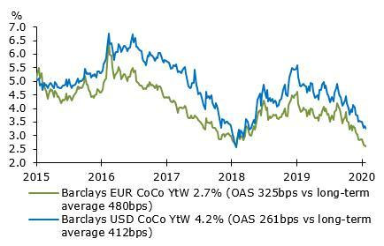

## Table of Contents

## What are Contingent Convertibles (CoCos) in simple terms?

Contingent Convertibles, or CoCos, are a type of financial instrument that banks can use. They are like special bonds that can turn into bank shares under certain conditions. Imagine you lend money to a bank, and instead of getting your money back with interest, you might get shares of the bank if something specific happens. This "something specific" is usually when the bank is in financial trouble.

The main reason banks use CoCos is to make sure they have enough money to keep operating, even if they face financial difficulties. If a bank starts to struggle, these CoCos can convert into shares, which helps the bank get more capital quickly. This can prevent the bank from failing and can help protect the overall financial system. So, CoCos act like a safety net for banks, but they also come with risks for the people who invest in them.

## How do CoCos function within the European financial system?

In the European financial system, CoCos work as a tool to help banks stay stable. When a bank in Europe faces financial trouble, CoCos can change from being a bond, which is like a loan to the bank, into shares of the bank. This change happens automatically if certain conditions are met, like if the bank's capital falls below a certain level. By turning into shares, CoCos help the bank get more money quickly, which can stop it from failing. This is important because it helps keep the whole European financial system safe and stable.

European regulators have rules about how banks can use CoCos. These rules say that banks must have a certain amount of CoCos as part of their capital. This is to make sure that banks are prepared for tough times. If a bank's financial health gets too weak, the CoCos will convert into shares, and this might mean that the people who invested in the CoCos could lose money or get less than they expected. But, this system is designed to protect the bigger financial system and the economy by making sure banks don't collapse.

## What are the primary benefits of CoCos for banks in Europe?

CoCos help banks in Europe by giving them a way to get more money quickly if they start to have financial problems. If a bank's money drops too low, CoCos can turn into bank shares. This means the bank can use these shares to get more money and stay strong. It's like having a safety net that catches the bank before it falls too far.

Another big benefit is that CoCos help keep the whole European financial system stable. If one bank starts to fail, it can cause problems for other banks and the economy. By turning CoCos into shares, the bank can avoid failing, which helps stop these bigger problems from happening. This makes the financial system safer for everyone.

## What risks do CoCos pose to investors in the European market?

CoCos can be risky for investors in the European market because they might not get their money back like they would with regular bonds. If a bank's financial health gets bad enough, CoCos will turn into shares. This means instead of getting their money back with interest, investors might end up with shares that could be worth less than what they originally invested. This can lead to a big loss if the bank's stock price goes down a lot.

Another risk is that CoCos can be hard to understand and predict. They have special rules about when they will turn into shares, and these rules can be complicated. If the bank's situation changes suddenly, investors might not have time to react. This uncertainty can make CoCos a risky choice because investors might not know exactly what will happen to their investment.

## Can you explain the trigger mechanisms for CoCos in Europe?

In Europe, CoCos have special rules called trigger mechanisms that decide when they will turn from bonds into bank shares. These triggers are usually based on the bank's financial health. One common type of trigger is the accounting trigger, which happens if the bank's capital falls below a certain level that is set by rules. Another type is the market trigger, which is based on the bank's stock price dropping too low. These triggers are important because they make sure the CoCos change into shares at the right time to help the bank.

The exact level at which a CoCo turns into shares can be different for each bank, but it's always set to help the bank when it's in trouble. For example, if a bank's capital goes below 5.125% of its total assets, the CoCo might turn into shares. This helps the bank get more money quickly to stay strong. European regulators keep a close eye on these triggers to make sure they work well and protect both the banks and the financial system.

## How do regulatory frameworks in Europe affect the issuance of CoCos?

In Europe, rules set by regulators like the European Banking Authority (EBA) and the European Central Bank (ECB) affect how banks can issue CoCos. These rules say that banks must have a certain amount of CoCos as part of their capital. This is to make sure banks are ready for tough times. The rules also set the conditions, or triggers, for when CoCos will turn into shares. This helps keep the financial system stable by making sure banks have a safety net if they start to struggle.

These regulatory frameworks also make sure that CoCos are used in a way that protects both the banks and the investors. Banks have to follow strict guidelines on how they can issue CoCos and what information they need to share with investors. This helps investors understand the risks and makes the market more transparent. Overall, the rules in Europe are designed to make sure that CoCos help keep banks strong and the financial system safe.

## What are some real-world examples of CoCos issued by European banks?

One example of CoCos in Europe is when Credit Suisse issued them. In 2011, Credit Suisse issued CoCos to raise money and make their financial position stronger. These CoCos were set to turn into shares if the bank's capital fell below a certain level. This was important because it helped Credit Suisse prepare for tough times and keep the bank stable. 

Another example is from Banco Santander, a Spanish bank. In 2014, Banco Santander issued CoCos to meet new rules set by European regulators. These CoCos were designed to convert into shares if the bank's financial health got too weak. By doing this, Banco Santander made sure it had enough money to keep operating, even if things got difficult. This helped protect both the bank and the wider financial system.

## How have CoCos performed during financial crises in Europe?

During financial crises in Europe, CoCos have shown how they can help banks stay stable. One big example was during the European debt crisis that started in 2009. Some banks in countries like Spain and Italy issued CoCos to get more money and make sure they had enough capital. When the crisis got worse, these CoCos helped the banks by turning into shares when the banks' financial health got weak. This meant the banks could get more money quickly and avoid failing, which was important for keeping the whole financial system stable.

However, CoCos also showed some challenges during crises. In 2023, when Credit Suisse faced big problems, its CoCos were wiped out before shareholders lost money. This surprised many investors because usually, shareholders lose money first. This event made people question how safe CoCos really are and how they work during very tough times. It showed that while CoCos can help banks, they also come with big risks for investors, especially during big financial crises.

## What are the differences between CoCos and traditional bonds in the European context?

In Europe, CoCos and traditional bonds work differently. Traditional bonds are like loans to a bank or a company. When you buy a traditional bond, you lend money to the bank and expect to get it back with interest at a certain time. These bonds are usually safe because if the bank has problems, bondholders are paid before shareholders. On the other hand, CoCos are special bonds that can turn into bank shares if the bank's financial health gets too weak. This means that instead of getting your money back with interest, you might end up with shares of the bank, which can be riskier.

The main difference between CoCos and traditional bonds is how they handle risk. With traditional bonds, the risk is lower because you know you will get your money back as long as the bank doesn't fail completely. But with CoCos, there's more risk because they can change into shares if the bank gets into trouble. This means you might lose money if the bank's stock price goes down a lot. CoCos are used to help banks get more money quickly during tough times, but they make investing more complicated and risky for people who buy them.

## How do CoCos impact the capital structure and risk management of European banks?

CoCos change how European banks manage their money and handle risks. They are a special kind of bond that can turn into bank shares if the bank starts to have money problems. This means banks can use CoCos to get more money quickly when they need it. By having CoCos, banks can make sure they have enough money to keep going, even if things get tough. This helps banks stay strong and can stop them from failing, which is good for the whole financial system.

But CoCos also add more risk to the bank's money setup. They are not as safe as regular bonds because they can turn into shares, which might be worth less than what investors paid for them. This can make investors nervous because they might lose money if the bank's situation gets bad. Banks need to be careful about how they use CoCos because while they help with getting more money, they also make things more complicated and risky for everyone involved.

## What are the current trends and future outlook for CoCos in European finance?

Right now, CoCos are becoming more popular in Europe because banks need to follow strict rules about how much money they should have. More and more banks are using CoCos to make sure they have enough money to stay strong, even if things get tough. Investors are also getting more interested in CoCos because they can offer higher returns than regular bonds, but they come with bigger risks too. Banks are trying to make CoCos easier to understand and more attractive to investors by being clearer about how they work and what the risks are.

Looking into the future, CoCos are likely to keep playing a big role in European finance. As long as regulators keep pushing for banks to have strong safety nets, CoCos will be important for helping banks stay stable. But there might be changes in how CoCos are used and managed to make them safer for investors. After what happened with Credit Suisse in 2023, banks and regulators might work on making the rules around CoCos clearer and more predictable. This could help more investors feel comfortable with CoCos and make them a bigger part of the financial system.

## How can investors assess the valuation and pricing of CoCos in the European market?

Investors can assess the valuation and pricing of CoCos in the European market by looking at a few important things. First, they need to understand the trigger level, which is the point at which the CoCo will turn into shares. If this trigger is set too low, it means the CoCo is riskier, and investors might want a higher return to take that risk. Second, investors should check the bank's financial health. A bank that is doing well might have CoCos that are less risky and therefore priced higher. Lastly, investors can look at the [interest rate](/wiki/interest-rate-trading-strategies), or coupon, that the CoCo pays. A higher coupon might mean the CoCo is riskier, so investors need to decide if the extra return is worth the extra risk.

Another way to assess CoCos is by comparing them to other similar investments. Investors can look at the prices of other CoCos from different banks to see if the one they are interested in is priced fairly. They can also compare CoCos to regular bonds to see how much extra return they are getting for taking on the extra risk. By doing this, investors can get a better idea of whether the price of the CoCo is right for the level of risk they are taking. It's also important for investors to keep up with news and changes in the bank's situation because these can affect the value and price of CoCos.

## References & Further Reading

[1]: Avdjiev, S., Bolton, P., Jiang, W., & Kartasheva, A. (2019). ["CoCo Bond Issuance and Bank Fragility."](https://papers.ssrn.com/sol3/papers.cfm?abstract_id=3076413) National Bureau of Economic Research.

[2]: "Algorithmic Trading and DMA: An introduction to direct access trading strategies" by Barry Johnson.

[3]: Flannery, M. J. (2014). ["Contingent Capital Instruments for Large Financial Institutions: A Review of the Literature."](https://www.annualreviews.org/content/journals/10.1146/annurev-financial-110613-034331) International Finance Discussion Papers, Board of Governors of the Federal Reserve System (U.S.).

[4]: "Contingent Convertibles (CoCos): A Primer on a New Debt Security" by Rajdeep Sengupta, Federal Reserve Bank of St. Louis Review, 2016.

[5]: Lhabitant, F.-S., & Rancourt, S. (2007). ["Hedge Funds and Prime Brokers."](https://books.google.com/books/about/Hedge_Funds.html?id=-iI1o2dLyzMC) The Journal of Financial Transformation.