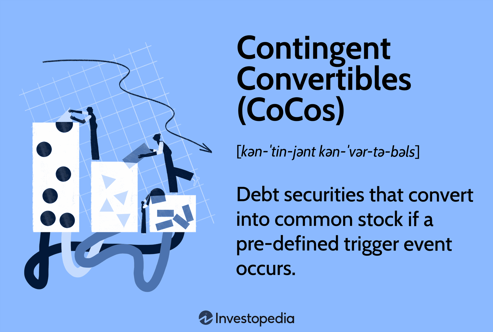

In the dynamic financial ecosystem of Europe, Contingent Convertibles (CoCos) have emerged as essential tools for banks seeking to enhance their capital structures. Introduced in response to the 2008 financial crisis, CoCos combine both debt and equity features, making them a complex and influential financial instrument. They act as a buffer for banks, enabling them to convert debt to equity under certain financial conditions, thereby absorbing losses before a bank's capital levels reach critically low thresholds.

CoCos provide strategic advantages to European banks by bolstering their capital ratios without the need for immediate equity issuance. These instruments are particularly significant under the regulatory framework established by Basel III, which emphasizes the importance of maintaining robust capital levels to prevent systemic financial instability. By converting debt into equity during periods of distress, CoCos can prevent the need for taxpayer-funded bailouts, a key concern following the 2008 crisis.



As banks and financial institutions continue to navigate the complexities of modern financial markets, the role of algorithmic (algo) trading associated with CoCos is gaining prominence. Algo trading, with its ability to execute trades at high speed and efficiency, is increasingly impacting CoCo markets. This integration is not only enhancing liquidity and market efficiency but also presenting new challenges and opportunities for banks and investors alike.

Understanding CoCos and their functionality in the European banking sector provides valuable insights into how algorithmic trading is reshaping market dynamics. By utilizing advanced algorithms, financial institutions can optimize their risk management and investment strategies in the volatile market of CoCos. This technological advancement allows investors to approach high-yield investments with greater precision, balancing the inherent risks with the potential for substantial returns.

The synergy between CoCos and algo trading represents a significant development in the financial sector, offering a transformative means for banks to manage risk while optimizing capital structure. As these elements continue to evolve, they will have a profound impact on how banks and investors engage with complex financial instruments across Europe.

## Table of Contents

## What Are Contingent Convertibles (CoCos)?

Contingent convertibles, commonly known as CoCos or AT1 bonds, are hybrid financial instruments employed by banks to manage their capital structures. These securities convert into equity when a bank's capital falls below a predetermined level, thereby serving as a mechanism for loss absorption. The conversion feature of CoCos is intrinsically linked to a bank's financial health, functioning as a safeguard against financial instability.

Primarily, CoCos are issued by European financial institutions. The conversion is activated by specific strike prices, which are set based on the institution’s tiered capital requirements and prevailing financial conditions. These trigger points are pivotal because they are designed to automatically convert the debt into equity, fortifying the bank's capital base when it falters.

The innovation of CoCos emerged in the wake of the 2008 financial crisis, aiming to protect taxpayers from the burden of bank bailouts. By incorporating automatic conversion features, CoCos furnish banks with a capital buffer and absorb losses that might otherwise lead to systemic failure. This characteristic distinguishes them from traditional bonds, as CoCos inherently mitigate the risk of a capital crisis without necessitating government intervention.

## The Purpose and Mechanics of CoCos

Contingent Convertibles, also known as CoCos, are financial instruments crafted to aid banks in meeting Basel III regulatory standards. These standards mandate that banks maintain robust capital levels, particularly within the categories of Additional Tier 1 (AT1) and Tier 2 (T2) capital. CoCos operate as a hybrid between debt and equity, allowing financial institutions to absorb shocks more effectively during periods of economic distress.

A distinct feature of CoCos is their non-prioritization of bondholders in the event of conversion. Unlike traditional convertible bonds that often favor bondholders, CoCos can be considered more equity-friendly. This structural nuance means that upon conversion, CoCos contribute to the bank's capital rather than safeguarding the interests of bondholders. This design is intended to reflect—and indeed bolster—the financial health of the issuer, providing a layer of stability that can be crucial during crises.

The conversion mechanism of CoCos can be triggered when a bank's capital falls below a pre-determined threshold, thereby converting the bond into equity. This automatic conversion serves as a loss absorption tool, safeguarding the institution against potential insolvencies. Additionally, CoCos may also include write-down features. In these scenarios, the bond's principal can be reduced or entirely written off to enhance the bank's capital position without necessitating a default event.

These embedded mechanisms offer banks significant financial flexibility. By having instruments like CoCos in their capital structure, banks gain the ability to maneuver through financial turmoil without immediate recourse to external capital injections or taxpayer-funded bailouts. Thus, CoCos play a vital role in maintaining financial stability and ensuring a resilient banking framework capable of weathering economic fluctuations.

## Role of Algorithmic Trading in CoCo Markets

Algorithmic trading, commonly known as algo trading, involves the use of computer programs to execute a large number of trades at speeds and frequencies that are impossible for a human trader. In the context of Contingent Convertibles (CoCos), algo trading is playing an increasingly significant role in shaping market dynamics. The intrinsic complexity and [volatility](/wiki/volatility-trading-strategies) of CoCos make them suitable candidates for algorithmic intervention, as these instruments benefit from enhanced [liquidity](/wiki/liquidity-risk-premium) and efficiency that algo trading provides.

One of the primary advantages of [algorithmic trading](/wiki/algorithmic-trading) in CoCo markets is the ability to increase market efficiency. Algorithms can process vast datasets rapidly, analyzing historical and real-time market information to identify trading opportunities. This swift processing capability ensures that trades are executed at the most favorable prices, minimizing the costs associated with spread differences. 

Moreover, algo trading enhances liquidity in CoCo markets. By automatically matching buy and sell orders, algorithms contribute to a more fluid market, reducing the risk of large price swings that could result from sudden trading volumes. The presence of active algorithms ensures continuous market participation, which is crucial for maintaining the flow of CoCos, given their unique risk-reward profiles.

In addition to improving efficiency and liquidity, algo trading facilitates more refined investment strategies by leveraging real-time analytics. Financial institutions can deploy algorithms to monitor market trends and sentiment, quickly adjusting their strategies to capitalize on the prevailing market conditions. For example, by utilizing moving averages or mean reversion signals, algorithms can automatically instigate trading actions that align with pre-set investment criteria aimed at optimizing returns while mitigating risks associated with CoCo investments.

To illustrate, consider a basic algorithm that identifies mean reversion opportunities. In Python, this could be achieved by setting up a signal that triggers trades when a CoCo's price deviates significantly from its moving average:

```python
import pandas as pd
import numpy as np

# Sample data: CoCo prices
prices = pd.Series([100, 102, 101, 99, 105, 107, 106, 108, 110, 103])

# Define moving average
window = 3
moving_average = prices.rolling(window=window).mean()

# Define a signal for mean reversion
signal = np.where(prices < moving_average - 2, 'buy', 
                  np.where(prices > moving_average + 2, 'sell', 'hold'))

# Output the signal
trading_strategy = pd.DataFrame({'Price': prices, 'Moving Average': moving_average, 'Signal': signal})
print(trading_strategy)
```

By automating such strategies, financial institutions can react to evolving market conditions without delay, ensuring that their portfolios are well-positioned to accommodate the inherent volatility of CoCos.

In conclusion, the integration of algorithmic trading in the CoCo markets offers significant benefits in terms of efficiency, liquidity, and strategic investment management. Its capacity to swiftly analyze and act on market data positions algo trading as a transformative force in handling complex financial instruments like CoCos.

## How Banks Use CoCos and Algo Trading

In the European banking sector, Contingent Convertibles (CoCos) are leveraged by financial institutions to fortify their capital reserves while offering the flexibility to defer interest payments during periods of economic uncertainty. This flexibility significantly strengthens a bank's balance sheets by providing a mechanism to absorb financial shocks without immediate fiscal repercussions. CoCos serve as a strategic tool for banks to maintain capital adequacy and navigate regulatory requirements effectively, particularly during market stress.

The integration of algorithmic trading into CoCo investments allows banks to navigate the complexities of these volatile securities more proficiently. By employing complex algorithms, banks can execute trades with speed and precision, thereby optimizing their CoCo investment strategies. Algorithmic trading systems are designed to process large volumes of market data in real-time, enabling banks to swiftly respond to fluctuations in the market. This rapid response capability is crucial when dealing with CoCos, which are sensitive to market conditions and regulatory triggers that may affect their valuation and conversion mechanisms.

For instance, suppose a bank utilizes a Python-based algorithm to monitor CoCo price movements and trigger automated trades. The algorithm could look something like this:

```python
import numpy as np
import pandas as pd

# Simulated market data for CoCo prices
market_data = pd.Series(np.random.randn(100) + 100)

# Define moving average strategy parameters
short_window = 5
long_window = 20

# Calculate moving averages
short_mavg = market_data.rolling(window=short_window).mean()
long_mavg = market_data.rolling(window=long_window).mean()

# Generate trading signals
signals = pd.DataFrame(index=market_data.index)
signals['signal'] = 0.0
signals['signal'][short_window:] = np.where(short_mavg[short_window:] > long_mavg[short_window:], 1.0, -1.0)

# Generate trading orders
signals['positions'] = signals['signal'].diff()

print(signals.tail())
```

In this example, a simple moving average strategy is applied to generate trading signals based on price trends. Such algorithmic strategies allow banks to hedge against the inherent risks of CoCo instruments and maximize potential returns.

Regulators support the advancement of algorithmic trading as it contributes to enhanced market transparency and stability, both of which are critical for managing financial products with embedded contingent risks. The structured approach of algorithmic trading systems provides a level of predictability and efficiency that manual trading lacks, helping institutions meet rigorous compliance standards and mitigate systemic risks within the financial markets.

Overall, the combination of CoCos and algorithmic trading fosters an environment where banks can fortify their capital structures and operate with greater assurance and resilience, mitigating risks and capturing opportunities in the complex landscape of financial markets.

## Opportunities and Risks for Investors

Contingent Convertibles, or CoCos, are high-yield investment instruments that provide appealing opportunities for investors seeking returns higher than those from traditional bonds. However, with these potential returns come significant risks. The primary risk is associated with their key characteristic: automatic conversion into equity or write-down of debt, which activates when the issuing bank's capital falls below a certain threshold. This mechanism aims to protect the bank's solvency but can result in substantial losses for investors. 

CoCos are particularly susceptible to market events that can trigger conversions, such as financial distress or regulatory actions within the banking sector. The high returns offered by CoCos reflect this risk, often attracting investors with a higher risk tolerance and a keen interest in volatility and market speculation. 

Algorithmic trading introduces opportunities to navigate these risks more strategically. By employing complex algorithms, traders can execute buy and sell orders at speeds unattainable by humans, capitalizing on short-lived market inefficiencies. This capability allows investors to optimize their portfolios by rapidly adjusting positions in response to real-time data and market signals, potentially mitigating some risks associated with CoCos' volatility. 

For example, an investor could use algorithmic trading to continuously monitor the market for signs of distress in a bank issuing CoCos and then execute automatic trades based on pre-defined criteria. By doing so, they can attempt to [exit](/wiki/exit-strategy) positions prior to unfavourable conversion scenarios or capitalize on [arbitrage](/wiki/arbitrage) opportunities.

Despite the benefits, investors must be cognizant of liquidity challenges inherent to CoCos. The secondary market for these instruments can experience significant fluctuations in liquidity, which may exacerbate price volatility. In such environments, algorithmic strategies aimed at exploiting market inefficiencies could also amplify transactions and price movements, posing additional risks. 

Moreover, regulatory frameworks governing CoCo trading can impact how trades are executed, potentially introducing another layer of complexity for investors. Regulations may differ across jurisdictions, influencing market dynamics and affecting the performance of algorithmic strategies.

Thus, while CoCos and algorithmic trading strategies can offer enhanced opportunities for yield, investors must carefully weigh these benefits against the associated risks. It's crucial to maintain an agile approach, equipped with a deep understanding of both CoCos' intricate features and the influence of regulatory policies on market behavior.

## Case Study: Lessons from Credit Suisse and Deutsche Bank

The recent write-down of Credit Suisse's Contingent Convertibles (CoCos) serves as a poignant illustration of the inherent risks associated with these financial instruments. In this instance, investors faced a staggering $17 billion loss, highlighting the volatility intrinsic to CoCos, particularly in scenarios involving automatic conversion or write-down. This event not only underscores the risk factors tied to CoCos but also signals the potential for substantial financial disruption affecting stakeholders on a global scale.

Credit Suisse's CoCo debacle was precipitated by the bank's financial distress, triggering the conversion threshold of these securities. As CoCos are designed to convert into equity or be written down when a bank's capital levels fall below a critical point, this mechanism was activated, leading to significant losses for CoCo holders. The automatic nature of this conversion did not allow investors the flexibility to exit positions preemptively, thereby reinforcing the high-stakes environment of CoCo investments.

Similarly, Deutsche Bank's experience with CoCos reflects the necessity for meticulous risk management. Amidst periods of financial instability, Deutsche Bank has had to adopt robust risk assessment strategies and strategically implement algorithmic trading solutions to effectively manage their CoCo portfolios. These tools enable the bank to navigate the rapid market fluctuations characteristic of CoCo markets. Algorithmic trading assists in achieving responsive hedging strategies, ensuring that decisions around CoCo investments are data-driven and aligned with real-time market conditions.

The lessons learned from both Credit Suisse and Deutsche Bank substantiate the critical role of comprehensive risk assessment and the strategic use of technology in managing CoCo investments. It is imperative for banks and investors to deploy sophisticated trading algorithms that can adapt dynamically to market shifts, thereby maximizing returns while mitigating potential losses. As CoCos continue to be integral to European banking strategies, understanding and managing the associated risks through advanced technology becomes not just advantageous but essential.

## Conclusion: The Future of CoCos and Algo Trading in Europe

The convergence of Contingent Convertibles (CoCos) and algorithmic trading marks a significant advancement in financial practices within European banking. This collaboration necessitates both banks and investors to evolve and respond swiftly to the continually shifting financial climate. CoCos provide much-needed capital buffer to banks, helping them meet regulatory standards and absorb financial shocks, while algorithmic trading introduces speed, precision, and efficiency in executing trades that align with the volatile nature of CoCo markets. 

The inherent risks associated with CoCos, such as automatic conversion and possible capital write-downs, demand careful assessment and strategic management. Algorithmic trading emerges as a powerful ally in this regard, offering sophisticated tools to navigate these challenges. By leveraging real-time data analytics and executing trades based on complex algorithms, financial institutions can enhance their risk mitigation strategies significantly.

The evolution of the financial sector highlights the necessity for continuous adaptation. The relationship between CoCos and algorithmic trading has the potential to redefine capital market strategies, promoting the development of more robust and flexible financial systems. By integrating advanced algorithmic processes, banks and investors can better predict market shifts, anticipate risk scenarios, and optimize investment outcomes, ultimately contributing to a more resilient economic framework in Europe.

## References & Further Reading

[1]: Avdjiev, S., Bolton, P., Jiang, W., & Kartasheva, A. (2019). ["CoCo Bond Issuance and Bank Fragility."](https://papers.ssrn.com/sol3/papers.cfm?abstract_id=3076413) National Bureau of Economic Research.

[2]: "Algorithmic Trading and DMA: An introduction to direct access trading strategies" by Barry Johnson.

[3]: Flannery, M. J. (2014). ["Contingent Capital Instruments for Large Financial Institutions: A Review of the Literature."](https://www.annualreviews.org/content/journals/10.1146/annurev-financial-110613-034331) International Finance Discussion Papers, Board of Governors of the Federal Reserve System (U.S.).

[4]: "Contingent Convertibles (CoCos): A Primer on a New Debt Security" by Rajdeep Sengupta, Federal Reserve Bank of St. Louis Review, 2016.

[5]: Lhabitant, F.-S., & Rancourt, S. (2007). ["Hedge Funds and Prime Brokers."](https://books.google.com/books/about/Hedge_Funds.html?id=-iI1o2dLyzMC) The Journal of Financial Transformation.